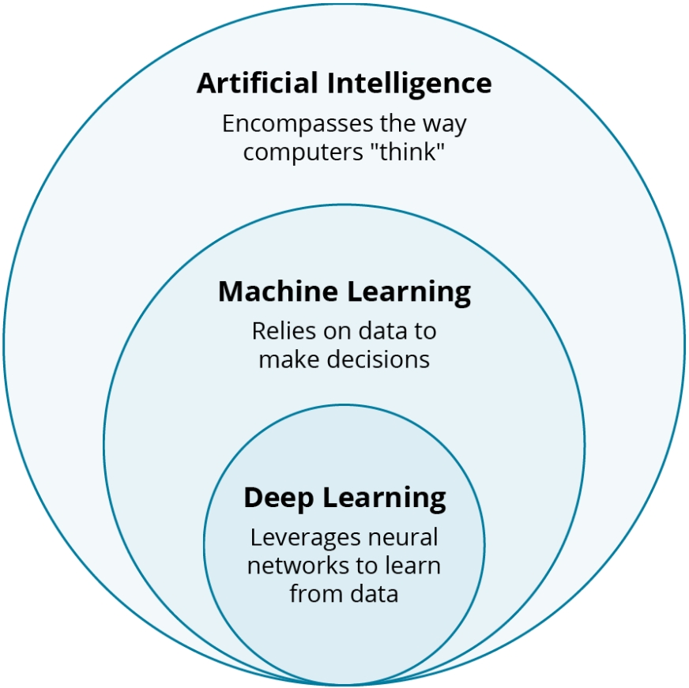
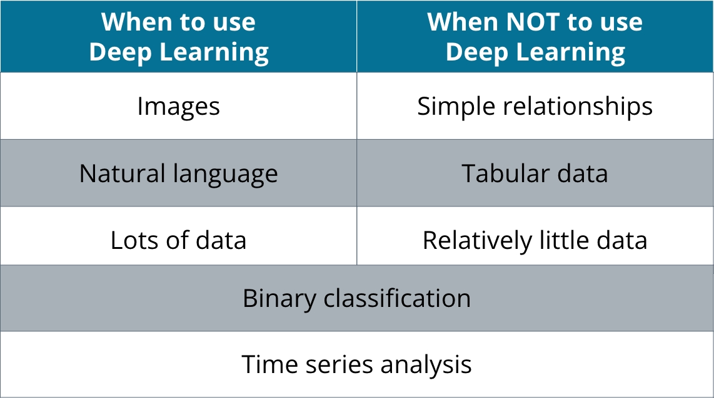

## How Do Experts Think About Deep Learning?

**video**

### Expert Opinions on Deep Learning

Whether or not deep learning is the path to artificial general intelligence, experts all understand the power of Deep Learning to accomplish a variety of tasks. Practitioners in the field recognize some shortcomings in Deep Learning, but its power on computer vision and Natural Language processing tasks is undeniable.

## AI, ML, and Deep Learning

**video**

## Deep Learning as a Subfield of AI and ML

Artificial Intelligence is the overarching field and includes algorithms like Local Search and Logic Programming. Machine Learning is a part of Artificial Intelligence and includes models like Logistic Regression and Decision Trees. Deep Learning is a subfield of Machine Learning that consists of various neural network models.

## History of Deep Learning

**video**

## AI Winter and AI Spring

The origins of Deep Learning stem from the perceptron, a probabilistic model of the brain developed in a 1958 paper by Frank Rosenblatt based on the McCulloch-Pitts neuron.

A later book by Marvin Minsky and Seymour Papert exposed the imitations of the model and, coupled with a number of other unrealized applications, ended neural network research for nearly a generation.

In 1998, the successes of neural networks on handwritten digit recognition restored confidence in the research program, and by 2012, neural networks became the de facto standard for doing computer vision.

## Tools for Deep Learning

**video**

## Deep Learning Lifecycle:

We begin with a problem statement, then move to development (where code gets written). Next, we begin training, where our model learns our data. After training, we deploy, which is when our model goes out into the world for use. A lot of other people do front-end work at this stage. Then we go to monitoring. For our purposes, we'll focus on the development and training of models.

### Deep Learning Tools

In this video, we covered a number of tools:

#### Development tools

- Integrated Development Environment
    - Code Editor
    - Interpreter/Compiler
- Jupyter Notebooks
    - Note: Each cell is executed on its own, and it works well for environments to prototype or present code. However, there are limitations:
        - Editing can make you lose state
        - Code deployed production should be in .py rather than notebooks

#### Deep Learning Frameworks
- PyTorch (aka Torch)
- TensorFlow/Keras
- JAX

#### Training Tools

- Experiment management like TensorBoard or Weights and Biases
    - Observe accuracy and loss at training time
- Model versioning like DVC, Neptune, and Pachyderm
    - Remedy issues within the model across different versions of the model
    - DVC is very similar to Git

## When To Use Deep Learning

**video**

### Deciding when Deep Learning is the Right Tool

Deep Learning is a powerful tool, but it's not the only one. In general, the way to choose whether or not to use Deep Learning depends on your task, what kind of data you have, and how complex the relationships in the data are.

Scenarios in which to use Deep Learning include but are not limited to:

- Tasks
    - Binary classification:
        - Deep Learning
        - Logistic Regression
        - Decision Trees
        - Support Vector Machines
    - Multi-class classification:
        - Deep Learning
        - Decision Trees
        - Support Vector Machines
    - Regression:
        - Deep Learning
        - Linear Regression
        - some Decision Trees
- Data:
    - Images:
        - Deep Learning
    - Text:
        - Deep Learning
        - Statistical Methods
    - Tabular Data:
        - Decision Trees
- Data Relationships:
    - Simple:
        - Linear Regression
        - Logistic Regression
        - Decision Trees
    - Complex:
        - Deep Learning
        - Decision Trees

### Additional Resources

If you want to learn more about when each machine learning method is appropriate, we recommend this article from [MIT's Sloan school](https://mitsloan.mit.edu/ideas-made-to-matter/machine-learning-explained)