## Intro to Minimizing Error Function

### Introduction

**video**

Doing Deep Learning means training our models. These models are made up of parameters that are randomly initialized and gradually get closer to mapping our inputs to our outputs. This is done by minimizing our error function, and one of the key algorithms for minimizing error is the gradient descent algorithm. Once we are dealing with multilayer models, we need to find a way to backpropagate the changes, which we use the backpropagation algorithm for.

### Lesson Outline

**video**

What We'll Learn

Improving our Machine Learning model means computing how far off our predictions are from their true values and minimizing the distance between those values. To do that, we'll need to understand how we can do that optimization programmatically. In this lesson, we will learn how to:

- Create and manipulate PyTorch tensors
- Preprocess data using PyTorch
- Define and use loss functions to measure model performance
- Implement the foundational algorithms of deep learning: gradient descent and backpropagation

The skills we learn in this lesson will build the foundations needed for doing Deep Learning.

### PyTorch Basics

**video**

### PyTorch and Tensors

In the video, we covered a number of features of PyTorch. In general, it's a good idea to keep the [PyTorch documentation](https://pytorch.org/docs/stable/index.html) handy. Most of what was demonstrated in this video are properties of [Tensors](https://pytorch.org/docs/stable/tensors.html) or are parts of core [Torch](https://pytorch.org/docs/stable/torch.html).

Since PyTorch uses NumPy like indices, this [SciPy documentation](https://docs.scipy.org/doc/numpy-1.10.1/reference/arrays.indexing.html) on indexing and slicing numpy arrays may be helpful.

**PyTorch_Basics_demo**

## PreProcessing Data with PyTorch

**video**

### Data Representation

Rarely can we use "out of the box" input. We need our input to be tensors, but often our raw data consists of images, text, or tabular data, and we can't easily input those directly into our model.

- For image data, we need the data to be turned into tensors with entries of the tensors as bit values in color channels (usually red, green, and blue).
- Text data needs to be tokenized, meaning, individual words or groups of letters need to be mapped to a token value.
- For tabular data, we have categorical values (high, medium, low, colors, demographic information, etc...) that we need to transform into numbers for processing.

### One-Hot Encoding

Categorical values can become numbers. For instance, if you have three colors, Red, Blue, and Yellow, you can assign binary values representing if the color is present or not. The model can then easily compute how far two points are from each other, rather than simply assigning arbitrary values (like 1, 2, and 3 to the colors).

Note: One-Hot Encoding adds columns, which increases the dimensions of our tensors. If you have a lot of categorical features, this makes it even more complicated.

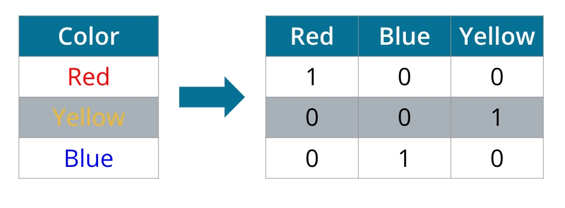

### Transforming Data for Neural Networks

Often, we are faced with data that is not in a format conducive to use in neural networks in its raw form. Preprocessing is the act of turning data from that raw form into tensors that can be used as input to a neural network. This includes:

- Encoding non-numerical features
- Converting images to tensors of bit values in color channels
- Tokenizing words

### Exercise: Data in PyTorch

**Data Processing in PyTorch**

## Error Functions

**video**

### Defining Error Functions

For the remainder of this lesson, we will be using error functions. An error function is simply a function that measures how far the current state is from the solution. We can calculate the error and then make a change in an attempt to reduce the error—and then repeat this process until we have reduced the error to an acceptable level.

### Log-Loss Error Function

**video**

### Discrete and Continuous Errors

One approach to reducing errors might be to simply count the number of errors and then make changes until the number of errors is reduced. But taking a discrete approach like this can be problematic—for example, we could change our line in a way that gets closer to the solution, but this change might not (by itself) improve the number of misclassified points.

Instead, we need to construct an error function that is continuous. That way, we can always tell if a small change in the line gets us closer to the solution. We'll do that in this lesson using the log-loss error function. Generally speaking, the log-loss function will assign a large penalty to incorrectly classified points and small penalties to correctly classified points. For a point that is misclassified, the penalty is roughly the distance from the boundary to the point. For a point that is correctly classified, the penalty is almost zero.

We can then calculate a total error by adding all the errors from the corresponding points. Then we can use gradient descent to solve the problem, making very tiny changes to the parameters of the line in order to decrease the total error until we have reached an acceptable minimum.

We need to cover some other concepts before we get into the specifics of how to calculate our log-loss function, but we'll come back to it when we dive into gradient descent later in the lesson.

### Maximum Likelihood

Probability will be one of our best friends as we go through deep learning. In this lesson, we'll see how we can use probability to evaluate (and improve!) our models.

**video**

### Separating Data

We're still in our quest for an algorithm that will help us pick the best model that separates our data. Now that we have ways of generating a probability for each classification, we can use these probabilities to help us evaluate our model.

One method we can use for this is called maximum likelihood. In this approach, we pick the model that gives the existing labels in our historical data (which we know are correct) the highest probability.

**video**

### Using Probability to Separate Data

The key idea is that we want to calculate $P(all)$, which is the product of all the independent probabilities of each point. This helps indicate how well the model performs in classifying all the points. To get the best model, we will want to maximize this probability.

Our aim here was to give you a general intuition for why we would want to get the maximum likelihood. Next, we'll get into a more formal treatment of what it is and how to calculate it.

### Cross Entropy

**video**

### Measuring Distances between Distributions

Cross-Entropy is a way of measuring the difference between two distributions. We define Cross-Entropy for binary labels and N examples as:

$$ -\sum_{i=1}^{N}y_i\log p_i + (1 -y_i) \log (1-p_i) $$

Multi-Class Cross-Entropy is then defined for M labels and N examples as:

$$ -\sum_{i=1}^{N}\sum_{j=1}^{M} y_{ij} \log p_{ij}$$

Cross-Entropy is one of the best ways to describe the difference between our predictions and the true labels.

](images/cross_entropy.jpeg)

### Gradient Descent

In this lesson, we'll learn the principles and the math behind the gradient descent algorithm.

**video**

### Gradient Calculation

In the last few videos, we learned that in order to minimize the error function, we need to take some derivatives. So let's get our hands dirty and actually compute the derivative of the error function. The first thing to notice is that the sigmoid function has a really nice derivative. Namely,

$$ \sigma\prime = \sigma (x) (1 - \sigma (x)) $$

The reason for this is the following, we can calculate it using the quotient formula:

$$ \sigma\prime =   \frac{\partial }{\partial x} \frac{1}{1 + e^{-x}} $$
$$ = \frac {e^{-x}} {(1 + e^{-x})^2} $$
$$ = \frac {1}{1 + e^{-x}}. \frac {e^{-x}}{1 + e^{-x}} $$
$$ = \sigma (x) (1 - \sigma (x)) $$

And now, let's recall that if we have $m$ points labelled $ x^{(1)},x^{(2)},…,x^{(m)} $ , the error formula is:

$$ E = -  \frac {1}{m} \sum_{i=1}^{m} (y_i \ln {(\hat y_i)}) + (1 - y_i) \ln {(1 - \hat y_i)} $$

where the prediction is given by $ \hat y_i = \sigma (W x^{(i)} + b)$

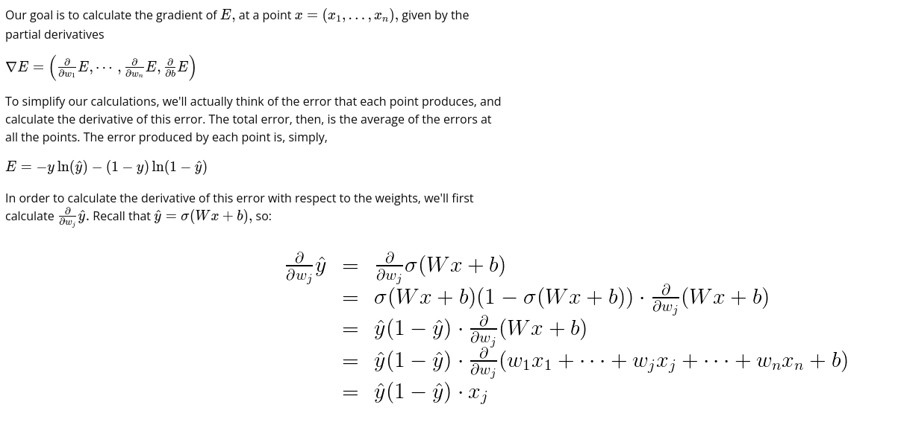
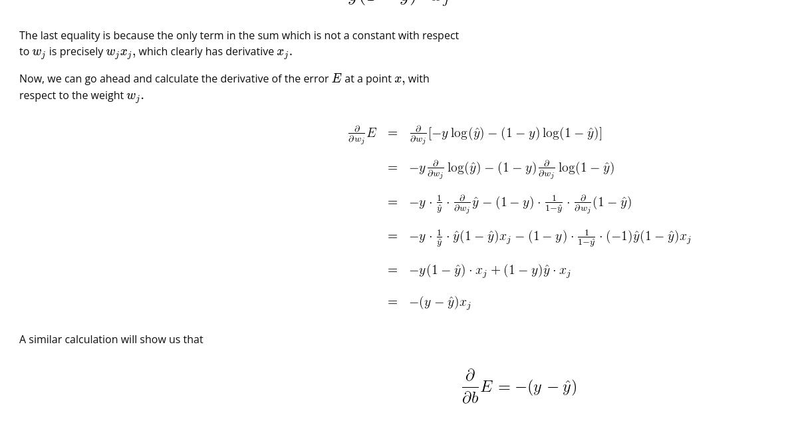
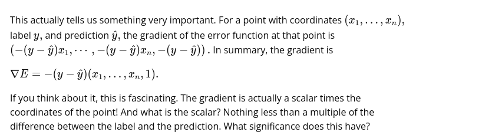

So, a small gradient means we'll change our coordinates by a little bit, and a large gradient means we'll change our coordinates by a lot.

If this sounds anything like the perceptron algorithm, this is no coincidence! We'll see it in a bit.

### Gradient Descent Step

Therefore, since the gradient descent step simply consists in subtracting a multiple of the gradient of the error function at every point, then this updates the weights in the following way:

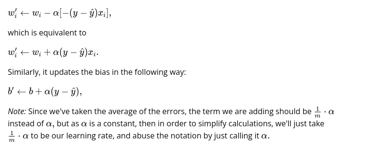

Our goal is to calculate the gradient of E,E,E, at a point x=(x1,…,xn),x = (x_1, \ldots, x_n),x=(x1​,…,xn​), given by the partial derivatives

∇E=(∂∂w1E,⋯ ,∂∂wnE,∂∂bE)\nabla E =\left(\frac{\partial}{\partial w_1}E, \cdots, \frac{\partial}{\partial w_n}E, \frac{\partial}{\partial b}E \right)∇E=(∂w1​∂​E,⋯,∂wn​∂​E,∂b∂​E)

To simplify our calculations, we'll actually think of the error that each point produces, and calculate the derivative of this error. The total error, then, is the average of the errors at all the points. The error produced by each point is, simply,

E=−yln⁡(y^)−(1−y)ln⁡(1−y^)E = - y \ln(\hat{y}) - (1-y) \ln (1-\hat{y})E=−yln(y^​)−(1−y)ln(1−y^​)

In order to calculate the derivative of this error with respect to the weights, we'll first calculate ∂∂wjy^.\frac{\partial}{\partial w_j} \hat{y}.∂wj​∂​y^​. Recall that y^=σ(Wx+b),\hat{y} = \sigma(Wx+b),y^​=σ(Wx+b), so:
This is the calculation we need to get the derivative of the error.

The last equality is because the only term in the sum which is not a constant with respect to wjw_jwj​ is precisely wjxj,w_j x_j,wj​xj​, which clearly has derivative xj.x_j.xj​.

Now, we can go ahead and calculate the derivative of the error EEE at a point x,x,x, with respect to the weight wj.w_j.wj​.
Calculation for the derivative of the error E at a point x, with respect to weight wj.

A similar calculation will show us that
Calculation for the derivative of the error E at a point x, with respect to weight wj.

This actually tells us something very important. For a point with coordinates (x1,…,xn),(x_1, \ldots, x_n),(x1​,…,xn​), label y,y,y, and prediction y^,\hat{y},y^​, the gradient of the error function at that point is (−(y−y^)x1,⋯ ,−(y−y^)xn,−(y−y^)).\left(-(y - \hat{y})x_1, \cdots, -(y - \hat{y})x_n, -(y - \hat{y}) \right).(−(y−y^​)x1​,⋯,−(y−y^​)xn​,−(y−y^​)). In summary, the gradient is

∇E=−(y−y^)(x1,…,xn,1).\nabla E = -(y - \hat{y}) (x_1, \ldots, x_n, 1).∇E=−(y−y^​)(x1​,…,xn​,1).

If you think about it, this is fascinating. The gradient is actually a scalar times the coordinates of the point! And what is the scalar? Nothing less than a multiple of the difference between the label and the prediction. What significance does this have?

Gradient Descent Step

Therefore, since the gradient descent step simply consists in subtracting a multiple of the gradient of the error function at every point, then this updates the weights in the following way:

wi′←wi−α[−(y−y^)xi],w_i' \leftarrow w_i -\alpha [-(y - \hat{y}) x_i],wi′​←wi​−α[−(y−y^​)xi​],

which is equivalent to

wi′←wi+α(y−y^)xi.w_i' \leftarrow w_i + \alpha (y - \hat{y}) x_i.wi′​←wi​+α(y−y^​)xi​.

Similarly, it updates the bias in the following way:

b′←b+α(y−y^),b' \leftarrow b + \alpha (y - \hat{y}),b′←b+α(y−y^​),

Note: Since we've taken the average of the errors, the term we are adding should be 1m⋅α\frac{1}{m} \cdot \alpham1​⋅α instead of α,\alpha,α, but as α\alphaα is a constant, then in order to simplify calculations, we'll just take 1m⋅α\frac{1}{m} \cdot \alpham1​⋅α to be our learning rate, and abuse the notation by just calling it α.\alpha.α.


### Logistic Regression

Now, we're finally ready for one of the most popular and useful algorithms in machine learning, and the building block of all that constitutes deep learning: The logistic regression algorithm. And it basically goes like this:

- Take your data
- Pick a random model
- Calculate the error
- Minimize the error, and obtain a better model
- Enjoy!

### Calculating the Error Function

Let's dive into the details. The next video will show you how to calculate the error function that we will need.

**video**

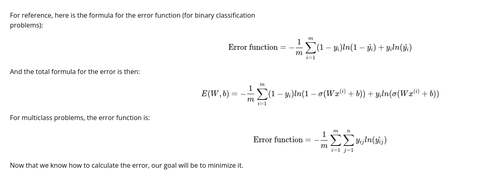

For reference, here is the formula for the error function (for binary classification problems):
Error function=−1m∑i=1m(1−yi)ln(1−yi^)+yiln(yi^)\text{Error function} = -\frac{1}{m}\sum_{i=1}^m(1-y_i)ln(1-\hat{y_i})+y_iln(\hat{y_i})
Error function=−m1​i=1∑m​(1−yi​)ln(1−yi​^​)+yi​ln(yi​^​)

And the total formula for the error is then:
E(W,b)=−1m∑i=1m(1−yi)ln(1−σ(Wx(i)+b))+yiln(σ(Wx(i)+b))E(W, b) = -\frac{1}{m}\sum_{i=1}^m(1-y_i)ln(1-\sigma(Wx^{(i)}+b))+y_iln(\sigma(Wx^{(i)}+b))
E(W,b)=−m1​i=1∑m​(1−yi​)ln(1−σ(Wx(i)+b))+yi​ln(σ(Wx(i)+b))

For multiclass problems, the error function is:
Error function=−1m∑i=1m∑j=1nyijln(yij^)\text{Error function} = -\frac{1}{m}\sum_{i=1}^m\sum_{j=1}^ny_{ij}ln(\hat{y_{ij}})
Error function=−m1​i=1∑m​j=1∑n​yij​ln(yij​^​)

Now that we know how to calculate the error, our goal will be to minimize it.

### Minimizing the Error Function

**video**

So, conceptually, we will minimize the error by using gradient descent. But how does that work? This is what we'll look at in the next section.

### Exercise: Implementing Gradient Descent

Okay, now we know how to update our weights:

$$ \Delta w_{ij} = \eta * \delta_{j} * x_{i} $$

You've seen how to implement that for a single update, but how do we translate that code to calculate many weight updates so our network will learn?

As an example, I'm going to have you use gradient descent to train a network on graduate school admissions data (found at http://www.ats.ucla.edu/stat/data/binary.csv). This dataset has three input features: GRE score, GPA, and the rank of the undergraduate school (numbered 1 through 4). Institutions with rank 1 have the highest prestige, those with rank 4 have the lowest.

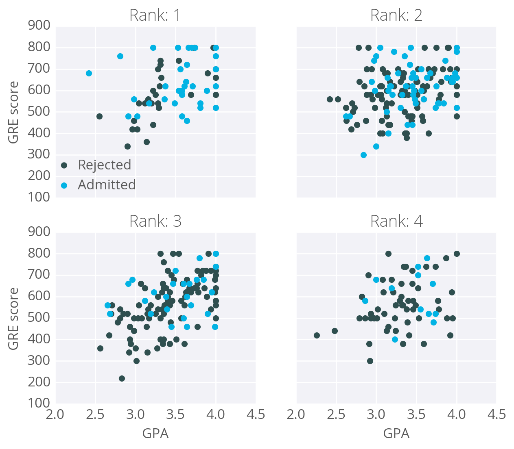

The goal here is to predict if a student will be admitted to a graduate program based on these features. For this, we'll use a network with one output layer with one unit. We'll use a sigmoid function for the output unit activation.

### Data cleanup

You might think there will be three input units, but we actually need to transform the data first.

- The rank feature is categorical, the numbers don't encode any sort of relative values.
- Rank 2 is not twice as much as rank 1, rank 3 is not 1.5 more than rank 2.
- Instead, we need to use dummy variables to encode rank, splitting the data into four new columns encoded with ones or zeros.
- Rows with rank 1 have one in the rank 1 dummy column, and zeros in all other columns.
- Rows with rank 2 have one in the rank 2 dummy column, and zeros in all other columns. And so on.

### Standardizing the GRE and GPA Data

We'll also need to standardize the GRE and GPA data, which means scaling the values such that they have zero mean and a standard deviation of 1.

- This is necessary because the sigmoid function squashes really small and really large inputs.
- The gradient of really small and large inputs is zero, which means that the gradient descent step will go to zero too.
- Since the GRE and GPA values are fairly large, we have to be really careful about how we initialize the weights or the gradient descent steps will die off and the network won't train.
- Instead, if we standardize the data, we can initialize the weights easily and everyone is happy.

This is just a brief run-through, you'll learn more about preparing data later. If you're interested in how I did this, check out the data_prep.py file in the programming exercise below.

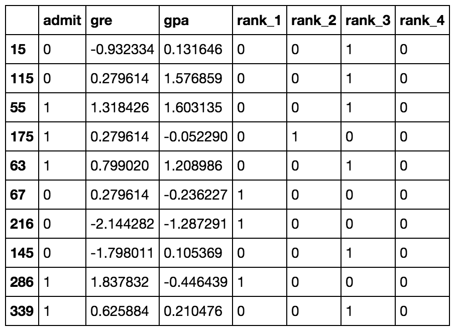

Now that the data is ready, we see that there are six input features: gre, gpa, and the four rank dummy variables.

### Mean Square Error

We're going to make a small change to how we calculate the error here. Instead of the SSE, we're going to use the mean of the square errors (MSE). Now that we're using a lot of data, summing up all the weight steps can lead to really large updates that make the gradient descent diverge. To compensate for this, you'd need to use a quite small learning rate. Instead, we can just divide by the number of records in our data, mmm to take the average. This way, no matter how much data we use, our learning rates will typically be in the range of 0.01 to 0.001. Then, we can use the MSE (shown below) to calculate the gradient and the result is the same as before, just averaged instead of summed.

$$ E = \frac{1}{2m} \sum_{\mu}(y^{\mu} - \hat y^{\mu} )^2 $$

Here's the general algorithm for updating the weights with gradient descent:

- Set the weight step to zero: $ \Delta w_i = 0 $ 
- For each record in the training data:
    - Make a forward pass through the network, calculating the output $ \hat y = f(\sum_i w_i x_i) $
    - Calculate the error term for the output unit $ \delta = (y - \hat y) * f \prime ( \sum_i w_i x_i) $
    - Update the weight step $ \Delta w_i = \Delta w_i + \delta x_i $
- Update the weights $ w_i = w_i + \eta \Delta w_i / m $ where $ \eta $ is the learning rate and $ m $ is the number of records. Here we're averaging the weight steps to help reduce any large variations in the training data.
- Repeat for $ e $ epochs.

You can also update the weights on each record instead of averaging the weight steps after going through all the records.

Remember that we're using the sigmoid for the activation function,  $ f(h) = \frac {1}{1+ e^{-h}}$

And the gradient of the sigmoid is $ f \prime(h) = f(h)(1 - f(h)) $

where $h$ is the input to the output unit,

$ h = \sum_i w_i x_i $

### Implementing with NumPy

For the most part, this is pretty straightforward with NumPy.

First, you'll need to initialize the weights. We want these to be small such that the input to the sigmoid is in the linear region near 0 and not squashed at the high and low ends. It's also important to initialize them randomly so that they all have different starting values and diverge, breaking symmetry. So, we'll initialize the weights from a normal distribution centered at 0. A good value for the scale is $ \frac {1}{\sqrt n}$ where nnn is the number of input units. This keeps the input to the sigmoid low for increasing numbers of input units.

```python
weights = np.random.normal(scale=1/n_features**.5, size=n_features)
```

NumPy provides a function np.dot() that calculates the dot product of two arrays, which conveniently calculates $h$ for us. The dot product multiplies two arrays element-wise, the first element in array 1 is multiplied by the first element in array 2, and so on. Then, each product is summed.

```python
## input to the output layer
output_in = np.dot(weights, inputs)
```

And finally, we can update $\Delta w_i$​ and $ w_i $​ by incrementing them with $ weights += ... $ which is shorthand for $weights = weights + ....$

### Efficiency tip!

You can save some calculations since we're using a sigmoid here. For the sigmoid function, $ f \prime(h) = f(h)(1-f(h))$. That means that once you calculate $f(h)$, the activation of the output unit, you can use it to calculate the gradient for the error gradient.

### Programming exercise

Below, you'll implement gradient descent and train the network on the admissions data. Your goal here is to train the network until you reach a minimum in the mean square error (MSE) on the training set. You need to implement:

- The network output: output.
- The output error: error.
- The error term: error_term.
- Update the weight step: del_w +=.
- Update the weights: weights +=.

After you've written these parts, run the training by pressing Shift + Enter on the cell containing the code. The MSE will print out, as well as the accuracy on a test set, the fraction of correctly predicted admissions.

Feel free to play with the hyperparameters and see how it changes the MSE.

When the output looks correct to you, click "Test Code" to see if your implementation was successful.

**udacity_deeplearning_nanodegree/1 Introduction to Neural Networks/2 Minimizing Error Function with Gradient Descent/Implementing Gradient Descent/gradient_descent.py**

### Perceptrons

**video**

Note: There are a couple of corrections to the video above:

- At 3:07 in the video, the title should read "Step Function", not "Set Function".
- At 3:07 in the video, the definition of the Step function should be:
    - $ y = 1 if x \geq 0$
    - $ y=0 if x \lt 0 $

A perceptron is a major building block of neural networks. Perceptrons are graphs that have nodes and edges. In the general case, they look like this:

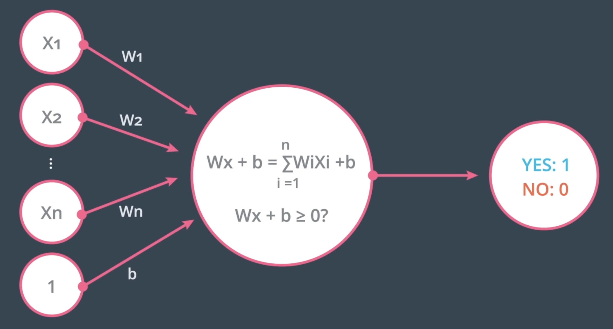

On the left we have $n$ inputs coming in, with values $x_1$​ to $x_n$​ (and $$1 in the last place). Then we have edges with weights $W_1$ to $W_n$​ and $b$ (for the bias). The node takes these inputs and calculates a linear equation:

$$ Wx + b = \sum_{1=1}^{n} W_i X_i + b $$

The node then checks if the value is greater than or equal to zero—returning a value of Yes if it is and No if it is not.

### Multilayer Perceptrons

**video**

### Implementing the hidden layer

#### Prerequisites

Below, we are going to walk through the math of neural networks in a multilayer perceptron. With multiple perceptrons, we are going to move to using vectors and matrices. To brush up, be sure to view the following:

- Khan Academy's [introduction to vectors](https://www.khanacademy.org/math/linear-algebra/vectors-and-spaces/vectors/v/vector-introduction-linear-algebra).
- Khan Academy's [introduction to matrices](https://www.khanacademy.org/math/precalculus/x9e81a4f98389efdf:matrices).

#### Derivation

Before, we were dealing with only one output node which made the code straightforward. However now that we have multiple input units and multiple hidden units, the weights between them will require two indices: $w_{ij}$​ where iii denotes input units and $j$ are the hidden units.

For example, the following image shows our network, with its input units labeled $ x_1, x_2 $ and $ x_3 $​, and its hidden nodes labeled $ h_1 $ and $ h_2 $​:


The lines indicating the weights leading to $h_1$ have been colored differently from those leading to $h_2$ just to make it easier to read.

Now to index the weights, we take the input unit number for the $i$ and the hidden unit number for the $j$​. That gives us $w_{11}$ for the weight leading from $x_1$ to $$h_1, and $ w_{12} $ for the weight leading from $x_1$​ to $h_2$​.

The following image includes all of the weights between the input layer and the hidden layer, labeled with their appropriate $ w_{ij}$​ indices:

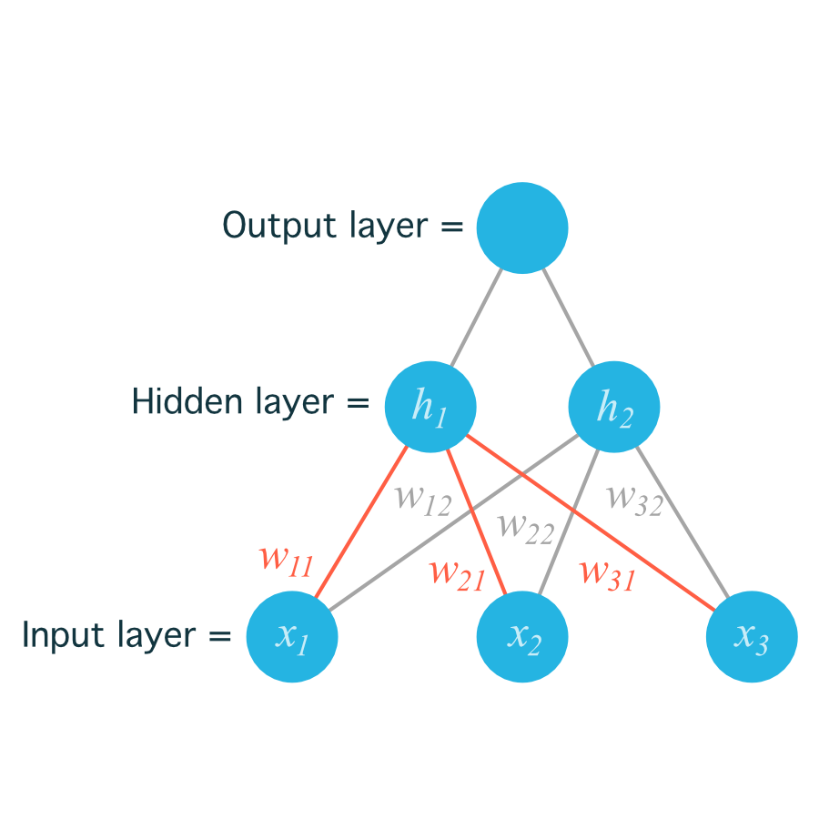

Before, we were able to write the weights as an array, indexed as $w_i$​.

But now, the weights need to be stored in a matrix, indexed as $w_{ij}$​. Each row in the matrix will correspond to the weights leading out of a single input unit, and each column will correspond to the weights leading in to a single hidden unit. For our three input units and two hidden units, the weights matrix looks like this:

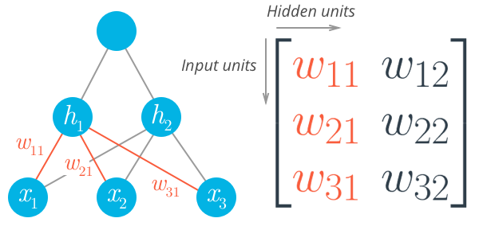

Be sure to compare the matrix above with the diagram shown before it so you can see where the different weights in the network end up in the matrix.

To initialize these weights in NumPy, we have to provide the shape of the matrix. If features is a 2D array containing the input data:

```python
## Number of records and input units
n_records, n_inputs = features.shape
## Number of hidden units
n_hidden = 2
weights_input_to_hidden = np.random.normal(0, n_inputs**-0.5, size=(n_inputs, n_hidden))
```

This creates a 2D array (i.e. a matrix) named weights_input_to_hidden with dimensions n_inputs by n_hidden. Remember how the input to a hidden unit is the sum of all the inputs multiplied by the hidden unit's weights. So for each hidden layer unit, hjh_jhj​, we need to calculate the following:

$$ h_j = \sum_i w_{ij} x_i $$

To do that, we now need to use matrix multiplication. If your linear algebra is rusty, I suggest taking a look at the suggested resources in the prerequisites section. For this part though, you'll only need to know how to multiply a matrix with a vector.

In this case, we're multiplying the inputs (a row vector here) by the weights. To do this, you take the dot (inner) product of the inputs with each column in the weights matrix. For example, to calculate the input to the first hidden unit, $ j= 1$, you'd take the dot product of the inputs with the first column of the weights matrix, like so:

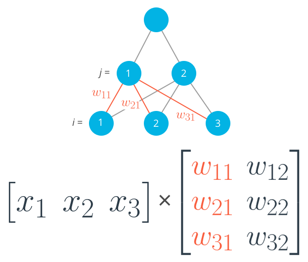

Calculating the input to the first hidden unit with the first column of the weights matrix.

$$ h_1 = x_1 w_{11} + x_2 w_{21} + x_3 w_{31}$$

And for the second hidden layer input, you calculate the dot product of the inputs with the second column. And so on and so forth.

In NumPy, you can do this for all the inputs and all the outputs at once using np.dot

```python
hidden_inputs = np.dot(inputs, weights_input_to_hidden)
```
You could also define your weights matrix such that it has dimensions n_hidden by n_inputs then multiply like so where the inputs form a column vector:

$$ 
h_j =
\begin{bmatrix}
w_{11} & w_{12} & w_{13} \\
w_{21} & w_{22} & w_{23}
\end{bmatrix}
\begin{bmatrix}
x_1 \\
x_2 \\
x_3
\end{bmatrix}
$$

Note: The weight indices have changed in the above image and no longer match up with the labels used in the earlier diagrams. That's because, in matrix notation, the row index always precedes the column index, so it would be misleading to label them the way we did in the neural net diagram. Just keep in mind that this is the same weight matrix as before, but rotated so the first column is now the first row, and the second column is now the second row. If we were to use the labels from the earlier diagram, the weights would fit into the matrix in the following locations:

$$
\begin{bmatrix}
w_{11} & w_{21} & w_{31} \\
w_{12} & w_{22} & w_{32}
\end{bmatrix}
$$
<p align="center"> Weight matrix shown with labels matching earlier diagrams. </p>

Remember, the above is not a correct view of the indices, but it uses the labels from the earlier neural net diagrams to show you where each weight ends up in the matrix.

The important thing with matrix multiplication is that the dimensions match. For matrix multiplication to work, there has to be the same number of elements in the dot products. In the first example, there are three columns in the input vector, and three rows in the weights matrix. In the second example, there are three columns in the weights matrix and three rows in the input vector. If the dimensions don't match, you'll get this:

```
## Same weights and features as above, but swapped the order
hidden_inputs = np.dot(weights_input_to_hidden, features)
---------------------------------------------------------------------------
ValueError                                Traceback (most recent call last)
<ipython-input-11-1bfa0f615c45> in <module>()
----> 1 hidden_in = np.dot(weights_input_to_hidden, X)

ValueError: shapes (3,2) and (3,) not aligned: 2 (dim 1) != 3 (dim 0)
```

The dot product can't be computed for a 3x2 matrix and 3-element array. That's because the 2 columns in the matrix don't match the number of elements in the array. Some of the dimensions that could work would be the following:

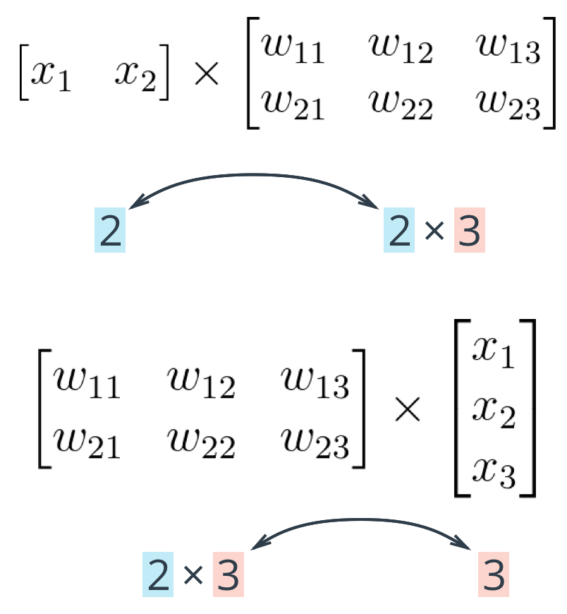

The rule is that if you're multiplying an array from the left, the array must have the same number of elements as there are rows in the matrix. And if you're multiplying the matrix from the left, the number of columns in the matrix must equal the number of elements in the array on the right.

#### Making a column vector

You see above that sometimes you'll want a column vector, even though by default NumPy arrays work like row vectors. It's possible to get the transpose of an array like so arr.T, but for a 1D array, the transpose will return a row vector. Instead, use arr[:,None] to create a column vector:

```python
print(features)
> array([ 0.49671415, -0.1382643 ,  0.64768854])

print(features.T)
> array([ 0.49671415, -0.1382643 ,  0.64768854])

print(features[:, None])
> array([[ 0.49671415],
       [-0.1382643 ],
       [ 0.64768854]])
```

Alternatively, you can create arrays with two dimensions. Then, you can use arr.T to get the column vector.

```python
np.array(features, ndmin=2)
> array([[ 0.49671415, -0.1382643 ,  0.64768854]])

np.array(features, ndmin=2).T
> array([[ 0.49671415],
       [-0.1382643 ],
       [ 0.64768854]])
```

I personally prefer keeping all vectors as 1D arrays, it just works better in my head.

### Programming quiz

Below, you'll implement a forward pass through a 4x3x2 network, with sigmoid activation functions for both layers.

Things to do:

- Calculate the input to the hidden layer.
- Calculate the hidden layer output.
- Calculate the input to the output layer.
- Calculate the output of the network.

** udacity_deeplearning_nanodegree/1 Introduction to Neural Networks/2 Minimizing Error Function with Gradient Descent/Implementing Gradient Descent/multilayer_perceptron.py **

### Backpropagation

**video**

Now we've come to the problem of how to make a multilayer neural network learn. Before, we saw how to update weights with gradient descent. The backpropagation algorithm is just an extension of that, using the chain rule to find the error with the respect to the weights connecting the input layer to the hidden layer (for a two layer network).

To update the weights to hidden layers using gradient descent, you need to know how much error each of the hidden units contributed to the final output. Since the output of a layer is determined by the weights between layers, the error resulting from units is scaled by the weights going forward through the network. Since we know the error at the output, we can use the weights to work backwards to hidden layers.

For example, in the output layer, you have errors $ \delta^0_k $​ attributed to each output unit $k$. Then, the error attributed to hidden unit $j$ is the output errors, scaled by the weights between the output and hidden layers (and the gradient):

$$ \delta^h_j = \sum W_{jk} \delta^0_k f\prime(h_j)$$

Then, the gradient descent step is the same as before, just with the new errors:

$$ \Delta w_{ij} = \eta \delta^h_j x_i $$

where $ w_{ij} $​ are the weights between the inputs and hidden layer and $x_i$ are input unit values. This form holds for however many layers there are. The weight steps are equal to the step size times the output error of the layer times the values of the inputs to that layer

$$ \Delta w_{pq} = \eta \delta_{output} V_{in} $$

Here, you get the output error, $\delta_{output}$​, by propagating the errors backwards from higher layers. And the input values, $V_{in}$​ are the inputs to the layer, the hidden layer activations to the output unit for example.

### Working through an example

Let's walk through the steps of calculating the weight updates for a simple two layer network. Suppose there are two input values, one hidden unit, and one output unit, with sigmoid activations on the hidden and output units. The following image depicts this network. (Note: the input values are shown as nodes at the bottom of the image, while the network's output value is shown as $ \hat  y $​ at the top. The inputs themselves do not count as a layer, which is why this is considered a two layer network.)

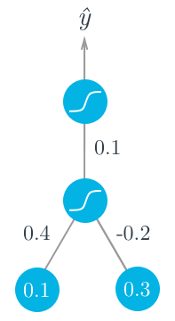

Assume we're trying to fit some binary data and the target is $y = 1$. We'll start with the forward pass, first calculating the input to the hidden unit

$ h = \sum_i w_i x_i = 0.1 \times 0.4 - 0.2 \times 0.3 = -0.02$

and the output of the hidden unit

$ a = f(h) = {sigmoid}(-0.02) = 0.495$

Using this as the input to the output unit, the output of the network is

$ \hat y = f(W . a) = {sigmoid}(0.1 \times 0.495) = 0.512 $

With the network output, we can start the backwards pass to calculate the weight updates for both layers. Using the fact that for the sigmoid function 

$ f \prime(W.a) = f(W.a)(1 - f(W.a))$

the error term for the output unit is

$ \delta^0 = (y- \hat y) f \prime(W.a) = (1 − 0.512) \times 0.512 \times (1−0.512) = 0.122 $

Now we need to calculate the error term for the hidden unit with backpropagation. Here we'll scale the error term from the output unit by the weight $ W $ connecting it to the hidden unit. For the hidden unit error term, $ \delta^h_j = \sum_k W_{jk} \delta^0_k f\prime(h_j)$, but since we have one hidden unit and one output unit, this is much simpler.

$ \delta^h = W \delta^0 f \prime(h) = 0.1 \times 0.122 \times 0.495 \times (1 - 0.495) = 0.003 $

Now that we have the errors, we can calculate the gradient descent steps. The hidden to output weight step is the learning rate, times the output unit error, times the hidden unit activation value.

$\Delta W = \eta \delta^0 a = 0.5 \times 0.122 \times 0.495 = 0.0302 $

Then, for the input to hidden weights $w_i$, it's the learning rate times the hidden unit error, times the input values.

$ \Delta w_i = \eta \delta^h x_i = ( 0.5 \times 0.003 \times 0.1, 0.5 \times 0.003 \times 0.3) = (0.00015, 0.00045) $

From this example, you can see one of the effects of using the sigmoid function for the activations. The maximum derivative of the sigmoid function is 0.25, so the errors in the output layer get reduced by at least 75%, and errors in the hidden layer are scaled down by at least 93.75%! You can see that if you have a lot of layers, using a sigmoid activation function will quickly reduce the weight steps to tiny values in layers near the input. This is known as the vanishing gradient problem. Later in the course you'll learn about other activation functions that perform better in this regard and are more commonly used in modern network architectures.

### Implementing in NumPy

For the most part you have everything you need to implement backpropagation with NumPy.

However, previously we were only dealing with error terms from one unit. Now, in the weight update, we have to consider the error for each unit in the hidden layer, $\delta_j$​:

$\delta w_{ij} = \eta \delta_j x_i$

Firstly, there will likely be a different number of input and hidden units, so trying to multiply the errors and the inputs as row vectors will throw an error:

```
hidden_error*inputs
---------------------------------------------------------------------------
ValueError                                Traceback (most recent call last)
<ipython-input-22-3b59121cb809> in <module>()
----> 1 hidden_error*x

ValueError: operands could not be broadcast together with shapes (3,) (6,)
```

Also, $w_{ij}$​ is a matrix now, so the right side of the assignment must have the same shape as the left side. Luckily, NumPy takes care of this for us. If you multiply a row vector array with a column vector array, it will multiply the first element in the column by each element in the row vector and set that as the first row in a new 2D array. This continues for each element in the column vector, so you get a 2D array that has shape (len(column_vector), len(row_vector)).

```python
hidden_error*inputs[:,None]
array([[ -8.24195994e-04,  -2.71771975e-04,   1.29713395e-03],
       [ -2.87777394e-04,  -9.48922722e-05,   4.52909055e-04],
       [  6.44605731e-04,   2.12553536e-04,  -1.01449168e-03],
       [  0.00000000e+00,   0.00000000e+00,  -0.00000000e+00],
       [  0.00000000e+00,   0.00000000e+00,  -0.00000000e+00],
       [  0.00000000e+00,   0.00000000e+00,  -0.00000000e+00]])
```

It turns out this is exactly how we want to calculate the weight update step. As before, if you have your inputs as a 2D array with one row, you can also do hidden_error*inputs.T, but that won't work if inputs is a 1D array.

### Backpropagation exercise

Below, you'll implement the code to calculate one backpropagation update step for two sets of weights. I wrote the forward pass - your goal is to code the backward pass.

Things to do

- Calculate the network's output error.
- Calculate the output layer's error term.
- Use backpropagation to calculate the hidden layer's error term.
- Calculate the change in weights (the delta weights) that result from propagating the errors back through the network.

**udacity_deeplearning_nanodegree/1 Introduction to Neural Networks/2 Minimizing Error Function with Gradient Descent/Implementing Gradient Descent/backward_pass.py**

### Implementing Gradient Descent with Backpropagation

#### Implementing backpropagation

Now we've seen that the error term for the output layer is

$\delta_k = (y_k - \hat y_k) f \prime (a_k)$

and the error term for the hidden layer is

$$ \delta_j = \sum [w_{jk} \delta_k] f \prime(h_j) $$

For now we'll only consider a simple network with one hidden layer and one output unit. Here's the general algorithm for updating the weights with backpropagation:

- Set the weight steps for each layer to zero
    - The input to hidden weights $ \Delta w_{ij} = 0$
    - The hidden to output weights $\Delta W_j = 0 $ 
- For each record in the training data: 
    - Make a forward pass through the network, calculating the output $\hat y$
    - Calculate the error gradient in the output unit, $\delta^0 = (y -\hat y)f \prime(z)$ where $ z = \sum_j W_j a_j$ , the input to the output unit.
    - Propagate the errors to the hidden layer $ \delta^h_j = \delta^0 W_j f \prime (h_j) $
    - Update the weight steps, where $\eta$ is the learning rate:
        - $ \Delta W_j = \eta \delta^0 a_j $
        - $ w_{ij} = \eta \delta^h_j a_i $
- Update the weights, where $m$ is the number of records: 
    - $W_j = W_j + \frac {\Delta W_j} {m}$
    - $ w_{ij} = w_{ij} + \frac {\Delta w_{ij}} {m} $
- Repeat for $e$ epochs.

## Backpropagation exercise

Now you're going to implement the backprop algorithm for a network trained on the graduate school admission data. You should have everything you need from the previous exercises to complete this one.

Your goals here:

- Implement the forward pass.
- Implement the backpropagation algorithm.
- Update the weights.

**udacity_deeplearning_nanodegree/1 Introduction to Neural Networks/2 Minimizing Error Function with Gradient Descent/Implementing Gradient Descent/gradient_descent_backpropagation.ipynb**

