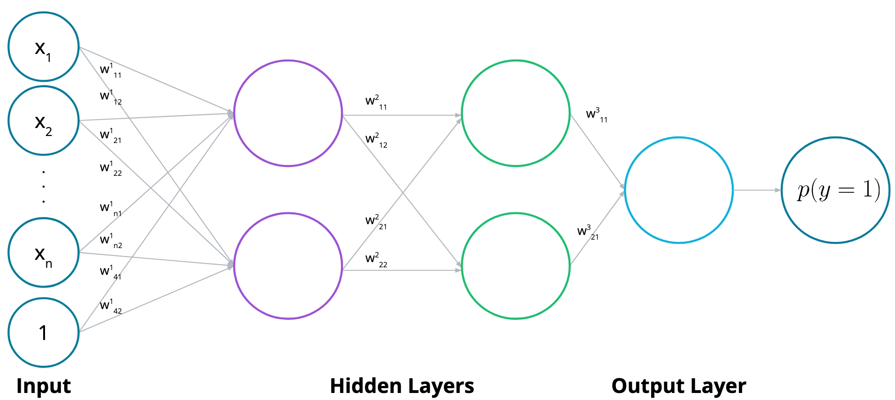
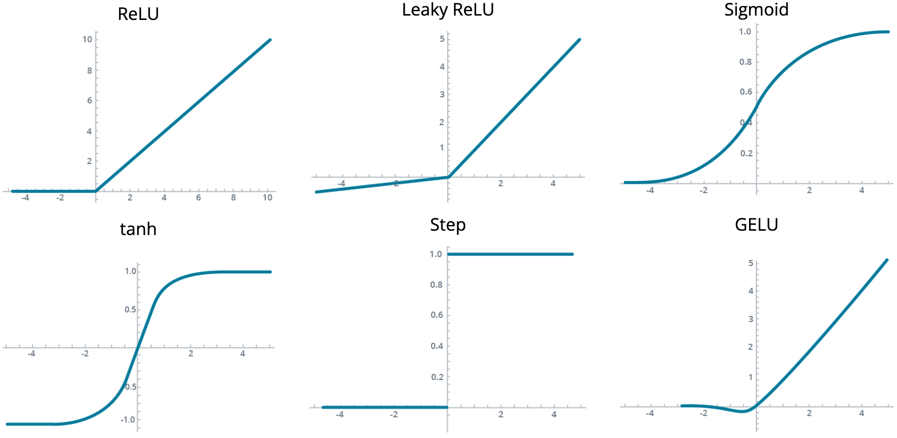

### Lesson Outline
**video**

### What We'll Learn

Now that we know the basic algorithms underpinning Neural Networks, we need to learn how to design their architectures In this lesson, we will learn how to:

- Explain essential concepts in Neural Networks, including their origins
- Implement appropriate Neural Networks architectures
- Distinguish between problems based on model objectives
- Design Neural Networks based on the decision boundaries in the data

Taken together, these skills, combined with knowledge of backpropagation and gradient descent, give us the ability to design our Neural Networks to solve our problems.

### Why "Neural Networks"?

**video**

### Origins of the Term Neural Network

Neural Networks get their name from the fact that they are—loosely—modeled after biological neurons. Perceptrons take inputs, perform calculations on the inputs, and decide whether to return one result or another (e.g., a one or a zero).

In a similar way, neurons in the brain receive inputs (such as signals from other neurons) through their branching dendrites, and then decide whether to, in turn, send out a signal of their own.

Similar to how real neurons can be connected one to another to form layers, we will be concatenating our perceptrons—layering multiple perceptrons such that we can take the output from one and use it as the input for another.

### Perceptrons vs. Neural Networks

**video**

### Multilayer Perceptrons are Neural Networks

The perceptron and neural networks are inspired by biological neurons. Though modern "perceptrons" use the Logistic Sigmoid Function or other activation functions, classical perceptrons use a step function.

Neural Networks are a more general class of models that encapsulates multi-layer perceptrons. Neural Networks are defined by having one or more hidden layers and an output layer that emits a decision -- either a predicted value, a probability, or a vector of probabilities, depending on the task.

### Neural Network Architecture

Ok, so we're ready to put these building blocks together, and build great Neural Networks! (Or Multi-Layer Perceptrons, however you prefer to call them.)

This first two videos will show us how to combine two perceptrons into a third, more complicated one.

**video**

### Combining Models

We will combine two linear models to get our non-linear model. Essentially the steps to do this are:

- Calculate the probability for each model
- Apply weights to the probabilities
- Add the weighted probabilities
- Apply the sigmoid function to the result

**video**

The big picture here is that we can represent our linear models using perceptrons—and then combine our perceptrons to form larger neural networks.

### Multiple layers

Now, not all neural networks look like the one above. They can be way more complicated! In particular, we can do the following things:

- Add more nodes to the input, hidden, and output layers.
- Add more layers.

We'll see the effects of these changes in the next video.

** video **

Neural networks have a certain special architecture with layers:

- The first layer is called the input layer, which contains the inputs.
- The next layer is called the hidden layer, which is the set of linear models created with the input layer.
- The final layer is called the output layer, which is where the linear models get combined to obtain a nonlinear model.

Neural networks can have different architectures, with varying numbers of nodes and layers:
 
- Input nodes. In general, if we have nnn nodes in the input layer, then we are modeling data in n-dimensional space (e.g., 3 nodes in the input layer means we are modeling data in 3-dimensional space).
- Output nodes. If there are more nodes in the output layer, this simply means we have more outputs—for example, we may have a multiclass classification model.
- Layers. If there are more layers then we have a deep neural network. Our linear models combine to create nonlinear models, which then combine to create even more nonlinear models!

### Multi-Class Classification

And here we elaborate a bit more into what can be done if our neural network needs to model data with more than one output.

**video**

When we have three or more classes, we could construct three separate neural networks—one for predicting each class. However, this is not necessary. Instrad, we can add more nodes in the output layer. Each of these nodes will give us the probability that the item belongs to the given class.

### Feedforward

Training a neural network essentially means determining what parameters they should have on the edges in order to model our data well. So in order to learn how to train them, we need to look carefully at how they process the input to obtain an output.

**video**

Feedforward is the process neural networks use to turn the input into an output. In general terms, the process looks like this:

- Take the input vector
- Apply a sequence of linear models and sigmoid functions
- Combine maps to create a highly non-linear map

As we saw in the video, the feedforward formula is:

$$ \hat y = \sigma \circ W^{(2)} \circ \sigma \circ W^{(1)}(x) $$ 

### Error Function

**video**

Just as before, neural networks will produce an error function, which at the end, is what we'll be minimizing.

For a multilayer perceptron, as we saw, our prediction is simply a combination of matrix multiplications and sigmoid functions. But the error function can be the exact same formula, aside from the fact that $ \hat{y}$​ is a bit more complicated.

### Activation Functions

**video**

### Activation Function Properties

There are a wide variety of activation functions that we can use. Activation functions should be:

- Nonlinear
- Differentiable -- preferably everywhere
- Monotonic
- Close to the identity function at the origin

We can loosen these restrictions slightly. For example, ReLU is not differentiable at the origin. Others, like monotonicity, are very important and cannot be reasonably relaxed.

### Output Functions

**video**

### How to Choose an Output Function

Your choice of output function depends on two primary factors about what you are trying to predict: its shape and its range.

This means that our output function is determined by what we're trying to do: classification or regression.

Common output functions include:

- Sigmoid for binary classification
- Softmax for multi-class classification
- Identity or ReLU for regression

###  Exercise: Choosing Your Activation and Output Function

**udacity_deeplearning_nanodegree/1 Introduction to Neural Networks/3 Intro to Neural Networks/Exercise: Choosing Your Activation and Output Function/Activation and Output Functions.ipynb**

### Neural Network Objectives
**video**

### Adjusting your Model According to Objectives

Once you know the output you're aiming for -- a binary classification, a classification into multiple classes, or a real number -- you can use that information to make decisions about your model.

In particular, the combination of loss function and output activation function is dictated by the type of problem that you have.

### Decision Boundaries
**video**

### Nonlinear and High Dimensional Decision Boundaries

Our data will dictate what the shape of our decision boundary should be. Neural networks will be able to find decision boundaries that are high-dimensional and nonlinear by combining the decision boundaries of the hidden neurons. Even in cases where we cannot visualize our decision boundary easily, knowing the approximate complexity of our decision boundary will inform how big our model needs to be.