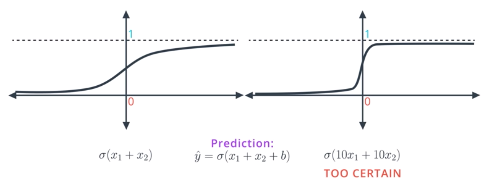
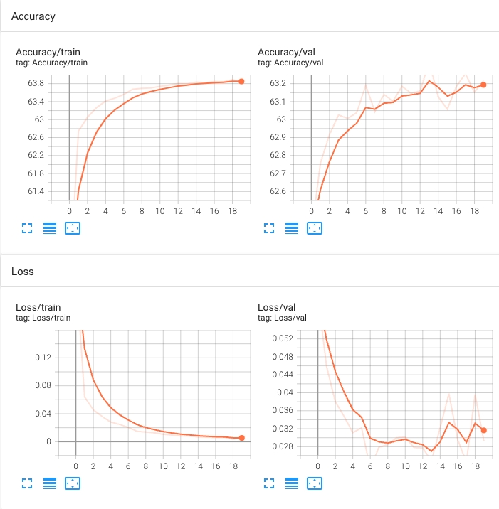
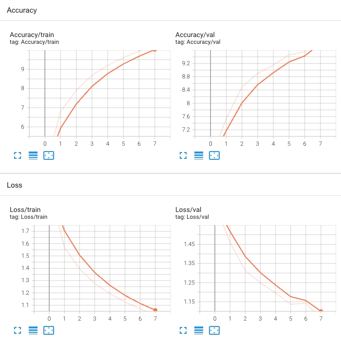
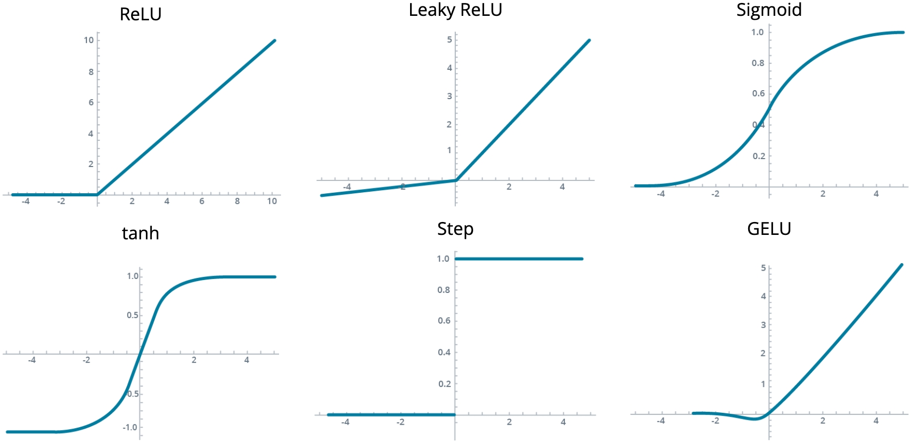

### Introduction to Training Neural Networks

### Introduction

**video**

### Introduction to Training Neural Networks

In this lesson, we'll cover the details of how to train a neural network and define a training loop. We'll cover:

- How to divide datasets
- Distinguish between underfitting and overfitting
- Techniques for optimizing training
- Choosing loss functions and optimizers for neural networks
- How to write training loops in PyTorch

### Lesson Outline

**video**

### What We'll Learn

Having a conceptual framework for neural networks is important, but so is actually training the models. In this lesson, we will learn how to:

- Distinguish between underfitting and overfitting
- Visualize our training with TensorBoard
- Optimize the training process with early stopping, regularization, dropout, random restarts, learning rate decay, and momentum
- Use PyTorch to build and train a neural network

### Training, Validation, and Testing

**video**

### Dividing Data

When presented with a dataset, if we use the whole thing to train our model, then we do not know how it performs on unseen data. We typically divide our data into three sets whose size can vary, but a good rule of thumb is the 80/10/10 rule:

- Train (80%)
- Validation (10%)
- Test (10%)

Another powerful approach is k-fold cross-validation, where the data is split up into some number, which we call k, equal parts. One is used as the validation set, one is used as the test set, and the remaining parts are used as the training set. We then cycle through all combinations of the data until all parts have had a chance to be the test set.

### Overfitting and Underfitting

**video**

When we train our models, it is entirely possible to get them to a point where they perform very well on our training data—but then perform very poorly on our testing data. Two common reasons for this are underfitting and overfitting

### Underfitting

- Underfitting means that our model is too simplistic. There is a poor fit between our model and the data because we have oversimplified the problem.
- Underfitting is sometimes referred to as error due to bias. Our training data may be biased and this bias may be incorporated into the model in a way that oversimplifies it.

For example, suppose we train an image classifier to recognize dogs. And suppose that the only type of animal in the training set is a dog. Perhaps the model learns a biased and overly simple rule like, "if it has four legs it is a dog". When we then test our model on some data that has other animals, it may misclassify a cat as a dog—in other words, it will underfit the data because it has error due to bias.

### Overfitting

- Overfitting means that our model is too complicated. The fit between our model and the training data is too specific—the model will perform very well on the training data but will fail to generalize to new data.
- Overfitting is sometimes referred to as error due to variance. This means that there are random or irrelevant differences among the data points in our training data and we have fit the model so closely to these irrelevant differences that it performs poorly when we try to use it with our testing data.

For example, suppose we want our image classifier to recognize dogs, but instead we train it to recognize "dogs that are yellow, orange, or grey." If our testing set includes a dog that is brown, for example, our model will put it in a separate class, which was not what we wanted. Our model is too specific—we have fit the data to some unimportant differences in the training data and now it will fail to generalize.

### Applying This to Neural Networks

Generally speaking, underfitting tends to happen with neural networks that have overly simple architecture, while overfitting tends to happen with models that are highly complex.

The bad news is, it's really hard to find the right architecture for a neural network. There is a tendency to create a network that either has overly simplistic architecture or overly complicated architecture. In general terms, the approach we will take is to err on the side of an overly complicated model, and then we'll apply certain techniques to reduce the risk of overfitting.

### Early Stopping

**video**

When training our neural network, we start with random weights in the first epoch and then change these weights as we go through additional epochs. Initially, we expect these changes to improve our model as the neural network fits the training data more closely. But after some time, further changes will start to result in overfitting.

We can monitor this by measuring both the training error and the testing error. As we train the network, the training error will go down—but at some point, the testing error will start to increase. This indicates overfitting and is a signal that we should stop training the network prior to that point. We can see this relationship in a model complexity graph like this one:

Have a look at the graph and make sure you can recognize the following:

- On the Y-axis, we have a measure of the error and on the X-axis we have a measure of the complexity of the model (in this case, it's the number of epochs).
- On the left we have high testing and training error, so we're underfitting.
- On the right, we have high testing error and low training error, so we're overfitting.
- Somewhere in the middle, we have our happy Goldilocks point (the point that is "just right").

In summary, we do gradient descent until the testing error stops decreasing and starts to increase. At that moment, we stop. This algorithm is called early stopping and is widely used to train neural networks.

### Visualizing Training with Tensorboard

**video**

### How to Use Tensorboard

After launching Tensorboard from the command line and choosing a directory for the logs, we use the SummaryWriter class from torch.utils.tensorboard. Using the add_scalar method, we can write things like loss and accuracy. We can also put images and figures into Tensorboard using add_image and add_figure respectively.

For further information, check the [PyTorch Tensorboard documentation](https://pytorch.org/docs/stable/tensorboard.html)

### Regularization

**video**

A couple of reminders:

- The prediction is: $ \hat y = \sigma (w_1 x_1 + w_2 x_2 + b) $
- The general equation for a linear model is: $ w_1 x_1 + w_2 x_2 + b = 0 $

With that in mind, suppose we have a data set with only two points and we want to separate these points with a line. Which of the below equations gives a smaller error?
Solution 1:

$ x_1 + x_2 = 0 $

Notice that the bias bbb is 000 and w1w_1w1​ and w2w_2w2​ are both equal to 111.
Solution 2

$ 10x_1 + 10x_2 = 0 $ 

Notice that the bias b is 0 and $w_1$​ and $w_2$​ are both equal to 10.

Which gives a smaller error? $ 10x_1 + 10x_2 = 0 $ 

**video [Goal: Split Two Points]**

### Considering the Activation Functions

A key point here is to consider the activation functions of these two equations:

- When we apply sigmoid to small values such as $ x_1 + x_2 $​, we get the function on the left, which has a nice slope for gradient descent.
- When we multiply the linear function by 10 and take sigmoid of $ 10x_1 + 10x_2 $​, our predictions are much better since they're closer to zero and one. But the function becomes much steeper and it's much harder to do graident descent.

Conceptually, the model on the right is too certain and it gives little room for applying gradient descent. Also, the points that are classified incorrectly in the model on the right will generate large errors and it will be hard to tune the model to correct them.

### Regularization

Now the question is, how do we prevent this type of overfitting from happening? The trouble is that large coefficients are leading to overfitting, so what we need to do is adjust our error function by, essentially, penalizing large weights.

If you recall, our original error function looks like this:

$$ - \frac {1}{m} \sum_{i=1}^{n} (1 - y_i) \ln {(1 - \hat y_i)} + y_i \ln{\hat (y_i)}$$

We want to take this and add a term that is big when the weights are big. There are two ways to do this. One way is to add the sums of absolute values of the weights times a constant lambda:

$$ + \lambda (\mid {w_1} \mid + {...} + \mid {w_n} \mid ) $$

The other one is to add the sum of the squares of the weights times that same constant:

$$ + \lambda ({w_1}^2 + {...} + {w_n}^2) $$

In both cases, these terms are large if the weights are large.

### L1 vs L2 Regularization

The first approach (using absolute values) is called L1 regularization, while the second (using squares) is called L2 regularization. Here are some general guidelines for deciding between the two:

### L1 Regularization

- L1 tends to result in sparse vectors. That means small weights will tend to go to zero.
- If we want to reduce the number of weights and end up with a small set, we can use L1.
- L1 is also good for feature selection. Sometimes we have a problem with hundreds of features, and L1 regularization will help us select which ones are important, turning the rest into zeroes.

### L2 Regularization

- L2 tends not to favor sparse vectors since it tries to maintain all the weights homogeneously small.
- L2 gives better results for training models so it's the one we'll use the most.

### Exercise: Implementing Regularization

**udacity_deeplearning_nanodegree/1 Introduction to Neural Networks/4 Training Neural Networks/Exercise: Implementing Regularization/Implementing Regularization -- STARTER.ipynb**

### Dropout
**video**

### Turning off Weights to Balance Training

When training a neural network, sometimes one part of the network has very large weights and it ends up dominating the training, while another part of the network doesn't really play much of a role (so it doesn't get trained).

To solve this, we can use a method called dropout in which we turn part of the network off and let the rest of the network train:

- We go through the epochs and randomly turn off some of the nodes. This forces the other nodes to pick up the slack and take a larger part in the training.
- To drop nodes, we give the algorithm a parameter that indicates the probability that each node will get dropped during each epoch. For example, if we set this parameter to 0.2, this means that during each epoch, each node has a 20% probability of being turned off.
- Note that some nodes may get turned off more than others and some may never get turned off. This is OK since we're doing it over and over; on average, each node will get approximately the same treatment.

### Local Minima and Random Restart

**video**

### Getting Stuck in Local Minima

Gradient descent looks at the direction where it can most decrease the error and then it takes a step in that direction. However, if there are multiple low points in the solution space, gradient descent may end up leading us to local minima—solutions where the error is at the lowest point in the local area, but not the lowest point overall.

**video**

### Random Restart

One way to solve our problem is to use random restart. We start (and restart) from a few different random places and do gradient descend from all of them. This increases the probability that we'll get to the global minimum, or at least a pretty good local minimum.

### Exercise: Training Techniques

### Scenario 1:

You are training a neural network and see the following accuracy and loss in TensorBoard:

- Based on the screenshot, what is happening to your model? 
    - It is overfitting to the training set
    - It is stuck in a local minimum

- Which two of the following techniques would be most helpful for this scenario?
    - Early stopping
    - Random restart

### Scenario 2:

You're training another neural network and find the following accuracy and loss in TensorBoard:

- Which of the following is occurring?
    - The model is not sufficiently trained

### Vanishing and Exploding Gradients

**video**

### Gradients and Activation Functions

Both vanishing and exploding gradients are more common in deeper networks. However, the phenomena of vanishing and exploding gradients differ in one major way: they are caused by different properties of activation functions used in the hidden layers. So-called "saturating" activation functions -- those that have a bounded range, can cause vanishing gradients. Meanwhile, unbounded activation functions can cause exploding gradients.

- Consider the six activation functions depicted above. Which of the six are most susceptible to vanishing gradients?
    - Sigmoid
    - tanh
    - Step
- In addition to changing the activation function, we can use the torch.nn.utils.clip_grad_norm_ function to clip our gradients. What effect will this have?
    - Prevent exploding gradients by bounding the norm of the gradient

### Learning Rate Decay

**video**

### Choosing Learning Rates

Here are some key ideas to keep in mind when choosing a learning rate:

If the learning rate is large:

- This means the algorithm is taking large steps, which can make it faster.
- However, the large steps may cause it to miss (overshoot) the minimum.

If the learning learning rate is small:

- This means the algorithm is taking small steps, which can make it slower.
- However, it will make steady progress and have a better chance of arriving at the local minimum.

If your model is not working, a good general rule of thumb is to try decreasing the learning rate. The best learning rates are those that decrease as the algorithm is getting closer to a solution.

### Momentum
**video**

### Pushing Past Local Minima

Another way to solve the local minimum problem is with momentum. Momentum is a constant $ \beta $ between 0 and 1.

We use  $ \beta $ to get a sort of weighted average of the previous steps:

$$ {step}(n) + \beta {step}(n - 1) + \beta^2 {step}(n) + \beta^2 {step}(n - 2) $$

The previous step gets multiplied by 1, the one before it gets multiplied by $ \beta $ , the one before that by $ \beta^2 $ the one before that by $ \beta^3 $ , and so on. Because $ \beta $ has a value between 0 and 1, raising it to increasingly large powers means that the value will get smaller and smaller. In this way, the steps that happened a long time ago will be multiplied by tiny values and thus matter less than the ones that happened recently.

This can get us over "humps" and help us discover better minima. Once we get to the global minimum, the momentum will still be pushing us away, but not as much.

### Optimizers

**video**

### Choosing an Optimizer

Our choice of optimizer is not often the most important decision in training a model, but it can definitely make a difference. While Adam is a good default, the use of SGD is still common. The various optimizers available in PyTorch are covered in the [torch.optim](https://pytorch.org/docs/stable/optim.html) documentation

### Quiz Question

What parameter of the Adam optimizer tells it how big of a step to take when we call the .step() method? You can reference [the documentation](https://pytorch.org/docs/stable/generated/torch.optim.Adam.html#torch.optim.Adam) if you get stuck.

- lr

### Batch vs Stochastic Gradient Descent

**video**

### Batch Gradient Descent

First, let's review our batch gradient descent algorithm:

- In order to decrease error, we take a bunch of steps following the negative of the gradient, which is the error function.
- Each step is called an epoch.
- In each epoch, we take our input (all of our data) and run it through the entire neural network.
- Then we find our predictions and calculate the error (how far the predictions are from the actual labels).
- Finally, we back-propagate this error in order to update the weights in the neural network. This will give us a better boundary for predicting our data.

If we have a large number of data points then this process will involve huge matrix computations, which would use a lot of memory.

### Stochastic Gradient Descent

To expedite this, we can use only some of our data at each step. If the data is well-distributed then a subset of the data can give us enough information about the gradient.

This is the idea behind stochastic gradient descent. We take small subsets of the data and run them through the neural network, calculating the gradient of the error function based on these points and moving one step in that direction.

We still want to use all our data, so what we do is the following:

- Split the data into several batches.
- Take the points in the first batch and run them through the neural network.
- Calculate the error and its gradient.
- Back-propagate to update the weights (which will define a better boundary region).
- Repeat the above steps for the rest of the batches.

Notice that with this approach we take multiple steps, whereas with batch gradient descent we take only one step with all the data. Each step may be less accurate, but, in practice, it's much better to take a bunch of slightly inaccurate steps than to take only one good one.

### Training Techniques in PyTorch

**video**

### Implementing Training Techniques in PyTorch

The various training optimizations we've covered are relatively easy to implement when training our networks. Though early stopping is not written into PyTorch itself, implementing it in the training loop is fairly easy.

Our other techniques are more straightforward and can be found in the PyTorch documentation:

- [Dropout](https://pytorch.org/docs/stable/generated/torch.nn.Dropout.html)
- Momentum and learning rate decay are implemented in the [optimizer](https://pytorch.org/docs/stable/optim.html)

### Training Loops in PyTorch
**video**

Writing Training Loops

To write a training loop, one typically begins with the for epoch in range(epochs) syntax. Then, loading each batch from the dataloader, the steps of training are:

- Zeroing out the optimizer's gradients with optimizer.zero_grad()
- Computing the outputs with net(inputs)
- Computing the loss with criterion(outputs, labels)
- Computing the gradient of the loss with loss.backward()
- Taking an update step with the optimizer using optimizer.step()

We can also implement early stopping, compute validation loss and accuracy, and print updates in the training loop.

### Exercise: Training Neural Networks

**udacity_deeplearning_nanodegree/1 Introduction to Neural Networks/4 Training Neural Networks/Exercise: Training Neural Networks/Training Neural Networks.ipynb**

### Lesson Review

**video**

### What We Learned

At the beginning of this lesson, we needed to develop the skills to actually train a neural network using PyTorch. In this lesson, we learned how to:

- Split our data into training, validation, and test sets
- Distinguish between and understand the causes of underfitting and overfitting
- Optimize the model training process with early stopping, regularization, and dropout
- Define a loss function and optimizer to train a neural network
- Write a training loop to use PyTorch to build a neural network

Using these skills, we can train a neural network from scratch and ensure that it generalizes well to unseen data.

### Glossary

For your reference, here are all the new terms we introduced in this lesson:

- Training Data: Data actually used to fit the model
- Validation Data: Data used during training to evaluate generalization
- Test Data: Data used to evaluate the final model
- Underfitting (also called error due to bias): Underfitting means that our model is too simplistic because of a poor fit between our model, and the data because we have oversimplified the problem.
- Overfitting (also called error due to variance): Overfitting means that our model is too complicated, and the fit between our model and the training data is too specific—the model will perform very well on the training data but will fail to generalize to new data.
- Early Stopping: Implementing gradient descent until the testing error stops decreasing and starts to increase.
- Dropout: The process of turning part of the network off and letting the rest of the network train
- Local Minima: solutions where the error is at the lowest point in the local area, but not the lowest point overall.
- Momentum: Momentum is a constant β\betaβ between 000 and 111.
- Stochastic gradient descent: The process of taking small subsets of the data and running them through the neural network, calculating the gradient of the error function based on these points, and moving one step in that direction.

### Course Overview

**video**

### Course Review

In this course, we covered the prerequisites for the course and some tools needed to do deep learning.

We discussed when to use Deep Learning, the history of Deep Learning, and how Deep Learningrelates to the broader field of Artificial Intelligence and Machine Learning.

We covered how to deal with tensor data and preprocess our data.

Then, we moved into how the algorithms that actually power neural networks: gradient descent and backpropagation.

Once we had knowledge of the algorithms used to train neural networks, we learned about the design and architecture of neural networks, including activation functions and output functions.

In our final lesson, we learned about the techniques necessary to train neural networks and how to optimize that training.

