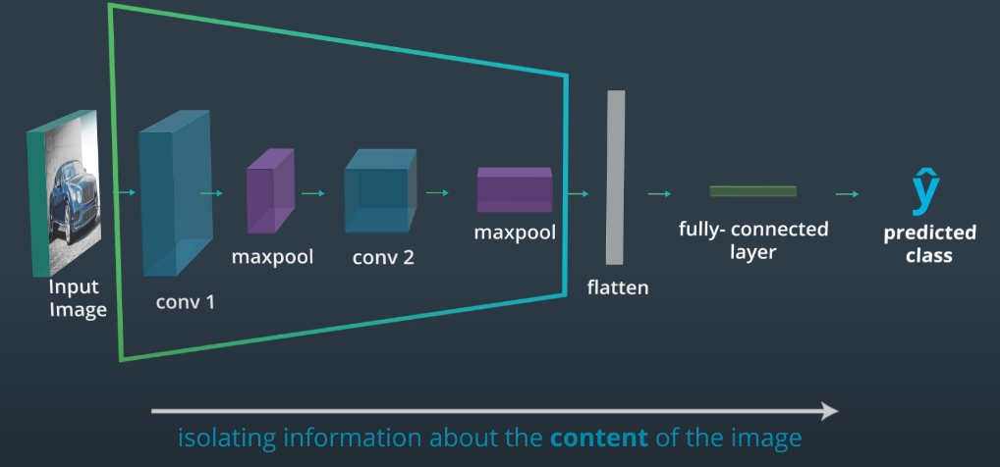
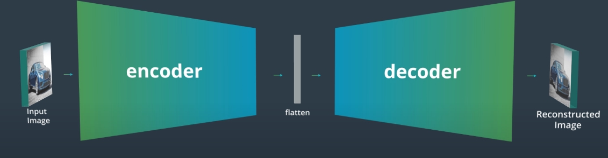
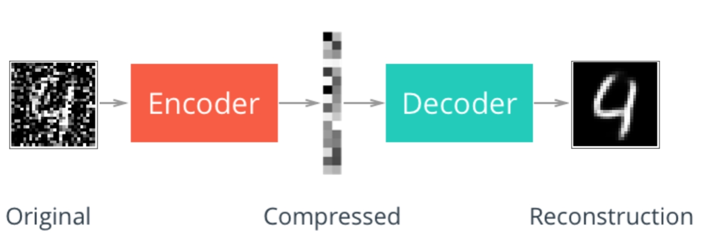
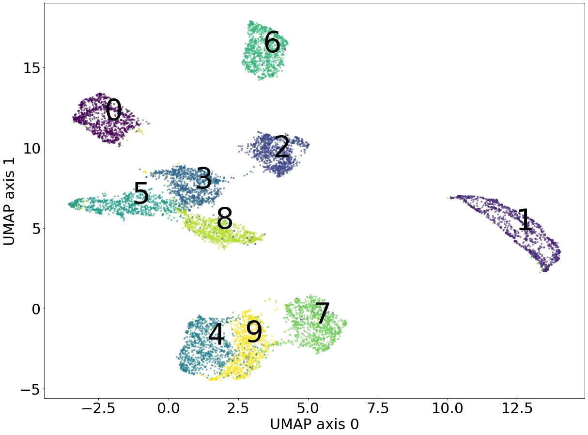
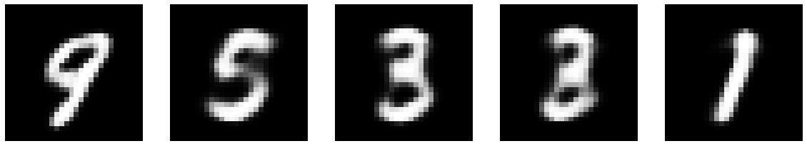

### Introduction to Autoencoders
**video**

### Summary

Autoencoders are a very interesting neural network architecture that can be used for different applications directly (anomaly detection, denoising...), and it is also widely used in larger and modern architectures for other tasks (object detection, image segmentation).

More advanced versions of autoencoders, such as variational autoencoders, can also be used as generative models, i.e., they can learn representations of data and use that representation to generate new realistic images.

### Lesson Outline

**video**

### Lesson Overview

In this lesson, you will learn:

- About linear and CNN-based autoencoders
- How to design and train a linear autoencoder for anomaly detection
- How to design and train a CNN autoencoder for anomaly detection
- How to apply autoencoders for image denoising
- About autoencoders and generative models

### Autoencoders

**video**

When studying CNNs for image classification or regression we have seen that the network is essentially composed of two parts: a backbone that extracts features from the image, and a Multi-Layer Perceptron or similar that uses those features to decide which class the image belongs to. In-between the two we have a flattening operation (or a Global Average Pooling layer) that takes the last feature maps coming out of the backbone and transforms them into a 1d array, which is a feature vector.



<p align="center"> Structure of a Typical CNN </p>

Autoencoders have a similar backbone (called encoder in this context) that produces a feature vector (called embedding in this context). However, they substitute the fully-connected layers (the head) with a decoder stage whose scope is to reconstruct the input image starting from the embeddings:


<p align="center"> Typical Structure of an Autoencoder </p>

This can appear pointless at first glance, but it is actually very useful in many contexts.

### Uses of Autoencoders

We can use autoencoders to:

- Compress data
- Denoise data
- Find outliers (do anomaly detection) in a dataset
- Do inpainting (i.e., reconstruct missing areas of an image or a vector)
- With some modifications, we can use autoencoders as generative models - models capable of generating new images

Autoencoders are also the basis for a whole field of research concerned with metric learning, which is learning representations of images that can be useful in downstream tasks.

### Unsupervised vs. Supervised Learning

By looking closer at the structure and the tasks we have just described, you can see that autoencoders do not use the information on the label of the image at all. They are only concerned with the image itself, not with its label. The tasks that autoencoders address are examples of unsupervised learning, where the algorithm can learn from a dataset without any label. Another example of unsupervised learning that you might be familiar with is clustering.

CNNs for image classification are instead an example of supervised learning, where the network learns to distinguish between classes by learning from a labeled dataset.

### The Loss of Autoencoders

The autoencoder is concerned with encoding the input to a compressed representation, and then re-constructing the original image from the compressed representation. The signal to train the network comes from the differences between the input and the output of the autoencoder.

For example, let's consider an autoencoder for images. We compare the input image to the output image and we want them to be as similar as possible.

What is the right loss for this task?

We have different possibilities, but the most common one is the Mean Squared Error (MSE) loss. It just considers the square of the difference between each pixel in the input image and the corresponding pixel in the output image, so minimizing this loss is equivalent to minimizing the difference of each pixel in the input with the corresponding pixel in the output. In practice, this is given by the formula:

$$ MSE = \frac {1}{n_{rows} n_{cols}} \sum_{i=1}^{n_{rows}} \sum_{j=1}^{n_{cols}} (x_{ij} - \hat x_{ij})^2 $$

We take the square of the difference between each pixel $x_{ij}$ in the input and the corresponding pixel $ \hat x_{ij} $ in the output and we average them out, i.e., we sum all the squared differences and then we divide by the number of pixels (which is equal to the number of rows $ n_{rows} $ times the number of columns $n_{cols}$).

This loss is very simple and in practice gives good results. Using other types of losses is possible as well.

### A Linear Autoencoder

**video**

You will get a chance in the exercise upcoming to try out this code on your own!

In this first look we have built the simplest autoencoder, which is made up of two linear layers:

```
class Autoencoder(nn.Module):

    def __init__(self, encoding_dim):
        super(Autoencoder, self).__init__()
        ## encoder ##
        self.encoder = nn.Sequential(
            nn.Linear(28*28, encoding_dim),
            nn.ReLU(),
            nn.BatchNorm1d(encoding_dim)
        )

        ## decoder ##
        self.decoder = nn.Sequential(
            nn.Linear(encoding_dim, 28*28),
            nn.Sigmoid()
        )

        self.auto_encoder = nn.Sequential(
            nn.Flatten(),
            self.encoder,
            self.decoder
        )

    def forward(self, x):
        # define feedforward behavior 
        # and scale the *output* layer with a sigmoid activation function

        encoded = self.auto_encoder(x)

        # Reshape the output as an image
        # remember that the shape should be (batch_size, channel_count, height, width)
        return encoded.reshape((x.shape[0], 1, 28, 28))
```

We have trained it using the Mean Squared Error (MSE) loss. Of course, we did not use the labels, since anomaly detection with autoencoders is an unsupervised task.

### Exercise: Linear Autoencoder

**udacity_deeplearning_nanodegree/2 Convolutional Neural Networks/5 Autoencoders/Exercise: Linear Autoencoder/dense_autoencoder.ipynb**

### Exercise Solution: Linear Autoencoder
**video**

### Code

This is the autoencoder network that I used in the solution to the exercise, for your reference:

```
class Autoencoder(nn.Module):

    def __init__(self, encoding_dim):
        super(Autoencoder, self).__init__()
        ## encoder ##
        self.encoder = nn.Sequential(
            nn.Linear(28*28, 256),
            nn.ReLU(),
            nn.BatchNorm1d(256),
            nn.Linear(256, encoding_dim),
            nn.ReLU(),
            nn.BatchNorm1d(encoding_dim),

        )

        ## decoder ##
        self.decoder = nn.Sequential(
            nn.Linear(encoding_dim, 256),
            nn.ReLU(),
            nn.BatchNorm1d(256),
            nn.Linear(256, 28*28),
            nn.Sigmoid()
        )

        self.auto_encoder = nn.Sequential(
            nn.Flatten(),
            self.encoder,
            self.decoder
        )

    def forward(self, x):
        # define feedforward behavior 
        # and scale the *output* layer with a sigmoid activation function

        encoded = self.auto_encoder(x)

        # Reshape the output as an image
        # remember that the shape should be (batch_size, channel_count, height, width)
        return encoded.reshape((x.shape[0], 1, 28, 28))
```

### Autoencoders for anomaly detection

Now that you tried out using autoencoders for anomaly detection, try to explain how exactly these algorithms can pinpoint examples that are somewhat dissimilar from the rest of the dataset.

This is an open-ended question, so your answer will be different from ours—but after you submit your response, we'll show you how we thought about the problem and point out some key things to consider.

### Your reflection

if the algorithm incurs big loss decoding the encoded embedding, it marks it as anomaly.

### Things to think about

Autoencoders compress the visual information contained in images into a compact, latent representation (the embedding) that has a much lower dimensionality than the input image. By asking the decoder to reconstruct the input from this compact representation, we force the network to learn an embedding that stores meaningful information about the content of the image. For example, in the solution I compressed 28 x 28 images (so 784 pixels) into a vector of only 32 elements, but I was still able to reconstruct most of the images very well.

When applying it to a test set that the network has never seen, most images were reconstructed well, but some of them were not. This means that the compression that the network has learned on the training dataset works well for the vast majority of the examples in this new set, but not for these anomalous ones. These anomalies have characteristics that the network is not well equipped to reconstruct, and therefore the decoder cannot recreate them faithfully during decoding.

Through scoring each example by the loss, we are able to identify anomalies by simply taking the examples with the highest loss.


### Learnable Upsampling

**video**

We have seen how to use linear layers to create an autoencoder. Since we are working on images, it is natural to use convolution instead of just linear layers. Convolution allows us to keep spatial information and get a much more powerful representation of the content of an image.

However, this poses a problem: while the encoder section can be just the backbone of a standard CNN, what about the decoder part? Yes, we could flatten the output of the backbone and then use linear layers to decode. But there are also other ways to upsample a compact representation into a full-resolution image. For example, we can use a Transposed Convolutional Layer, which can learn how to best upsample an image. We'll see how that works on the next page.

### Transposed Convolutions

**video**

The Transposed Convolution can perform an upsampling of the input with learned weights. In particular, a Transposed Convolution with a 2 x 2 filter and a stride of 2 will double the size of the input image.

Whereas a Max Pooling operation with a 2 x 2 window and a stride of 2 reduces the input size by half, a Transposed Convolution with a 2 x 2 filter and a stride of 2 will double the input size.

Let's consider an autoencoder with two Max Pooling layers in the encoder, both having a 2 x 2 window and a stride of 2. If we want the network to output an image with the same size as the input, we need to counteract the two Max Pooling layers in the encoder with two Transposed Convolution layers with a 2 x 2 filter and a stride of 2 in the decoder. This will give us back an output with the same size as the input.

### Transposed Convolutions in PyTorch

You can generate a Transposed Convolution Layer in PyTorch with:

```
unpool = nn.ConvTranspose2d(input_ch, output_ch, kernel_size, stride=2)
```

See [here](https://pytorch.org/docs/stable/generated/torch.nn.ConvTranspose2d.html) for the full documentation.

For example, we can generate a Transposed Convolution Layer that doubles the size of an input grayscale image and generates 16 feature maps as follows:

```
unpool = nn.ConvTranspose2d(1, 16, 2, stride=2)
```

### Alternative to a Transposed Convolution

It [can be shown](https://distill.pub/2016/deconv-checkerboard/) that Transposed Convolutions tend to produce checkerboard artifacts in the output of the networks. Therefore, nowadays many practitioners replace them with a nearest-neighbor upsampling operation followed by a convolution operation. The convolution makes the image produced by the nearest-neighbors smoother. For example, we can replace this Transposed Convolution:

```
unpool = nn.ConvTranspose2d(1, 16, 2, stride=2)
```
with:

```

unpool = nn.Sequential(
    nn.Upsample(scale_factor = 2, mode='nearest'),
    nn.Conv2d(1, 16, kernel_size=3, stride=1, padding=1)
)
```
### Convolutional Autoencoder

**video**

The simplest autoencoder using CNNs can be constructed with a convolutional layer followed by Max Pooling, and then an unpooling operation (such as a Transposed Convolution) that brings the image back to its original size:

```
class Autoencoder(nn.Module):
    def __init__(self, encoding_dim):
        super(Autoencoder, self).__init__()

        ## encoder ##
        self.encoder = nn.Sequential(
            nn.Conv2d(1, 3, 3, padding=1),
            nn.ReLU(),
            nn.MaxPool2d(2, 2)
        )

        ## decoder ##
        self.decoder = nn.Sequential(
            # Undo the Max Pooling
            nn.ConvTranspose2d(3, 1, 2, stride=2),
            nn.Sigmoid()
        )

        self.auto_encoder = nn.Sequential(
            self.encoder,
            self.decoder
        )

    def forward(self, x):
        # define feedforward behavior 
        # and scale the *output* layer with a sigmoid activation function

        return self.auto_encoder(x)
```

Of course, this autoencoder is not very performant. Typically you want to compress the information much more with a deeper encoder, and then uncompress it with a deeper decoder. This is what you are going to do in the next exercise.

In real-life situations, you can also use an already-existing architecture like a ResNet to extract the features (just remember to remove the final linear layers, i.e., the head and only keep the backbone). Of course, your decoder needs to then start from the embedding built by the architecture to get back to the dimension of the input image.

# Exercise: Convolutional Autoencoder

**udacity_deeplearning_nanodegree/2 Convolutional Neural Networks/5 Autoencoders/Exercise: Convolutional Autoencoder/cnn_autoencoder.ipynb**

### Exercise Solution: Convolutional Autoencoder

**video**

### Denoising

We call denoising the task of removing noise from an image by reconstructing a denoised image.

This is a task that convolutional autoencoders are well-suited for.


<p align="center"> A Denoising Autoencoder </p>

A denoising autoencoder is a normal autoencoder, but trained in a specific way.

### How Do We Train a Denoising Autoencoder?

In order to train a denoising autoencoder we need to have access to the denoised version of the images. The easiest way to do this is to build a training dataset by taking clean images and adding noise to them. Then we will feed the image with the added noise into the autoencoder, and ask it to reconstruct the denoised (original) version.

It is very important that we then compute the loss by comparing the input uncorrupted image (without noise) and the output of the network. DO NOT use the noisy version when computing the loss, otherwise your network will not learn!

### Why Does it Work?

Let's consider an autoencoder trained on a noisy version of the MNIST dataset. During training, the autoencoder sees many examples of all the numbers. Each number has noisy pixels in different places. Hence, even though each number is corrupted by noise, the autoencoder can piece together a good representation for each number by learning different pieces from different examples. Here the convolutional structure helps a lot, because after a few layers the convolution smooths out a lot of the noise in a blurry but useful image of the number. This is also why generally you need to go quite deep with CNN autoencoders if you want to use them for denoising.

### Exercise: Denoising Autoencoder

**udacity_deeplearning_nanodegree/2 Convolutional Neural Networks/5 Autoencoders/Exercise: Denoising Autoencoder/denoising_autoencoders.ipynb**

### Exercise Solution: Denoising Autoencoders

**video**

### Autoencoders and Generative Models

As we have seen, an autoencoder has an encoder part that compresses the input into a vector (embedding) and a decoder part that takes the embedding and tries to regenerate the input.

Let's look closer at the embeddings for the MNIST dataset. Even though we did not use the labels for training the autoencoder, we can use them for visualization purposes and see if the embedding that the encoder has learned separates well the various classes. After all, if the encoder has learned the latent characteristics that distinguish a 3 from a 1 or a 8 from a 7, then the embedding space should reflect this structure.

Let's consider the CNN autoencoder we presented as a solution to the Convolutional Encoder exercise of this lesson. It has a latent space (where the embeddings live) of 32 feature maps each 7 x 7 pixels. This corresponds to 1568 numbers. Of course we cannot visualize a space with 1568 dimensions, so we are going to use the UMAP dimensionality reduction technique to visualize it in 2d:



Here the different colors correspond to the different classes in the MNIST dataset (the different digits). To make things easier, I annotated each cluster with the label of the most common class in the cluster.

It is indeed clear that images representing similar numbers are clustered together. Not only are most of the points belonging to the same class close to each other, but also numbers that are visually similar to each other (like 3, 8 and 5) are close in the latent space.

Looking at this we could ask: what happens if we generate an embedding vector close to one of these clusters, and run it through the decoder? We should be able to generate new numbers! This is indeed the case. If we take a few points in the embedding space and run them through the decoder, we obtain images such as:



We have just generated new MNIST images!

However, if we repeat this exercise enough we soon realize that things don't look so great. The embedding space of an autoencoder is discontinuous: you can take an embedding of a 3, modify it just a tiny bit and end up with a completely different number, or even something that does not resemble a number at all. Why? Because in our training we use a loss that does not enforce any particular structure in the embedding space, so the network finds the one that happens to solve our problem best, without considering any constraints regarding the structure of the space.

In more formal terms we can say that the autoencoder learns a mapping between our images and the embedding space. It does not learn the distribution of the data in the embedding space.

This problem can be solved by other algorithms, for example the so-called Variational Autoencoders (VAEs). They learn to project our points in an embedding space that has much more structure than a simple autoencoder. VAEs are proper generative models, in that they learn to represent the distribution of the dataset and therefore their embedding space is much more regular and more suited for data generation.

A deeper dive into VAEs goes beyond the scope of this class, but you can find more information [here](https://towardsdatascience.com/variational-autoencoder-demystified-with-pytorch-implementation-3a06bee395ed). With what you learned in this lesson you should be able to learn VAEs in a breeze!

### Glossary

For your reference, here are all the new terms we introduced in this lesson:

- Autoencoder: A neural network architecture consisting of an encoder part, which takes an input and compresses it into a low-dimensional embedding vector, and a decoder part, which takes the embedding and tries to reconstruct the input image from it.

- Transposed Convolution: A special type of convolution that can be used to intelligently upsample an image or a feature map

- Denoising: The task of taking an image corrupted by noise and generating a version of the image where the noise has been removed.

- Variational autoencoder (VAE): An extension of the idea of autoencoders that transforms them into proper generative models.

### Lesson Review

**video**

### Lesson Review

In this lesson you learned:

- About linear and CNN-based autoencoders
- How to design and train a linear autoencoder for anomaly detection
- How to design and train a CNN autoencoder for anomaly detection
- How to use autoencoders for image denoising
- How to use autoencoders to generate data
