### Introduction to Object Detection and Segmentation

**video**

When performing computer vision on images, we can ask a neural network to complete different types of tasks, with varying complexity:

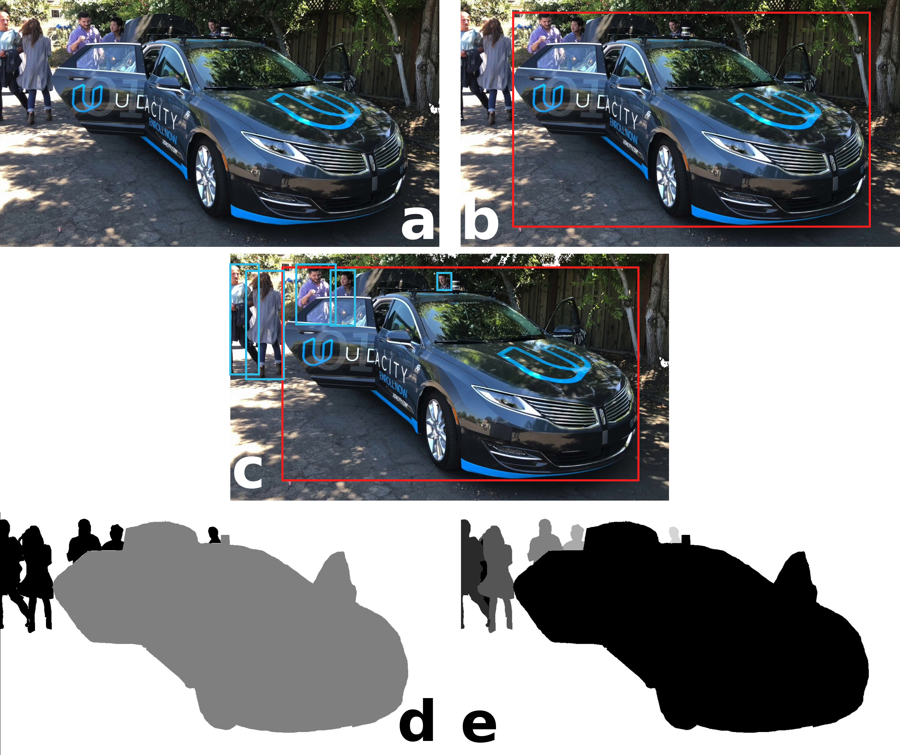

Image|Task|Objective
---|:---:|---: 
a|Image classification|Assign one or more labels to an image
b|Object localization|Assign a label to most prominent object, define a box around that object
c|Object detection|Assign a label and define a box for all objects in an image
d|Semantic segmentation|Determine the class of each pixel in the image
e|Instance segmentation|Determine the class of each pixel in the image distinguishing different instances of the same class

In this lesson we will focus on object localization, object detection and semantic segmentation. These topics could easily fill an entire class. In this lesson we are going to look at a core set of concepts and solutions that will help you get started on these fascinating topics, with no intention of being complete.

In particular we are going to focus on two workhorse architectures for object detection and semantic segmentation, respectively: RetinaNet and UNet.

### Lesson Outline

**video**

In this lesson, you will learn how to:

- Define object localization and object detection
- Describe one-stage object detection, and study in particular the RetinaNet architecture
- Describe and define some common metrics to evaluate object detection models
- Train and evaluate a RetinaNet model on a custom dataset
- Define the task of image segmentation
- Describe a semantic segmentation architecture called UNet
- Train and evaluate a UNet model on a custom dataset

### Object Localization

**video**

### Object Localization and Bounding Boxes

Object localization is the task of assigning a label and determining the bounding box of an object of interest in an image.

A bounding box is a rectangular box that completely encloses the object, whose sides are parallel to the sides of the image.

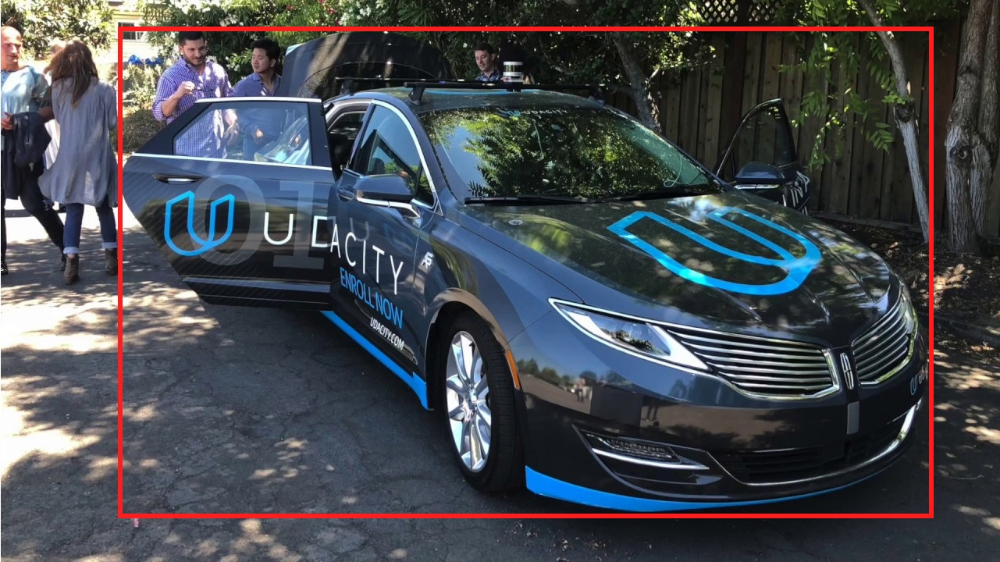

<p align="center"> Bounding Box (in Red) for the Car </p>

There are different ways of describing a bounding box, but they all require 4 numbers. These are some examples:
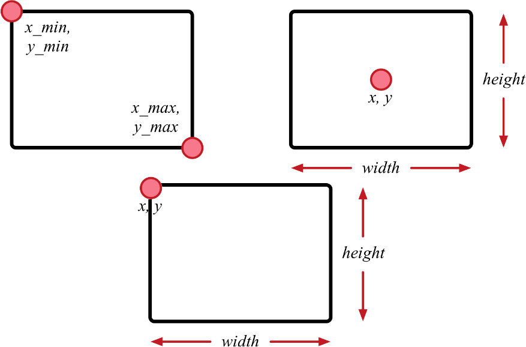
<p align="center"> Three of the Different Ways of Describing a Bounding Box with 4 Numbers </p>

Note in these images above that x_min, y_min is in the upper left. Images in deep learning are usually indexed as matrices, starting from the upper left. So if an image is 100 x 100, then (0,0) is the point in the upper left, and (99,99) is the point in the lower right.

### Architecture of Object Localization Networks

The architecture of an object localization network is similar to the architecture of a classification network, but we add one more head (the localization head) on top of the existing classification head:

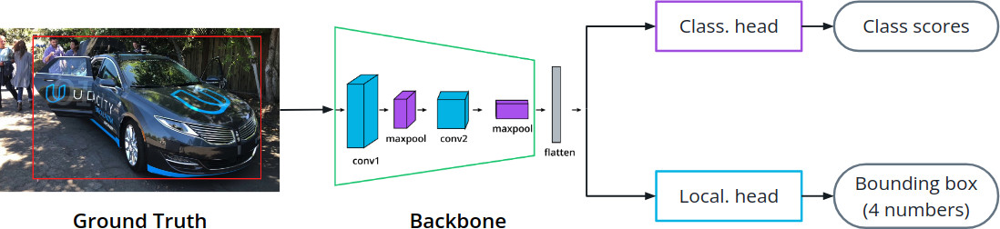

### A Multi-Head Model in PyTorch

A multi-head model is a CNN where we have a backbone as typical for CNNs, but more than one head. For example, for object localization this could look like:

```
from torch import nn


class MultiHead(nn.Module):
    def __init__(self):
        super().__init__()
        # Backbone: this can be a custom network, or a
        # pre-trained network such as a resnet50 where the
        # original classification head has been removed. It computes
        # an embedding for the input image
        self.backbone = nn.Sequential(..., nn.Flatten())

        # Classification head: an MLP or some other neural network
        # ending with a fully-connected layer with an output vector
        # of size n_classes
        self.class_head = nn.Sequential(..., nn.Linear(out_feature, n_classes))

        # Localization head: an MLP or some other neural network
        # ending with a fully-connected layer with an output vector
        # of size 4 (the numbers defining the bounding box)
        self.loc_head = nn.Sequential(..., nn.Linear(out_feature, 4))

    def forward(self, x):
        x = self.backbone(x)

        class_scores = self.class_head(x)
        bounding_box = self.loc_head(x)

        return class_scores, bounding_box

```
### Loss in a Multi-Head Model

**video**

An object localization network, with its two heads, is an example of a multi-head network. Multi-head models provide multiple inputs that are in general paired with multiple inputs.

For example, in the case of object localization, we have 3 inputs as ground truth: the image, the label of the object ("car") and the bounding box for that object (4 numbers defining a bounding box). The object localization network processes the image through the backbone, then the two heads provide two outputs:

1. The class scores, that need to be compared with the input label
2. The predicted bounding box, that needs to be compared with the input bounding box.

The comparison between the input and predicted labels is made using the usual Cross-entropy loss, while the comparison between the input and the predicted bounding boxes is made using, for example, the mean squared error loss. The two losses are then summed to provide the total loss L.

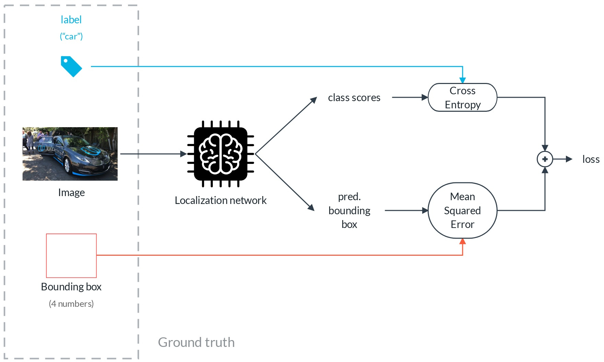
<p align="center">Loss in a Multi-Head Model</p>

Since the two losses might be on different scales, we typically add a hyperparameter α to rescale one of the two:

$$ L = CE(\hat p) + \sigma MSE(b, \hat b)$$

### Multiple Losses in PyTorch

This is an example of a training loop for a multi-head model with multiple losses (in this case, cross-entropy and mean squared error):

```
class_loss = nn.CrossEntropyLoss()
loc_loss = nn.MSELoss()
alpha = 0.5

...
for images, labels in train_data_loader:
    ...

    # Get predictions
    class_scores, bounding_box = model(images)

    # Compute sum of the losses
    loss = class_loss(class_scores) + alpha * loc_loss(bounding_box)

    # Backpropagation
    loss.backward()


    optimizer.step()
```

### Object Detection

**video**

Object Detection

The task of object detection consists of detecting and localizing all the instances of the objects of interest.

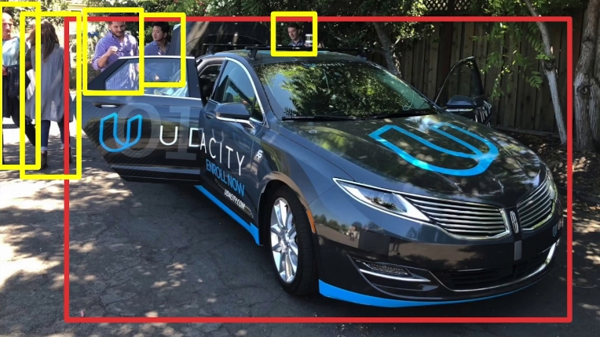
<p align="center">Detect and Localize All the People (in Yellow) and All the Cars (in Red, Only One in This Image)</p>

Different images of course can have a different number of objects of interest: for example an image could have one car, zero cars, or many cars. The same images could also have one person, zero people or many people. In each one of these cases, we need the network to output one vector of class scores plus 4 numbers to define the bounding box for each object. How do we build a network with a variable number of outputs?

It is clear that a network with the same structure as the object localization network would not work, because we would need a variable number of heads depending on the content of the image.

One way would be to slide a window over the image, from the upper left corner to the lower right corner, and for each location of the image we run a normal object localization network. This **sliding window** approach works to a certain extent, but is not optimal because different objects can have different sizes and aspect ratios. Thus, a window with a fixed size won't fit well all objects of all sizes. For example, let's consider cars: depending on how close or far they are, their size in the image will be different. Also, depending on whether we are seeing the back or the front, or the side of the car, the aspect ratio of the box bounding the object would be pretty different. This becomes even more extreme if we consider objects from different classes, for example cars and people:


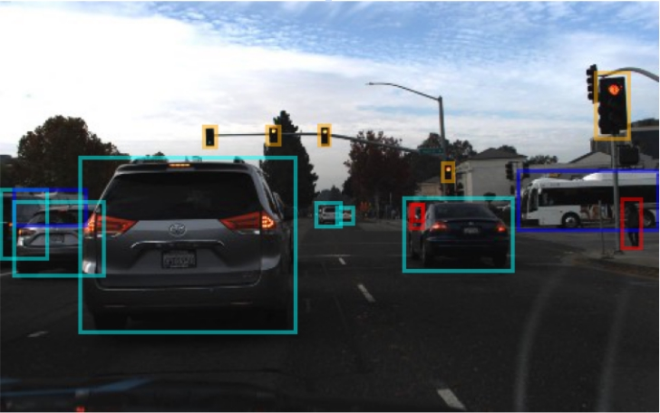
<p align="center">Objects in images have different scales and aspect ratios, so a window that is optimal for an object type at a certain scale won't be optimal for a different scale or a different object class.</p>

Nowadays there are two approaches to solving the problem of handling a variable number of objects, and of their different aspect ratios and scales:
### 1) One-stage object detection

We consider a fixed number of windows with different scales and aspect ratios, centered at fixed locations (anchors). The output of the network then has a fixed size. The localization head will output a vector with a size of 4 times the number of anchors, while the classification head will output a vector with a size equal to the number of anchors multiplied by the number of classes.
### 2) Two-stage object detection

In the first stage, an algorithm or a neural network proposes a fixed number of windows in the image. These are the places in the image with the highest likelihood of containing objects. Then, the second stage considers those and applies object localization, returning for each place the class scores and the bounding box.

In practice, the difference between the two is that while the first type has fixed anchors (fixed windows in fixed places), the second one optimizes the windows based on the content of the image.

In this lesson we are only going to treat one-stage object detection.

#### Additional Optional Resources for Two-Stage Object Detection

I recommend exploring these resources if you are interested!
- [Video: Two-stage object detection](https://www.youtube.com/watch?v=6I3m0SsLPo4)
- An approachable paper reviewing [object detection algorithms](https://iopscience.iop.org/article/10.1088/1742-6596/1544/1/012033/meta) (both one-stage and two-stage)

### One-Stage Object Detection: RetinaNet

**video**

The RetinaNet network is an example of a one-stage object detection algorithm. Like many similar algorithms, it uses anchors to detect objects at different locations in the image, with different scales and aspect ratios.

Anchors are windows with different sizes and different aspect ratios, placed in the center of cells defined by a grid on the image:

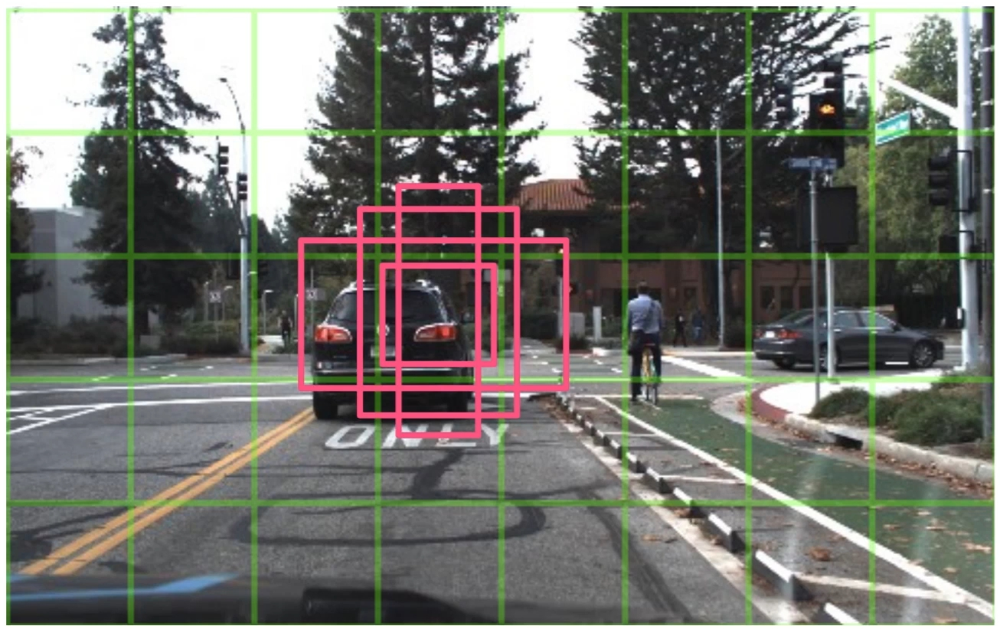
<p align="center">Grid (in Green) and Windows (in Red)</p>

We divide the image with a regular grid. Then for each grid cell we consider a certain number of windows with different aspect ratios and different sizes. We then "anchor" the windows in the center of each cell. If we have 4 windows and 45 cells, then we have 180 anchors.

We run a localization network considering the content of each anchor. If the class scores for a certain class is high for an anchor, then we consider that object detected for that anchor and we take the bounding box returned by the network as the localization of that object.

This tends to return duplicated objects, so we post-process the output with an algorithm like [Non Maximum Suppression](https://learnopencv.com/non-maximum-suppression-theory-and-implementation-in-pytorch/).

### Feature Pyramid Networks (FPNs)

RetinaNet uses a special babckbone called Feature Pyramid Network.

**video**

The [Feature Pyramid Network](https://arxiv.org/abs/1612.03144) is an architecture that extracts multi-level, semantically-rich feature maps from an image:

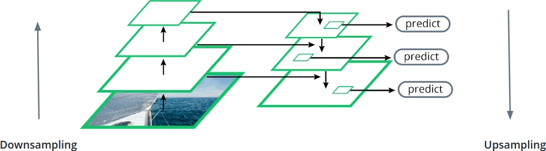
<p align="center">Feature Pyramid Network</p>

A normal CNN backbone made of convolution, pooling, and other typical CNN layers is used to extract multiple feature maps from the original image (downsampling path). The last feature map contains the most semantic-rich representation, which is also the least detailed because of the multiple pooling. So we copy that over to the upsampling path, and we run object detection with anchors on that. Then we upsample it and sum it to the feature map coming from the same level in the downsampling path. This means we are mixing the high-level, abstract information coming from the feature map in the upsampling path to the more detailed view coming from the downsampling path. We then run object detection on the result. We repeat this operation a certain number of times (3 times in total in this figure). This is how RetinaNet uses the Feature Pyramid Network:

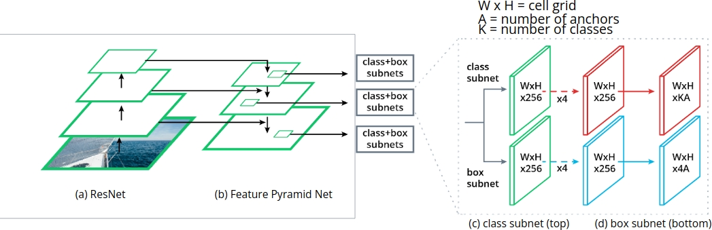
<p align="center">The RetinaNet Architecture</p>

RetinaNet performs object detection and localization using anchors on each level of the Feature Pyramid separately. For example, in this case we have 3 feature maps in the upsampling path, and for each one we run object localization on every anchor.

### Focal Loss

The third innovative feature of RetinaNet is the so-called Focal Loss.

**video**

When using a lot of anchors on multiple feature maps, RetinaNet encounters a significant class balance problem: most of the tens of thousands of anchors used in a typical RetinaNet will not contain objects. The crop of the image corresponding to these anchors will normally be pretty easy to classify as background. So the network will very quickly become fairly confident on the background. The normal cross-entropy loss assigns a low but non-negligible loss even to well-classified examples. For example, let's look at the blue curve here:

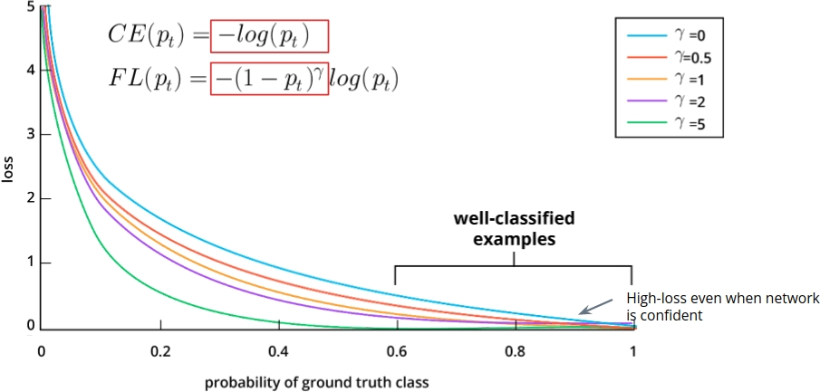

Here we are considering for simplicity a binary classification problem. Let's consider an example having a positive label. If our network has a confidence on the positive label of 0.8, it means it is classifying this example pretty well: it is assigning the right label, with a good confidence of 0.8. However, the loss for this example is still around 0.5. Let's now consider a different positive example, where the network is assigning a probability for the positive class of 0.1. This is a False Negative, and the loss accordingly is pretty high (around 4). Let's now assume that we have 10 examples where the network is correct and has a confidence of 0.8 (and loss of 0.5), and one example where the network is wrong and has a loss of 4. The ten examples will have a cumulative loss of 0.5 x 10 = 5, which is larger than 4. In other words, the cumulative loss of the examples that are already classified well is going to dominate over the loss of the example that is classified wrong. This means that the backpropagation will try to make the network more confident on the 10 examples it is already classifying well, instead of trying to fix the one example where the network is wrong. This has catastrophic consequences for networks like RetinaNet, where there are usually tens of thousands of easy background anchors for each anchor containing an object.

The **Focal Loss** adds a factor in front of the normal cross-entropy loss to dampen the loss due to examples that are already well-classified so that they do not dominate. This factor introduces a hyperparameter γ: the larger γ, the more the loss of well-classified examples is suppressed.

### RetinaNet Summary

Summarizing, RetinaNet is characterized by three key features:

- Anchors
- Feature Pyramid Networks
- Focal loss

### Object Detection Metrics

**video**

Before continuing, make sure you recall the meaning of concepts of True Positives, True Negatives, False Positives, False Negatives, and Precision and Recall. These terms are also briefly reviewed in the videos on this page.

### Intersection over Union (IoU)

The IoU is a measure of how much two boxes (or other polygons) coincide. As the name suggests, it is the ratio between the area of the intersection, or overlap, and the area of the union of the two boxes or polygons:

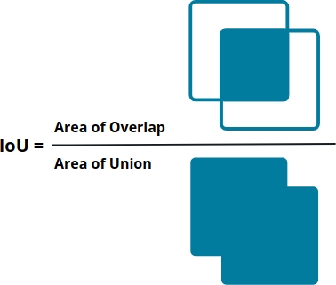

IoU is a fundamental concept useful in many domains, and is a key metric for the evaluation of object detection algorithms.

**video**

NOTE: The instructor misspoke in this video above - the precision-recall curve is measured by varying the classification confidence threshold, not by varying the IoU threshold as mentioned in the video. The slides and the text are correct. We apologize for the mistake.

### Mean Average Precision (mAP)

Mean Average Precision (mAP) conveys a measurement of precision averaged over the different object classes.

Let’s say we have a number of classes. We consider all the binary classification problems obtained by considering each class in turn as positive and all the others as negative.

For each one of these binary sub-problems, we start by drawing the precision-recall curve that is obtained by measuring precision and recall for different confidence level thresholds, while keeping the IoU threshold fixed (for example at 0.5). The confidence level is the classification confidence level, i.e., the maximum of the softmax probabilities coming out of the classification head. For example, we set the confidence threshold to 0.9 and measure precision and recall, then we change the threshold to say 0.89 and measure precision and recall, and so on, until we get to a threshold of 0.1. This constitutes our precision-recall curve:


We then interpolate the precision and recall curve we just obtained by using a monotonically-decreasing interpolation curve, and we take the area under the curve. This represents the so-called Average Precision (AP) for this class:

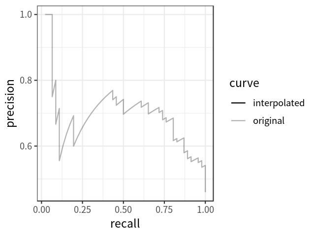

We repeat this procedure for all classes, then we take the average of the different APs and call that mean Average Precision, or mAP.

A related metric is called mean Average Recall (mAR). Similarly to the mAP, we split our problem into a number of binary classification problems. For each class, we compute the recall curve obtained by varying this time the IoU threshold from 0.5 to 1. We can now consider the integral of the curve. Since we integrate between 0.5 and 1, and Recall is a quantity bounded between 0 and 1, the integral would be bounded between 0 and 0.5. We therefore multiply by 2 to make it a quantity bounded between 0 and 1. Twice the area under the recall curve represents the so-called Average Recall (AR) for this class:

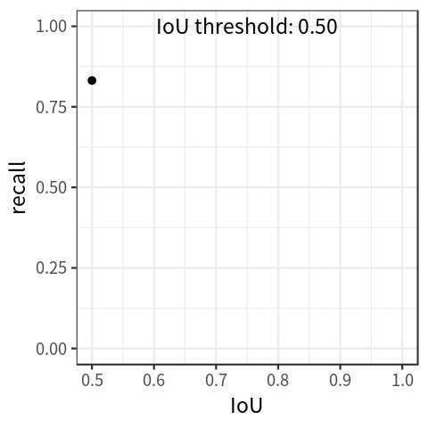

We then take the average of the AR over the different classes, to define the mean Average Recall, or mAR.

### Exercise: Object Detection

**udacity_deeplearning_nanodegree/2 Convolutional Neural Networks/6 Object Detection and Segmentation/Exercise: Object Detection/object_detection.ipynb**

### Exercise Solution: Object Detection

**video**

### Image Segmentation

### Semantic Segmentation

Semantic segmentation is one key technique of image segmentation.

**video**

The task of semantic segmentation consists of classifying each pixel of an image to determine to which class it belongs. For example, if we want to distinguish between people, cars, and background, the output looks like this:


In this image we have color-coded the people class as black, the car class as gray, and the background as white.

We have briefly mentioned previously, but are not going to discuss further here, another technique of image segmentation called instance segmentation. But if you are interested in researching it, you can find more information about it [here](https://debuggercafe.com/instance-segmentation-with-pytorch-and-mask-r-cnn/).

### Semantic Segmentation: UNet

**video**

The UNet is a specific architecture for semantic segmentation. It has the structure of a standard autoencoder, with an encoder that takes the input image and encodes it through a series of convolutional and pooling layers into a low-dimensional representation.

Then the decoder architecture starts from the same representation and constructs the output mask by using transposed convolutions. However, the UNet adds skip connections between the feature maps at the same level in the encoder and in the decoder, as shown below:

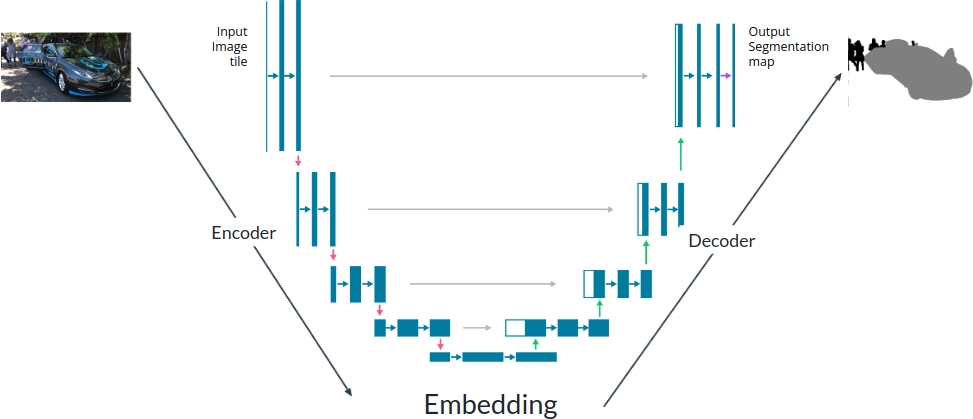

In the decoder, the feature map coming from the decoder path is concatenated along the channel dimension with the feature map coming from the encoder path. This means that the next transposed convolution layer has access to information with high semantic content coming from the previous decoder layer, along with information with high detail coming from the encoder path. The final segmentation mask is then a lot more detailed than what you would obtain with a simple encoder-decoder architecture without skip connections between the encoder and the decoder.

**video**

### The Dice Loss

There are a few different losses that one can use for semantic segmentation. One loss that tend to work well in practice is called Dice loss, named after Lee Raymond Dice, who published it in 1945. Here is how Dice loss is calculated:

$$ {Dice} {Loss} = 1 - \frac {2 \sum_{i=1}^{n_{pix}} p_i y_i} {\sum_{i=1}^{n_{pix}} (p_i + y_i)}$$

$p_i$ and $y_i$ represent the i-th pixel in respectively the prediction mask and the ground truth mask. The sums are taken over all the $n_{pix}$ pixels in the image.

The Dice loss derives from the F1 score, which is the geometric mean of precision and recall. Consequently, the Dice loss tends to balance precision and recall at the pixel level.

### UNet in PyTorch

We will use the implementation of UNet provided by the wonderful open-source library [segmentation_models for PyTorch](https://github.com/chsasank/segmentation_models.pytorch). The library also implements the Dice loss.

This is how you can define a UNet using this library:

```
import segmentation_models_pytorch as smp

# Binary segmentation?
binary = True
n_classes = 1

model = smp.Unet(
        encoder_name='resnet50',
        encoder_weights='imagenet',
        in_channels=3,
        # +1 is for the background
        classes=n_classes if binary else n_classes + 1)
```
The Dice loss is simply:

```
loss = smp.losses.DiceLoss(smp.losses.BINARY_MODE, from_logits=True)
```

### Derivation of the Dice Loss (optional, for those who are interested)

We start from the formula of the F1 score:

$$ F_1 = \frac {2TP} {2TP + FN + FP} $$

Let's consider for simplicity the binary classification problem, and let's imagine we want to segment a car in an image. In semantic segmentation we can define the True Positives (TP), the False Negatives (FN), and the False Positives (FP) as illustrated by the following diagram, where the gray mask is the ground truth mask for the car and the blue mask is the prediction from the model (a bad model in this case, but we use this example to make the illustration easier):

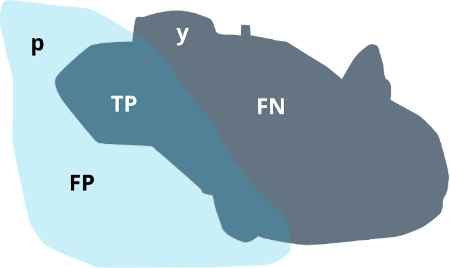

Here $p_i$ represents the class probability coming from the network, while $y_i$ is the ground truth. While the $p_i$ will be numbers between 0 and 1, the $y_i$ are either 0 (for the background class) or 1 for the foreground class.

Let's start by noting that the denominator in the expression for the F1 score is equal to the area of the blue mask and the area of the gray mask. Indeed, FP + TP represents the area of the blue mask, while TP + FN represents the area of the gray mask, so FP + TP + TP + FN = 2 TP + FP + FN which is the denominator in the F1 expression. We will use this fact shortly.

Let's now see how we can compute TP. We can transform the normal definition into a more continuous one that is simply the sum of the pi weighted by the pi:

$$ TP = \sum_{i=1}^{n_{pix}} p_i y_i $$

Since $y_i$ is either 0 or 1, the sum over all the pixels is actually equivalent to the sum of the $p_i$ limited to the pixels where $y_i$ is equal to 1. The higher the $p_i$ is for this subset, which means, the more the network is confident that the positive pixels are indeed positive, the higher the "continuous" TP value will be.

We have noticed above how the denominator of the F1 expression is just the sum of the predicted mask plus the ground truth mask. We can easily transform this into a continuous version where the sum of the predicted mask is the sum over $p_i$ while the sum of the ground truth mask is the sum over $y_i$. Then the denominator of the F1 expression becomes:

$$ 2TP + FN + FP = \sum_{i=1}^{n_{pix}} p_i + \sum_{i=1}^{n_{pix}} y_i = \sum_{i=1}^{n_{pix}} (p_i + y_i) $$

We can now write a "continuous" version of the F1 score - called the Dice coefficient - as:

$$ Dice coeff = \frac {2 \sum_{i=1}^{n_{pix}} p_i y_i} {\sum_{i=1}^{n_{pix}} (p_i + y_i)} $$

This coefficient will be at its maximum when the predicted probabilities $p_i$ are 1 for all the pixels that are positives (i.e., where $y_i$=1) in the ground truth mask, and zero everywhere else. In that case, both the numerator and the denominator will be equal to $2n_{pix}$, which means that a network with perfect performance will give a Dice coefficient of 1.

This is the opposite of what we want, because we want the loss to decrease when the performance of the network gets better. So we just subtract the Dice coefficient from 1 to give a function that decreases as the performance improves, which is our Dice loss:

$$ Dice Loss = 1 - \frac {2 \sum_{i=1}^{n_{pix}} p_i y_i} {\sum_{i=1}^{n_{pix}} (p_i + y_i)} $$

So the Dice loss is equal to 0 only if the output from the network is perfect.

### Exercise: Semantic Segmentation

**udacity_deeplearning_nanodegree/2 Convolutional Neural Networks/6 Object Detection and Segmentation/Exercise: Semantic Segmentation/segmentation.ipynb**

### Exercise Solution: Semantic Segmentation

### Solution, Part 1: Data Preparation
**video**

### Solution, Part 2: Architecture, Training, Results
**video**

### Glossary

For your reference, here are all the key new terms we introduced in this lesson:

- Object localization: The task of determining if an image contains an object, and localize it with a bounding box.

- Bounding box: A rectangular box that completely encloses a given object in an image, whose sides are parallel to the sides of the image.

- Multi-head model: A CNN where we have one backbone but more than one head.

- Object detection: The task of localizing using a bounding box every object of interest in an image.

- Anchors: Windows with different sizes and different aspect ratios, placed in the center of cells defined by a grid on an image.

- Feature Pyramid Network (FPN): An architecture that extracts multi-level, semantically-rich feature maps from an image.

- Focal Loss: A modification of the Cross-Entropy Loss, **by **including a factor in front of the CE Loss to dampen the loss due to examples that are already well-classified, so they do not dominate.

- Mean Average Recall (mAR): A metric for object detection algorithms. It is obtained by computing the Average Recall for each class of objects, as twice the integral of the Recall vs IoU curve, and then by averaging the Average Recall for each class.

- Mean Average Precision (mAP): A metric for object detection algorithms. It is obtained by computing the Average Precision (AP) for each class. The AP is computed by integrating an interpolation of the Precision-Recall curve. The mAP is the mean average of the AP over the classes.

- Intersection over Union (IoU): The ratio between the area of the intersection, or overlap, and the area of the union of two boxes or polygons. Used to measure how much two boxes coincide.

- Semantic segmentation: The task of assigning a class to each pixel in an image.

- Dice loss: A useful measure of loss for semantic segmentation derived from the F1 score, which is the geometric mean of precision and recall. The Dice loss tends to balance precision and recall at the pixel level.

### Lesson Review
**video**

In this lesson, you learned:

- About object localization, object detection, and semantic segmentation
- How to train and evaluate a one-stage object detection model to detect multiple objects in an image.
- How to train and evaluate a semantic segmentation model to classify every pixel of an image.

### Course Review

**video**