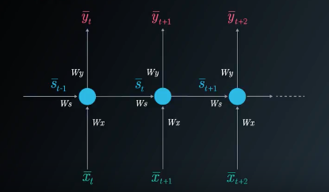

### RNN Introduction

Hi! I am Ortal, your instructor for this lesson!

In this lesson, we will learn about Recurrent Neural Networks (RNNs).

The neural network architectures you've seen so far were trained using the current inputs only. We did not consider previous inputs when generating the current output. In other words, our systems did not have any memory elements. RNNs address this basic and essential issue by using memory (i.e., past inputs to the network) when producing the current output.

**video**

### A bit of history

How did the theory behind RNN evolve? Where were we a few years ago and where are we now?

**video**

As mentioned in this video, RNNs have a key flaw, as capturing relationships that span more than 8 or 10 steps back is practically impossible. This flaw stems from the "vanishing gradient" problem in which the contribution of information decays geometrically over time.

What does this mean?

As you may recall, while training our network, we use backpropagation. In the backpropagation process, we adjust our weight matrices using a gradient. In the process, gradients are calculated by continuous multiplications of derivatives. The value of these derivatives may be so small that these continuous multiplications may cause the gradient to practically "vanish."

LSTM is one option to overcome the Vanishing Gradient problem in RNNs.

As mentioned in the video, Long Short-Term Memory Cells (LSTMs) and Gated Recurrent Units (GRUs) give a solution to the vanishing gradient problem by helping us apply networks that have temporal dependencies.

More information about GRUs can be found [here](https://towardsdatascience.com/understanding-gru-networks-2ef37df6c9be). Focus on the overview titled: GRUs.

#### Extra Resources

- [Vanishing Gradient Problem](https://en.wikipedia.org/wiki/Vanishing_gradient_problem)
- [Geometric Series] (https://socratic.org/algebra/exponents-and-exponential-functions/geometric-sequences-and-exponential-functions)
- [TDNN (Time delay neural network)](https://en.wikipedia.org/wiki/Time_delay_neural_network)
- Here is the original [Elman Network](http://onlinelibrary.wiley.com/doi/10.1207/s15516709cog1402_1/abstract) publication from 1990. This link is provided here as it's a significant milestone in the world of RNNs. To simplify things a bit, you can take a look at the following [additional info](https://en.wikipedia.org/wiki/Recurrent_neural_network#Elman_networks_and_Jordan_networks).
- In this [LSTM](http://www.bioinf.jku.at/publications/older/2604.pdf) link, you will find the original paper written by S[epp Hochreiter](https://en.wikipedia.org/wiki/Sepp_Hochreiter) and [Jürgen Schmidhuber](http://people.idsia.ch/~juergen/). Don't get into all the details just yet. We will cover all of this later!

### RNN Applications

The world's leading tech companies use RNNs, particularly LSTMs, in their applications. Let's take a look at a few.

**video**

There are so many interesting applications; let's look at a few more!

- Are you into gaming and bots? Check out the [DotA 2 bot by Open AI](https://blog.openai.com/dota-2/)
- How about [automatically adding sounds to silent movies?](https://www.youtube.com/watch?time_continue=1&v=0FW99AQmMc8)
- Amazon's voice-to-text using high-quality speech recognition, [Amazon Lex](https://aws.amazon.com/lex/faqs/).
- Facebook uses RNN and LSTM technologies for [building language models](https://code.facebook.com/posts/1827693967466780/building-an-efficient-neural-language-model-over-a-billion-words/)
- Netflix also uses RNN models - [here is an interesting read](https://arxiv.org/pdf/1511.06939.pdf)

### Applications of RNN Architectures

Can you think of a way to apply an RNN architecture to your line of work? Describe the problem in the box below.

#### Your reflection

i work in a company which provides monitoring for cloud infrastructure. using RNN we can model time series data.

#### Things to think about

Common ways to apply RNNs to your work include timeseries forecasting, sequence creation, solving differential equations and more.

A great rule of thumb is to evaluate whether or not the problem requires you to make a projection. If so, the problem may be suitable for an RNN.

### Recurrent Neural Networks

**video**

RNNs are based on the same principles as those behind FFNNs, which is why we spent so much time reminding ourselves of the feedforward and backpropagation steps used in the training phase.

There are two main differences between FFNNs and RNNs. The Recurrent Neural Network uses:

- sequences as inputs in the training phase, and
- memory elements

Memory is defined as the output of hidden layer neurons, which will serve as additional input to the network during the next training step.

The basic three layer neural network with feedback that serve as memory inputs is called the Elman Network and is depicted in the following picture:

 Elman Network, source: Wikipedia 

### RNN - Folded and Unfolded Model

**video**

In FFNN the output at any time t, is a function of the current input and the weights. This can be easily expressed using the following equation:

$$ \bar y_t = F(\bar x_t, W) $$

In RNNs, our output at time t, depends not only on the current input and the weight, but also on previous inputs. In this case the output at time t will be defined as:

$$ \bar y_t = F(\bar x_t, \bar x_{t-1}, \bar x_{t-2}, {...} , , \bar x_{t-t_0}, W) $$

This is the RNN folded model:

 The RNN folded model 

In this picture, $\bar {x} $ represents the input vector, $\bar{y}$ represents the output vector and $\bar{s}$ denotes the state vector.

$W_x$​ is the weight matrix connecting the inputs to the state layer.

$W_y$​ is the weight matrix connecting the state layer to the output layer.

$W_s$​ represents the weight matrix connecting the state from the previous timestep to the state in the current timestep.

The model can also be "unfolded in time". The **unfolded model** is usually what we use when working with RNNs.

 The RNN unfolded model 

### The Unfolded Model

The Unfolded Model is useful for visualizing the RNN. This is because The Unfolded Model provides a more straightforward way to separate and understand the parts of the RNN.

Here's how the unfolded model helps us understand RNNs:

- Separates the State Vector from the Input Vector to simplify the diagram
- Shows how both the State Vector and the Input Vector interact with the same weights
- Makes it easier to understand how the State at T-1 and the Input Vector at T produce the Output at T

In RNNs the state layer depended on the current inputs, their corresponding weights, the activation function and also on the previous state:

$$ \bar {s_t} = \Phi (\bar x_t W_x + \bar s_{t-1} W_s) $$ 

The output vector is calculated exactly the same as in FFNNs. It can be a linear combination of the inputs to each output node with the corresponding weight matrix $W_y$​, or a softmax function of the same linear combination.

$$ \bar y_t = \bar s_t W_y$$
$$ {or} $$

$$ \bar y_t = \sigma (\bar s_t W_y) $$

### RNN Example

In this example, we will illustrate how RNNs can help detect sequences. When detecting a sequence, the system must remember the previous inputs, so it makes sense to use a recurrent network.

If you are unfamiliar with sequence detection, the idea is to see if a specific pattern of inputs has entered the system. In our example, the pattern will be the word U,D,A,C,I,T,Y.

**video**

### Backpropagation Through Time - I

We are now ready to understand how to train the RNN.

When we train RNNs we also use backpropagation, but with a conceptual change. The process is similar to that in the FFNN, with the exception that we need to consider previous time steps, as the system has memory. This process is called Backpropagation Through Time (BPTT).

We will use the MSE loss function to explain the BPTT. Recall that

$$ E_t = (\bar d_t - \bar y_t)^2 $$
$$ {Mean Squared Error}$$

where

$E_t$​ represents the output error at time t

$d_t$​ represents the desired output at time t

$y_t$​ represents the calculated output at time t

**video**

In BPTT we train the network at timestep t and take into account all of the previous timesteps. Let's understand this with the help of an example.

In this example, we will focus on the BPTT process for time step t=3. You will see that to adjust all three weight matrices, $W_x$, $W_s$ and $W_y$​​, we need to consider timestep 3 as well as timestep 2 and timestep 1.

As we are focusing on timestep t=3, the Loss function will be: $ E_3 = (\bar{d}_3-\bar{y}_3)^2 $

 The Folded Model at Timestep 3 

To update each weight matrix, we need to find the partial derivatives of the Loss Function at time 3, as a function of all of the weight matrices. We will modify each matrix using gradient descent while considering the previous timesteps.

 Gradient Considerations in the Folded Model 

We will now unfold the model. You will see that unfolding the model in time is very helpful in visualizing the number of steps (translated into multiplication) needed in the Backpropagation Through Time process. These multiplications stem from the chain rule and are easily visualized using this model.

### Backpropagation Through Time - II

#### Unfolding the model in time

In the following video we will understand how to use Backpropagation Through Time (BPTT) when adjusting two weight matrices:

- $W_y$​ - the weight matrix connecting the state of the output
- $W_s$​ - the weight matrix connecting one state to the next state

**video**

**Gradient calculations needed to adjust** $W_y$​

The partial derivative of the Loss Function concerning $W_y$​ is found by a simple one-step chain rule: (Note that in this case, we do not need to use BPTT. Visualization of the calculations path can be found in the video).

$$ \frac {\partial E_3} {\partial W_y} = \frac {\partial E_3} {\partial \bar y_3} \frac {\partial \bar y_3} {\partial W_y} $$

 Chain rule for calculating partial derivative of loss 

$$ \frac {\partial E_N} {\partial W_y} = \frac {\partial E_N} {\partial \bar y_N} \frac {\partial \bar y_N} {\partial W_y} $$

 Chain rule for calculating partial derivative of loss (N steps) 

**Gradient calculations needed to adjust** $W_s$​

We still need to adjust $W_s$​ the weight matrix connecting one state to the next and $W_x$​ the weight matrix connecting the input to the state. We will arbitrarily start with $W_s$​.

To understand the BPTT process, we can simplify the unfolded model. We will focus on the contributions of $W_s$​ to the output, the following way:

 Simplified Unfolded model for Adjusting $W_s$ 

When calculating the partial derivative of the Loss Function for $W_s$​, we need to consider all of the states contributing to the output. In the case of this example, it will be states $\bar{s_3}$​ which depends on its predecessor $\bar{s_2}$​ which depends on its predecessor $\bar{s_1}$​, the first state.

In BPTT, we will consider every gradient stemming from each state, accumulating all of these contributions.

At timestep t=3, the contribution to the gradient stemming from $\bar{s_3}$​, $\bar{s_2}$​, and $\bar{s_1}$​ is the following:

Note: Notice the use of the chain rule here. If you need, go back to the video to visualize the calculation path.

 Final gradient calculation in the BPTT algorithm (considering 3 timesteps) 

Generalizing for N timesteps, we get:

 Final gradient calculation in the BPTT algorithm (considering N timesteps) 

### We still need to adjust W_x, the weight matrix connecting the nuput to the state.
### Adjusting / Updating $W_x$

**video**

When calculating the partial derivative of the Loss Function concerning to $W_x$​ we need to consider, again, all of the states contributing to the output. As we saw before, in the case of this example, it will be states $\bar{s_3}$​, which depend on its predecessor $\bar{s_2}$​, which depends on its predecessor $\bar{s_1}$​, the first state.

 Simplified Unfolded model for Adjusting Wx 

After considering the contributions from all three states: $\bar{s_3}$​ ,$\bar{s_2}$​ and $\bar{s_1}$​, we will accumulate them to find the final gradient calculation.

The following equation is the gradient contributing to the adjustment of $W_x$​ using Backpropagation Through Time:

 Equation for Updating Wx (considering 3 timesteps) 

Generalizing for N timesteps, we get:

 Equation for updating Wx (considering N timesteps) 

### RNN Theory Summary

Let's summarize what we have seen so far:

**video**

As you have seen, in RNNs the current state depends on the input and the previous states, with an activation function.

$$ \bar s_t = \Phi (\bar x_t W_x + \bar s_{t-1} W_s) $$

 The current state as a function of input and the previous state 

The current output is a simple linear combination of the current state elements with the corresponding weight matrix.

$$ \bar y_t = \bar s_t W_y $$
$$ or $$

$$ \bar y_t = \sigma (\bar s_t W_y) $$

 Equation showing the current output 

We can represent the recurrent network with the use of a folded model or an unfolded model:

 The RNN Folded Model 

 The RNN Unfolded Model 

We will have three weight matrices to consider in the case of a single hidden (state) layer. Here we use the following notations:

$W_x$- represents the weight matrix connecting the inputs to the state layer.

$W_y$ - represents the weight matrix connecting the state to the output.

$W_s$​ - represents the weight matrix connecting the state from the previous timestep to the state in the following timestep.

The gradient calculations for the purpose of adjusting the weight matrices are the following:

$$ \frac {\partial E_N} {\partial W_y} = \frac {\partial E_N} {\partial \bar y_N}  \frac {\partial \bar y_N} {\partial W_y}$$

$$ \frac {\partial E_N} {\partial W_s} = \sum_{i=1}^{N} \frac {\partial E_N} {\partial \bar y_N} \frac {\partial \bar y_N} {\partial \bar s_i} \frac {\partial \bar s_i} {\partial W_s} $$

$$ \frac {\partial E_N} {\partial W_x} =   \sum_{i=1}^{N} \frac {\partial E_N} {\partial \bar y_N} \frac {\partial \bar y_N} {\partial \bar s_i} \frac {\partial \bar s_i} {\partial W_x} $$

When training RNNs using BPTT, we can choose to use mini-batches, where we update the weights in batches periodically (as opposed to once every inputs sample). We calculate the gradient for each step but do not update the weights immediately. Instead, we update the weights once every fixed number of steps. This helps reduce the complexity of the training process and helps remove noise from the weight updates.

The following is the equation used for Mini-Batch Training Using Gradient Descent: (where $\delta_{ij}$​ represents the gradient calculated once every inputs sample, and M represents the number of gradients we accumulate in the process).

$$ \delta_{ij} = \frac {1} {M} \sum_{k=1}^{M} \delta_{ij_k}$$

If we backpropagate more than ~10 timesteps, the gradient will become too small. This phenomenon is known as the **vanishing gradient problem**, where the contribution of information decays geometrically over time. Therefore, the network will effectively discard temporal dependencies that span many time steps. **Long Short-Term Memory (LSTM)** cells were designed to solve this problem specifically.

In RNNs we can also have the opposite problem, called the **exploding gradient** problem, in which the value of the gradient grows uncontrollably. A simple solution for the exploding gradient problem is **Gradient Clipping**.

More information about Gradient Clipping can be found [here](https://arxiv.org/abs/1211.5063).

You can concentrate on Algorithm 1 which describes the gradient clipping idea in simplicity.

### Implementing RNNs

**video**

RNNs are very useful for sequence-based tasks. The challenges for implementing RNNs are two-fold.

- How do we pre-process sequential data for our network?
- How do we represent memory in our code?

### Simple RNN - Predicting Time Series Data
### Building and Training a Simple RNN Model using PyTorch for Predicting Sine Wave Patterns

**udacity_deeplearning_nanodegree/3 RNN/1 Introduction/Exercises/RNN/simpleRNN_predict_timeseries_data.ipynb**

###  Simple RNN - Predicting Household Power Consumption
###  Building and Training a Simple RNN Model using PyTorch for Predicting Household Power Consumption

**udacity_deeplearning_nanodegree/3 RNN/1 Introduction/Exercises/RNN/simpleRNN_predict_household_power_consumption.ipynb**

### Dealing with textual data

So far, we have learned how to implement RNNs for predicting time series and have dealt with numeric data only. However, when it comes to using RNNs with textual data, there are some fundamental differences that need to be addressed.

- Textual data is unstructured: Unlike numeric data, textual data is unstructured and cannot be directly used as input to a neural network. Before we can use RNNs for tasks like sentiment analysis or question answering, we need to preprocess the text data and convert it into a structured format.
- Vocabulary size: Textual data typically has a larger vocabulary size compared to numeric data. For example, the English language has over 170,000 words. To process text data, we need to convert words into a numerical representation that can be understood by the neural network.
- Handling variable-length input: Textual data is variable-length, meaning that different text inputs can have different lengths. This makes it challenging to use traditional neural networks that require fixed input sizes. To handle variable-length inputs, we need to use techniques like padding to ensure that all inputs are of the same length.
- Semantic representation: Unlike numeric data, where each value has a clear meaning, words in text data can have different meanings depending on their context. For example, the word "bank" could refer to a financial institution or the edge of a river. To ensure that the neural network can understand the meaning of words in a given context, we need to use techniques like word embeddings that represent each word as a vector of continuous values that capture its semantic meaning.

By learning techniques like tokenization, stopword removal, stemming and lemmatization, encoding techniques like bag of words, TF-IDF, and word embeddings, and padding, you would be able to preprocess textual data and use RNNs to perform tasks like sentiment analysis, question answering, text generation, etc.

Let's understand some of these techniques for preprocessing texts.

### Normalization

**video**

### Tokenization

**video**

### Stop Word Removal

**video**

### Stemming and Lemmatization

**video**

### Text Preprocessing

**udacity_deeplearning_nanodegree/3 RNN/1 Introduction/Exercises/RNN/text_preprocessing.ipynb**

### Word Embeddings

**video**

### What are word embeddings?

Word embeddings are a type of distributed representation used in natural language processing (NLP) that allow words to be represented as dense vectors of real numbers. Each word is mapped to a unique vector, and the vector space is designed such that words that are semantically similar are located close to each other in the vector space.

Word embeddings are typically learned through unsupervised learning techniques, such as neural network models like [Word2Vec](https://arxiv.org/pdf/1301.3781.pdf) and [GloVe](https://nlp.stanford.edu/pubs/glove.pdf), which are trained on large corpora of text. During training, the model learns to predict the context in which a word appears, such as the surrounding words in a sentence, and uses this information to assign a vector representation to each word.

### Why word embeddings are important?

Word embeddings have revolutionized the field of natural language processing by providing a way to represent words as dense vectors that capture semantic and syntactic relationships between words. These representations are particularly useful for downstream NLP tasks, such as text classification, sentiment analysis, and machine translation, where traditional techniques may struggle to capture the underlying structure of the text.

For example, in a sentiment analysis task, word embeddings can be used to capture the sentiment of a sentence by summing the vector representations of the words in the sentence and passing the result through a neural network. In a machine translation task, word embeddings can be used to map words from one language to another by finding the closest vector representation in the target language.

### Models for word embedding in Pytorch?

Pytorch provides several models for word embedding, including:

    Note: Please refer to the research papers if you want to understand these models in detail. Our aim is to introduce these models and see how to use them in practice.

- GloVe (Global Vectors): It is a method for generating word embeddings, which are dense vector representations of words that capture their semantic meaning. The main idea behind GloVe is to use co-occurrence statistics to generate embeddings that reflect the words' semantic relationships. GloVe embeddings are generated by factorizing a co-occurrence matrix. The co-occurrence matrix is a square matrix where each row and column represents a word in the vocabulary, and the cell at position (i, j) represents the number of times word i and word j appear together in a context window. The context window is a fixed-size window of words surrounding the target word. The factorization of the co-occurrence matrix results in two smaller matrices: one representing the words, and the other representing the contexts. Each row of the word matrix represents a word in the vocabulary, and the entries in that row are the weights assigned to each dimension of the embedding. Similarly, each row of the context matrix represents a context word, and the entries in that row are the weights assigned to each dimension of the context embedding. The GloVe embeddings are computed by multiplying the word and context embeddings together and summing them up. This produces a single scalar value that represents the strength of the relationship between the two words. The resulting scalar is used as the value of the (i, j) entry in the word-context co-occurrence matrix. In PyTorch, you can use the torchtext package to load pre-trained GloVe embeddings. The torchtext.vocab.GloVe class allows you to specify the dimensionality of the embeddings (e.g. 50, 100, 200, or 300), and the pre-trained embeddings are downloaded automatically.

- FastText: FastText is a popular method for generating word embeddings that extends the concept of word embeddings to subword units, rather than just whole words. The main idea behind FastText is to represent each word as a bag of character n-grams, which are contiguous sequences of n characters. FastText embeddings are generated by training a shallow neural network on the subword units of the corpus. The input to the network is a bag of character n-grams for each word in the vocabulary, and the output is a dense vector representation of the word. During training, the network uses a negative sampling objective to learn the embeddings. The objective is to predict whether or not a given word is in the context of a target word. The model learns to predict the context of a word by computing the dot product between the target word's embedding and the embedding of each subword unit in the context. FastText embeddings have several advantages over traditional word embeddings. For example, they can handle out-of-vocabulary words, as long as their character n-grams are present in the training corpus. They can also capture morphological information and handle misspellings, since they are based on subword units. In PyTorch, you can use the torchtext package to load pre-trained FastText embeddings. The torchtext.vocab.FastText class allows you to specify the language and the dimensionality of the embeddings (e.g. 300).

- CharNgram: It refers to a method of generating character-level embeddings for words. The idea behind charNgram is to represent each word as a sequence of character n-grams (substrings of length n), and then use these n-grams to generate a fixed-length embedding for the word. For example, if we use CharNGram with n=3, the word "hello" would be represented as a sequence of 3-character n-grams: "hel", "ell", "llo". We would then use these n-grams to generate a fixed-length embedding for the word "hello". This embedding would be a concatenation of the embeddings of each n-gram. The benefit of using charNgram embeddings is that they can capture information about the morphology of words (i.e. how the word is formed from its constituent parts), which can be useful for certain NLP tasks. However, charNgram embeddings may not work as well for tasks that rely heavily on semantic meaning, since they do not capture the full meaning of a word. In PyTorch, you can generate charNgram embeddings using the torchtext package. The torchtext.vocab.CharNGram class allows you to generate character n-grams for a given text corpus, and the resulting n-grams can be used to generate charNgram embeddings for individual words.

- BERT: a pre-trained language model that can be fine-tuned for various downstream NLP tasks and also produces high-quality word embeddings. Pytorch provides pre-trained BERT models through the [transformers](https://pytorch.org/hub/huggingface_pytorch-transformers/) library.

In addition to these pre-trained models, Pytorch provides tools for training your own word embeddings from scratch. Take a look at **Word Embeddings in PyTorch** below.

#### Additional Materials:

- [Word Embeddings in PyTorch](https://pytorch.org/tutorials/beginner/nlp/word_embeddings_tutorial.html#word-embeddings-in-pytorch)
- [GloVe](https://nlp.stanford.edu/projects/glove/)
- [Word2Vec using Character n-grams](https://web.stanford.edu/class/archive/cs/cs224n/cs224n.1174/reports/2761021.pdf)
- [FastText](https://fasttext.cc/docs/en/crawl-vectors.html)

### Implementing Word Embeddings Using GloVE

**udacity_deeplearning_nanodegree/3 RNN/1 Introduction/Exercises/RNN/embeddings.ipynb**