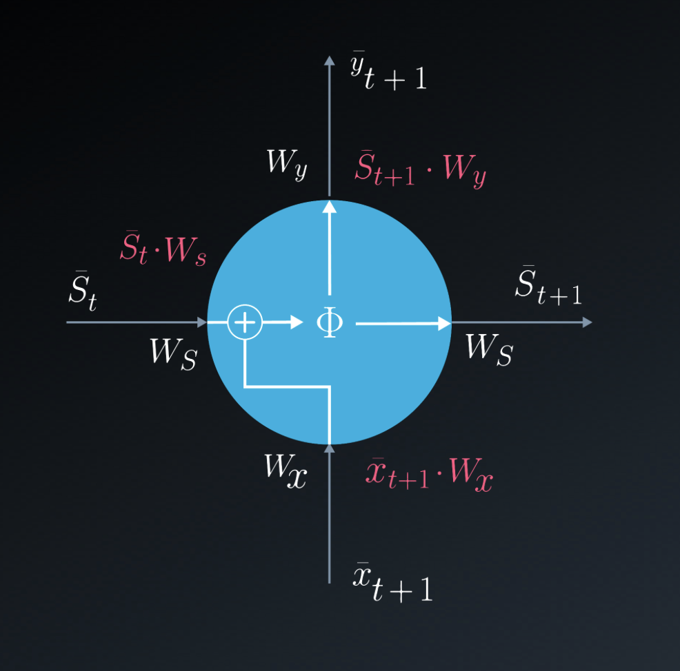
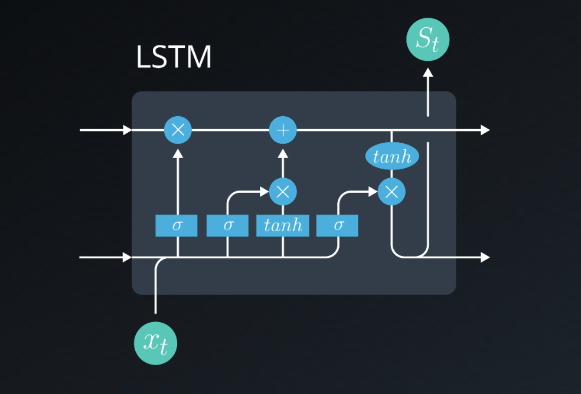

### Lesson Overview

**video**

Welcome to our lesson on Long Short-Term Memory Networks.

In this lesson, we will cover the following topics:

- LSTM Overview
- LSTM Architecture and Gates

By the end of the lesson, you'll be able to:

- Explain how LSTMs overcome the limitations of RNNs
- Implement the LSTM architecture

### RNN vs LSTM

**video**

### Vanishing Gradient Problem

The problem with RNNs is that memory stored in an RNN can be effective short-term memory. This is due to the "Vanishing Gradient Problem." The Vanishing Gradient Problem happens when the gradient of a deep layer of the neural network is "diluted" and has a reduced effect on the network. This is due to the nature of the activation functions of the RNN that can diminish the effect of the gradients of the deeper layer over time.

The LSTM solves the problem by introducing an operation to maintain the long-term memory of the network. We will learn about these gates in subsequent lessons.

### From RNN to LSTM

Before we take a close look at the Long Short-Term Memory (LSTM) cell, let's take a look at the following video:

**video**

[Long Short-Term Memory](http://www.bioinf.jku.at/publications/older/2604.pdf) Cells, (LSTM) give a solution to the vanishing gradient problem, by helping us apply networks that have temporal dependencies. They were proposed in 1997 by Sepp Hochreiter and Jürgen Schmidhuber

If we look closely at the RNN neuron, we see that we have simple linear combinations (with or without an activation function). We can also see that we have a single addition.

Zooming in on the neuron, we can graphically see this in the following configuration:

 Closeup Of The RNN Neuron 

The LSTM cell is a bit more complicated. If we zoom in on the cell, we can see that the mathematical configuration is the following:

 Closeup Of the LSTM Cell 

The LSTM cell allows a recurrent system to learn over many time steps without the fear of losing information due to the vanishing gradient problem. It is fully differentiable, therefore allowing us to use backpropagation when updating the weights easily.

### Basics of LSTM

**video**

In this video, we learned the basics of the LSTM. We have listed them below.

- Inputs
    - Long Term Memory
    - Short Term Memory
    - Input Vector (Event)
- Gates
    - Forget Gate
    - Learn Gate
    - Remember Gate
    - Use Gate
- Outputs
    - New Long-Term Memory
    - New Short-Term Memory

### Architecture of LSTM
**video**

### LSTM Gates
### The Learn Gate

**video**

The output of the Learn Gate is $N_t$ $i_t$​ where:

$$ N_t = tanh(W_n[STM_{t-1}, E_t] + b_n) $$ 
$$ i_t = \sigma(W_i[STM_{t-1}, E_t] + b_i) $$
Equation 1
### The Forget Gate

**video**

The output of the Forget Gate is $LTM_{t-1}f_t$​ where:

$$ f_t = \sigma (W_f [STM_{t-1}, E_t] + b_f) $$
Equation 2

### The Remember Gate

**video**

The output of the Remember Gate is:

$$ L T M_{t-1} f_t + N_t i_t $$
Equation 3

($N_t$, $i_t$ ​ and $f_t$​ are calculated in equations 1 and 2)

### The Use Gate

**video**
Note: At 00:27 : Luis refers to obtaining New Short Term Memory instead it's New Long Term Memory.

The output of the Use Gate is $U_t$ $V_t$​ where:

$$ U_t = tanh(W_u LT M_{t-1}f_t +b_u) $$
$$ V_t = \sigma (W_v [ST M_{t-1}, E_t] + b_v) $$
Equation 4

### Putting it together
**video**

### Predicting Temperature using LSTM

**udacity_deeplearning_nanodegree/3 RNN/2 LTSM/Exercises/LTSM/predicting_temp_using_LSTM.ipynb**

### Sentiment Analysis using LSTM

**udacity_deeplearning_nanodegree/3 RNN/2 LTSM/Exercises/LTSM/sentiment_analysis_using_LSTM.ipynb**

### Exercise: Text classification using LSTM

**udacity_deeplearning_nanodegree/3 RNN/2 LTSM/Exercises/LTSM/text_classification_LSTM_exercise.ipynb**