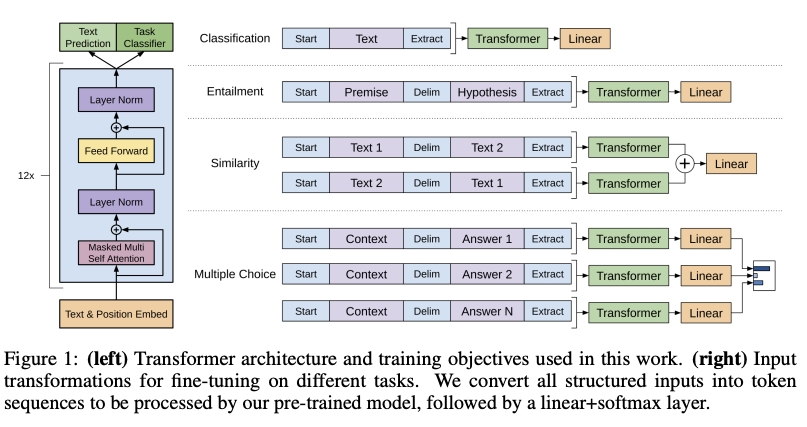
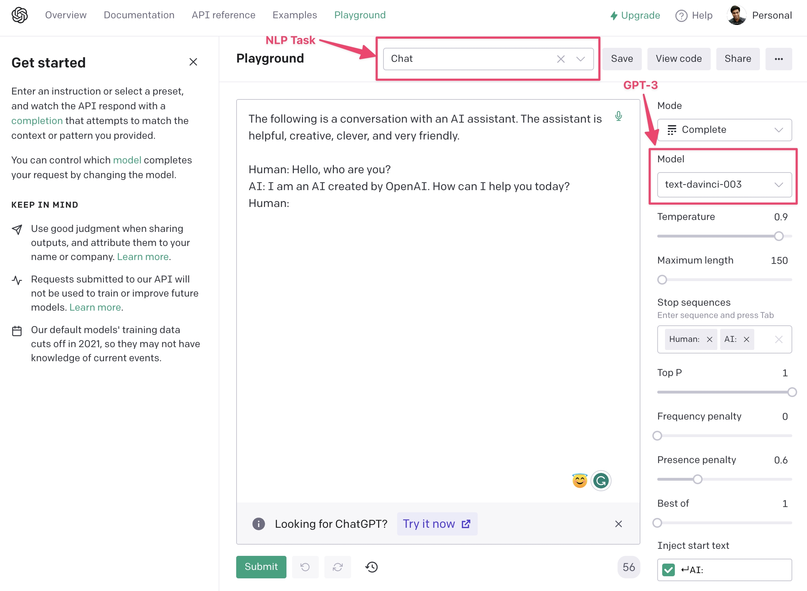

### Intro

So what are transformer models and why they are taking the world by storm?

Originally introduced in 2017 by Google researchers led by Ashish Vaswani, transformer models are a type of neural network architecture. They are designed to process sequential data (e.g., words in a sentence), such as natural language text. But here is why transformer models are revolutionary - they use a self-attention mechanism.

This self-attention mechanism allows them to focus on different parts of the input sequence and adjust their importance when making predictions about the output. In contrast Recurring Neural Networks (RNNs)/ Long Short-Term Memory (LSTM)/ Gated recurrent units (GRUs) are other types of Neural Networks that process a sequence one element at a time. Unlike self-attention, RNNs process the sequence in a linear fashion, with each element being processed sequentially based on its position in the sequence. As a result, these have a limited attention span and cannot “remember” the context from an earlier part of the sequence or conversation. Let’s see this with a visual.

**video**

### Summary

So while LSTMs have been very effective in handling sequential data, they do have some limitations:

1. Limited attention span - They struggle to capture long term dependencies in sequences as they maintain a limited amount of information in memory.
2. Computation efficiency - LSTMs are computationally expensive to train.
3. Handling multiple sequences - LSTMs are designed to handle one sequence at a time.

Transformers overcome all these limitations of LSTM by using self-attention and parallel processing.

Transformer models have been shown to achieve state-of-the-art performance on a wide range of NLP tasks, including:

- language translation
- text generation
- question answering
- sentiment analysis
- named-entity recognition

This has led to their widespread adoption in industry and academia, and they are now the dominant approach for many NLP applications. Their impact has been particularly significant in the development of large-scale language models, such as Bidirectional Encoder Representation Transformer (BERT), and Generative Pre-trained Transformer (GPT), which have revolutionized the field of NLP across a wide range of tasks.

### Open-source APIs for Transformers

The availability of these powerful transformer models can be found in numerous open-source APIs are currently accessible from various companies, including OpenAI, TensorFlow Hub, AWS, Google Cloud AI Platform, and Hugging Face Transformers. These APIs offer convenient integration into the data pipelines of businesses, allowing them to take advantage of pre-existing transformer models in deep learning and data science.

If you feel like doing a quick check on testing your understanding, do check out the quiz below.

### Transformers in detail

#### Transformer Architecture


<p align="center"> Transformer - model architecture [Vaswani et al. (2017). Attention is all you need.] </p>

Transformers are a type of deep learning architecture that has become increasingly popular in natural language processing (NLP) tasks such as language translation and text generation. Transformers were introduced in a 2017 paper titled "Attention Is All You Need" by Vaswani et al., and have since become a cornerstone of many state-of-the-art NLP models.

At a high level, the transformer architecture consists of an encoder and a decoder.

- The encoder takes in a sequence of input tokens and produces a sequence of hidden representations
- The decoder takes in the encoder's output and generates a sequence of output tokens.

The key innovation of transformers is the use of self-attention mechanisms, which allow the model to selectively focus on different parts of the input sequence when computing the hidden representations.

The self-attention mechanism works by computing attention weights between each input token and all other input tokens and using these weights to compute a weighted sum of the input token embeddings. The attention weights are computed using a softmax function applied to the dot product of a query vector, a key vector, and a scaling factor. The query vector is derived from the previous layer's hidden representation, while the key and value vectors are derived from the input embeddings. The resulting weighted sum is fed into a multi-layer perceptron (MLP) to produce the next layer's hidden representation.

More specifically, given an input sequence of length L, the encoder can be represented by a series of L identical layers, each consisting of a self-attention mechanism and a feedforward neural network:

$$ EncoderLayer(x) = LayerNorm(x + SelfAttention(x) + FeedForward(x)) $$

**video**

### Key, Value, and Query

Let's try to understand the Key, Value, and Query before discussing the Decoder.

The key, value, and query vectors are used in the self-attention mechanism to help the model selectively attend to different parts of the input sequence.

- Key: You can think of the key vectors as a set of reference points the model uses to decide which parts of the input sequence are important.
- Value: The value vectors are the actual information that the model associates with each key vector.
- Query: Query vectors are used to determine how much attention to give to each key-value pair.
---
    Example: imagine you are trying to summarize a long article. The key vectors could represent the most important sentences or phrases in the article, while the value vectors could represent the actual content of those sentences. The query vectors would then be used to decide which of these key-value pairs are most relevant to the task of summarization.
---

The self-attention mechanism works by computing a dot product between the query vector and each key vector, which produces a set of attention weights that indicate how much attention to give to each value vector. The resulting weighted sum of the value vectors represents the attended information for that particular query.

In summary, key, value, and query vectors are used in transformers to help the model focus on important parts of the input sequence and produce more accurate and relevant output.

### The Mathematics behind Transformers

The mathematics behind transformers can be quite complex, but at a high level, it involves matrix multiplications, dot products, and non-linear activations. The key equations for the self-attention mechanism can be expressed as follows:

$$ Attention(Q, K, V) = softmax(\frac {QK^T} {\sqrt{d_k}})V $$

where Q, K, and V are the query, key, and value matrices, respectively, and $d_k$​ is the dimension of the key vectors. The softmax function is applied row-wise to the dot product of Q and K, which produces a set of attention weights that are used to weight the values in V. The output of the self-attention mechanism is then given by:

$$ MultiHead(Q, K, V) = Concat({head}_1, {...}, {head}_h) W^0 $$

### Decoder

The decoder is similar to the encoder but also includes an additional attention mechanism that allows it to attend to the encoder's output.

Overall, the transformer architecture has several advantages over previous NLP models. First, it is highly parallelizable, which makes it more efficient to train on modern hardware. Second, it does not rely on any explicit notion of sequence order, which allows it to better capture long-term dependencies in the input sequence. Finally, the attention mechanisms allow the model to selectively attend to different parts of the input sequence, which helps it handle tasks such as language translation where the input and output sequences may have different lengths.

### HuggingFace

- Hugging Face is an open-source company that provides NLP tools and models for developers and researchers. Learn more at their [website](https://huggingface.co/).
- Their flagship product is the Hugging Face Transformers library, which is a Python-based framework for building, training, and deploying state-of-the-art NLP models. Explore the library on [GitHub](https://github.com/huggingface/transformers)
- Hugging Face Transformers provides pre-trained models for a variety of NLP tasks, such as text classification, question answering, machine translation, and text generation. Check out their [model hub](https://huggingface.co/models) to browse pre-trained models.
- The library allows developers to quickly and easily integrate powerful NLP models into their applications using a simple API for loading pre-trained models. See the [documentation](https://huggingface.co/transformers/main_classes/pipelines.html) for more details.
- The library includes a range of tools for fine-tuning models on custom datasets, making it easy to adapt models to specific tasks.
- Hugging Face has a large and active community that provides support, documentation, and a range of resources to help developers and researchers get the most out of the library. Join the community on their [forums](https://discuss.huggingface.co/).
- In addition to pre-trained models and tools, Hugging Face also provides datasets, evaluation metrics, and benchmarking tools for NLP. Explore their [datasets](https://huggingface.co/datasets) and [evaluation tools](https://huggingface.co/metrics) on their website.
- Hugging Face is a valuable resource for anyone working with NLP models, whether you are a developer looking to integrate models into your applications or a researcher looking to explore the state of the art in NLP. See how Hugging Face models have been used in various applications on their [blog](https://huggingface.co/blog).

### Benefits of using pre-trained models:
- Pre-trained models are already trained on vast amounts of data and have learned to perform well on a wide range of NLP tasks. This saves a lot of time and resources that would otherwise be spent on data collection, pre-processing, and model training.
- Hugging Face provides access to a large collection of pre-trained models for various NLP tasks, which are continually updated and improved. This allows developers and researchers to choose the best model for their specific use case and avoid the risk of building a suboptimal model from scratch.
- The Hugging Face Transformers library provides a simple API for loading and using pre-trained models, making it easy to integrate them into custom applications without requiring deep knowledge of NLP or machine learning.

### Benefits of Transformers

**video**

##### Faster to Train

The replacement of recurrent cells with feedforward networks improves the parallelization of Transformers. Current high-performance computing systems are designed to work well with this type of parallelization.

##### Better Performance

Transformers offer better performance than RNNs across most natural language tasks. Therefore, we can use them to solve new problems.

##### Versatility

The Transformer architecture can move between different domains like NLP and Computer Vision.

### Intro to BERT

### BERT Overview

BERT (Bidirectional Encoder Representations from Transformers) is a Machine Learning (ML) model for natural language processing developed by Google in 2018. BERT is a versatile model that can handle a range of natural language processing (NLP) tasks, including but not limited to:

1. Sentiment analysis
2. Named entity recognition
3. Question answering
4. Language inference
5. Text classification
6. Paraphrasing
7. Text summarization
8. Machine translation
9. Language modeling
10. Text completion
11. Entity linking
12. Coreference resolution

BERT's ability to perform well on these tasks makes it a valuable tool for many NLP applications.

#### The Science Behind BERT: How it Learns and Processes Language

To achieve its remarkable performance, BERT utilizes the following components:

###### Extensive training data

BERT was trained on a colossal dataset of 3.3 billion words, which is one of the main factors that contributed to its success. Specifically, it was trained on two vast datasets: Wikipedia (about 2.5 billion words) and Google's BooksCorpus (about 800 million words). By using these vast and varied datasets, BERT gained a deep understanding of natural language.

###### MLM (Masked Language Modeling)

MLM is a technique used by BERT to learn about the relationships between words in a sentence. In this process, BERT is trained to predict what a masked word should be based on the other words in the sentence.

---
    Example:
    Let's say we have the following sentence: "The cat sat on the [MASK]".

    During pre-training, BERT may randomly mask one of the words in the sentence. In this case, let's say BERT masks the word "mat". The sentence would then look like this: "The cat sat on the [MASK]".

    BERT is then trained to predict what the masked word should be based on the other words in the sentence. In this case, the correct answer is "mat". By considering the other words in the sentence, such as "cat" and "sat", BERT is able to make an educated guess that the missing word is "mat".

    This process is repeated many times over with different sentences and different masked words, allowing BERT to learn about the relationships between words in a sentence and build a deep understanding of language.
---

###### NSP (Next Sentence Prediction)

NSP is another technique used by BERT during pre-training to help it better understand the overall structure and flow of language. In this process, BERT is trained to predict whether two sentences are likely to appear together in a piece of text.

---
    Example:
    Let's say we have two sentences:

    - "The cat sat on the mat."
    - "It was a beautiful day outside."

    During pre-training, BERT may be given these two sentences and asked to predict whether they are likely to appear together in a piece of text. In this case, the answer would be "no" since the two sentences do not seem to be related to each other.

    BERT is trained using many different pairs of sentences, some of which are related and some of which are not. By learning to predict whether pairs of sentences are related or not, BERT gains a better understanding of the overall structure and flow of language.

    This technique is important because it helps BERT understand the context in which sentences appear, which is crucial for many natural language processing tasks such as question answering and text classification.
---

### BERT Architecture


<p align="center"> BERTlarge - model architecture (340 million parameters) </p>

Model | Transformer Layers | Hidden Size | Attention Heads | Parameters
---|:---:|:---:|:---:|---: 
BERTbase | 12 | 768 | 12 | 110M
BERTlarge | 24 | 1024 | 16 | 340M

The above table provides some key specifications of two different versions of the BERT model: BERTbase and BERTlarge.

- Transformer Layers: This refers to the number of transformer layers in the BERT model. Transformer layers are a key component of BERT and are responsible for processing the input text.
- Hidden Size: This refers to the number of hidden units in each layer of the BERT model. This is an important parameter as it determines the capacity of the model to learn complex patterns in the input data.
- Attention Heads: This refers to the number of attention heads used in each transformer layer. Attention heads are responsible for computing the attention scores between different parts of the input sequence, which allows the model to focus on the most relevant parts of the input.
- Parameters: This refers to the total number of parameters in the BERT model. The number of parameters is directly proportional to the complexity of the model and determines how well it can fit the training data.

### Text classification using BERT

**udacity_deeplearning_nanodegree/3 RNN/3 Transformers/Exercises/text_classification_BERT.ipynb**

### Fine-tuning BERT
**video**

### Steps to Finetune BERT

1. First, we need to import all the libraries that we need. We will use the datasets library to load data as well as functions to compute metrics and from HuggingFace's transformers library, we will import tokenizers, trainers, and models for sentence classification.

```
from datasets import load_dataset
from transformers import AutoTokenizer
from transformers import AutoModelForSequenceClassification
from transformers import TrainingArguments, Trainer
import numpy as np
from datasets import load_metric
```
2. Next, we will define some functions to compute our metrics and tokenize our sentences

```
def compute_metrics(eval_pred):
    logits, labels = eval_pred
    predictions = np.argmax(logits, axis=-1)
    return metric.compute(predictions=predictions, references=labels)

def tokenize_function(examples):
    return tokenizer(examples["text"], padding="max_length", truncation=True)
```

3. Now we can load and preprocess our dataset. Remember that we will be using the datasets library to load data. Datasets have many inbuilt datasets available and you can find a list of them [here](https://huggingface.co/docs/datasets/loading_datasets.html#from-the-huggingface-hub).
    
4. The tokenizer we select needs to be the same as the model we are using. There are many pre-trained models available in transformers and you can find a list of them [here](https://huggingface.co/transformers/pretrained_models.html). In the code below, you can see that I am using the bert-base-cased model. Once we have selected the model, we need to tokenize our dataset. I have also added code to use a small subset of the data to make training faster. However, you may choose to use the whole dataset by uncommenting the last two lines.

```
tokenizer = AutoTokenizer.from_pretrained("bert-base-cased")
tokenized_datasets = raw_datasets.map(tokenize_function, batched=True)

small_train_dataset = tokenized_datasets["train"].shuffle(seed=42).select(range(1000))
small_eval_dataset = tokenized_datasets["test"].shuffle(seed=42).select(range(1000))
# full_train_dataset = tokenized_datasets["train"]
# full_eval_dataset = tokenized_datasets["test"]
```

5. Now that we have written our data preprocessing code, we can download our model and start to train it. We will use the AutoModelForSequenceClassification API to fetch the pre-trained bert-base-cased model. We also need to specify the number of classes in our data.

Finally, we can train and evaluate the model using a Trainer object.

```
model = AutoModelForSequenceClassification.from_pretrained("bert-base-cased", num_labels=<your labels>)

metric = load_metric("accuracy")

training_args = TrainingArguments("test_trainer", evaluation_strategy="epoch")

trainer = Trainer(
    model=model,
    args=training_args,
    train_dataset=small_train_dataset,
    eval_dataset=small_eval_dataset,
    compute_metrics=compute_metrics,
)
trainer.train()
trainer.evaluate()
```

---
    Note: Fine tuning BERT takes a long time (even on GPUs), hence we are not providing a workspace for this demo. Please try this on your local machine.
---

### GPT

GPT, or Generative Pre-trained Transformer, is an advanced [autoregressive](https://en.wikipedia.org/wiki/Autoregressive_model) language model built on the transformer architecture, which leverages self-attention mechanisms for efficiently handling long-range dependencies in sequence data. The primary goal of GPT models is to predict the next token in a given sequence by learning a probability distribution over a vast vocabulary. This is achieved through unsupervised pre-training on large-scale text corpora, followed by fine-tuning on specific tasks to generate human-like text, perform translation, answer questions, and more.

The evolution of GPT began with GPT-1, which demonstrated the potential of unsupervised pre-training followed by task-specific fine-tuning. GPT-2, the successor, utilized a much larger dataset and model size, leading to substantially improved performance across various NLP tasks. However, its release was initially limited due to concerns about potential misuse. GPT-3 took the concept further, scaling up to 175 billion parameters and introducing the ["few-shot learning"](https://paperswithcode.com/task/few-shot-learning) paradigm, which allowed the model to perform tasks with very limited task-specific training data.

GPT-4 builds upon the advancements of its predecessors, featuring an even larger model size and enhanced pre-training techniques. This latest iteration benefits from architectural improvements, such as sparsity and attention mechanisms that facilitate more efficient training and inference. GPT-4's greater capacity enables it to learn more sophisticated language patterns and generate higher-quality output across a broader range of tasks. Additionally, GPT-4 can be fine-tuned with smaller datasets, making it a powerful tool for specialized applications in various domains. Despite its impressive capabilities, GPT-4 still faces challenges in controlling generated content, ensuring factual accuracy, and mitigating biases present in training data.


Source: [Improving Language Understanding by Generative Pre-Training](https://s3-us-west-2.amazonaws.com/openai-assets/research-covers/language-unsupervised/language_understanding_paper.pdf)

### Text generation using pre-trained GPT models from HuggingFace

**udacity_deeplearning_nanodegree/3 RNN/3 Transformers/Exercises/text_generation_transformers.ipynb**

### Text translation using pre-trained Transformers

**udacity_deeplearning_nanodegree/3 RNN/3 Transformers/Exercises/text_translation.ipynb**

### GPT3 and ChatGPT

#### GPT-3

- GPT-3 is a language model developed by OpenAI based on transformer architecture.
- It was released in June 2020 and is known for its impressive performance on various language tasks.
- GPT-3 is trained on over 45 terabytes of text data and has 175 billion parameters.
- The model is pre-trained on a language modeling objective, which allows it to learn a general understanding of language, including syntax, semantics, and context.
- GPT-3's architecture is based on the transformer, which consists of a stack of transformer layers with multiple attention heads.
- The model incorporates several innovations, including relative positional encoding and a mixture of experts to specialize in different areas of language processing.

You can use GPT-3 using API developed by OpenAI by creating an account on the [OpenAI website](https://platform.openai.com/overview).

We also recommend exploring [Open AI playground](https://platform.openai.com/playground) to test GPT-3 and other models for various NLP tasks.



Click on View Code if you would like to integrate this model in your application.

#### ChatGPT

- ChatGPT is a large language model developed by OpenAI based on the GPT-4 architecture.
- It is an NLP tool that can generate human-like responses to textual input.
- ChatGPT has been trained on a vast corpus of text data and can understand the nuances of language, including grammar, syntax, and context.
- It can be used for chatbots, customer service, virtual assistants, language learning, tutoring, and more.
- ChatGPT has a vast knowledge base and can provide answers to a wide range of questions, making it a valuable resource for researchers, students, and professionals.
- Its ability to understand the context of the conversation and generate relevant responses has made it popular for companies looking to automate their customer service and support functions.
- ChatGPT's conversational abilities are continuously improving and have the potential to revolutionize the way we interact with machines.
- Overall, ChatGPT is a powerful language model with significant potential for various applications, and its capabilities are expected to grow as NLP technology advances.