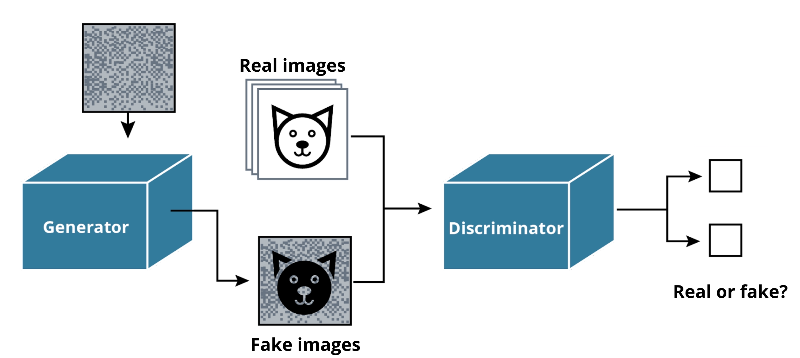
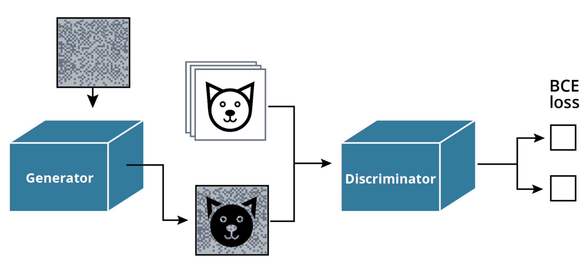
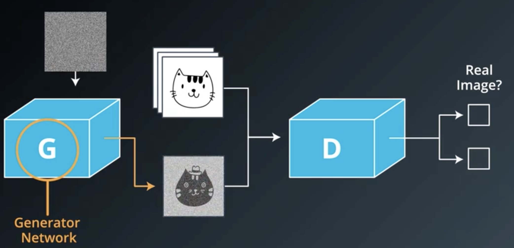
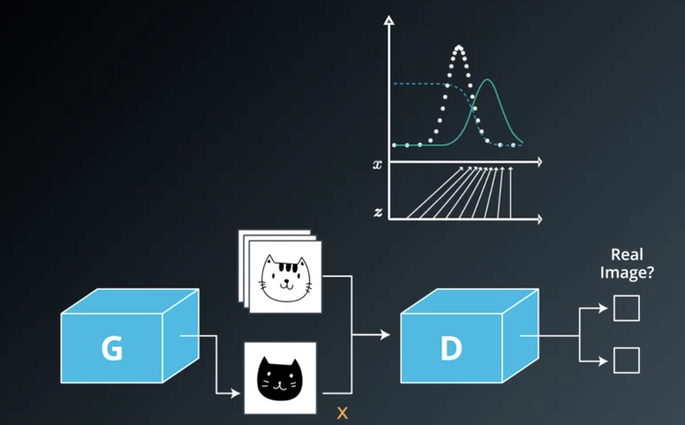

### Welcome to Generative Adversarial Networks

**video**

In this course, we will consider a specific type of deep learning model**:**

- Generative Adversarial Networks, or GANs.

Applications of GANs include:

- Image generation
- Image to image translation
- "Deep fakes"

 GANs: Generating Images based on "Real" Images 

### Course Outline

**video**

In this course, we will cover the following topics:

- Generative Adversarial Networks
    - Build a generator network
    - Build a discriminator network
    - Build GAN losses
    - Train on the MNIST dataset
- Training a Deep Convolutional GANs
    - Build a DCGAN generator and discriminator
    - Train a DCGAN model on the CIFAR10 dataset
    - Implement GAN evaluation metrics
- Image to Image Translation
    - Implement CycleGAN dataloaders
    - Implement CycleGAN generator and loss functions
    - Train a CycleGAN
- Modern GANs: WGAN-GP, ProGAN and StyleGAN
    - Implement the Wasserstein Loss with gradient penalties
    - Implement a ProGAN model
    - Implement the components of a StyleGAN model

### Prerequisites & Tools

**video**

### Who Should Take This Course

This advanced course is intended for students who have basic knowledge and experience in the following areas:

- Calculus, linear algebra, and probabilities
- Intermediate level in Python and PyTorch
- Building custom neural network architecture
    - Convolution and pooling layers
    - Batch normalization
    - Linear layers and different activation functions
- Training to convergence a neural network
    - PyTorch dataset and dataloaders
    - Loss functions and optimizers
    - Hyperparameter optimization

If you are unfamiliar with these topics or need a refresher course, check out Udacity's free courses, [Intro to Deep Learning with PyTorch](https://www.udacity.com/course/deep-learning-pytorch--ud188) and [Linear Algebra Refresher](https://www.udacity.com/course/linear-algebra-refresher-course--ud953).

### Tools & Environment

In this course, the work for all exercises and the course final project is contained in Jupyter Notebooks found in the workspaces provided in the classroom.

We highly recommend completing coursework within the provided classroom workspaces. However, if you choose to work locally, the relevant files may be downloaded from the classroom workspace.

### Business Stakeholders

**video**

GANs are a fundamental component of computer-generated data.

GANs can be used to:

- Generate interactive images from simple drawings
- Make synthetic data more realistic
- Create examples that can fool an existing algorithm

Because of its broad range of existing and potential use cases, GANs can be applicable to virtually every industry, from retail to self-driving cars, from industrial to pharmaceuticals.

### Project Preview

**video**

For the final project in this course, you will:

- **Build a custom generative adversarial network to generate new images of faces.**
- **Use a dataset of high-resolution images of "celebrity" faces.**

The project lesson contains a more detailed overview of the project, as well as, detailed instructions.

### Welcome to GANs

**video**

Welcome to this lesson on Generative Adversarial Networks taught by the "Godfather" of GANs, Ian Goodfellow.

By the end of this lesson, you will be able to:

- Build a generator and a discriminator network
- Implement the generator and discriminator loss functions.
- Train a GAN on a dataset
- Implement some tips and tricks to increase the stability of GAN training

After this lesson, you will have a good understanding of generative adversarial networks and the challenges of successfully training them!

Let's get started!

 Big Picture: GANs 

### Lesson Outline

**video**

In this lesson on Generative Adversarial Networks we will cover the following topics:

- Building Generator and Discriminator Networks
- Implementing Loss Functions
- Training a GAN on a dataset
- Implementing techniques to improve GAN training

### Introducing Ian Goodfellow

**video**

Ian Goodfellow is the creator of GANs and has held many roles including:

- Senior Research Scientist at Google
- Director of Machine Learning at Apple

In this lesson, Ian will teach you how to create new computer-generated images that can appear very realistic.

You will find that GANs has real-world application in a number of broad fields including:

- Computer Vision
- The Automotive Industry
- Video Gaming

and its implications can be far-reaching.

### Applications of GANs

**video**

GANs can be used for a number of broad applications.

Visual, Image-Based Applications –

- Creating new images
- Digital Art
- Image to Image Translation
- Realistic image training sets
- Imitation Learning

Less Visual Applications –

- Predicting the outcome of highly complex physics experiments
- Generating adversarial examples

#### Additional Resources

- [StackGAN: Text to Photo-realistic Image Synthesis with Stacked Generative Adversarial Networks](https://arxiv.org/abs/1612.03242), is an academic paper about using computer vision and pattern recognition to create realistic images.
- [iGAN: Interactive Image Generation via Generative Adversarial Networks](https://github.com/junyanz/iGAN), uses a GANs model to create interactive image generation based on real-time user inputs
- [CartoonGAN: Generative Adversarial Networks for Photo Cartoonization](https://video.udacity-data.com/topher/2018/November/5bea23cd_cartoongan/cartoongan.pdf), is a paper about transforming real-life photos into cartoon-style images.

### How GANs Work

**video**

##### Image Generation

- Fully Visible Belief Networks – where the model generates an image one pixel at a time. This is also called an Autoregressive Model.

- Generative Adversarial Networks (GANs) – where the model generates an entire image in parallel using a differentiable function

##### How to Get Realistic Images

GANs used a combination of neural networks to accomplish the task of image generation:

- **Generator Network** – takes random input through a differentiable function to transform and reshape it to have a recognizable structure. The output is a realistic image.

 Generators Create New Images Based on a Dataset 

Unlike training a supervised learning model, when training a generator model, there is no classification/label to associate with each image. It creates additional images based on a probability distribution.

- **Discriminator Network**  - is a regular neural net classifier that learns to guide the generator network by outputting the probability that the input is real. Fake images are 0 and real images are 1.

The generator network is forced to produce more realistic images to "fool" the discriminator network.

 Discriminators determine the probability of an image being "real" or "fake" 

#### Additional Resources

Check out Ian's original paper on [Generative Adversarial Nets](https://arxiv.org/pdf/1406.2661.pdf).

### Exercise Part 1: MNIST GAN Generator Discriminator

**udacity_deeplearning_nanodegree/4 GAN/1 Introduction/Exercise Part 1: MNIST GAN Generator Discriminator/MNIST_GAN_generator_discriminator_Starter.py.ipynb**

### Exercise Part 1: Solution

**video**

### Games and Equilibria

**video**

### Games and Equilibria: Part 1

##### Adversarial

In GANs, **adversarial** means that two networks, the generator and the discriminator, compete with each other for improved image generation.

This "competition" between the networks is based on **Game Theory**.

**Game Theory** – a form of applied mathematics used to model cooperation and conflict between rational agents in any situation

### Games and Equilibria: Part 2

**video**

#### Equilibria and GANs

Most ML models are based on optimization and follow the general pattern of

1. Determine model parameters
2. Have a cost function of these parameters
3. Minimize the cost

GANs are different because there are two players, the generator and the discriminator, and each player has its own cost. The "game" is therefore defined by a value function.

- The **generator wants to minimize** the value function.
- The **discriminator wants to maximize** the value function.
- The **saddle point** is when equilibrium is reached, a point in the parameters of both players that is simultaneously a local minimum for each player's costs with respect to that player's parameters.

A key learning problem for GANs is finding the equilibrium of a game involving cost functions that are:

- High dimensional
- Continuous
- Non-convex

#### Additional Reading

A very famous example of Game Theory is the Prisoner Dilemma. This [video](https://www.youtube.com/watch?v=t9Lo2fgxWHw) explains this game very well. A few others concepts are keys to understand game theory:

- [Nash equilibrium](https://en.wikipedia.org/wiki/Nash_equilibrium): an equilibrium reached when neither player gain anything by changing their strategies. In the Prisoner Dilemma's game, the Nash Equilibrium is attained when both players decide to betray each other
- [Pareto Optimality](https://en.wikipedia.org/wiki/Pareto_efficiency): a strategy is pareto optimal when neither player can be better off without another player being negatively affected. In the Prisoner Dilemma's game, both players deciding to not betray each other is pareto optimal.

### Tips for Training GANs
**video**

### Tips for Training GANs: Part 1

#### Good Architecture

**Fully Connected Architecture** can be used for simple tasks that meet the following criteria:

- No convolution
- No recurrence
- The generator and discriminator have a least one hidden layer

**Leaky ReLU** helps to make sure that the gradient can flow through the entire architecture and is a popular choice for hidden layer activation functions.

The **Hyperbolic Tangent** activation function is a popular output choice for the generator and means data should be scaled to the interval from -1 to +1.

A **Sigmoid Unit** is used to enforce the constraint that the output of the discriminator is a probability.

#### Design Choice

One of the design choices from the DCGAN architecture is **Adam**, an optimization algorithm.

A common error is that people forget to use a numerically stable version of **cross-entropy**, where the loss is computed using the **logits**.

- **Logits** – the values produced by the discriminator right before the **sigmoid**.

#### Tips for Training

1. A simple trick is to multiply the 0 or 1 labels by a number a bit less than 1. This is a GANs-specific label smoothing strategy similar to that used to regularize normal classifiers.
2. For the generator loss, minimize cross-entropy with the labels flipped.

### Tips for Training GANs: Part 2

**video**

### Scaling GANs

**Convolutional Neural Networks (CNN)** are needed to scale GANs to work on larger images. Scaling GANs relies on an understanding of:

- Classifier Convolutional Net – starting with a tall and wide feature map and moving to very short and narrow feature maps
- Generator Net – starting with short and narrow feature maps and moving to a wide and tall image
- Batch Normalization – on potentially every layer except the output layer of the generator and the input layer of the discriminator

#### Improved Training Techniques for GANs

The paper,[ Improved Techniques for Training GANs](https://video.udacity-data.com/topher/2018/November/5bea0c6a_improved-training-techniques/improved-training-techniques.pdf), describes improved training techniques for GANs!

### Exercise Part 2: Discriminator and Generator Losses

**udacity_deeplearning_nanodegree/4 GAN/1 Introduction/Exercise Part 2: Discriminator and Generator Losses/MNIST_LOSS_Starter.ipynb**

### Exercise Part 2: Solution

**video**

### Generating Fake Images

**video**

The next few pages will cover the practical implementation of GANs based on training the MNIST dataset.

#### Additional Resources

If you'd like to read about even more applications of GANs, I recommend reading [GAN — Some cool applications of GAN](https://medium.com/@jonathan_hui/gan-some-cool-applications-of-gans-4c9ecca35900), which does an overview of interesting applications!

The tulip generation model was created by the artist Anna Ridler, and you can read about her data collection method and inspiration in the article, This [AI dreams in tulips](https://www.fastcompany.com/90237233/this-ai-dreams-in-tulips).

### MNIST GAN

**video**

The steps for building a GAN to generate new images can be summarized as follows:

1. Create a classifier by training on dataset images
2. Create an adversarial training using a discriminator and generator
    - The discriminator acts as a simple classifier distinguishing between real and fake images
    - The generator acts as an adversary with the goal of tricking the discriminator into tagging generated images as "real"
3. Define generator and discriminator networks with opposing goals and loss functions

#### Additional Resources

The MNIST data is a very popular dataset used when discussing GANs and you may see it referenced frequently. You can learn more about the MNIST dataset by reading the original documentation, [THE MNIST DATABASE of Handwritten Digits](http://yann.lecun.com/exdb/mnist/).

### Exercise Part 3: MNIST GAN

**udacity_deeplearning_nanodegree/4 GAN/1 Introduction/Exercise Part 3: MNIST GAN/MNIST_GAN_Starter.ipynb**

### Exercise Part 3: Solution

**video**

### Lesson Review

**video**

In this lesson, you:

- Built generator and discriminator networks with fully connected layers and leaky ReLU activations
- Implemented the generator and the discriminator loss functions using the binary cross-entropy loss
- Trained your first GAN on the MNIST dataset
- Implemented techniques to increase GAN training stability

