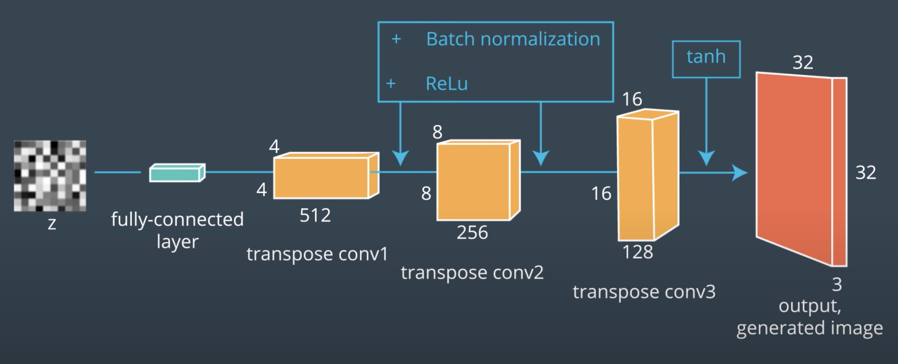

### Introduction to DCGANs

**video**

Welcome to this lesson on Deep Convolutional Generative Adversarial Networks, also known as, DCGANs.

By the end of this lesson, you will be able to:

- Build a convolutional generator based on the DCGAN model
- Build a convolutional discriminator also based on the DCGAN model
- Train these networks on a dataset of RGB images
- Implement two metrics for GANs performance evaluation

In this lesson, we consider how to scale GANs by adding more complexity in the networks!

Let’s get started!

 Big Picture: GANs for Complexity 

### Lesson Outline

**video**

In this lesson on Deep Convolutional GANs (DCGANs) we will cover the following topics:

- Build DCGAN Discriminator and Generator
- Train a DCGAN Model
- Evaluate GANs using New Metrics

### Deep Convolutional GANs

**video**

Disclaimer: This video mentions the Street View House Numbers Dataset or SVHN; however, you will actually be training a DCGAN model on the [CIFAR10 dataset](https://www.cs.toronto.edu/~kriz/cifar.html). Both datasets have a similar spatial resolution.

### Understanding a DCGAN

In this lesson, you will be training a GAN on the CIFAR10 dataset, a labeled subset of the [80 million tiny images dataset](http://people.csail.mit.edu/torralba/tinyimages/).

To improve model performance, convolutional layers will be used to make a DCGAN.

- DCGANs have generator and discriminator networks, but the networks are made of convolutional layers that are designed to work with spatial data
- The discriminator will be a convolutional neural network (CNN) that classifies images are real or fake
- The generator will be a transpose CNN that upsamples a latent vector z and generates realistic images that can fool the discriminator.

### DCGAN, Discriminator

**video**

The DCGAN Discriminator is:

- A convolutional neural network (CNN) with one fully connected layer at the end
- There are no max-pooling layers in the network
- Down-sampling is accomplished using convolutional layers that have a stride equal to 2
- Batch normalization and Leaky ReLU activations are applied to the outputs of all hidden layers
- After a series of downsampling convolutional layers, the final layer is flattened and connected to a single sigmoid unit
- The sigmoid unit output has a range from 0 to 1, indicating if an image is "real" or "fake"

 DCGAN Discriminator : With convolutional layers progressively down-sampling 

Leaky ReLu – a function that will reduce any negative values by multiplying those values by some small coefficient, known as the negative slope.

Batch Normalization – scales the layer outputs to have a mean of 0 and variance of 1, to help the network train faster and reduce problems due to poor parameter initialization.

#### DCGAN Paper

It's always good to take a look at the original paper when you can. Many papers discuss both the theory and training details of deep learning networks, and you can read the DCGAN paper, [Unsupervised Representational Learning with Deep Convolutional Generative Adversarial Networks](https://arxiv.org/pdf/1511.06434.pdf).

### DCGAN Generator

**video**

The task of a DCGAN Generator is to understand patterns in the underlying structure and features of the training data, in ways that allow it to create realistic generated images.

The DCGAN Generator:

- Has an input, random vector z
- Has an image output that can be sent to the discriminator
- Up-samples the vector z until it is the same shape as the training images
- Uses transposed convolutions
- ReLU activations and batch normalization is used on all hidden layers
- A tanh activation function is applied the the outputs of the final layer

 DCGAN Generator : With transposed convolutions progressively up-sampling the layers 

#### Generating Images

To generate an image, the generator:

1. Connects the input vector z to a fully connected layer
2. The fully connected layer is reshaped to a 4x4 XY shape of a given depth
3. A stack of larger layers is built by upsampling with transpose convolution
4. Each layer is doubled in XY size using strides of 2, and depth is reduced
5. The final output is a generated image the same size as the training images

### What is Batch Normalization?

Batch normalization was introduced in Sergey Ioffe's and Christian Szegedy's 2015 paper [Batch Normalization: Accelerating Deep Network Training by Reducing Internal Covariate Shift](https://arxiv.org/pdf/1502.03167.pdf). The idea is that, instead of just normalizing the inputs to the network, we normalize the inputs to every layer within the network.

### Batch Normalization

It's called "batch" normalization because, during training, we normalize each layer's inputs by using the mean and standard deviation (or variance) of the values in the current batch. These are sometimes called the batch statistics.

---
    Specifically, batch normalization normalizes the output of a previous layer by subtracting the batch mean and dividing by the batch standard deviation.
---

Why might this help? Well, we know that normalizing the inputs to a network helps the network learn and converge to a solution. However, a network is a series of layers, where the output of one layer becomes the input to another. That means we can think of any layer in a neural network as the first layer of a smaller network.

### Normalization at Every Layer

For example, imagine a 3 layer network.

 3 layer network 

Instead of just thinking of it as a single network with inputs, layers, and outputs, think of the output of layer 1 as the input to a two layer network. This two layer network would consist of layers 2 and 3 in our original network.

 2 layer network 

Likewise, the output of layer 2 can be thought of as the input to a single layer network, consisting only of layer 3.

 one layer network 

When you think of it like this - as a series of neural networks feeding into each other - then it's easy to imagine how normalizing the inputs to each layer would help. It's just like normalizing the inputs to any other neural network, but you're doing it at every layer (sub-network).

### Internal Covariate Shift

Beyond the intuitive reasons, there are good mathematical reasons to motivate batch normalization. It helps combat what the authors call internal covariate shift.

---
    In this case, internal covariate shift refers to the change in the distribution of the inputs to different layers. It turns out that training a network is most efficient when the distribution of inputs to each layer is similar!
---

And batch normalization is one method of standardizing the distribution of layer inputs. This discussion is best handled in the paper and in Deep Learning, a book you can read online written by Ian Goodfellow, Yoshua Bengio, and Aaron Courville. Specifically, check out the batch normalization section of Chapter 8: Optimization for Training Deep Models.

### The Math

Next, let's do a deep dive into the math behind batch normalization. This is not critical for you to know, but it may help your understanding of this whole process!

#### Getting the mean and variance

In order to normalize the values, we first need to find the average value for the batch. If you look at the code, you can see that this is not the average value of the batch inputs, but the average value coming out of any particular layer before we pass it through its non-linear activation function and then feed it as an input to the next layer.

We represent the average as 
$$ \mu_B $$

which is simply the sum of all of the values, $x_i$ divided by the number of values, m.

$$ \mu_B \gets \frac {1} {m} \sum_{i=1}^{m} x_i $$

We then need to calculate the variance, or mean squared deviation, represented as

$$ \sigma_B^2 $$

If you aren't familiar with statistics, that simply means for each value $x_i$, we subtract the average value (calculated earlier as $\mu_B$), which gives us what's called the "deviation" for that value. We square the result to get the squared deviation. Sum up the results of doing that for each of the values, then divide by the number of values, again m, to get the average, or mean, squared deviation.

$$ \sigma_B^2 \gets \frac {1} {m} \sum_{i=1}^{m} (x_i - \mu_B)^2 $$

#### Normalizing output values

Once we have the mean and variance, we can use them to normalize the values with the following equation. For each value, it subtracts the mean and divides by the (almost) standard deviation. (You've probably heard of standard deviation many times, but if you have not studied statistics you might not know that the standard deviation is actually the square root of the mean squared deviation.)

$$ \hat x_i \gets \frac {x_i - \mu_B} {\sqrt {(\sigma_B^2 +  \epsilon )}} $$

Above, we said "(almost) standard deviation". That's because the real standard deviation for the batch is calculated by

$$ \sigma_B^2 $$

but the above formula adds the term epsilon before taking the square root. The epsilon can be any small, positive constant, ex. the value 0.001. It is there partially to make sure we don't try to divide by zero, but it also acts to increase the variance slightly for each batch.

Why add this extra value and mimic an increase in variance? Statistically, this makes sense because even though we are normalizing one batch at a time, we are also trying to estimate the population distribution – the total training set, which itself an estimate of the larger population of inputs your network wants to handle. The variance of a population is typically higher than the variance for any sample taken from that population, especially when you use a small sample size (a small sample is more likely to include values near the peak of a population distribution), so increasing the variance a little bit for each batch helps take that into account.

At this point, we have a normalized value, represented as
$$\hat{x_i}$$

But rather than use it directly, we multiply it by a gamma value, and then add a beta value. Both gamma and beta are learnable parameters of the network and serve to scale and shift the normalized value, respectively. Because they are learnable just like weights, they give your network some extra knobs to tweak during training to help it learn the function it is trying to approximate.

$$ y_i \gets  \gamma \hat{x_i} + \beta  $$

We now have the final batch-normalized output of our layer, which we would then pass to a non-linear activation function like sigmoid, tanh, ReLU, Leaky ReLU, etc. In the original batch normalization paper, they mention that there might be cases when you'd want to perform the batch normalization after the non-linearity instead of before, but it is difficult to find any uses like that in practice.

Next, take a look at the effect of batch normalization, by applying it to a PyTorch model!

### Benefits of Batch Normalization

#### Adding Batch Normalization Layers to a PyTorch Model

In the last notebook, you saw how a model with batch normalization applied reached a lower training loss and higher test accuracy! There are quite a few comments in that code, and I just want to recap a few of the most important lines.

To add batch normalization layers to a PyTorch model:

- You add batch normalization to layers inside the __init__ function.
- Layers with batch normalization do not include a bias term. So, for linear or convolutional layers, you'll need to set bias=False if you plan to add batch normalization on the outputs.
- You can use PyTorch's [BatchNorm1d] function to handle the math on linear outputs or [BatchNorm2d] for 2D outputs, like filtered images from convolutional layers.
- You add the batch normalization layer before calling the activation function, so it always goes layer > batch norm > activation.

Finally, when you tested your model, you set it to .eval() mode, which ensures that the batch normalization layers use the populationrather than the batch mean and variance (as they do during training).

 Batch normalization benefits 

### The takeaway

By using batch normalization to normalize the inputs at each layer of a network, we can make these inputs more consistent and thus reduce oscillations that may happen in gradient descent calculations. This helps us build deeper models that also converge faster!

---
    Take a look at the [PyTorch BatchNorm2d documentation](https://pytorch.org/docs/stable/nn.html#batchnorm2d) to learn more about how to add batch normalization to a model, and how data is transformed during training (and evaluation).
---

### Benefits of Batch Normalization

Batch normalization optimizes network training. It has been shown to have several benefits:

1. Networks train faster – Each training iteration will actually be slower because of the extra calculations during the forward pass and the additional hyperparameters to train during back propagation. However, it should converge much more quickly, so training should be faster overall.
2. Allows higher learning rates – Gradient descent usually requires small learning rates for the network to converge. And as networks get deeper, their gradients get smaller during back propagation so they require even more iterations. Using batch normalization allows us to use much higher learning rates, which further increases the speed at which networks train.
3. Makes weights easier to initialize – Weight initialization can be difficult, and it's even more difficult when creating deeper networks. Batch normalization seems to allow us to be much less careful about choosing our initial starting weights.
4. Makes more activation functions viable – Some activation functions do not work well in some situations. Sigmoids lose their gradient pretty quickly, which means they can't be used in deep networks. And ReLUs often die out during training, where they stop learning completely, so we need to be careful about the range of values fed into them. Because batch normalization regulates the values going into each activation function, non-linearlities that don't seem to work well in deep networks actually become viable again.
5. Simplifies the creation of deeper networks – Because of the first 4 items listed above, it is easier to build and faster to train deeper neural networks when using batch normalization. And it's been shown that deeper networks generally produce better results, so that's great.
6. Provides a bit of regularization – Batch normalization adds a little noise to your network. In some cases, such as in Inception modules, batch normalization has been shown to work as well as dropout. But in general, consider batch normalization as a bit of extra regularization, possibly allowing you to reduce some of the dropout you might add to a network.
7. May give better results overall – Some tests seem to show batch normalization actually improves the training results. However, it's really an optimization to help train faster, so you shouldn't think of it as a way to make your network better. But since it lets you train networks faster, that means you can iterate over more designs more quickly. It also lets you build deeper networks, which are usually better. So when you factor in everything, you're probably going to end up with better results if you build your networks with batch normalization.

### Exercise Part 1: DCGAN Generator Discriminator

**udacity_deeplearning_nanodegree/4 GAN/2 Training a Deep Convolutional GANs/Exercise Part 1: DCGAN Generator Discriminator/DCGAN-Generator-Discriminator-Starter.ipynb**

### Exercise Part 1: Solution
**video**

##### Why no bias?

The reason there is no bias for our convolutional layers is because we have batch normalization applied to their outputs. The goal of batch normalization is to get outputs with:

- mean = 0
- standard deviation = 1

Since we want the mean to be 0, we do not want to add an offset (bias) that will deviate from 0. We want the outputs of our convolutional layer to rely only on the coefficient weights.

### Optimization Strategy / Hyperparameters
**video**

#### Two Times Update Rule [TTUR]

Another approach for better GAN convergence consists in using the [Two Times Update Rule](https://arxiv.org/pdf/1706.08500.pdf) (TTUR). This approach consists in running more update steps for the discriminator than for the generator. For example, for each update of the generator, we run 3 updates of the discriminator.

Another way is to have a slightly higher learning rate for the discriminator. An example of TTUR can be found in the [official implementation by the Institute of Bioinformatics, Johannes Kepler University Linz](https://github.com/bioinf-jku/TTUR/blob/master/WGAN_GP/gan_64x64_FID.py#L44).

#### [A recipe for training Neural Networks](http://karpathy.github.io/2019/04/25/recipe/)

The above link is a great resource to use when debugging neural networks. It applies to any type of deep learning model, including GAN and was written by Andrej Karpathy, the head of AI at Tesla. Definitely a recommended read!

### Exercise Part 2: DCGAN Training
**udacity_deeplearning_nanodegree/4 GAN/2 Training a Deep Convolutional GANs/Exercise Part 2: DCGAN Training/DCGAN-Training-Starter.ipynb**

### Exercise Part 2: Solution

**video**

### GAN Evaluation

**video**

#### The Inception Model

The Inception Model is a concatenation of the outputs of layers of different filter sizes that allows deeper networks. The Inception Score and the Frechet Inception use the Inception Model for their calculations.

 The Inception Model 

### Kullback Leibler (KL) Divergence

The KL divergence is a measure of distance between two probability distributions.

- Low KL divergence means that the distributions are similar
- High KL divergence means that they are different

 The KL Divergence 

### The Inception Score
**video**

The Inception Score leverages the KL divergence and the inception model to evaluate generated samples. To calculate the inception score, build two probability distributions.

1. Conditional Distribution – feed a generated sample through the inception model pre-trained on the [ImageNet dataset](https://www.image-net.org/). The inception model will output a probability distribution with the last soft-max layer.
2. Marginal Distribution – the mean of all the p(y|x) over all of the x values.
3. Use KL Divergence to measure the distance between the two distributions

The Inception Score is:

$$ expE[KL(p(y∣x),p(y))] $$

- the expected value of KL divergence between the marginal and the conditional label distribution over all the generated samples.

#### Inception Score Limitations

The inception score is a great tool to calculate a GAN performance but has some limitations:

- It relies on a model pre-trained on the ImageNet dataset.
- It does not take into account the real dataset, which can be limiting in some situations.

### Frechet Inception Distance

**video**

Frechet Inception Distance or FID measures the distance between two multinomial Gaussian distributions, where the mean and covariance are calculated from the real and the generated samples.

The mathematical equation for determining FID is:

$$ d={{\Vert m_r​−m_f​  \Vert }_2}^2​+Tr(C_r​+C_f​−2(C_r ​C_f​)^{1/2}) $$

where:

- $m_r$ ​​= mean of the real distribution
- $C_r$​ = covariance of the real distribution
- $m_f$ ​= mean of the fake distribution
- $C_f$​ = covariance of the fake distribution
- $T_r$ = trace

The [Inception Score paper](https://arxiv.org/pdf/1606.03498.pdf) and the F[rechet Inception Distance paper](https://arxiv.org/pdf/1706.08500.pdf) (which is also the TTUR paper, suprise!) contain a lot more information about the implementation of both metrics.

Both official implementations are available:

- [Inception Score Code](https://github.com/openai/improved-gan)
- [Frechet Inception Distance code](https://github.com/bioinf-jku/TTUR)

I encourage you to take a look at the code as you will have to implement both of these metrics in the next exercise.

### Exercise Part 3: IS FID
**/home/arindam/Projects/personal/udacity_deeplearning_nanodegree/4 GAN/2 Training a Deep Convolutional GANs/Exercise Part 3: IS FID/IS-FID-Start.ipynb**

### Exercise Part 3: Solution
**video**

### Other Interesting Applications of GANs

So far, you've seen a lot of examples of how GANs might be used for image generation and transformation. GANs are a relatively new formulation and so there are some really exciting research directions that include GANs. I didn't have time to cover them all in video, so I wanted to highlight a few of my favorite examples, here, and link to some resources that I've found helpful! This page is for those who are interested in learning more about GANs and curious to learn about semi-supervised learning.

1. Semi-Supervised Learning

Semi-supervised models are used when you only have a few labeled data points. The motivation for this kind of model is that, we increasingly have a lot of raw data, and the task of labelling data is tedious, time-consuming, and often, sensitive to human error. Semi-supervised models give us a way to learn from a large set of data with only a few labels, and they perform surprisingly well even though the amount of labeled data you have is relatively tiny. Ian Goodfellow has put together a video on this top, which you can see, below.

**video**

#### Semi-Supervised Learning in PyTorch

There is a readable implementation of a semi-supervised GAN from the repository [Improved GAN (Semi-supervised GAN)](https://github.com/Sleepychord/ImprovedGAN-pytorch). If you'd like to implement this in code, I suggest reading through that code!

##### Domain Invariance

Consider [this car classification example](https://arxiv.org/abs/1709.02480). From the abstract, researchers (Timnit Gebru, et. al) wanted to:

---
    develop a computer vision pipeline to predict income, per capita carbon emission, crime rates and other city attributes from a single source of publicly available visual data. We first detect cars in 50 million images across 200 of the largest US cities and train a model to predict demographic attributes using the detected cars. To facilitate our work, we have collected the largest and most challenging fine-grained dataset reported to date consisting of over 2600 classes of cars comprised of images from Google Street View and other web sources, classified by car experts to account for even the most subtle of visual differences.
---

One interesting thing to note is that these researchers obtained some manually-labeled Streetview data and data from other sources. I'll call these image sources, domains. So Streetview is a domain and another source, say cars.com is separate domain.

 Images from the paper, Fine-Grained Car Detection for Visual Census Estimation 

[link](https://arxiv.org/abs/1709.02480)

The researchers then had to find a way to combine what they learned from these multiple sources! They did this with the use of multiple classifiers; adversarial networks that do not include a Generator, just two classifiers.

---
    One classifier is learning to recognize car types And another is learning to classify whether a car image came from Google Streetview or* cars.com, given the extracted features from that image
---

So, the first classier’s job is to classify the car image correctly and to trick the second classifier so that the second classifier cannot tell whether the extracted image features indicate an image from the Streetview or cars.com domain!

The idea is: if the second classifier cannot tell which domain the features are from, then this indicates that these features are shared among the two domains, and you’ve found features that are domain-invariant.

Domain-invariance can be applied to a number of applications in which you want to find features that are invariant between two different domains. These can be image domains or domains based on different population demographics and so on. This is also sometimes referred to as [adversarial feature learning](https://arxiv.org/pdf/1705.11122.pdf).

#### Ethical and Artistic Applications: Further Reading

- [Ethical implications of GANs](https://www.newyorker.com/magazine/2018/11/12/in-the-age-of-ai-is-seeing-still-believing) and when "fake" images can give us information about reality.
- [Do Androids Dream in Balenciaga?](https://www.ssense.com/en-us/editorial/fashion/do-androids-dream-of-balenciaga-ss29) note that the author briefly talks about generative models having artistic potential rather than ethical implications, but the two go hand in hand. The generator, in this case, will recreate what it sees on the fashion runway; typically thin, white bodies that do not represent the diversity of people in the world (or even the diversity of people who buy Balenciaga).

#### GANs for Illuminating Model Weaknesses

GANs are not only used for image generation, they are also used to find weaknesses in existing, trained models. The adversarial examples that a generator learns to make, can be designed to trick a pre-trained model. Essentially, small perturbations in images can cause a classifier (like AlexNet or a known image classifier) to fail pretty spectacularly!

---
    [This OpenAI blog post](https://blog.openai.com/adversarial-example-research/) details how adversarial examples can be used to "attack" existing models, and discusses potential security issues. And one example of a perturbation that causes misclassification can be seen below.
---

Adding a small amount of noise to an image of a panda causes a model to misclassify it as a [gibbon](https://en.wikipedia.org/wiki/Gibbon), which is a kind of ape. One of the interesting parts of this is the model's confidence. With this noise it is 99.3% confident that this is an image of a gibbon, when we can pretty clearly see that it is a panda!

### Lesson Review

**video**

In this lesson you:

- Built a DCGAN model using convolution, transpose convolution and batch normalization layers to build the generator and the discriminator models
- Trained a DCGAN model on the CIFAR10 dataset and discovered the importance of hyperparameters
- Implemented two metrics to evaluate GAN performances and generated samples

You now have the tools to build GANs on more complex datasets.