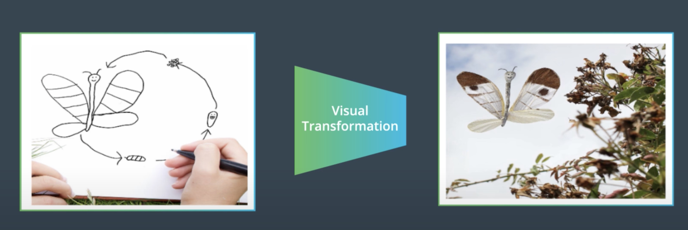
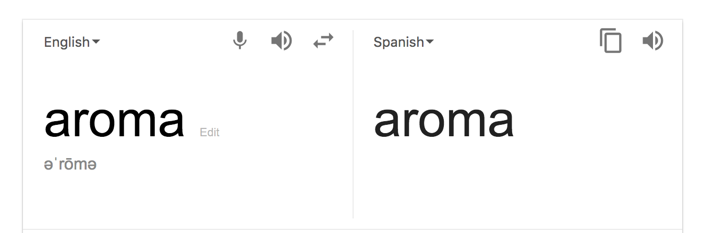

### Welcome to Image to Image Translation

**video**

Image to Image Translation means using GANs to map from one type of image to another type, to create a new image.

This lesson will focus on a particular image-to-image translation architecture, known as the CycleGAN model.

 Welcome to Image to Image Translation 

By the end of this lesson, you will be able to:

- Implement unpaired images dataloaders
- Build residual blocks and incorporate them in the CycleGAN generator
- Train a CycleGAN model on an image dataset

### Lesson Outline

**video**

In this lesson on Image to Image Translation, you will:

- Build Unpaired Images Dataloader
- Build the CycleGAN Generator
- Implement the CycleGAN Loss Function
- Train CycleGAN model

### Introduction to Jun-Yan Zhu

**video**

Jun-Yan Zhu is a professor of Computer Science and Machine Learning at Carnegie Mellon University and was a Postdoctoral Researcher at MIT Computer Science and Artificial Intelligence Laboratory (CSAIL). He is also one of the creators of CycleGAN.

Check out [MIT CSAIL's website](https://www.csail.mit.edu/) to look at the variety of research that is happening in this lab.

 A Hand Drawing to A Realistic Digital Image 

### Image to Image Translation

**video**

Generating new data is a challenging task; however, GAN models can learn something about the underlying structure of training data, to discern patterns that can be used to recreate images.

GANs can also be applied to Image to Image Translation.

- Image to Image Translation – takes an input image and produces a transformed image as output

#### Applications for Image to Image Translation

Deep learning and computer vision applications of image to image translation include:

- Semantic Segmentation - every pixel in the input image is labeled and classified
- Translating an image into a new domain with a desired property or feature

Pix2Pix and CycleGAN are two formulations of image to image translation that learn to transform an input image into a desired output and they can be applied to a variety of tasks.

##### Links to Related Work

- Ian Goodfellow's original paper on GANs
- Face swap with [CycleGAN Face-off](https://arxiv.org/pdf/1712.03451.pdf)

#### Designing Loss Functions

**video**

Objective Loss Functions

An objective function is typically a loss function that you seek to minimize (or in some cases maximize) during training a neural network. These are often expressed as a function that measures the difference between a prediction $\hat y$ and a true target y.

$$ \mathcal{L} (y, \hat y)$$

The objective function we've used the most in this program is [cross entropy loss](https://ml-cheatsheet.readthedocs.io/en/latest/loss_functions.html), which is a negative log loss applied to the output of a softmax layer. For a binary classification problem, as in real or fake image data, we can calculate the binary cross entropy loss as:

$$ -[y \log(\hat y) + (1 -y) \log (1 - \hat y)] $$

In other words, a sum of two log losses!

---
In the notation in the next video, you'll see that $ \hat y $ is the output of the discriminator; our predicted class.
---

### GANs, a Recap

**video**

#### Latent Space

Latent means "hidden" or "concealed". In the context of neural networks, a latent space often means a feature space, and a latent vector is just a compressed, feature-level representation of an image!

For example, when you created a simple autoencoder, the outputs that connected the encoder and decoder portion of a network made up a compressed representation that could also be referred to as a latent vector.

You can read more about latent space in [this blog post] as well as an interesting property of this space: recall that we can mathematically operate on vectors in vector space and with latent vectors, we can perform a kind of feature-level transformation on an image!

---
This manipulation of latent space has even been used to create an [interactive GAN, iGAN](https://github.com/junyanz/iGAN/blob/master/README.md) for interactive image generation! I recommend reading the paper, linked in the Github readme.
---

### Pix2Pix Generator

**video**

#### Pix2Pix resources

If you're interested in learning more, take a look at the [original Pix2Pix paper](https://arxiv.org/pdf/1611.07004.pdf). I'd also recommend this related work on creating high-res images: [high resolution, conditional GANs](https://tcwang0509.github.io/pix2pixHD/).

### Pix2Pix Discriminator

**video**

In the Pix2Pix architecture, there needs to be a way to associate an input image with its correct output image.

- The discriminator can be modified to measure the input and output
- Instead of identifying a single image as real or fake, it will look at pairs of input and output images and output a value for a real pair or fake pair
- This requires pair training data

#### Edges to Cats Demo

Try out Christopher Hesse's [image-to-image demo](https://affinelayer.com/pixsrv/) to get some really interesting (and sometimes creepy) results!

### CycleGANs & Unpaired Data
**video**

In practice, paired data is time-intensive and difficult to collect. In some cases, such as stylized images, paired data is impossible to get.

With unpaired data, there is no longer the ability to look at real and fake pairs of data - but the model can be changed to produce an output that belongs to the target domain.

- **Cycle Consistency Constraint** uses inverse mapping to accomplish this task

Many of the images in the video above are collected in the [Pix2Pix and CycleGAN Github repo](https://github.com/junyanz/pytorch-CycleGAN-and-pix2pix) developed by Jun-Yan.

And you can read the CycleGAN paper, [here](https://arxiv.org/pdf/1703.10593.pdf).

### Exercise 1: CycleGAN Dataloader

**udacity_deeplearning_nanodegree/4 GAN/3 Image to Image Translation/Exercise 1: CycleGAN Dataloader/CycleGan-Dataloader-Starter.ipynb**

### Exercise 1: Solution
**video**

### Cycle Consistency Loss

**video**

### Importance of Cycle Consistency

A really interesting place to check cycle consistency is in language translation. Ideally, when you translate one word or phrase from, say, English to Spanish, if you translate it back (from Spanish to English) you will get the same thing!

In fact, if you are interested in natural language processing, I suggest you look into this as an area of research; even Google Translate has a tough time with this. In fact, as an exercise, I want you to see if Google Translate passes the following cycle consistency test.

 Using an online translator for the word "aroma", from English to Spanish 

### Why Does This Work?
**video**

#### Model Shortcomings

As with any new formulation, it's important not only to learn about its strengths and capabilities but also, its weaknesses. A CycleGAN has a few shortcomings:

- It will only show one version of a transformed output even if there are multiple, possible outputs.
- A simple CycleGAN produces low-resolution images, though there is some research around [high-resolution GANs](https://github.com/NVIDIA/pix2pixHD)
- It occasionally fails!

### Exercise 2: CycleGAN Generator & Loss
**udacity_deeplearning_nanodegree/4 GAN/3 Image to Image Translation/Exercise 2: CycleGAN Generator & Loss/CycleGan-Generator-Loss-Starter.ipynb**

### Exercise 2: Solution
**video**

### Exercise 3: CycleGAN
**udacity_deeplearning_nanodegree/4 GAN/3 Image to Image Translation/Exercise 3: CycleGAN/CycleGAN_Starter.ipynb**

### Exercise 3: Solution
**video**

### Beyond CycleGANs

**video**

#### Additional Resources

For additional resources, check out the GitHub repository for Pix2Pix and CycleGAN formulations. The models are implemented in PyTorch and the repository belongs to Jun-Yan Zhu.

It's a great resource because it uses other datasets and shows the results.

- [Augmented CycleGAN](https://arxiv.org/abs/1802.10151)
- Implementation of [StarGAN](https://github.com/yunjey/StarGAN)

### When to Use Image to Image Translation

**video**

One of the challenges with deep learning based solutions is the amount of required data. It takes a significant amount effort and money to:

- Capture real data
- Clean real data
- Annotate real data

#### Alternative Data Sources

Another source for data is computer generated data or synthetic data. Synthetic data can be used to train models on tasks such as object detection or classification.

However, because synthetic images are still quite different from real images and model performance is usually not on par with models trained on real data.

The difference between the real and the synthetic domain is called domain gap.

### Lesson Review
**video**

This lesson focused on implementing Image to Image Translation and you accomplished a lot.

Over the course of this lesson you:

- Create unpaired image dataloaders
- Created an encoder-decoder generator using residual blocks
- Implemented CycleGAN loss functions
- Trained a CycleGAN model on the summer2winter yosemite dataset.

