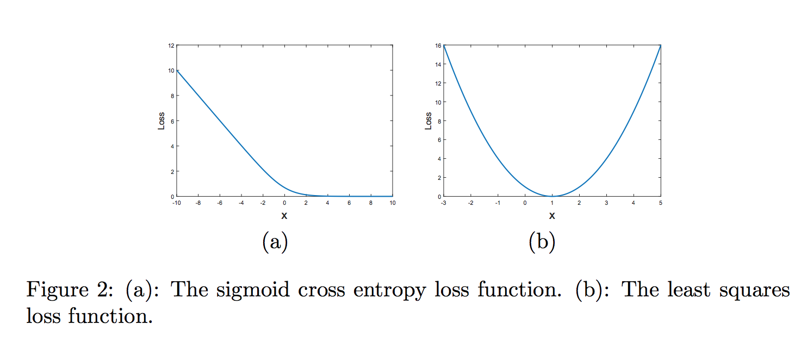
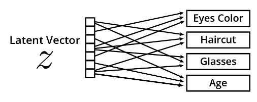
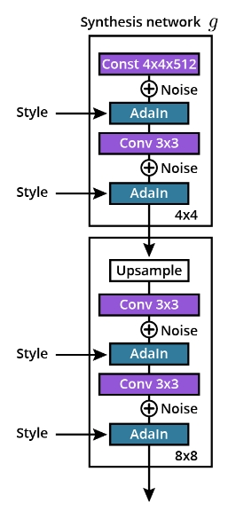

### Introduction to Modern GANs

**video**

Introduction to Modern GANs

In this lesson, we will cover how the GAN architectural paradigm has been rethought over the last few years. We will cover topics such as the:

- Wasserstein GAN architecture
- Gradients to improve GAN training stability
- Growing architectures generators and discriminators
- StyleGAN model

I am very excited about this lesson as you will learn about architecture and techniques at the edge of GAN research!


<p align="center"> Rethinking GAN Architecture </p>

### Lesson Outline

**video**

In this lesson on Modern GANs and Training Tips, you will:

- Use the Wasserstein Distance as a Loss Function for Training GANs
- Leverage Gradient Penalties to Stabilize GAN Model Training
- Build a ProGAN Model
- Build Components of a StyleGAN Model

### Limitations of the BCE Loss

**video**

The [original GAN paper](https://arxiv.org/pdf/1406.2661.pdf) already mentions some of the limitations of the BCE Loss, in the section 6 'Advantages and disadvantages'.


<p align="center"> The MiniMax Game </p>

This is the minimax game that you should be familiar with.

$$ E[\log (D(x))] + E[\log(1 - D(G(z)))] $$

- We have x, a sample from our real distribution, z the latent vector, our discriminator D, and our generator G.
- The discriminator tries to maximize this expression, which means maximizing the log probability of x being real and maximizing the log of the inverse probability of G(z) being real.
- The generator tries to minimize the log of the inverse probability of G(z) being real.
- It is more stable for the generator to maximize the log probability of G(z) being fake.

#### Challenges of Training GANs

The common problems with GANs are:

- Mode Collapse occurs when the generator only creates some of the modes of the real distribution.
- Vanishing Gradient occurs when the discriminator loss reaches zero and the generator is not learning anymore.


<p align="center"> Vanishing Gradients </p>

#### Addressing Vanishing Gradients

[Least squares (LSGANs)](https://arxiv.org/abs/1611.04076) can partly address the vanishing gradient problem for training deep GANs.

The problem is as follows:

- For negative log-likelihood loss, when an input x is quite big, the gradient can get close to zero and become meaningless for training purposes. However, with a squared loss term, the gradient will actually increase with a larger x, as shown below.


<p align="center"> Loss patterns for large x values. Image from the LSGAN paper  </p>

Least square loss is just one variant of a GAN loss. There are many more variants such as a [Wasserstein GAN loss](https://arxiv.org/abs/1701.07875) and others.

These loss variants sometimes can help stabilize training and produce better results. As you write your own code, you're encouraged to hypothesize, try out different loss functions, and see which works best in your case!

### Wasserstein Loss

**video**

To prevent mode collapse and vanishing gradient there is another loss function to train GANs:

- **The Earth Mover Distance or Wasserstein Metric** also referred to as Wasserstein Loss and Wasserstein Distance

The Wasserstein Loss is mathematically represented as follows:
$$ E[C(x)] -E[C(G(z))] $$

Similar to the BCE Loss, note that the logs have disappeared. Indeed the Wasserstein distance gets rid of the log function and only considers the probabilities.


<p align="center"> The Discriminator is now a Critic! </p>

With the Wasserstein distance the discriminator is called Critic.

The Critic:

- Does not discriminate between real and fake anymore but instead measures the distance between both distributions.
- Will try to maximize this expression.
- Wants to maximize the score of the real distribution and minimize the score of the fake distribution, which is similar to maximizing its inverse.

The generator will try to maximize the critic score of the fake distribution, which is similar to minimizing it with the flipped label.


<p align="center"> The Gradient of the Wasserstein Distance in Never Zero </p>

The WGAN minimax game is described by the formula above.

When training the critic C, we want to maximize the critic score on the real images x and minimize the critic score on the fake images G(z) which is similar to maximizing the inverse of C(G(z)).

When training the generator G, we want to maximize the score of the critic for the fake images.

#### 1-Lipschitz continuous

The 1-Lipschitz continuous is a new constraint on the discriminator or critic when using the Wasserstein distance as a loss function.

Defined mathematically:

For a function f, the following condition must be fulfilled: $ \lvert  \frac {df(x)} {dx}  \lvert \leq 1 $

Note: For the rest of the class, Critic and Discriminator will be used interchangeably to designate the Discriminator network.

##### Additional Resources

The [Wasserstein GAN](https://arxiv.org/pdf/1701.07875.pdf) (WGAN) paper is a little math-heavy but I recommend reading the paragraph on weight clipping on page 7 as well as the description of the WGAN algorithm on page 8.

### Gradient Penalties

**video**

##### Weight Clipping

In the WGAN paper, the authors explain that:

"Weight clipping is a clearly terrible way to enforce a Lipschitz constraint. If the clipping parameter is large, then it can take a long time for any weights to reach their limit, thereby making it harder to train the critic till optimality. If the clipping is small, this can easily lead to vanishing gradients when the number of layers is big, or batch normalization is not used (such as in RNNs). We experimented with simple variants (such as projecting the weights to a sphere) with little difference, and we stuck with weight clipping due to its simplicity and already good performance. However, we do leave the topic of enforcing Lipschitz constraints in a neural network setting for further investigation, and we actively encourage interested researchers to improve on this method."

#### WGAN Training Algorithm

To train the GAN:

- Sample from the real data and generate some fake samples
- Then calculate the Wasserstein Distance and the gradients at line 5.
- Line 6, we perform backpropagation using RMSprop, an optimization algorithm similar to stochastic gradient descent or Adam
- Enforce the weights to stay within a threshold of -0.01 and 0.01

```
#WGAN algorithm

1 while GAN has not converged:
2    # for each iteration
3    Sample a batch of real data
4    Sample a batch of fake data
5    Calculate the gradient gw
6    Backpropagation w ← w + ɑ RMSProp
7    w ← clip(w, -c, c)
```

In short, weight clipping works, but is not the best approach to enforce the Lipschitz constraint.
Gradient Penalties

The WGAN-GP paper introduced the concept of gradient penalty. In this paper, the authors add a new term to the new loss function that will penalize high gradients and help enforce the 1-Lipschitz constraint. Added to the Wasserstein Loss formula was the gradient penalty:

$$ \lambda E[{( {\lVert \Delta \hat x C(\hat x)) \lVert }_2 - 1)}^2]$$


<p align="center"> Gradient Penalty </p>

Calculating the gradient penalty also includes a bit of interpolation of the real and fake distribution:

- Randomly sample a coefficient 𝛼 of between 0 and 1
- Calculate the interpolation as: $\hat x =\alpha x+(1 - \alpha) G(z)$

#### Additional Resources

- For additional discussion regarding weight clipping in PyTorch, check out [How to do constrained optimization in PyTorch](https://discuss.pytorch.org/t/how-to-do-constrained-optimization-in-pytorch/60122).
- A great GitHub repository, [DCGAN-LSGAN-WGAN-GP-DRAGAN-Pytorch](https://github.com/LynnHo/DCGAN-LSGAN-WGAN-GP-DRAGAN-Pytorch), contains the implementation of various GANs with different gradient penalties. Reading the code is recommended as it will be helpful for the following exercises.

### Exercise 1: Wasserstein Loss Gradient

**udacity_deeplearning_nanodegree/4 GAN/4 Modern GANs/Exercise 1: Wasserstein Loss Gradient/Wasserstein_loss_gradient_penalty_Starter.ipynb**

### Exercise 1: Solution

**video**

### Progressive Growing of GANS
**video**

To make training even more stable, the ProGAN model was developed and the current resolution is 16x16.

##### How ProGAN works

- It adds a new layer to the generator and a new layer to the discriminator by fading the layers in smoothly.
- In the generator, the resolution of the 16x16 layer is doubled using an interpolation method such as nearest neighbor. The output of the 32x32 layer is then fused with this interpolated output.
- In the discriminator, the output of the 32x32 layer is fused with a downsampled image.
- A pooling method such as average pooling is used for downsampling.


<p align="center"> ProGAN Progressively Adds Layers At Higher Resolutions </p>

In both cases, perform a weighted sum of the learned output of the new layer with the non-parametric output of the previous layer.

Slowly increase the weight of the output of the new layer over 10 epochs to reach a stage where there is no need to fade that layer anymore.

Then train the network at the 32x32 resolution for another 10 epochs.

##### Layer Fading

For more stable training, layer fading is a way to incorporate new layers. Consider the following example:


<p align="center"> Layer Fading </p>

1. Training a ProGAN model and the current resolution is 16x16. The toRGB layer maps the output of the last convolution to an RGB image and the from RGB layer takes a RGB image as input and feeds it into the next convolution layer.
2. To increase the resolution to 32x32 use layer fading. Add a new layer to the generator and the discriminator by doubling the resolution of the 16x16 layer using an interpolation method such as nearest neighbor.
    - In the generator, fuse the output of the 32x32 layer with the interpolated output.
    - In the discriminator, fuse the output of the 32x32 layer with a downsampled image and use a pooling method such as average pooling for downsampling.
3. For both cases, perform a weighted sum of the learned output of the new layer with the non parametric output of the previous layer. Slowly increase the weight of the output of the new layer over 10 epochs to reach a stage where a fade is not needed in that layer.
4. Train the network at the 32x32 resolution for another 10 epochs

##### ProGAN Tricks

- Progressive Growing – Progressively train layers and increase resolution
- Minibatch Discrimination – Enforce fake and real batches to have similar statistics
- Equalized Learning Rates – Scale the weights of each layer by a different constant to make sure the layers are learning at the same speed
- Pixelwise Normalization – Normalize each pixel of a feature map along the channel axis

##### Additional Resources

[The ProGAN paper](https://arxiv.org/pdf/1710.10196.pdf), Progressive Growing GANs for Improved Quality, Stability, and Variation, is very accessible and I recommend reading it to better understand the different components of ProGAN.

Other resources for implementing ProGAN include the following links:

- [Official ProGAN implementation in TensorFlow](https://github.com/tkarras/progressive_growing_of_gans)
- [ProGAN implementation in PyTorch (unofficial)](https://github.com/akanimax/pro_gan_pytorch)

### ProGAN components

### ProGAN

In addition to the progressive growing of networks, the [ProGAN paper](https://arxiv.org/pdf/1710.10196.pdf) has a couple of additional novel ideas: pixelwise normalization and minibatch standard deviation.

#### Pixelwise normalization

You are familiar with batch normalization and you may be familiar with other type of normalization, as described in the figure below.


<p align="center"> From the paper, Group Normalization </p>

[Group Normalization](https://arxiv.org/pdf/1803.08494.pdf)

C is the channel dimensions, N the batch dimension and H,W the spatial dimensions. For example, for a batch normalization layer, we calculate mean and variance over the batch and spatial dimensions, so we have a pair of (mean, variance) values for each channel.

With pixel normalization, we normalize each pixel of the input volume as follow:

```
y = x.pow(2.0).mean(dim=1, keepdim=True).add(alpha).sqrt() 
x = x / y
```

where x is the input volume of dimensions (NCHW). We square the input volume, calculate the mean over the channel dimension, add a very small factor alpha and calculate the square root.

##### Minibatch Standard Deviation

The paper, [Improved Techniques for Training GANs](https://arxiv.org/pdf/1606.03498.pdf), introduced the concept of minibatch discrimination, to enforce similarities between batches of real and fake images.

In the ProGAN paper, the authors simplify this idea by introducing **minibatch standard deviation**. They create a new layer that adds a feature map to the input. This layer does the following:

- calculate the standard deviation for each feature and spatials locations
- replicate the value and concatenate it over all spatial locations

```
def minibatch_stddev_layer(x, group_size=4):
    with tf.variable_scope('MinibatchStddev'):
        group_size = tf.minimum(group_size, tf.shape(x)[0])     # Minibatch must be divisible by (or smaller than) group_size.
        s = x.shape                                             # [NCHW]  Input shape.
        y = tf.reshape(x, [group_size, -1, s[1], s[2], s[3]])   # [GMCHW] Split minibatch into M groups of size G.
        y = tf.cast(y, tf.float32)                              # [GMCHW] Cast to FP32.
        y -= tf.reduce_mean(y, axis=0, keepdims=True)           # [GMCHW] Subtract mean over group.
        y = tf.reduce_mean(tf.square(y), axis=0)                # [MCHW]  Calc variance over group.
        y = tf.sqrt(y + 1e-8)                                   # [MCHW]  Calc stddev over group.
        y = tf.reduce_mean(y, axis=[1,2,3], keepdims=True)      # [M111]  Take average over fmaps and pixels.
        y = tf.cast(y, x.dtype)                                 # [M111]  Cast back to original data type.
        y = tf.tile(y, [group_size, 1, s[2], s[3]])             # [N1HW]  Replicate over group and pixels.
        return tf.concat([x, y], axis=1) 
```

The code above is taken from the [original implementation in TensorFlow](https://github.com/tkarras/progressive_growing_of_gans/blob/master/networks.py#L127) but the PyTorch version is very similar.

Note how the authors are calculating the standard deviation per group of 4 pixels here.

This new layer is added only in the discriminator obviously and towards the end of the network.

### Exercise 2: ProGAN

**udacity_deeplearning_nanodegree/4 GAN/4 Modern GANs/Exercise 2: ProGAN/ProGAN_Starter.ipynb**

### Exercise 2: Solution

**video**

### StyleGAN: Introduction

**video**

Deep learning is a somewhat recent field and many consider the 2012 AlexNet paper as the starting point of the deep learning revolution. The progress in creating realistic generated images is most exemplified by the StyleGAN paper in 2019 as it was the first architecture to produce very high-quality samples.


<p align="center"> Traditional Generator </p>

#### The Traditional Generator

For a traditional generator:

- We input a latent vector z
- Run it through a bunch of fully connected, convolution and normalization layers
- Get a generated RGB image

#### The StyleGAN Generator

For the StyleGAN generator:

1. There is a new network, only made of fully connected layer, the mapping network, and it is taking the latent vector and outputs a new latent vector w.
2. Add noise at multiple places in the network, always after the convolution layers.
3. StyleGAN uses a new type of normalization layer, the adaptive instance normalization layer, or AdaIn.

Next, we will dissect each one of these new components and understand how they were leveraged to create such high quality images.


<p align="center"> StyleGAN Architecture </p>

##### Additional Resources

[The StyleGAN paper](https://arxiv.org/pdf/1812.04948.pdf), A Style-Based Generator Architecture for Generative Adversarial Networks [1], is worth reading to explore the full details of the architecture. The images shown here are from the StyleGAN paper referenced.

### StyleGAN Components 1
**video**

##### Controllable Generation

Conditional Generation indicates that the training set must be labeled and conditioning is limited to examples from the training set.

- Conditional Generation – each image is conditioned with a label (e.g. MNIST dataset).

For example, fake 11s can not be generated with a conditional GAN trained on the MNIST dataset because the data set only includes digits in the range of 0 to 9.

[Conditional Generative Adversarial Nets](https://arxiv.org/pdf/1411.1784.pdf) introduced the conditional GAN. An example of conditional implementation in PyTorch here. Conditional GANs have an extra input from the discriminator and generator networks.

For controllable generation, instead of inputting a label to condition the output, the latent vector z is modified to control the aspect of the output. This makes the assumption that the components of z each control a different aspect of the output image.

- Controllable Generation – does not require labels.

##### The Mapping Network

The mapping network is a new component of the StyleGAN generator. A mapping network:

- Takes the latent vector z as input
- Outputs a new latent vector w
- Helps to disentangle the latent vector z for controllable generation.


<p align="center"> StyleGAN: Mapping Network </p>

##### The Entanglement Problem

When modifying some components, we impact more than one feature. This is the entanglement problem.

For example in trying to generate faces, features could include:

- Haircut
- Eye color
- Glasses
- Age


<p align="center"> The Entanglement Problem </p>

If the features are entangled, putting glasses on a person could also make them older.

Mapping network to the rescue! By mapping the vector z to another vector w, the generator gets the capacity to disentangle features.

##### Noise Injection

Another new component of StyleGAN is the injection of noise at different locations in the generator. This noise injection will:

- Help with stochastic variation! Injecting noise in the network will help create more diverse features.
- Happen at different locations in the network and impacts the variability of the images at different levels.

To add noise:

1. A random feature map is sampled from a gaussian distribution
2. The map is multiplied by a learned scaling factor
3. This noise is applied to the output of the convolutional layers


<p align="center"> Noise Injection </p>

### SyleGAN Components 2
**video**

All Normalization Layers calculate the mean and the variance of a certain subset and normalize the input.

Remember, for Batch Normalization, we:

1. Calculate the mean and variance of the batch and spatial dimensions
2. For each channel of the inputs, there are different values of means and variance

##### Instance Normalization Layer

The Instance Normalization Layer – only normalizes over the spatial dimensions and each input has a number of channels times the batch size values of means and variance.


##### Adaptive Instance Normalization Layer

The **Adaptive Instance Normalization Layer** (Adaln):

1. Takes the latent vector, w, as input and using a fully connected layer, projects that vector into two vectors of style, ys and yb
2. The output of the previous layer goes through an Instance Normalization Layer
3. Use the styles ys and yb to scale and bias the output of the Instance Normalization Layer
4. Allows one to project the latent vector w into the styles and inject the styles into the generator

Style Mixing injects a different vector w at different places in the network and provides a regularization effect. This prevents the network from assuming that adjacent styles are correlated.


<p align="center"> Adaptive Instance Normalization (AdaIn) Layer </p>

##### Style Transfer

In practice, Adaln layers allow for the creation of a new image (c) by taking a first image (a) and modifying it in the style of a second image (b). A popular example is taking the image of the Mona Lisa (a) and the style of a Picasso painting (b) and creating a new Mona Lisa in Picasso style image (c). This image can be seen [here](https://www.deviantart.com/dr-koesters/art/Neural-Style-Transfer-Mona-Lisa-by-Picasso-733533838) and this process is known as style transfer.

The initial process of style transfer was time consuming; however, check out the paper, [Arbitrary Style Transfer in Real-time with Adaptive Instance Normalization](https://arxiv.org/pdf/1703.06868.pdf), which details a use case for how Adaln layers may be implemented to create fast style transfers based on arbitrary styles.

### Exercise 3: StyleGAN
**udacity_deeplearning_nanodegree/4 GAN/4 Modern GANs/Exercise 3: StyleGAN/StyleGan_Starter.ipynb**

### Exercise 3: Solution
**video**

### When to Use Modern GAN Techniques

**video**

Starting with a simpler architecture is always an easy and fast way to get started on a new problem.

- DCGAN is great starting point
- ProGAN or StyleGAN are practical when training on high resolution images
- Wasserstein Loss and Gradient Penalties experimentation is recommended when mode collapse or vanishing gradient are observed

##### Additional Resources

One of my favorite blog posts ever: [A recipe for training neural networks](http://karpathy.github.io/2019/04/25/recipe/). A great read and most concepts are applicable to GANs.

### Lesson Review
**video**

We have completed this lesson on implementing Modern GAN modeling techniques and you have accomplished a lot.

Over the course of this lesson you:

- Used the Wasserstein Distance as a Loss Function for Training GANs
- Leveraged Gradient Penalties to Stabilize GAN Model Training
- Built a ProGAN Model
- Built Components of a StyleGAN Model

Citations

Following are the full citations for the papers referenced on this page:

- I. Goodfellow, J. Pouget-Abadie, M. Mirza, et al, "Generative Adversarial Nets", Departement d’informatique et de recherche operationnelle Universite de Montreal [Online], Available: https://arxiv.org/pdf/1406.2661.pdf. [Accessed June 28, 2022].
- X. Mao, Q. Li, H. Xie, R. Y.K. Lau, et al, "Least Squares Generative Adversarial Networks", Department of Computer Science, City University of Hong Kong, Department of Mathematics and Information Technology, The Education University of Hong Kong, et al [Online], Available: https://arxiv.org/pdf/1611.04076.pdf. [Accessed June 28, 2022].
- M. Arjovsky, S. Chintala, and L. Bottou, "Wasserstein GAN", Courant Institute of Mathematical Sciences, Facebook AI Research [Online], Available: https://arxiv.org/pdf/1701.07875.pdf. [Accessed June 28, 2022].
- I. T. Karras, T. Aila, S. Laine, J. Lehtinen, "Progressive Growing GANs for Improved Quality, Stability, and Variation", NVIDIA, Aalto University [Online], Available: https://arxiv.org/pdf/1710.10196.pdf. [Accessed June 28, 2022]
- Y. Wu, K. He, "Group Normalization", Facebook AI Research (FAIR) [Online], Available: https://arxiv.org/pdf/1803.08494.pdf. [Accessed June 28, 2022].
- T. Salimans, I. Goodfellow, W. Zaremba, et al, "Improved Techniques for Training GANs", OpenAI [Online], Available: https://arxiv.org/pdf/1606.03498.pdf. [Accessed June 28, 2022].

### Course Summary
**video**

Congratulations

You have completed this course. We covered a number of topics and you implemented a broad variety of techniques, including:

- Building and training a simple GAN model on the MNIST dataset
- Building a more complex DCGAN and implementing GAN evaluation metrics
- Using dataloaders and implementing functions to train a CycleGAN model
- Implementing gradient penalties to execute ProGAN and StyleGAN models

Congratulations again and we can't wait to see what innovative computer-generated images you create.


