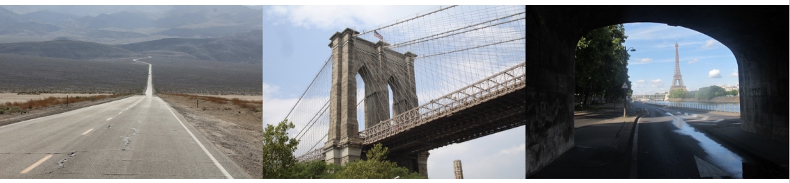

### Intro to CNNs

**video**

### Convolutional Neural Networks (CNNs)

A CNN is a neural network developed specifically for image and video processing. CNNs are used to automate many tasks, for example:

- Image classification
- Object recognition
- Anomaly detection
- Image captioning

... and many others. They are widely used across many industries, including medicine, banking, manufacturing, insurance, real-estate, transportation (self-driving cars), and social networks.

CNNs are arguably the main technology responsible for the Artificial Intelligence renaissance we are witnessing today, with billion of dollars in revenue generated by their application.

We are very excited for you to be here with us and to learn about this invaluable technology!

### Course Outline

**video**

### Course Overview

- Introduction to CNNs and basic concepts
    - Use Multi-Layer Perceptrons (MLPs) for image classification
    - Understand the limitations of MLPs for images and how CNNs overcome them
    - Learn basic concepts of CNNs and what makes them so powerful for image tasks
- CNNs in more depth
    - Learn all the basic layers that make up a CNN
    - Put all the basic layers together to build a CNN from scratch
    - Classify images using CNNs
    - Use various methods to improve CNN performance
    - Export models for production
- Transfer learning
    - Understand key innovative CNN architectures
    - Implement transfer learning using a pre-trained network to classify different sets of images
    - Fine-tune a pre-trained network on a new dataset
- Autoencoders
    - Explain the functionality of autoencoders for data compression, image denoising, and dimensionality reduction
    - Build a simple autoencoder out of linear layers to perform anomaly detection
    - Build CNN autoencoders to perform anomaly detection and image denoising
- Object detection and segmentation
    - Describe object detection, object localization, and image segmentation.
    - Train and evaluate a one-stage object detection model to detect multiple objects in an image.
    - Train and evaluate a semantic segmentation model to classify every pixel of an image.

### Prerequisites

#### Who Should Take This Course

This course is intended for a student who is at least somewhat familiar with the basic concepts of elementary neural networks, and has good experience with Python programming.

#### What You Should Already Know

Python

- Variables
- Loops
- Conditionals
- Functions
- Object-Oriented Programming, Classes

Experience with the Python scientific stack (NumPy, Matplotlib...) is going to be useful.

For the class we will be extensively using [Jupyter Notebooks](https://tacc.github.io/CSC2017Institute/docs/day1/jupyter.html).

#### Machine Learning
- [Loss function and gradient descent](https://machinelearningmastery.com/gradient-descent-for-machine-learning/)
- Train / validation / test split
- [Neural Networks](https://machinelearningmastery.com/neural-networks-crash-course/): We will recap these basic concepts, but some previous understanding of these concepts is required:
    - Perceptrons and Multi-Layer Perceptrons (MLP)
    - Activations and functions (ReLU, softmax…)
    - Training a neural network
    - Overfitting and underfitting
    - Forward pass, backpropagation
    - Regularization and [DropOut](https://machinelearningmastery.com/dropout-for-regularizing-deep-neural-networks/)

### PyTorch

We will briefly review all these concepts, but some previous familiarity with them will be helpful:

- Datasets and dataloaders
- Common loss functions
- Training, validation, and test loops
- Multi-Layer Perceptrons in PyTorch

### Business Stakeholders

**video**

### Summary

If you use CNNs to power a real product in a real-world setting, you are going to interact with several different profiles:

- Data Scientist / Machine Learning Engineer: Responsible for developing the ML pipeline and the model, as well as performing all the relevant analytics - for example on data quality and performance measurements.

- Data Engineers: Responsible for the data ingestion pipelines, the quality of the data that the DS/MLE receive, and for provisioning the right data at inference time.

- Software Engineers: Responsible for the production environment, both front-end and back-end, as well as for many pieces of the MLOps infrastructure. Involve them from the beginning to make sure that the model you are producing can fit into the production environment.

- DevOps Engineers: Help in handling the infrastructure, including training servers, various MLOps tools, and other infrastructure needed to train and deploy a model.

- Product Managers: Define the right problem to solve, exploit the knowledge of the customers, and define quantifiable deliverables and success criteria for the project. The PM also helps in keeping the project on time and on budget.

- Customers: Consumer of the product; we should always consider the customers' and users' perspectives for every decision that we make.

### History of CNNs

**video**

### Summary

A brief history of CNNs:

- [Perceptron (1958)](https://news.cornell.edu/stories/2019/09/professors-perceptron-paved-way-ai-60-years-too-soon): A one-neuron primitive neural network capable of classifying linearly-separable datasets.
- [Neocognitron (1980)](https://en.wikipedia.org/wiki/Neocognitron#:~:text=The%20neocognitron%20is%20a%20hierarchical,inspiration%20for%20convolutional%20neural%20networks.): A neural network using two types of mechanisms that are the basis of modern CNNs: convolution and pooling.
- [Backpropagation (1986)](https://en.wikipedia.org/wiki/Backpropagation#History): Allows training of neural networks end to end based on data.
- [Multi-Layer Perceptron (1986)](https://en.wikipedia.org/wiki/Multilayer_perceptron): The first proper neural network in the modern sense, theoretically capable of modeling any function.
- [LeNet-5 (1998)](http://yann.lecun.com/exdb/lenet/): The first proper Convolutional Neural Network with practical application, used to model handwritten digits obtaining an accuracy of almost 99%. This seminal work sparked a new renaissance of work on Convolutional Neural Networks for image recognition.
- [ImageNet (2010-2017)](https://qz.com/1034972/the-data-that-changed-the-direction-of-ai-research-and-possibly-the-world/): A competition with the goal of modeling with the largest possible accuracy a large dataset of more than 1 million natural images classified into 1000 classes.

The ImageNet competition spawned several innovations, starting with AlexNet, the first CNN to win the contest. AlexNet won in 2012 by a huge margin, when the runners-up were still trying to use classical computer vision methods. After 2012, every team in the competition used Convolutional Neural Networks.

Since then, the performance on the ImageNet dataset has continued improving at a very fast pace. Most of the architectures from around 2012 - 2020 were based exclusively on Convolutional Neural Networks. After that, a different class of neural network called Transformers started to conquer the top of the rankings. These days the most accurate architectures such as ViT and CoAtNet use a mix of CNN and Transformer elements. Many of these architectures also use additional data.

CNNs however are still the workhorses for real-world applications of neural networks on images, because they can achieve very good performances while requiring orders of magnitude less data and compute than pure Transformers.

### Tools & Environment

**video**

### Summary

All the software that you need to complete the exercises and develop your final project is pre-installed in the Udacity workspaces here in your classroom.

If you want to run something locally, every exercise and the project come with a file (requirements.txt) which contains all the dependencies that you need to install. You can install them in your Python environment by issuing the command: pip install -r requirements.txt.

In many cases you will need a GPU to complete the exercises and the project with reasonable execution times. The Udacity workspace we provide in your classroom comes with a GPU that you can opt to use. If instead you want to run locally, you will need to install all the relevant software needed for your GPU to work with PyTorch. You can find some instructions [here](https://pytorch.org/get-started/locally/).

### Project Preview

**video**

### Summary

In the final project, you will classify landmarks in images uploaded to a social network, in order to localize the images.

You will be given the dataset containing the images and their label (the landmark contained in the image). You will train two CNNs: one that you will design from scratch, and a standard one that you will fine-tune on the dataset. You will also build a little app, powered by your best model.

