### Lesson Outline

In this lesson we are going to learn the general concepts underlying Convolutional Neural Networks (CNNs), and how they relate to the neural networks you already know, Multi-layer Perceptrons (MLPs).

We will start by applying MLPs to the images of a very famous computer vision dataset, then see the limitations of MLPs when it comes to images.

We'll then learn how Convolutional Neural Networks solve these limitations, allowing them to outperform MLPs for all image tasks.

Finally, we will introduce at a high level the conceptual underpinnings of CNNs that make them so powerful and useful.

**video**

### MNIST Dataset

**video**

### Image Classification and the MNIST Dataset

Classifying an image means assigning one label to the entire image. The label could be for example the most prominent object in the image ("cat," "dog,"...), or a characteristic of the image ("cloudy sky," "sunny sky,"...).

The MNIST database is arguably the most famous dataset in the field of deep learning. It contains 70,000 handwritten digits 0-9 in white over a black background, and the task is to classify each image by assigning it the label corresponding to the depicted number.

It is nowadays considered a solved problem, with modern neural networks having performances that are on par or better than human performances and over 99.9% accurate. However, it is still widely used for tutorials and in the literature as the first, most obvious benchmark for new ideas.

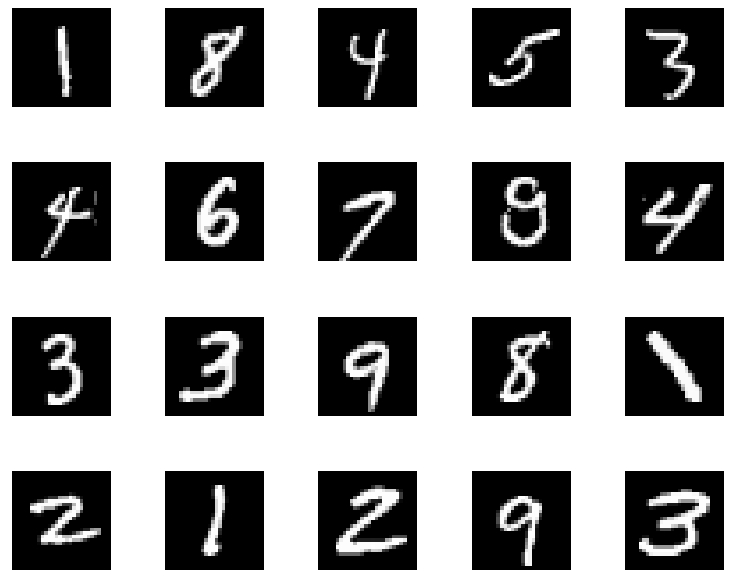

### How Computers Interpret Images

**video**

### Definitions

Before continuing, let's define some of the terms that we are going to use:

- Vector - an array of numbers with only one dimension
- Matrix - an array of numbers with two dimensions
- Array or tensor - two interchangeable generic terms which can mean arrays with one, two, or n dimensions

### Computer Interpretation of Images

An image is seen by the computer as an array of values (a matrix).

The images in the MNIST dataset are 28 x 28 and 8-bit grayscale. This means that the computer represents each one of them as a square matrix of 28 x 28 elements, where the value in the element of the matrix represents the light intensity with a range of 0 to 255: 0 means pure black and 255 means pure white.

### Classification with Neural Networks

We already know how to perform classification with neural networks, and in particular with a Multi-Layer Perceptron. This network takes as input a grayscale image (a matrix) and outputs a vector of scores or a vector of probabilities (one for each class). The class corresponding to the maximum of that vector corresponds to the best guess for the label of the image.

### Flattening

Suppose we want to use an MLP to classify our image. The problem is, the network takes a 1d array as input, while we have images that are 28x28 matrices. The obvious solution is to flatten the matrix, i.e., to stack all the rows of the matrix in one long 1d vector, as in the image below.


#### Quiz Question

- In the case of our 28 x 28 image, how many entries will the corresponding image vector have when this matrix is flattened? 
    - 784

### Normalizing Image Inputs

Data normalization is an important pre-processing step for neural networks. The activation functions that are normally used in neural networks (sigmoid, ReLU, etc.,...) have the highest rate of change around 0:

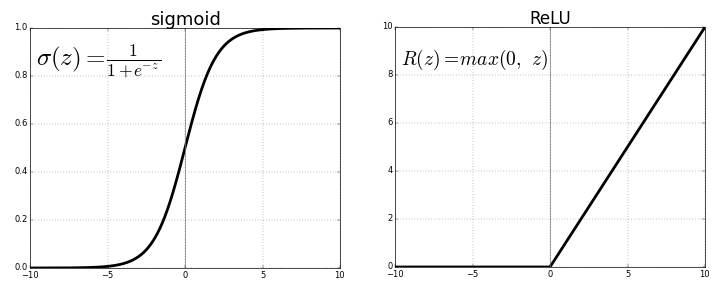

This means that their derivative is large for inputs that are not too far from 0. Since we train neural networks with gradient descent, the training can proceed faster if the weights stay in the vicinity of where the activation function changes rapidly, i.e., close to 0.

The weights of a neural network are typically initialized with a mean of 0, i.e., some weights are negative and some are positive, but they are in general between -1 and +1, close to 0. Remember that these weights are multiplied with the feature values (in this case the pixel values) and then a bias is added on top before the result is fed to the activation function.

Therefore, if we want the input of the activation function to be somewhere close to 0, we need to start with a number that is close to zero, because two numbers close to zero multiplied together give another number close to zero.

So we need to take the pixels in the input image, which in the case of a grayscale image have values between 0 and 255, and renormalize them to be close to zero.

The easiest way is to just divide the value by 255, thereby changing the pixel values to be between 0 and 1.

In many cases, we go further than that: we compute the mean and the standard deviation of all the pixels in the renormalized dataset, then we subtract the mean and divide by the standard deviation for each image separately. Therefore, our transformed data will contain both negative and positive pixels with mean 0 and standard deviation 1. Sometimes you'll see an approximation here, where we use a mean and standard deviation of 0.5 to center the pixel values. If you'd like, you can [read more here about the Normalize transformation in PyTorch](https://pytorch.org/docs/stable/).

### MLP Structure and Class Scores

#### MLP for Images
**video**

### A Multi-Layer Perceptron for MNIST

The input of our MLP must obviously be 28 x 28=784, which corresponds to the dimension of the flattened image. The output of the MLP must also be obviously a vector with 10 elements (one for each class). The values in this vector are proportional to the probability that the network assigns to each class. So if the network thinks that it is most likely that the given image is an 8, then the element in the array corresponding with 8 should be the largest. But what goes between the input and the output? How many hidden layers, and how many neurons?


#### Quiz Question

- What is the appropriate size for the input and for the output of an MLP for MNIST classification? Drag your answer to the appropriate row. For example if your answer for the input is 1, drag 1 to the "input size" row.
    - What is the input size for the vector going in an MLP to classify an MNIST image? 784
    - What is the size of the output array for an MLP to classify an MNIST image? 10

### Loss and Optimization

**video**

### Loss Function

The loss function quantifies how far we are from the ideal state where the network does not make any mistakes and has perfect confidence in its answers.

Depending on the task and other considerations we might pick different loss functions. For image classification the most typical loss function is the Categorical Cross-Entropy (CCE) loss, defined as:

$$  CCE = - \sum_{i=1}^{n_{classes}} y_i \log{\hat {p_i}}$$
<p align="center"> Categorical Cross Entropy Loss </p>

where:

- The sum is taken over the classes (10 in our case)
- $y_i$ is the ground truth, i.e., a one-hot encoded vector of length 10
- $p_i$ is the probability predicted by the network

---
**NOTE**
 In PyTorch it is customary to have the network output class scores (or logits) instead of probabilities like in other frameworks. Then, the PyTorch loss function itself will first normalize the scores with a Softmax function, and then compute the CCE loss.
---

### Gradient Descent

The values of the weights and the biases in the MLP are optimized by using Gradient Descent (or more precisely Stochastic Gradient Descent or SGD for short), or similar algorithms such as [Adam](https://optimization.cbe.cornell.edu/index.php?title=Adam). SGD takes the derivative of the loss with respect to the weights and then updates the values of the weights so as to decrease the loss as quickly as possible.

### Loading Data and Transforming Images in PyTorch

#### Loading Images in PyTorch

##### Transforms

Before we can feed images to a neural network, there are some operations we must perform. As we have seen before, we need to normalize the images so the values in the pixels are floating point numbers between 0 and 1, or -1 and 1, instead of values from 0 to 255 as in the RGB format. We also need to transform them to PyTorch Tensors, so our network can handle them.

In many cases we also want to augment our dataset by performing random transformations, but more on this in a later lesson.

For the moment, let's see how to normalize the images and transform them to tensors:

```python
import torchvision.transforms as T

## T.Compose creates a pipeline where the provided
## transformations are run in sequence
transforms = T.Compose(
    [

        # This transforms takes a np.array or a PIL image of integers
        # in the range 0-255 and transforms it to a float tensor in the
        # range 0.0 - 1.0
        T.ToTensor(),

        # This then renormalizes the tensor to be between -1.0 and 1.0,
        # which is a better range for modern activation functions like
        # Relu
        T.Normalize((0.5), (0.5)),
    ]
)
```

In many real-world datasets we also need some other operations like resizing, which we will see later.

##### Datasets

PyTorch offers dataset and dataloaders specific for images and their annotations.

A Dataset instance provides methods to load and manipulate the data, whereas a DataLoader instance wraps the dataset and allows iterations over it during training, validation, and test.

It is possible to define custom datasets when needed, but the torchvision library offers specific classes inheriting from the base Dataset class for all major computer vision datasets. You can find a list of these datasets [here](https://pytorch.org/vision/stable/datasets.html#image-classification). For example, you can load the MNIST dataset just by doing:

```python
train_data = datasets.MNIST(
    root="data", train=True, download=True, transform=transforms
)

test_data = datasets.MNIST(
    root="data", train=False, download=True, transform=transforms
)
```

torchvision also offers an ImageFolder class that can be used to extract images and labels directly from a local directory.

You have to structure your data in the following way:

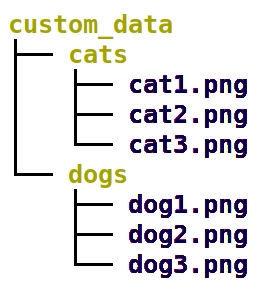

We need a top-level directory with the name of your dataset (custom_data in this case). Then, we need one or more subdirectories representing the classes. In this case we have a dataset of cats and dogs, and accordingly we have two subdirectories with the same name. Within each subdirectory we place the images belonging to that class.

The ImageFolder dataset class can auto-probe the classes (by using the names of the subdirectories) and can assign each image to the right class by looking into which subdirectory the image is placed.

This is how to use the ImageFolder class:

```python
from torchvision import datasets

train_data = datasets.ImageFolder(
  "/data/custom_data",
  transform=transforms
)
```

##### Dataloaders

A dataloader allows sequential or random iterations over a dataset or over a subset of a dataset.

For example, a dataloader for MNIST can be obtained as follows:

```python
train_data = datasets.MNIST(
    root="data", train=True, download=True, transform=transforms
)

train_loader = torch.utils.data.DataLoader(
  dataset=train_data, 
  shuffle=True, 
  batch_size=batch_size,
  num_workers=num_workers
)
```

The parameter batch_size indicates the size of the mini-batch for Stochastic Gradient Descent, while num_workers indicates the number of processes that PyTorch should use to load the data. It is important to be able to feed the GPU with enough data to keep it busy, otherwise the training will be slow. By using several processes that are reading data in parallel, PyTorch can increase the GPU usage and the speed of training. A good rule of thumb is to use a number of workers equal to the number of CPUs on the current machine:

```python
import multiprocessing

n_workers = multiprocessing.cpu_count()
```
Once you have a dataloader, you can easily loop over all the data one batch at a time:

```python
for image_batch, label_batch in train_loader:
    ... do something ...
```
If all you want to do is obtain the next batch, then:

```python
## Get an iterator from the dataloader
dataiter = iter(train_loader)
## Get the next batch
image_batch, label_batch = dataiter.next()
```
##### Splitting Train and Validation Data

It is typical to extract a validation set from the training data, for things like hyperparameter optimization and to prevent overfitting by monitoring the relationship between train and validation loss. We also reserve a test set for testing after the model development has finished.

It is easy to split a dataset using PyTorch:

```python
## Let's keep 80% of the training data for training
train_len = int(len(trainval_data) * 0.8)

## Let's use the remaining for validation
val_len = len(trainval_data) - train_len

## Perform a random split of the train dataset
train_subset, val_subset = torch.utils.data.random_split(
    trainval_data, [train_len, val_len]
)

## Now we can use the subsets as normal datasets
train_loader = torch.utils.data.DataLoader(
    dataset=train_subset, shuffle=True, batch_size=batch_size, num_workers=num_workers
)

val_loader = torch.utils.data.DataLoader(
    dataset=val_subset, shuffle=False, batch_size=batch_size, num_workers=num_workers
)
```

### Defining a Network in PyTorch
**video**

### Recap of the Structure of a Neural Network in PyTorch

A model in PyTorch is implemented as a class with at least two methods: the __init__ method and the forward method.

The __init__ method should initialize all the layers that the model uses, while the forward method implements a forward pass through the network (i.e., it applies all the layers to the input). Note that the backward pass for backpropagation is executed by PyTorch [automatically](https://pytorch.org/tutorials/beginner/blitz/autograd_tutorial.html) and does not need to be implemented.

So a typical model in PyTorch looks like this:

```python
import torch
import torch.nn as nn

class MyModel(nn.Module):

  def __init__(self):

    super().__init__()

    # Create layers. In this case just a standard MLP
    self.fc1 = nn.Linear(20, 10)
    self.relu1 = nn.ReLU()

    self.fc2 = nn.Linear(10, 3)

  def forward(self, x):

    # Call the layers in the appropriate sequence
    x = self.fc1(x)
    x = self.relu1(x)

    x = self.fc2(x)

    return x
```

Remember that at any time you can call your model like this:

```python
# Make up some data
x = torch.rand(20)

m = MyModel()
out = m(x)
```

This is useful when developing your own architecture because you can verify that the model runs (for example, you got all the shapes right) and also you can check the shape of the output.

#### Using nn.Sequential

When the network is just a simple sequential application of the different layers, you can use nn.Sequential, which allows saving a lot of boilerplate code. For example, the previous network can be written as:

```python
import torch
import torch.nn as nn

class MyModel(nn.Module):

  def __init__(self):

    super().__init__()

    # Create layers. In this case just a standard MLP
    self.model = nn.Sequential(
      nn.Linear(20, 10),
      nn.ReLU(),
      nn.Linear(10, 3)
    )

  def forward(self, x):

    # nn.Sequential will call the layers 
    # in the order they have been inserted
    return self.model(x)
```

In fact, when creating a network like this, we can skip the definition of a custom class and just use nn.Sequential like this:

```python
model = nn.Sequential(...)
```

The first method (defining a custom class) is more flexible and allows the use of architectures that are not strictly sequential. Therefore, we will use it throughout this class. However, the second abbreviated form is useful in many real-world circumstances.

### ReLU Activation Function

The purpose of an activation function is to scale the outputs of a layer so that they are consistent, small values. Much like normalizing input values, this step ensures that our model trains efficiently!

A ReLU activation function stands for "Rectified Linear Unit" and is one of the most commonly used activation functions for hidden layers. It is an activation function, simply defined as the positive part of the input, x. So, for an input image with any negative pixel values, this would turn all those values to 0, black. You may hear this referred to as "clipping" the values to zero; meaning that is the lower bound.

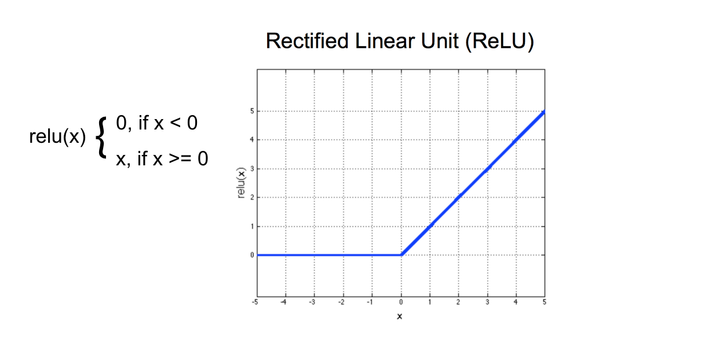

### Design of an MLP - Rules of Thumb

When designing an MLP you have a lot of different possibilities, and it is sometimes hard to know where to start. Unfortunately there are no strict rules, and experimentation is key. However, here are some guidelines to help you get started with an initial architecture that makes sense, from which you can start experimenting.

The number of inputs input_dim is fixed (in the case of MNIST images for example it is 28 x 28 = 784), so the first layer must be a fully-connected layer (Linear in PyTorch) with input_dim as input dimension.

Also the number of outputs is fixed (it is determined by the desired outputs). For a classification problem it is the number of classes n_classes, and for a regression problem it is 1 (or the number of continuous values to predict). So the output layer is a Linear layer with n_classes (in case of classification).

What remains to be decided is the number of hidden layers and their size. Typically you want to start from only one hidden layer, with a number of neurons between the input and the output dimension. Sometimes adding a second hidden layer helps, and in rare cases you might need to add more than one. But one is a good starting point.

As for the number of neurons in the hidden layers, a decent starting point is usually the mean between the input and the output dimension. Then you can start experimenting with increasing or decreasing, and observe the performances you get. If you see [overfitting](https://en.wikipedia.org/wiki/Overfitting), start by adding regularization ([dropout](https://pytorch.org/docs/stable/generated/torch.nn.Dropout.html) and weight decay) instead of decreasing the number of neurons, and see if that fixes it. A larger network with a bit of drop-out learns multiple ways to arrive to the right answer, so it is more robust than a smaller network without dropout. If this doesn't address the overfitting, then decrease the number of neurons. If you see [underfitting](https://en.wikipedia.org/wiki/Overfitting), add more neurons. You can start by approximating up to the closest power of 2. Keep in mind that the number of neurons also depends on the size of your training dataset: a larger network is more powerful but it needs more data to avoid overfitting.

So let's consider the MNIST classification problem. We have n_classes = 10 and input_dim = 784, so a starting point for our experimentation could be:

```python
import torch
import torch.nn as nn

class MyModel(nn.Module):

  def __init__(self):

    super().__init__()

    # Create layers. In this case just a standard MLP
    self.model = nn.Sequential(
      # Input layer. The input is obviously 784. For
      # the output (which is the input to the hidden layer)
      # we take the mean between network input and output:
      # (784 + 10) / 2 = 397 which we round to 400
      nn.Linear(784, 400),
      nn.Dropout(0.5),  # Combat overfitting
      nn.ReLU(),
      # Hidden layer
      nn.Linear(400, 400),
      nn.Dropout(0.5),  # Combat overfitting
      nn.ReLU(),
      # Output layer, must receive the output of the
      # hidden layer and return the number of classes
      nn.Linear(400, 10)
    )

  def forward(self, x):

    # nn.Sequential will call the layers 
    # in the order they have been inserted
    return self.model(x)
```

### Training the Network in PyTorch

**video**

### Cross-Entropy Loss

The cross-entropy loss is the typical loss used for classification problems. It can be instanced in PyTorch like this:

```python
from torch import nn

loss = nn.CrossEntropyLoss()
```
In the [PyTorch documentation](https://pytorch.org/docs/stable/), you can see that the cross-entropy loss function actually involves two steps:

- It first applies a softmax function to any output it sees
- Then it applies [NLLLoss](https://pytorch.org/docs/stable/nn.html#nllloss); negative log likelihood loss

Then it returns the average loss over a batch of data.

Since the nn.CrossEntropyLoss already applies the softmax function, the output of our network should be unnormalized class scores, and NOT probabilities. In other words, we must NOT apply softmax in the forward method of our network.

### Another Approach

We could also separate the softmax and NLLLoss steps.

- In the forward function of our model, we would explicitly apply a softmax activation function (actually the logarithm of the softmax function, which is more numerically stable) to the output, x.
```python
import torch.nn.functional as F
 ...
 ...
    def forward(self, x):

        ...

        # a softmax layer to convert 10 outputs 
        # into a distribution of class probabilities
        return F.log_softmax(x, dim=1)
```
- Then, when defining our loss criterion, we would apply nn.NLLLoss instead of nn.CrossEntropyLoss.
```python
criterion = nn.NLLLoss()
```

This separates the usual loss = nn.CrossEntropyLoss() into two steps. It is a a useful approach should you want the output of a model to be class probabilities rather than class scores.

Typically the first approach (using the Cross Entropy Loss) is preferred during training and validation (many tools actually assume that this is the case). However, when you export your model you might want to add the softmax at the end of your forward method, so that at inference time the output of your model will be probabilities and not class scores.

### The Optimizer

An optimizer is a class or a function that takes a function with parameters (typically our loss) and optimizes it. In the case of neural networks, optimization means minimization; i.e., the optimizer determines the values of the parameters that minimize the loss function. The problem indeed is formulated so that the parameters providing the minimum loss also provide the best performances.

PyTorch provides many optimizers. Two common ones are vanilla Stochastic Gradient Descent (SGD) and Adam. While the former is standard Gradient Descent applied using mini-batches, the latter is a more sophisticated algorithm that often provides similar results to SGD but faster. Both of them take as parameters the learning rate lr and (optionally) the regularization parameter weight_decay.

This is how to create optimizer instances in PyTorch:

```python
import torch.optim

optimizer = torch.optim.SGD(model.parameters(), lr=0.01, weight_decay=0)
import torch.optim

optimizer = torch.optim.Adam(model.parameters(), lr=0.01, weight_decay=0)
```

For other options as well as other available optimizers, please see the [official documentation](https://pytorch.org/docs/stable/optim.html).

### The Training Loop

Let's recap how to train a network in PyTorch:

```python
# number of epochs to train the model
n_epochs = 50

# Set model to training mode
# (this changes the behavior of some layers, like Dropout)
model.train()

# Loop over the epochs
for epoch in range(n_epochs):

    # monitor training loss
    train_loss = 0.0

    # Loop over all the dataset using the training
    # dataloader
    for data, target in train_dataloader:

        # clear the gradients of all optimized variables
        optimizer.zero_grad()

        # forward pass: 
        # compute predictions
        output = model(data)

        # calculate the loss which compare the model
        # output for the current batch with the relative
        # ground truth (the target)
        loss = criterion(output, target)

        # backward pass: 
        # compute gradient of the loss with respect to 
        # model parameters
        loss.backward()

        # perform a single optimization step (parameter update)
        optimizer.step()

        # update running training loss
        train_loss += loss.item()*data.size(0)

    # print training statistics 
    # calculate average loss over an epoch
    train_loss = train_loss/len(train_loader.dataset)
```

### Model Validation

**video**

### Validation Set: Takeaways

We create a validation set to:

1. Measure how well a model generalizes, during training
2. Tell us when to stop training a model; when the validation loss stops decreasing (and especially when the validation loss starts increasing and the training loss is still decreasing) we should stop training. It is actually more practical to train for a longer time than we should, but save the weights of the model at the minimum of the validation set, and then just throw away the epochs after the validation loss minimum.

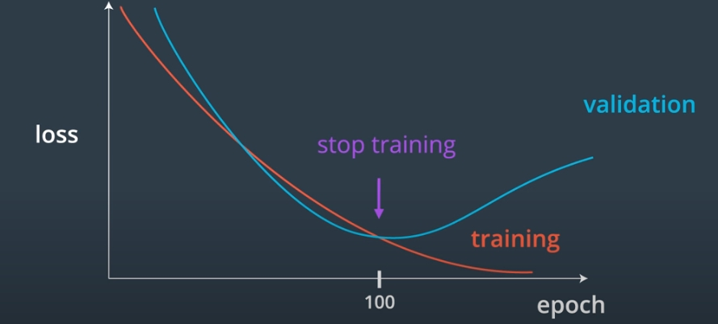

### Evaluating and Testing the Network in PyTorch

**video**

### Validation Loop

Once we have performed an epoch of training we can evaluate the model against the validation set to see how it is doing. This is accomplished with the validation loop:

```python
# Tell pytorch to stop computing gradients for the moment
# by using the torch.no_grad() context manager
with torch.no_grad():

  # set the model to evaluation mode
  # This changes the behavior of some layers like
  # Dropout with respect to their behavior during
  # training
  model.eval()

  # Keep track of the validation loss
  valid_loss = 0.0

  # Loop over the batches of validation data
  # (here we have removed the progress bar display that is
  # accomplished using tqdm in the video, for clarity)
  for batch_idx, (data, target) in enumerate(valid_dataloader):

    # 1. forward pass: compute predicted outputs by passing inputs to the model
    output = model(data)

    # 2. calculate the loss
    loss_value = criterion(output, target)

    # Calculate average validation loss
    valid_loss = valid_loss + (
      (1 / (batch_idx + 1)) * (loss_value.data.item() - valid_loss)
    )

  # Print the losses 
  print(f"Epoch {epoch+1}: training loss {train_loss:.5f}, valid loss {valid_loss:.5f}")
```

It is usually a good idea to wrap the validation loop in a function so you can return the validation loss for each epoch, and you can check whether the current epoch has the lowest loss so far. In that case, you save the weights of the model. We will see in one of the future exercises how to do that.

### The Test Loop

The test loop is identical to the validation loop, but we of course iterate over the test dataloader instead of the validation dataloader.

### Exercise: MLP Classification, MNIST

### How to Work on Exercises in Classroom Workspaces
**video**

### Exercise: MLP Classification

Here you'll work on an exercise in a Jupyter Notebook where you will define an MLP model for classifying MNIST images. You will train this model for some number of epochs, test your model to see how well it generalizes, and measure its accuracy.

When you are done, or if you get stuck, you can check the solution notebook that is present in the workspace.

Note: For this exercise, you do not need the GPU, so you can say "No" to that option here.

**udacity_deeplearning_nanodegree/2 Convolutional Neural Networks/2 CNN Concepts/Exercise: MLP Classification, MNIST/mnist_mlp_exercise.ipynb**

### Exercise Solution: MLP Classification, MNIST
### Solution, Part 1: Loading and Visualizing the Data

**video**

### Solution, Part 2: Defining the Network Architecture, Training and Testing the Network
**video**

In this exercise we have trained an MLP to classify hand-written digits. Congratulations!

Remember that the solution code is contained in the workspace.

### Typical Image Classification Steps

To visually summarize what we have discussed so far, here is a typical workflow for an image classification task:

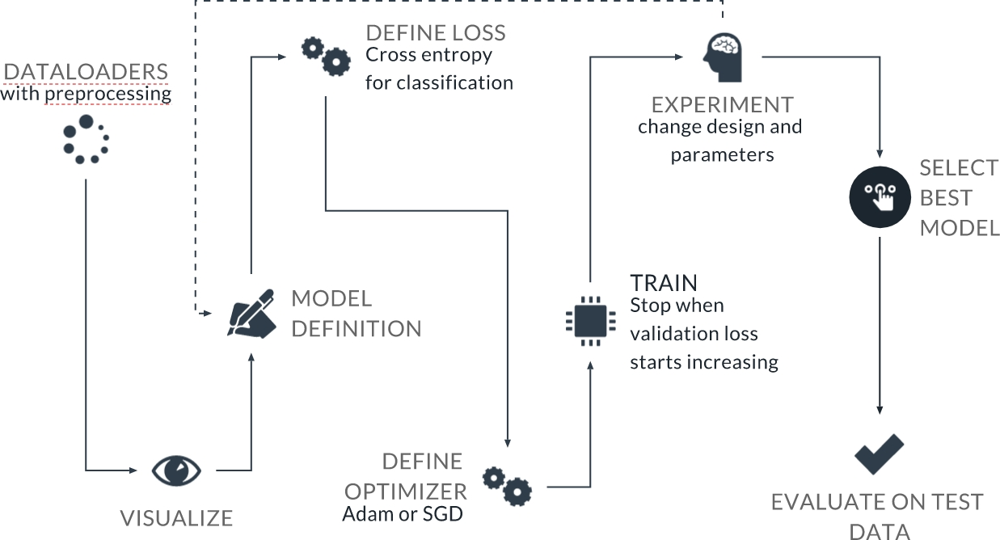

### MLPs vs. CNNs

**video**

### Classifier Performance

The MNIST dataset is very clean and is one of the few datasets where MLPs and Convolutional Neural Networks perform at a similar level of accuracy. However, all of the [top-scoring architectures for MNIST](http://yann.lecun.com/exdb/mnist/) are CNNs (although their performance difference compared to MLPs is small).

In most cases, CNNs are vastly superior to MLPs, both in terms of accuracy and in terms of network size when dealing with images.

As we will see, the main reason for the superiority of CNNs is that MLPs have to flatten the input image, and therefore initially ignore most of the spatial information, which is very important in an image. Also, among other things, they are not invariant for translation. This means that they need to learn to recognize the same image all over again if we translate even slightly the objects in it.

CNNs instead don't need to flatten the image and can therefore immediately exploit the spatial structure. As we will see, through the use of convolution and pooling they also have approximate translation invariance, making them much better choices for image tasks.

### Local Connectivity and Convolution

**video**

### Locally-Connected Layers

Convolutional Neural Networks are characterized by locally-connected layers, i.e., layers where neurons are connected to only a limited numbers of input pixels (instead of all the pixels like in fully-connected layers). Moreover, these neurons share their weights, which drastically reduces the number of parameters in the network with respect to MLPs. The idea behind this weight-sharing is that the network should be able to recognize the same pattern anywhere in the image.

We will see in the next videos exactly how this works.

### Filters and the Convolutional Layer

**video**

### The Convolution Operation

CNNs can preserve spatial information, and the key to this capability is called the Convolution operation: it makes the network capable of extracting spatial and color patterns that characterize different objects.

CNNs use filters (also known as "kernels") to "extract" the features of an object (for example, edges). By using multiple different filters the network can learn to recognize complex shapes and objects.

Let's look deeper into the filters, what they are and how they are applied to images.

### Filters and Edges

**video**

### Image Filters

Image filters are a traditional concept in computer vision. They are small matrices that can be used to transform the input image in specific ways, for example, highlighting edges of objects in the image.

An edge of an object is a place in an image where the intensity changes significantly.

To detect these changes in intensity within an image, you can create specific image filters that look at groups of pixels and react to alternating patterns of dark/light pixels. These filters produce an output that shows edges of objects and differing textures.

We will see that CNNs can learn the most useful filters needed to, for example, classify an image. But before doing that, let's look at some specific filters that we can create manually to understand how they work.

### Frequency in Images

We have an intuition of what frequency means when it comes to sound. A high frequency of vibration produces a high-pitched noise, like a bird chirp or violin. And low-frequency vibrations produce low pitches, like a deep voice or a bass drum. For sound, frequency actually refers to how fast a sound wave is oscillating; oscillations are usually measured in cycles/s (Hertz or Hz), and high pitches are created by high-frequency waves. Examples of low- and high-frequency sound waves are pictured below. On the y-axis is amplitude, which is a measure of sound pressure that corresponds to the perceived loudness of a sound, and on the x-axis is time.

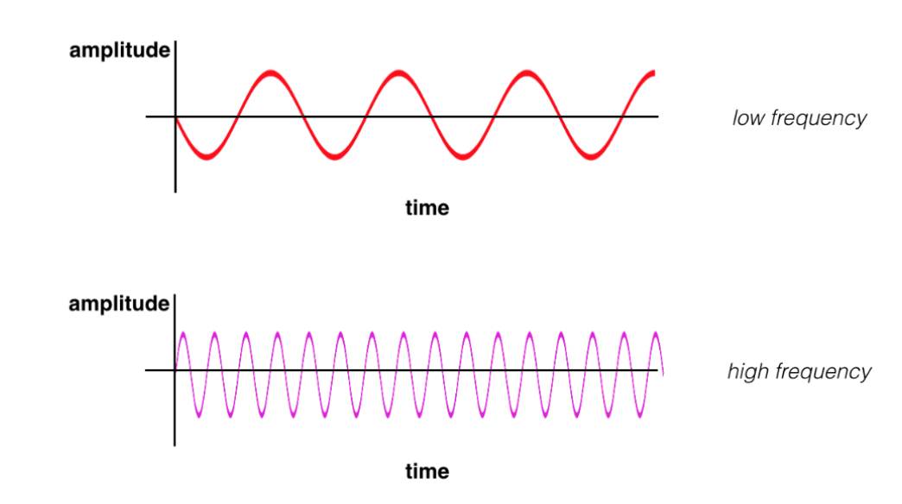

### High and Low Frequency

Similarly, frequency in images is a rate of change. But, what does it means for an image to change? Well, images change in space, and a high-frequency image is one where the intensity changes a lot. And the level of brightness changes quickly from one pixel to the next. A low-frequency image may be one that is relatively uniform in brightness or changes very slowly. This is easiest to see in an example.

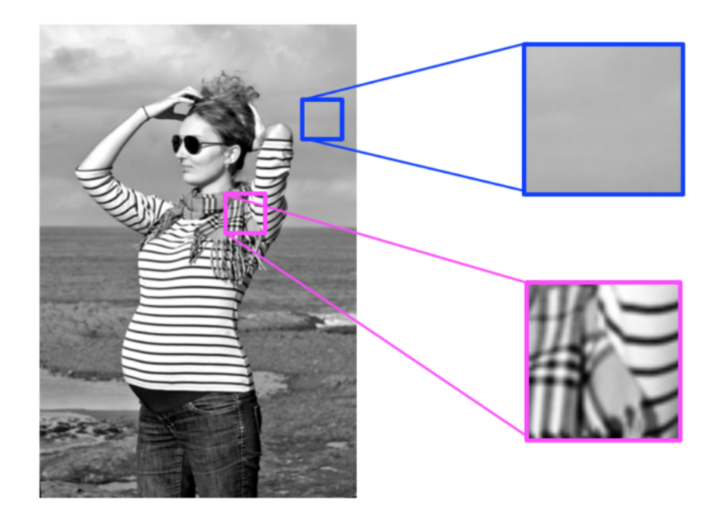

Most images have both high-frequency and low-frequency components. In the image above, on the scarf and striped shirt, we have a high-frequency image pattern; this part changes very rapidly from one brightness to another. Higher up in this same image, we see parts of the sky and background that change very gradually, which is considered a smooth, low-frequency pattern.

High-frequency components also correspond to the edges of objects in images, which can help us classify those objects.

### High-Pass Filters

**video**

### Edge Handling

Kernel convolution relies on centering a pixel and looking at its surrounding neighbors. So, what do you do if there are no surrounding pixels like on an image corner or edge? Well, there are a number of ways to process the edges, which are listed below. It’s most common to use padding, cropping, or extension. In extension, the border pixels of an image are copied and extended far enough to result in a filtered image of the same size as the original image.

- **Padding** - The image is padded with a border of 0's, black pixels.

- **Cropping** - Any pixel in the output image which would require values from beyond the edge is skipped. This method can result in the output image being smaller then the input image, with the edges having been cropped.

- **Extension** - The nearest border pixels are conceptually extended as far as necessary to provide values for the convolution. Corner pixels are extended in 90° wedges. Other edge pixels are extended in lines.

### Sobel Filters

The two filters we have looked at in the previous quiz page are called Sobel filters:

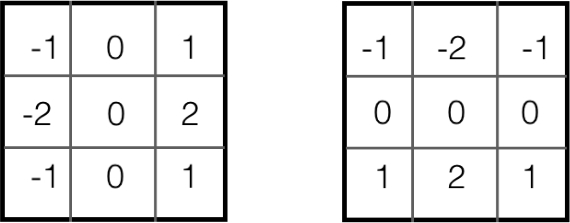

They are well-known filters used to isolate edges. We are going to use them to explain some concepts in the next few videos.

### Pooling

**video**

Pooling is a mechanism often used in CNNs (and in neural networks in general). Pooling compresses information from a layer by summarizing areas of the feature maps produced in that layer. It works by sliding a window over each feature map, just like convolution, but instead of applying a kernel we compute a summary statistic (for example the maximum or the mean). If we take the maximum within each window, then we call this Max Pooling.

### Concept Abstraction and Translation Variance

**video**

A block consisting of a convolutional layer followed by a max pooling layer (and an activation function) is the typical building block of a CNN.

By combining multiple such blocks, the network learns to extract more and more complex information from the image.

Moreover, combining multiple blocks allows the network to achieve translation invariance, meaning it will be able to recognize the presence of an object wherever that object is translated within the image.

### Effective Receptive Fields

**video**

### Effective Receptive Field

The concept of receptive field is that a pixel in the feature map of a deep layer is computed using information that originates from a large area of the input image, although it is mediated by other layers:


### Going Deeper (optional)

In practice things are a bit more complicated. When we compute the effective receptive field, instead of considering just whether the information contained in a given pixel is used or not by a pixel in a deeper layer, we can consider how many times that pixel is used. In other words, how many times that pixel was part of a convolution that ended up in a result used by the pixel in the deeper layer. Of course, pixels on the border of the input image are used during fewer convolutions than pixels in the center of the image. We can take this even further and ask how much a given pixel in the input image influences the pixel in a feature map deeper in the network. This means, if we change the value of the input pixel slightly, how much does the pixel in the deep layer change. If we take this into account, we end up with receptive fields that are more Gaussian-like, instead of flat as we have simplified them in the video, and they also evolve as we train the network.

If you are interested in exploring this topic further, look at [this paper](https://arxiv.org/abs/1701.04128). This is an example taken from it:

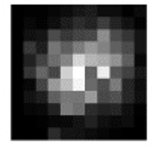

### CNN Architecture Blueprint

**video**

### CNN structure

We now have all the elements to see at a high level the structure of a typical CNN.

### Convolution and Pooling Layers

We have building blocks made by convolutional layers followed by pooling layers. We stack these blocks one after the other to build more and more abstraction in order to recognize the object of interest.

#### Flattening

Then, we end up with a large number of feature maps that are numerous but smaller than the input image, because of all the pooling operations. We flatten them out in a long array. All the activated pixels in the last feature maps before the flattening become large values in this flattened array.

### Multi-Layer Perceptron

We then have a standard MLP that takes as input the flattened array, and returns as output the class scores.

We can see here that the convolution part is used to extract features in the form of activated pixels in the flattened array, and then the MLP decides the class based on those features.

For example, if the convolutional part of the network detects a large square, a small square and a large triangle, then the MLP will use this information to recognize that the image contains a house:

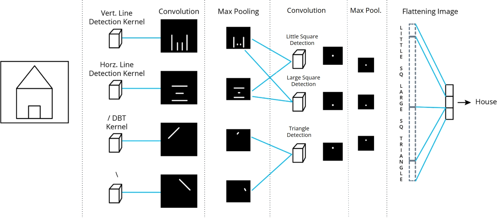

### Sample CNN Architecture on MNIST

**video**

Here is the website shown in the video, where you can go and explore yourself:

[2D convolutional network visualization](https://www.cs.cmu.edu/~aharley/vis/conv/flat.html)

There is also a [3d version](https://www.cs.cmu.edu/~aharley/vis/conv/) as well as versions for MLPs ([2d](https://www.cs.cmu.edu/~aharley/vis/fc/flat.html) and [3d](https://www.cs.cmu.edu/~aharley/vis/fc/)).

These visualizations are described in the paper: A. W. Harley, "An Interactive Node-Link Visualization of Convolutional Neural Networks," in ISVC, pages 867-877, 2015 ([link](https://www.cs.cmu.edu/~aharley/vis/))

### Glossary

For your reference, here are all the new terms we introduced in this lesson:

- CNN: Convolutional Neural Networks. A class of Neural Networks featuring local connectivity, weight sharing, and pooling operations.

- MNIST: A dataset of handwritten digits of historical importance, commonly used nowadays for tutorials and learning.

- Dataloader: Allows sequential or random iterations over a dataset or over a subset of a dataset.

- Local connectivity: In the fully-connected layers present in a Multi-Layer Perceptron the neurons in a layer are connected to all neurons in the previous layer. Instead, in CNNs, a neuron is connected only to a small portion of contiguous neurons in the previous layer (or pixels in the input image).

- Filters / Kernels: Small matrices of numbers, usually normalized to 1, that are applied to the input image during the convolution operation.

- Convolution: The operation of sliding a kernel on an image or a feature map to produce a modified output.

- Feature map: The result of applying a filter on an image or another feature map. One kernel/filter generates one feature map.

- Pooling: The operation of sliding a window over the input image or a feature map and applying a function to the numbers present in that window (for example, taking the maximum).

- Max Pooling: The operation of sliding a window over the input image or a feature map and applying a maximum function to the numbers present in that window.

- Sobel filters: Specific types of filters that can isolate vertical and horizontal edges.

- Effective receptive field (EFR): Generally, this is the region in the input image that contributes to the values of a pixel in a feature map deep in the network. More precisely, the effective receptive field is a matrix superimposed on the input image, where each element has a value proportional to the importance that a pixel in the input image has in determining the value of the pixel in the feature map deep in the network.

- Flattening: The operation of taking an image or a feature map and changing it into a vector (or 1d array).

### Lesson Review
### Summary: Foundational Concepts of CNNs

**video**

### Lesson Review

**video**

### Lesson Summary

In this lesson you:

- Reviewed how to use MLPs for image classification
- Learned of the limitations that MLPs have when it comes to image classification, and how CNNs overcome those limitations
- Learned the basic concepts of CNNs, and what makes them great at image tasks

Optional External Resource

[Deep Learning eBook](https://www.deeplearningbook.org/) (2016) authored by Ian Goodfellow, Yoshua Bengio, and Aaron Courville; published by Cambridge: MIT Press. This is a terrific free resource!