### Lesson Outline

**video**

### Lesson Overview

In this lesson, we'll dive deeper on CNNs, and you will learn to:

- Apply all of the basic layers that make up a CNN
- Put all these layers together to build a CNN from the ground up
- Improve the performance of your CNN network
- Export a model for production

### Why Should I Learn to Build a CNN from Scratch?

**video**

### Summary

In this lesson we are going to learn how to build and train a CNN from scratch.

However, in real-world situation, it is far more common to fine-tune an existing architecture than to build one from scratch.

Does this mean that this lesson is not needed? Of course not!

Understanding how things work in some detail is going to be very useful (and fun!). It will allow you to understand the strength and the limitations of different methods and architectures, as well as to follow and understand the state-of-the-art which evolves quickly.

Also, in some situations a slight modification to an existing architecture can make all the difference. You won't know where to start if you don't know at least at a high-level how things work internally.

So every expert would agree that starting from fundamentals and building your way up is the way to go. So let’s get started!

### Convolutional Layers in Depth


#### Convolution

You have learned about the concept of convolution as applied to grayscale images.

You now also understand how convolution can extract features such as edges that can be used to recognize what the image represents.

Let's recap some of these concepts and go deeper, extending convolutions to color images.

**video**

### Convolution on Color Images

In this video we have shown how to apply convolution to color images. The kernel that was a matrix of k x k numbers for grayscale images, becomes now a 3d filter of k x k x n channels:


### Multiple Convolutional Layers

In a CNN with more than one layer, the nk filters in the first convolutional layer will operate on the input image with 1 or 3 channels (RGB) and generate nk output feature maps. So in the case of an RGB image the filters in the first convolutional layer will have a shape of kernel_size x kernel_size x 3. If we have 64 filters we will then have 64 output feature maps. Then, the second convolutional layer will operate on an input with 64 "channels" and therefore use filters that will be kernel_size x kernel_size x 64. Suppose we use 128 filters. Then the output of the second convolutional layer will have a depth of 128, so the filters of the third convolutional layer will be kernel_size x kernel_size x 128, and so on. For this reason, it is common to use the term "channels" also to indicate the feature maps of convolutional layers: a convolutional layer that takes feature maps with a depth of 64 and outputs 128 feature maps is said to have 64 channels as input and 128 as outputs.

### Number of Parameters in a Convolutional Layer

Let's see how we can compute the number of parameters in a convolutional layer, $ n_p $.

Let's define some quantities:
- $n_k$ : number of filters in the convolutional layer
- k : height and width of the convolutional kernel
- c : number of feature maps produced by the previous layer (or number of channels in input image)

There are k times k times c weights per filter plus one bias per filter, so $ c*k^2 + 1$ parameters. The convolutional layer is composed of nkn_knk​ filters, so the total number of parameters in the convolutional layer is:

$$ n_p = n_k (c k^2 + 1) $$
<p align="center"> Formula to compute number of parameters in convolutional layer </p>

### Convolutional Layers in PyTorch

To create a convolutional layer in PyTorch, you must first import the necessary module:

```python
from torch import nn
```

Then you can define a convolutional layer as:

```python
conv1 = nn.Conv2d(in_channels, out_channels, kernel_size)
```

You must pass the following arguments:

- in_channels - The number of input feature maps (also called channels). If this is the first layer, this is equivalent to the number of channels in the input image, i.e., 1 for grayscale images, or 3 for color images (RGB). Otherwise, it is equal to the output channels of the previous convolutional layer.
- out_channels - The number of output feature maps (channels), i.e. the number of filtered "images" that will be produced by the layer. This corresponds to the unique convolutional kernels that will be applied to an input, because each kernel produces one feature map/channel. Determining this number is an important decision to make when designing CNNs, just like deciding on the number of neurons is an important decision for an MLP.
- kernel_size - Number specifying both the height and width of the (square) convolutional kernel.

There are also some additional, optional but important arguments that we are going to see in the next video.

At any time consult the official PyTorch [documentation](https://pytorch.org/docs/stable/generated/torch.nn.Conv2d.html#torch.nn.Conv2d) for more details and further options.

Note in PyTorch that this convolutional layer does NOT include the activation function, which is different than in other deep learning libraries such as Keras. We need to add that as a separate layer.

### Adding the Activation Function and Dropout

As we have seen in the case of MLPs, the activation function must be specified as a separate layer. The same is true for the Dropout layer, which is a very effective regularizer for neural networks. In the case of CNNs, we need to use the 2d version of Dropout, which randomly drops some input channels entirely.

So, a convolutional block in PyTorch looks something like:

```python
conv1 = nn.Conv2d(in_channels, out_channels, kernel_size)
dropout1 = nn.Dropout2d(p=0.2)
relu1 = nn.ReLU()
```
We can now apply it to an input image x:

```python
result = relu1(dropout1(conv1(x)))
```
We can also use nn.Sequential, which stacks together the layers we give as argument so they can be used as if they were one. For example we can build a convolutional block as:

```python
conv_block = nn.Sequential(
  nn.Conv2d(in_channels, out_channels, kernel_size),
  nn.ReLU(),
  nn.Dropout2d(p=0.2)
)
```

and now we can use it simply as:

```python
result = conv_block(x)
```

### Stride and Padding

**video**

### Padding, Stride, Input and Output Size

**Padding**: Expanding the size of an image by adding pixels at its border

**Stride**: Amount by which a filter slides over an image.

In PyTorch, the Conv2d layer allows for an arbitrary amount of padding.

Let's consider the first convolutional layer in a CNN, and let's assume that the input images are 5x5x1 (height of 5, width of 5, and grayscale) to make our math easier.

We can for example define a first convolutional layer with 3 input channels (corresponding to the RGB of the image), 16 feature maps (also called output channels), a 3x3 kernel, and stride 1. This is defined in PyTorch as nn.Conv2d(3, 16, kernel_size=3, padding=0). We can visualize how one filter operates with the following animation:

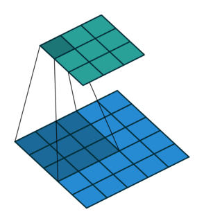
<p align="center"> 3x3 Convolution on 5x5 Input with Stride 1 and No Padding </p>

As we can clearly see, the kernel fits in the image only 3 times per row, thus the output feature map is 3x3.

In many cases it is a good idea to keep the input size and the output size the same. Sometimes it is even necessary, as we will see in a different lesson when we talk about skip connections. In this particular case, we just need to add a padding of 1: nn.Conv2d(3, 16, kernel_size=3, padding=1) (we will see later the different strategies to fill those values).

This is the result:


<p align="center"> 5x5 Convolution on 5x5 Input Image with Stride 1 and Padding 1 </p>

If we want our 5x5 convolution to produce the same size as the input, we have to use a padding of 2 this time:

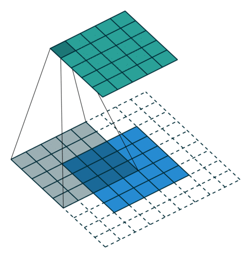
<p align="center"> 5x5 convolution on 5x5 input image with stride 1, padding 2. Input and output have same size. </p>

### Now Let's Consider Strides Larger than 1

For a 5x5 input, a 3x3 kernel, a padding of 0, and a stride of 2 we have:

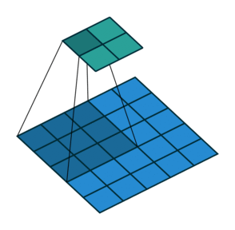
<p align="center"> 3x3 Convolution on 5x5 Input Image with Stride 2 and Padding 0 </p>

The kernel fits only 2 times per row, for a total output size of 2x2. If we want to have the output size equal to the input size we need to use a padding of 3 this time, but this does not make much sense:

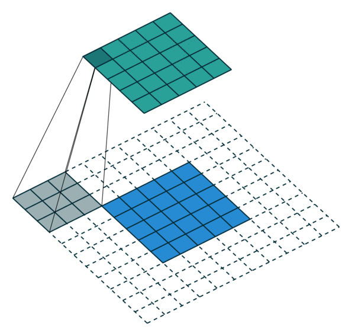
<p align="center"> 3x3 Convolution on 5x5 Image with Stride 2 and Padding 2 </p>

Indeed, there are some pixels in the output feature map that are the result of convolving the kernel with a region that is completely outside of the original image. That region contains no information! However, by now you get the idea of how things work and we can derive a rule to help us in the computation of kernel size, padding, and output dimension.

### Formula for Convolutional Layers

After working through the examples above, can you figure out a formula relating the output size, input size, kernel size, stride, and padding? (Try it on your own before looking below!)

In general we can link together the output size o, the size of the input image i, the size of the kernel k, the stride s , and the padding p with this simple formula, which is very useful when you are creating your own architectures:

$$ O = [\frac {i + 2p - k}{s}] +1  $$
<p align="center"> Simple Formula for Convolutional Layers </p>

### PyTorch Shortcuts

In PyTorch you can also use padding="same" or padding="valid" instead of providing explicit numbers for the padding. The same padding instructs PyTorch to automatically compute the amount of padding necessary to give you an output feature map with the same shape as the input. Note this option only works if you are using a stride of 1. Thevalid padding is equivalent to using a padding of 0.

### Types of Padding

As we have seen in the video there are different strategies to fill the padding pixels. The most obvious one is to fill them with zero (the default in PyTorch). However, the nn.Conv2d layer in Pytorch also supports other options, illustrated by the following images:

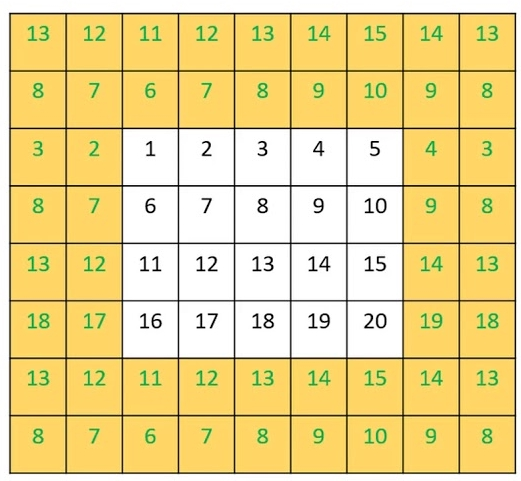
<p align="center"> padding_mode="reflect": padding pixels filled with copies of values in input image taken in opposite order, in a mirroring fashion </p>

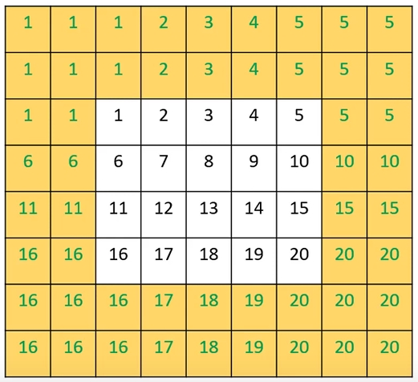
<p align="center"> padding_mode="replicate": padding pixels filled with value of closest pixel in input image </p>

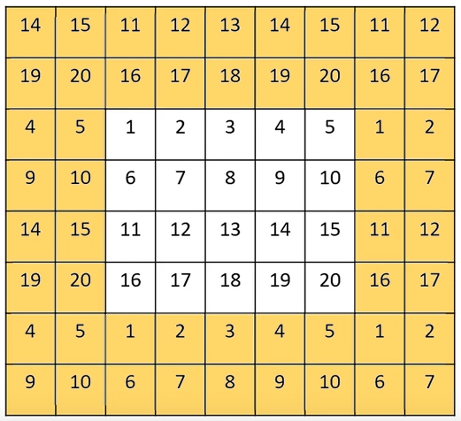
<p align="center"> padding_mode="circular": like reflect mode, but image is first flipped horizontally and vertically </p>

The zero-padding strategy is by far the most common, but these other strategies are adopted in some architectures and you can definitely experiment with them to see if they make any difference with respect to the zero-padding.

### Exercise: Convolutional Layer Visualization

This exercise gives you a chance to explore a convolutional layer and the effects of an activation function.

There is no coding that you need to do in this notebook, so there is no "solution" provided.

Note: For this exercise, you do not need the GPU, so you can say "No" to that option here.

**udacity_deeplearning_nanodegree/2 Convolutional Neural Networks/3 CNN Depth/Exercise: Convolutional Layer Visualization/conv_visualization.ipynb**

### Reflection on this Exercise

Compare the feature maps created by the activation function with those created just using the convolutional layer.
Your reflection

as relu converted negative values to zero, the result became dark
Things to think about

Thanks for your response here! I would've said something like: We can definitely see that applying ReLU activation is equivalent to applying a hard threshold on our feature maps: only strong edges are preserved, everything else becomes 0.

### Pooling Layers

You have previously learned about Max Pooling layers on a 1-channel image. Let's review that concept in the case of RGB images (3 channels).

**video**

### Other Kinds of Pooling

You now know how the Max Pooling layer works, but there are other types of pooling layers. One we can introduce now is called Average Pooling.
#### Average Pooling

This works similarly to the Max Pooling layer, but instead of taking the maximum for each window, we take the mean average of all the values in the window.

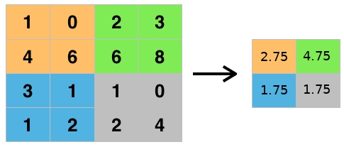

Average Pooling is not typically used for image classification problems because Max Pooling is better at noticing the most important details about edges and other features in an image, but you may see average pooling used in applications for which smoothing an image is preferable.

Sometimes, Average Pooling and Max Pooling are used together to extract both the maximum activation and the average activation.

### Pooling Layers in PyTorch

#### Max Pooling Layers in PyTorch

To create a pooling layer in PyTorch, you must first import the necessary module:

```python
from torch import nn
```

Then you can define the layer as:

```python
nn.MaxPool2d(kernel_size, stride)
```

You must pass the following arguments:

- kernel_size - The size of the max pooling window. The layer will roll a window of this size over the input feature map and select the maximum value for each window.
- stride - The stride for the operation. By default the stride is of the same size as the kernel (i.e., kernel_size).

There are some additional optional arguments that are rarely used, but could be helpful under certain circumstances. Please refer to the [PyTorch documentation on MaxPool2D](https://pytorch.org/docs/stable/generated/torch.nn.MaxPool2d.html).

#### Average Pooling Layer

Similarly, an Average Pooling Layer can be created in this way:

```python
pooling = nn.AvgPool2d(window_size, stride)
```
where the parameters have the same meaning as for the Max Pooling layer.

### Exercise: Pooling Layer Visualization

This exercise gives you a chance to explore and compare the effects of convolutional layers, activations, and pooling layers.

You are only asked to tweak the provided code a little bit in this exercise, so there is no "solution" provided.

Note: For this exercise, you do not need the GPU, so you can say "No" to that option here.

**udacity_deeplearning_nanodegree/2 Convolutional Neural Networks/3 CNN Depth/Exercise: Pooling Layer Visualization/maxpooling_visualization.ipynb**

### Reflections on this Exercise

    Describe the effects you see in this notebook from the implementation of the max pooling layer, compared with the convolutional layer and activation function.
    Describe some highlights of the differences you see from using different max pooling parameters and activation functions in this notebook.

Your reflection

1. the result image shrunk. 2. tanh and sigmoid output are noisy
Things to think about

Thanks for your responses! I would've said something like:

    With the implementation of the max pooling layer, the feature maps are reduced in size but the information content looks the same (the same edges are evident, for example).

### Structure of a Typical CNN

**video**

In a typical CNN there are several convolutional layers intertwined with Max Pooling layers. The convolutional layers have more and more feature maps as you go deeper into the network, but the size of each feature map gets smaller and smaller thanks to the Max Pooling layer.

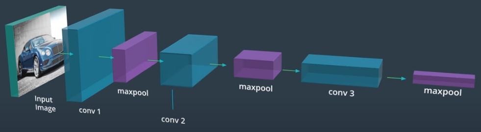

This kind of structure goes hand in hand with the intuition we have developed in another lesson: as the signal goes deeper into the network, more and more details are dropped, and the content of the image is "abstracted." In other words, while the initial layers focus on the constituents of the objects (edges, textures, and so on), the deeper layers represent and recognize more abstract concepts such as shapes and entire objects.

### CNN Structure and Layers in PyTorch: Recap

Let's recap what we have learned so far about the typical structure of a CNN and the layers that constitute a CNN.

**video**

The convolution part of a CNN is implemented in PyTorch by using the nn.Conv2d layer for convolution and the nn.MaxPool2d layer for max pooling. Stacking different blocks of convolution followed by pooling constitutes the typical structure of a simple CNN. Typically the sizes of the feature maps shrink as you go deeper into the network, while the channel count (i.e., the number of feature maps and filters) increases going deeper into the network, as shown below.

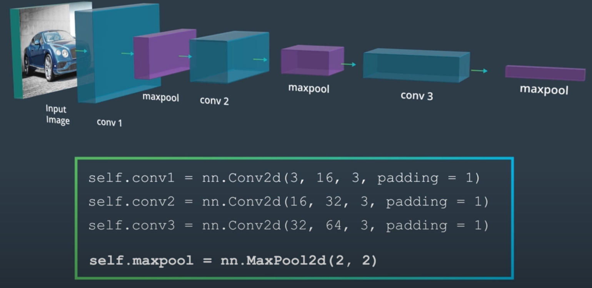

### Feature Vectors

**video**

A classical CNN is made of two distinct parts, sometimes called the backbone and the head, illustrated below.

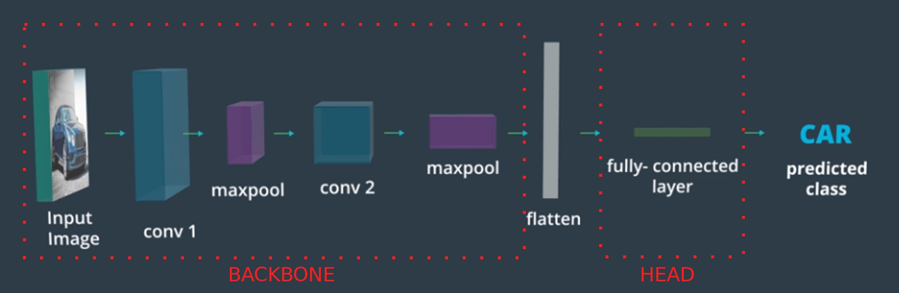

The backbone is made of convolutional and pooling layers, and has the task of extracting information from the image.

After the backbone there is a flattening layer that takes the output feature maps of the previous convolutional layer and flattens them out in a 1d vector: for each feature map the rows are stacked together in a 1d vector, then all the 1d vectors are stacked together to form a long 1d vector called a feature vector or embedding. This process is illustrated by the following image:

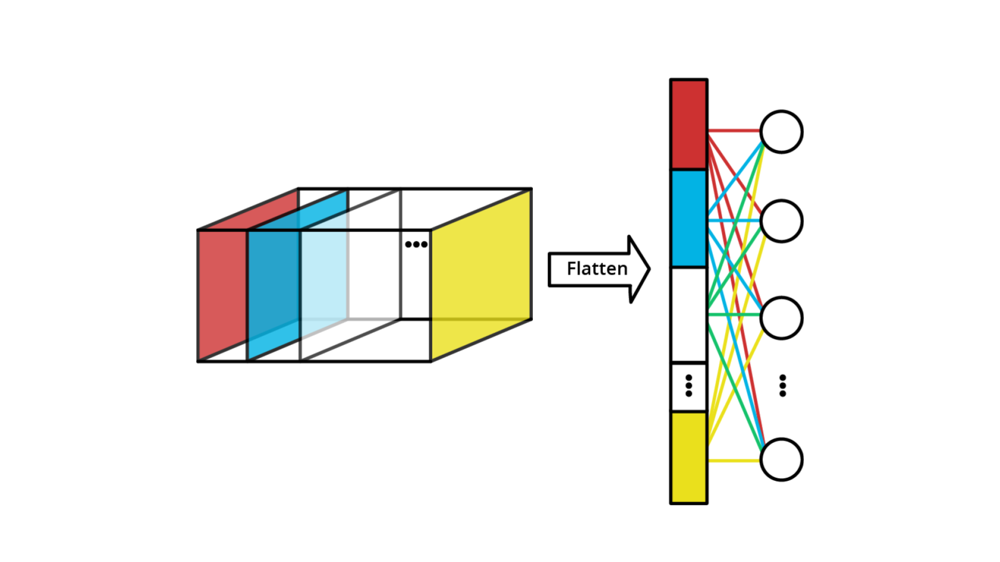

After the flattening operation we have the head section. The head is typically just a normal MLP that takes as input the feature vector and has the appropriate output for the task. It can have one or more hidden layers, as well as other types of layers as needed (like DropOut for regularization). In case of a classification task the output dimension is equal to the number of classes, just as in a normal MLP.

### CNNs in PyTorch: Summary So Far

Now let's put everything together in code!

### The Typical Convolutional Block

The typical sequence convolution -> pooling -> activation (with optional dropout) can be written in PyTorch like this:

```
self.conv1 = nn.Conv2d(3, 16, 3, padding=1),
self.pool = nn.MaxPool2d(2, 2),
self.relu1 = nn.ReLU()
self.drop1 = nn.Dropout2d(0.2)
```
(or of course with the nn.Sequential equivalent:

```
self.conv_block = nn.Sequential(
  nn.Conv2d(3, 16, 3, padding=1),
  nn.MaxPool2d(2, 2),
  nn.ReLU(),
  nn.Dropout2d(0.2)
)
```

### A Simple CNN in PyTorch

Let's now bring everything together and write our first CNN in PyTorch. We are going to have 3 convolutional blocks plus a head with a simple MLP.

```
import torch
import torch.nn as nn

class MyCNN(nn.Module):

  def __init__(self, n_classes):

    super().__init__()

    # Create layers. In this case just a standard MLP
    self.model = nn.Sequential(
      # First conv + maxpool + relu
      nn.Conv2d(3, 16, 3, padding=1),
      nn.MaxPool2d(2, 2),
      nn.ReLU(),
      nn.Dropout2d(0.2),

      # Second conv + maxpool + relu
      nn.Conv2d(16, 32, 3, padding=1),
      nn.MaxPool2d(2, 2),
      nn.ReLU(),
      nn.Dropout2d(0.2),

      # Third conv + maxpool + relu
      nn.Conv2d(32, 64, 3, padding=1),
      nn.MaxPool2d(2, 2),
      nn.ReLU(),
      nn.Dropout2d(0.2),

      # Flatten feature maps
      nn.Flatten(),

      # Fully connected layers. This assumes
      # that the input image was 32x32
      nn.Linear(1024, 128),
      nn.ReLU(),
      nn.Dropout(0.5),
      nn.Linear(128, n_classes)
    )

  def forward(self, x):

    # nn.Sequential will call the layers 
    # in the order they have been inserted
    return self.model(x)
```

Let's analyze what is going on in the Sequential call. We have a series of 3 convolutional parts constituted of a convolutional layer, a max pooling operation that halves the input shape, and then a ReLU activation:

```
nn.Conv2d(3, 16, 3, padding=1),
nn.MaxPool2d(2, 2),
nn.ReLU()
```

We can also optionally insert a nn.Dropout2d layer for regularization.

We repeat this structure 3 times, varying the number of feature maps in the sequence 16 -> 32 -> 64. As we go deep, in other words, we are working with feature maps with a smaller height and width (because we keep applying max pooling) but with a higher channel count. This is very typical and helps the network with abstracting concepts.

Then, we have a Flatten layer that flattens our 64 feature maps (coming from the last conv layer before the flattening) into one long vector. Assuming that the input is 32x32, this vector will contain 1024 numbers.

Finally, we have an MLP made of fully-connected layers that combines all the information extracted by the convolutional part and outputs one number for each class (logits). We first compress the 1024-long array into an embedding of 128 numbers, and then from there to the number of classes we have.

Since we have used the nn.Sequential class, the forward method is extremely simple and it is just calling that Sequential instance.

### Exercise: CNNs for CIFAR Image Classification

### Exercise: CNNs in PyTorch

Now you're ready to define and train a CNN in PyTorch!

### Instructions

- Define a CNN model for classifying CIFAR10 images
- Train it for some number of epochs, test your model to see how well it generalizes, and measure its accuracy.

If you need any help or want to check your work, feel free to check out the solution notebook in the workspace.

### GPU Workspaces

This workspace is GPU-enabled, which means you can choose to train on a GPU instance. We strongly recommend that you enable the GPU mode for this workspace, otherwise your training will be very slow. This is true for all upcoming exercises, and the project, in this course.

All models, and the data they see as input, will have to be moved to the GPU device, so take note of the relevant movement code in the model creation and training process.

Should you need it, remember that a tensor can be moved to the GPU by simply saying:

```
tensor.cuda()
```
and back from the GPU to the CPU by saying:

```
tensor.cpu()
```

**udacity_deeplearning_nanodegree/2 Convolutional Neural Networks/3 CNN Depth/Exercise: CNNs for CIFAR Image Classification/cifar10_cnn_exercise.ipynb**

### Solution: CNNs for CIFAR Image Classification
#### Solution, Part 1: Load Data

**video**

#### Solution, Part 2: Create Architecture
**video**

#### Solution, Part 3: Train and Test the Network
**video**

### Image Augmentation

#### Optimizing the Performance of Our Network

Now that we have seen how to train a simple CNN, let’s dive deeper and see how we can improve on the performance of our network with some widely-adopted tricks.

The first one is image augmentation.

**video**

The basic idea of image augmentation is the following: if you want your network to be insensitive to changes such as rotation, translation, and dilation, you can use the same input image and rotate it, translate it, and scale it and ask the network not to change its prediction!

In practice, this is achieved by applying random transformations to the input images before they are fed to the network.

### Augmentation Using Transformations

**video**

Image augmentation is a very common method to:

1. Increase the robustness of the network
2. Avoid overfitting
3. Introduce rotational, translational and scale invariance as well as insensitiveness to color changes
4. Avoid [shortcut learning](https://news.mit.edu/2021/shortcut-artificial-intelligence-1102)

### Demo: Augmentation Using Transformations

**video**

### Augmentation Pipelines

A typical training augmentation pipeline is represented in this diagram.

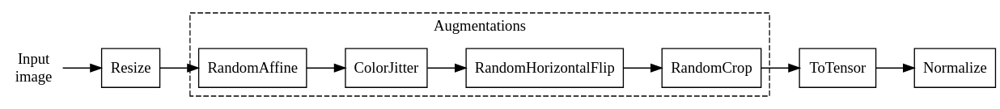

This typical training augmentation pipeline can be implemented in PyTorch as follows (transforms are documented [here](https://pytorch.org/vision/main/transforms.html)):

```
import torchvision.transforms as T


train_transforms = T.Compose(
    [
        # The size here depends on your application. Here let's use 256x256
        T.Resize(256),
        # Let's apply random affine transformations (rotation, translation, shear)
        # (don't overdo here!)
        T.RandomAffine(scale=(0.9, 1.1), translate=(0.1, 0.1), degrees=10),
        # Color modifications. Here I exaggerate to show the effect 
        T.ColorJitter(brightness=0.5, contrast=0.5, saturation=0.5, hue=0.5),
        # Apply an horizontal flip with 50% probability (i.e., if you pass
        # 100 images through around half of them will undergo the flipping)
        T.RandomHorizontalFlip(0.5),
        # Finally take a 224x224 random part of the image
        T.RandomCrop(224, padding_mode="reflect", pad_if_needed=True),  # -
        T.ToTensor(),
        T.Normalize((0.5, 0.5, 0.5), (0.5, 0.5, 0.5)),
    ]
)
```

This pipeline produces variations of the same image as this example:

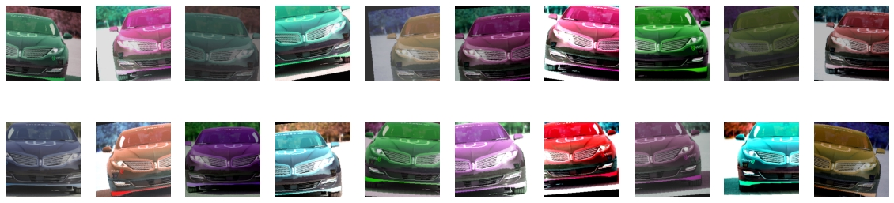

**video**

### Transformation Pipelines for Validation and Test

During validation and test you typically do not want to apply image augmentation (which is needed for training). Hence, this is a typical transform pipeline for validation and test that can be paired with the pipeline above:

```
testval_transforms = T.Compose(
    [
        # The size here depends on your application. Here let's use 256x256
        T.Resize(256),
        # Let's take the central 224x224 part of the image
        T.CenterCrop(224),
        T.ToTensor(),
        T.Normalize((0.5, 0.5, 0.5), (0.5, 0.5, 0.5)),
    ]
)
```

Note that of course:

- The resize and crop should be the same as applied during training for best performance
- The normalization should be the same between training and inference (validation and test)

### AutoAugment Transforms

There is a special class of transforms defined in torchvision, referred to as [AutoAugment](https://pytorch.org/vision/main/transforms.html#automatic-augmentation-transforms). These classes implements augmentation policies that have been optimized in a data-driven way, by performing large-scale experiments on datasets such as ImageNet and testing many different recipes, to find the augmentation policy giving the best result. It is then proven that these policies provide good performances also on datasets different from what they were designed for.

For example, one such auto-transform is called RandAugment and it is widely used. It is particularly interesting because it parametrizes the strength of the augmentations with one single parameter that can be varied to easily find the amount of augmentations that provides the best results. This is how to use it:

```
T.RandAugment(num_ops, magnitude)
```

The main parameters are:

- num_ops: the number of random transformations applied. Defaut: 2
- magnitude: the strength of the augmentations. The larger the value, the more diverse and extreme the augmentations will become.

As usual, refer to the [official documentation](https://pytorch.org/vision/main/generated/torchvision.transforms.RandAugment.html#torchvision.transforms.RandAugment) for details.

### Batch Normalization

The second modern trick that paves the way for enhancing the performance of a network is called Batch Normalization, or BatchNorm. It does not usually improve the performances per se, but it allows for much easier training and a much smaller dependence on the network initialization, so in practice it makes our experimentation much easier, and allows us to more easily find the optimal solution.

**video**

### How BatchNorm Works

Just as we normalize the input image before feeding it to the network, we would like to keep the feature maps normalized, since they are the output of one layer and the input to the next layer. In particular, we want to prevent them to vary wildly during training, because this would require large adjustments of the subsequent layers. Enter BatchNorm. BatchNorm normalizes the activations and keep them much more stable during training, making the training more stable and the convergence faster.

In order to do this, during training BatchNorm needs the mean and the variance for the activations for each mini-batch. This means that the batch size cannot be too small or the estimates for mean and variance will be inaccurate. During training, the BatchNorm layer also keeps a running average of the mean and the variance, to be used during inference.

During inference we don't have mini-batches. Therefore, the layer uses the mean and the variance computed during training (the running averages).

This means that BatchNorm behaves differently during training and during inference. The behavior changes when we set the model to training mode (using model.train()) or to validation mode (model.eval()).

### Pros and Cons of Batch Normalization

**video**

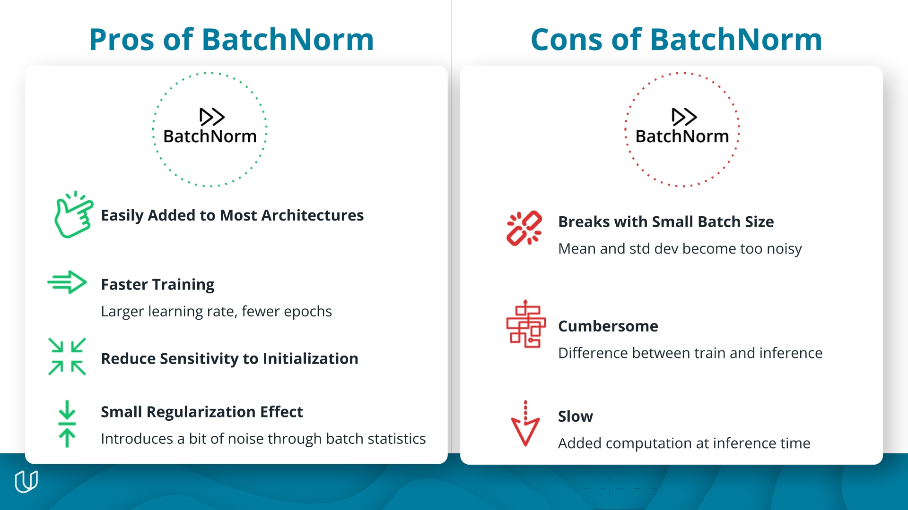

These advantages of using BatchNorm generally outweigh these disadvantages, so BatchNorm is widely used in almost all CNN implementations today.

### BatchNorm in PyTorch

**video**

### BatchNorm for Convolutional Layers

BatchNorm can be used very easily in PyTorch as part of the convolutional block by adding the nn.BatchNorm2d layer just after the convolution:

```
self.conv1 = nn.Sequential(
  nn.Conv2d(3, 16, kernel_size=3, padding=1),
  nn.BatchNorm2d(16),
  nn.MaxPool2d(2, 2),
  nn.ReLU(),
  nn.Dropout2d(0.2)
)
```
The only parameter is the number of input feature maps, which of course must be equal to the output channels of the convolutional layer immediately before it.

NOTE: It is important to use BatchNorm before DropOut. The latter drops some connections only at training time, so placing it before BatchNorm would cause the distribution seen by BatchNorm to be different between training and inference.

### BatchNorm for Dense Layers

We can add BatchNorm to MLPs very easily by using nn.BatchNorm1d:

```
self.mlp = nn.Sequential(
  nn.Linear(1024, 500),
  nn.BatchNorm1d(500),
  nn.ReLU(),
  nn.Dropout(0.5)
)
```

### Optimizing the Performance of Our Network

**video**

### Important Terms in Optimizing Performance

Parameter

- Internal to the model
- May vary during training
- Examples: Weights and biases of a network

Hyperparameter

- External to the model
- Fixed during training
- Examples: Learning rate, number of layers, activation layers

Experiment

- A specific training run with a fixed set of hyperparameters
- Practitioners typically perform many experiments varying the hyperparameters. Each experiment produces one or more metrics that can be used to select the best-performing set of hyperparameters (see the next section).

### Strategies for Optimizing Hyperparameters

- Grid search
  - Divide the parameter space in a regular grid
  - Execute one experiment for each point in the grid
  - Simple, but wasteful
- Random search
  - Divide the parameter space in a random grid
  - Execute one experiment for each point in the grid
  - Much more efficient sampling of the hyperparameter space with respect to grid search
- Bayesian Optimization
  - Algorithm for searching the hyperparameter space using a Gaussian Process model
  - Efficiently samples the hyperparameter space using minimal experiments

### Most Important Hyperparameters

**video**

### Summary: Most Important Hyperparameters

Optimizing hyperparameters can be confusing at the beginning, so we provide you with some rules of thumb about the actions that typically matter the most. They are described in order of importance below. These are not strict rules, but should help you get started:

1. Design parameters: When you are designing an architecture from scratch, the number of hidden layers, as well as the layers parameters (number of filters, width and so on) are going to be important.
2. Learning rate: Once the architecture is fixed, this is typically the most important parameter to optimize. The next video will focus on this.
3. Batch size: This is typically the most influential hyperparameter after the learning rate. A good starting point, especially if you are using BatchNorm, is to use the maximum batch size that fits in the GPU you are using. Then you vary that value and see if that improves the performances.
4. Regularization: Once you optimized the learning rate and batch size, you can focus on the regularization, especially if you are seeing signs of overfitting or underfitting.
5. Optimizers: Finally, you can also fiddle with the other parameters of the optimizers. Depending on the optimizers, these vary. Refer to the documentation and the relevant papers linked there to discover what these parameters are.

### Optimizing Learning Rate

**video**

### Summary: Optimizing Learning Rate

The learning rate is one of the most important hyperparameters. However, knowing what the optimal value is, or even what a good range is, can be challenging.

One useful tool to discover a good starting point for the learning rate is the so-called "learning rate finder." It scans different values of the learning rate, and computes the loss obtained by doing a forward pass of a mini-batch using that learning rate. Then, we can plot the loss vs. the learning rate and obtain a plot similar to this:

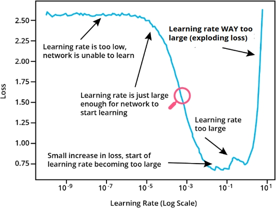


We want to pick as a starting point the learning rate corresponding to more or less the middle of the steep part of the graph (indicated by the red marker in the plot).

### Learning Rate Schedulers

In many cases we want to vary the learning rate as the training progresses. At the beginning of the training we want to make pretty large steps because we are very far from the optimum. However, as we approach the minimum of the loss, we need to make sure we do not jump over the minimum.

For this reason, it is often a good idea to use a learning rate scheduler, i.e., a class that changes the learning rate as the training progresses.

There are several possible learning rate schedulers. You can find the available ones in the [documentation](https://pytorch.org/docs/stable/optim.html#how-to-adjust-learning-rate).

One of the simplest one is the StepLR scheduler. It reduces the learning rate by a specific factor every n epochs. It can be used as follows:

```
from torch.optim.lr_scheduler import StepLR

scheduler = StepLR(optimizer, step_size=5, gamma=0.5)

# Training loop
for ... 
    ...
    # Update the weights
    optimizer.step()

    # Update the learning rate in the
    # optimizer according to the schedule
    scheduler.step()
```

### Tracking Your Experiments

When you are performing hyperparameter optimization and other changes it is very important that you track all of your experiments. This way you will know which hyperparameters have given you which results, and you will be able to repeat those experiments, choose the best one, understand what works and what doesn't, and what you need to explore further. You will also be able to present all your results to other people.

You can of course use spreadsheets for this, or even pen and paper, but there are definitely much better ways!

Enter experiment tracking tools. There are many of them out there, and they all work in similar ways. Let's consider mlflow, which is free and open source.

Tracking an experiment is easy in [mlflow](https://www.mlflow.org/docs/latest/tracking.html). You first start by creating a run. A run is a unit of execution that will contain your results. Think of it as one row in a hypothetical spreadsheet, where the columns are the things you want to track (accuracy, validation loss, ...). A run can be created like this:

```
with mlflow.start_run():
  ... your code here ...
```

Once you have created the run, you can use mlflow.log_param to log a parameter (i.e., one of the hyperparameters for example) and mlflow.log_metric to log a result (for example the final accuracy of your model). For example, let's assume that our only hyperparameters are the learning rate and the batch size. We can track their values as well as the results obtained when using those values like this:

```
import mlflow

with mlflow.start_run():

        ... train and validate ...

    # Track values for hyperparameters    
    mlflow.log_param("learning_rate", learning_rate)
    mlflow.log_param("batch_size", batch_size)

    # Track results obtained with those values
    mlflow.log_metric("val_loss", val_loss)
    mlflow.log_metric("val_accuracy", val_accuracy)

    # Track artifacts (i.e. files produced by our experiment)
    # For example, we can save the weights for the epoch with the
    # lowest validation loss
    mlflow.log_artifact("best_valid.pt")
```

If we do this for all of our experiments, then mlflow will allow us to easily study the results and understand what works and what doesn't. It provides a UI that looks like this:

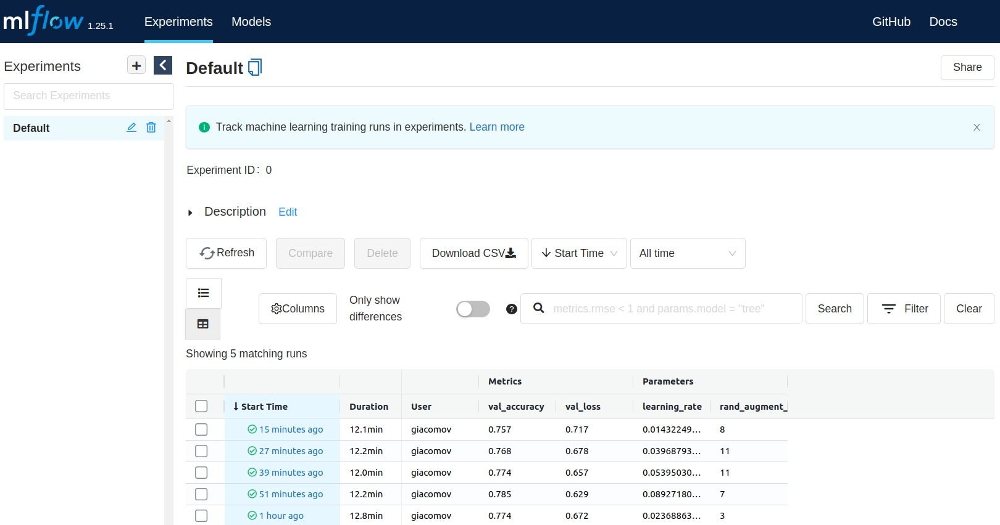

But you can also look at the results in a notebook by doing:

```
runs = mlflow.search_runs()
```

runs is a pandas DataFrame that you can use to look at your results.

We barely scratched the surface about what a tracking tool like mlflow can do for you. For example, they track the code that runs in your experiment so you can reproduce it even if you changed the code in the meantime. If you are looking to apply what you are learning in this course in a professional environment, have a good look at tracking tools and how they can benefit you.

### Exercise: Improving Performance

Now you're ready to try out some of the techniques we have discussed to improve the performances of CNNs.

Follow the instructions in the notebook. As usual, the workspace contains also the solution notebook for your reference.

**udacity_deeplearning_nanodegree/2 Convolutional Neural Networks/3 CNN Depth/Exercise: Improving Performance/improve_cnn.ipynb**

### Exercise Solution: Improving Performance
### Solution, Part 1: Data Augmentation, Model Definition

**video**

### Solution, Part 2: Running and Tracking Experiments to Optimize Hyperparameters

**video**

### Weight Initialization

### What is Weight Initialization?

Weight initialization is a procedure that happens only once, before we start training our neural network. Stochastic Gradient Descent and other similar algorithms for minimization are iterative in nature. They start from some values for the parameters that are being optimized and they change those parameters to achieve the minimum in the objective function (the loss).

These "initial values" for the parameters are set through weight initialization.

Before the introduction of BatchNorm, weight initialization was really key to obtaining robust performances. In this previous era, a good weight initialization strategy could make the difference between an outstanding model and one that could not train at all. These days networks are much more forgiving. However, a good weight initialization can speed up your training and also give you a bit of additional performance.

In general, weights are initialized with random numbers close but not equal to zero, not too big but not too small either. This makes the gradient of the weights in the initial phases of training neither too big nor too small, which promotes fast training and good performances. Failing to initialize the weights well could result in [vanishing or exploding gradients](https://en.wikipedia.org/wiki/Vanishing_gradient_problem), and the training would slow down or stop altogether.

### Weight Initialization in PyTorch

By default, PyTorch uses specific weight initialization schemes for each type of layer. This in practice means that you rarely have to think about weight initialization, as the framework does it for you using high-performance default choices.

If you are curious, you can see how each layer is initialized by looking at the reset_parameters method in the code for that layer. For example, [this is the initialization strategy for a Linear layer](https://github.com/pytorch/pytorch/blob/f9d07ae6449224bdcb6eb69044a33f0fb5780adf/torch/nn/modules/linear.py#L92) (i.e., a fully-connected layer), and t[his is the initialization strategy for a Conv2d layer](https://github.com/pytorch/pytorch/blob/f9d07ae6449224bdcb6eb69044a33f0fb5780adf/torch/nn/modules/conv.py#L140). In both cases PyTorch uses the so-called [He initialization](https://paperswithcode.com/method/he-initialization) (or Kaiming initialization).

### Export a Model for Production

### Wrap Your Model for Inference

Exporting a model for production means packaging your model in a stand-alone format that can be transferred and used to perform inference in a production environment, such as an API or a website.

### Production-Ready Preprocessing

Remember that the images need some preprocessing before being fed to the CNN. For example, typically you need to resize, center crop, and normalize the image with a transform pipeline similar to this:

```
testval_transforms = T.Compose(
    [
        # The size here depends on your application. Here let's use 256x256
        T.Resize(256),
        # Let's take the central 224x224 part of the image
        T.CenterCrop(224),
        T.ToTensor(),
        T.Normalize((0.5, 0.5, 0.5), (0.5, 0.5, 0.5)),
    ]
)
```

Obviously, if you do not do these operations in production the performance of your model is going to suffer greatly.

The best course of action is to make these transformations part of your standalone package instead of re-implementing them in the production environment. Let's see how.

We need to wrap our model in a wrapper class that is going to take care of applying the transformations and then run the transformed image through the CNN.

If we trained with the nn.CrossEntropyLoss as the loss function, we also need to apply a softmax function to the output of the model so that the output of the wrapper will be probabilities and not merely scores.

Let's see an example of such a wrapper class:

```
import torch
from torchvision import datasets
import torchvision.transforms as T
from __future__ import annotations


class Predictor(nn.Module):

    def __init__(
      self, 
      model: nn.Module, 
      class_names: list[str], 
      mean: torch.Tensor, 
      std: torch.Tensor
    ):

        super().__init__()

        self.model = model.eval()
        self.class_names = class_names

        self.transforms = nn.Sequential(
            T.Resize([256, ]),
            T.CenterCrop(224),
            T.ConvertImageDtype(torch.float),
            T.Normalize(mean.tolist(), std.tolist())
        )

    def forward(self, x: torch.Tensor) -> torch.Tensor:
        with torch.no_grad():
            # 1. apply transforms
            x = self.transforms(x)  # =
            # 2. get the logits
            x = self.model(x)  # =
            # 3. apply softmax
            #    HINT: remmeber to apply softmax across dim=1
            x = F.softmax(x, dim=1)  # =

            return x
```

### The Constructor

Let's first look at the constructor __init__: we first set the model to eval mode, and we also save the class names. This will be useful in production: the wrapper will return the probability for each class, so if we take the maximum of that probability and take the corresponding element from the class_names list, we can return the winning label.

Then we have this:

```
self.transforms = nn.Sequential(
            T.Resize([256, ]),  # We use single int value inside a list due to torchscript type restrictions
            T.CenterCrop(224),
            T.ConvertImageDtype(torch.float),
            T.Normalize(mean.tolist(), std.tolist())
        )
```
This defines the transformations we want to apply. It looks very similar to the transform validation pipeline, with a few important differences:

- We do not use nn.Compose but nn.Sequential. Indeed the former is not supported by torch.script (the export functionality of PyTorch).
- In Resize the size specification must be a tuple or a list, and not a scalar as we were able to do during training.
- There is no ToTensor. Instead, we use T.ConvertImageDtype. Indeed, in this context the input to the forward method is going to be already a Tensor

### The forward Method

Let's now look at the forward method:

```
def forward(self, x: torch.Tensor) -> torch.Tensor:
        with torch.no_grad():
            # 1. apply transforms
            x = self.transforms(x)  # =
            # 2. get the logits
            x = self.model(x)  # =
            # 3. apply softmax
            #    HINT: remmeber to apply softmax across dim=1
            x = F.softmax(x, dim=1)  # =

            return x
```

We declare we are not going to need gradients with the torch.no_grad context manager. Then, as promised, we first apply the transforms, then we pass the result through the model, and finally we apply the softmax function to transform the scores into probabilities.

### Export Using torchscript

We can now create an instance of our Predictor wrapper and save it to file using torch.script:

```
predictor = Predictor(model, class_names, mean, std).cpu()

# Export using torch.jit.script
scripted_predictor = torch.jit.script(predictor)
scripted_predictor.save("standalone_model.pt")
```

Note that we move the Predictor instance to the CPU before exporting it. When reloading the model, the model will be loaded on the device it was taken from. So if we want to do inference on the CPU, we need to first move the model there. In many cases CPUs are enough for inference, and they are much cheaper than GPUs.

We then use torch.jit.script which converts our wrapped model into an intermediate format that can be saved to disk (which we do immediately after).

Now, in a different process or a different computer altogether, we can do:

```
import torch

predictor_reloaded = torch.jit.load("standalone_model.pt")
```

This will recreate our wrapped model. We can then use it as follows:

```
from PIL import Image
import torch
import torchvision
import torchvision.transforms as T

# Reload the model
learn_inf = torch.jit.load("checkpoints/transfer_exported.pt")

# Read an image and transform it to tensor to simulate what would
# happen in production
img = Image.open("static_images/test/09.Golden_Gate_Bridge/190f3bae17c32c37.jpg")
# We use .unsqueeze because the model expects a batch, so this
# creates a batch of 1 element
t = T.ToTensor()(img).unsqueeze_(0)

# Perform inference and get the softmax vector
softmax = learn_inf(pil_to_tensor).squeeze()
# Get index of the winning label
max_idx = softmax.argmax()
# Print winning label using the class_names attribute of the 
# model wrapper
print(f"Prediction: {learn_inf.class_names[max_idx]}")
```
NOTE that there are 2 different formats that can be used to export a model: [script](https://pytorch.org/docs/stable/generated/torch.jit.script.html#torch.jit.script) and [trace](https://pytorch.org/docs/stable/generated/torch.jit.trace.html#torch.jit.trace). Scripting is more general, but in some cases you do have to use tracing.

### Glossary

For your reference, here are all the new terms we introduced in this lesson:

- Stride: Amount by which a filter slides over an image.

- Padding: Adding pixels at the border of an image in order to increase the width and/or the height to the desired size. These new pixels can be filled with a constant value (typically zero) or with other strategies based on the content of the original image.

- Average Pooling: The operation of sliding a window over the input image or a feature map and finding the mean average of the numbers present in that window.

- Backbone: The initial part of a CNN, usually comprised of convolutional layers and pooling layers (and optionally BatchNorm and DropOut layers). It usually ends with a flattening of the last feature maps in a vector.

- Head: Takes the output of the backbone (usually a flattened vector) and uses it to perform the classification. It is usually a Multi-Layer Perceptron or a similar achitecture mainly constituted of fully-connected layers.

- Feature Vector: The output of a typical CNN backbone. It is an array containing the features extracted by the backbone, flattened into a 1d array (a vector).

- Embedding An alternative name for the Feature Vector.

- Image augmentation: Artificially creates variations on the training images by applying one or more transformations. It makes the model more robust and less prone to overfitting

- Batch Normalization (BatchNorm): A layer that renormalizes the activations coming from a layer to decouple layers from each other during training. It makes training deep neural network easier and faster.

- Learning rate scheduler: A method for changing the learning rate as the training progresses.

- Transformation: A single operation that is applied to an image, usually during image augmentation. For example, transformations can produce rotations, translations, color changes and so on.

- Weight initialization: A process that sets initial values for the parameters of a network.

### Lesson Review

**video**

### Lesson Review

In this lesson you learned how to:

- Use each of the basic layers that make up a CNN
- Put all these layers together to build a CNN from scratch
- Classify images using CNNs
- Improve the performance of your CNN
- Export models for production
