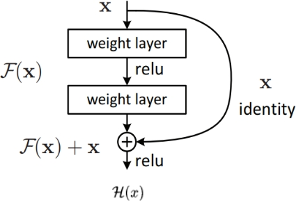
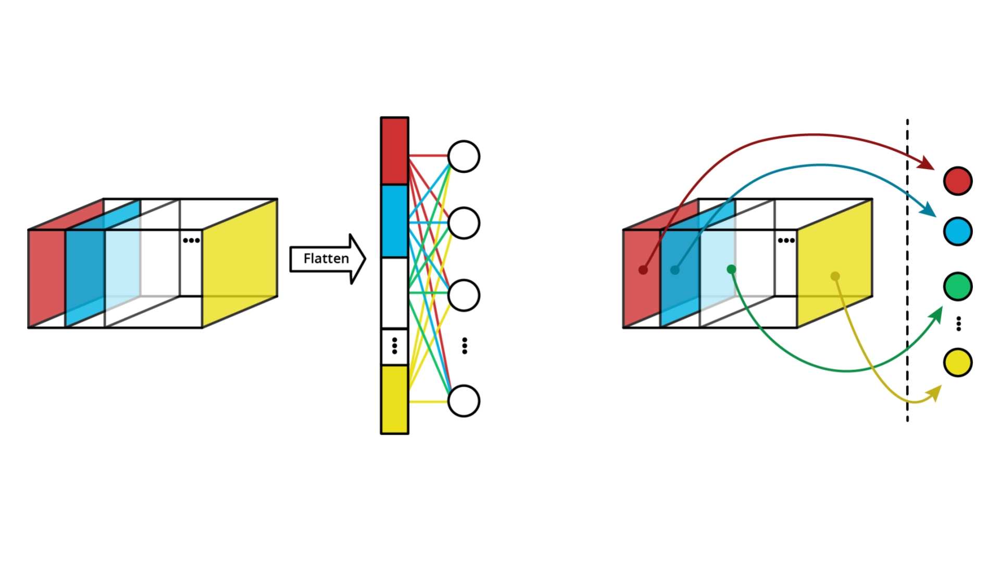
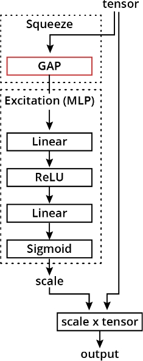
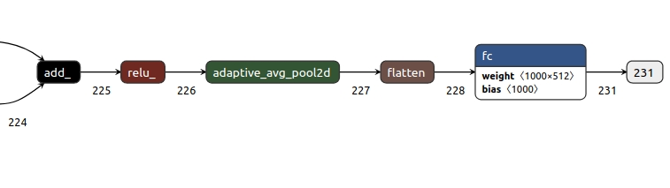
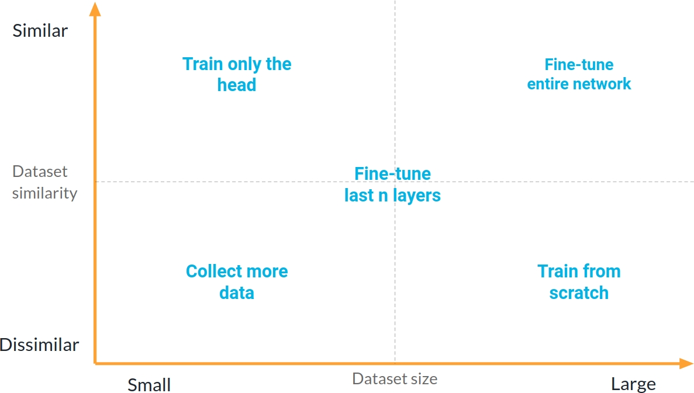
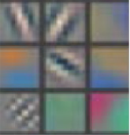
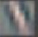
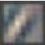
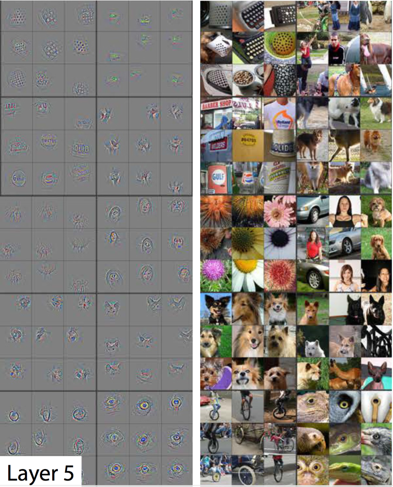

### Introduction to Transfer Learning

### Introduction

**video**

### Summary

Modern deep neural networks are data-hungry. They require very large datasets, with millions of items, to reach their peak performance.

Unfortunately, developing such large datasets from scratch for every use case of deep learning is very expensive and often not feasibe.

Transfer learning is a technique that allows you take a neural network that has been already trained of one of these very large datasets, and tweak it slightly to adapt it to a new dataset.

This requires far less data than training from scratch. This is the reason why transfer learning is a much more common technique for real-life applications than training from scratch.

Using a pre-designed and pre-trained architecture instead of designing your own gives you most of the time the best results, and also saves a lot of time and experimentation.

For all of these reasons, transfer learning is a technique of paramount importance for real-life uses of AI.

### Lesson Outline

**video**

### Lesson Outline

By the end of this lesson, you will be able to:

- Understand key examples of CNN architectures trained on large ImageNet databases
- Apply multiple ways of adapting pre-trained networks using transfer learning
- Fine-tune a network on a new dataset using transfer learning

### Innovative CNN Architectures

We will first take a look at some innovative CNN architectures that accomplished significant breakthroughs in the ImageNet competitions and had good success in real-world applications of AI.

### AlexNet, VGG and an Introduction to ResNet

**video**

### Summary

#### AlexNet

The first CNN architecture to use the ReLU activation function. AlexNet also used DropOut to prevent overfitting. It has the structure of a classical CNN, with a backbone made of convolution and Max Pooling followed by a flattening and a Multi-Layer Perceptron.

You can see the PyTorch code [here](https://github.com/pytorch/vision/blob/59c4de9123eb1d39bb700f7ae7780fb9c7217910/torchvision/models/alexnet.py#L17).

#### VGG

This architecture was designed by the Visual Geometry Group at Oxford. There are two versions, VGG16 and VGG19, with 16 and 19 layers respectively. The designers pioneered the use of many 3 by 3 convolutions instead of fewer larger kernels (for example, the first layer of AlexNet uses a 11 by 11 convolution). Most CNNs up to today still use the same strategy. Apart from that, VGG has an elegant and regular architecture made of convolutional layers followed by Max Pooling layers. The height and width of the feature maps decreases as we go deeper into the network, thanks to the Max Pooling layers, but the number of feature maps increases. The backbone is then followed by a flattening operation and a regular head made of a Multi-Layer Perceptron.

### ResNet in Depth

**video**

### Summary

ResNet is a very important architecture that introduced a fundamental innovation: the **skip connection**.

Before ResNet, deep learning models could not go very deep in terms of number of layers. Indeed, after a certain point, going deeper was hurting performances instead of helping them.

This pointed to problems in the optimization algorithm, because a deeper network should have at worst an identical performance to a shallower network. Indeed, the optimizer could transform the additional layers into the identity function and recover the shallower network exactly.

The fact that this does not happen means that the optimizer has a hard time transforming the last layers in the identity function, and so it converges to a suboptimal solution that makes the second network WORSE than the first. This is largely due to the so-called [vanishing gradient](http://neuralnetworksanddeeplearning.com/chap5.html) problem.

How does ResNet solve this problem? By starting very close to the identity function, using the skip connection:



In the ResNet block we have two convolutional layers with a ReLU in the middle. The output of these two layers is summed to the input tensor x and then another ReLU is applied on the result.

This means that the central part comprising the two layers with the ReLU in the middle is learning the residual, from which comes the name Residual Network, or ResNet for short.

It is easy to see how this block can become the identity function: it is sufficient to put the weights of the kernel of the first or the second convolutional layer to zero (or very close to zero). This will produce a feature map after the two convolutional layers where each pixel is zero. This is then summed to x, which means our block behaves as the identity function because H(x) = x.

With this simple trick we can now go very deep (up to hundreds of layers) and increase significantly the performance of the network.

We can implement the ResNet block in PyTorch as follows:

```
class ResidualBlock(nn.Module):
    def __init__(self, inp, out1, out2):
        super().__init__()

        self.conv_block = nn.Sequential(
            nn.Conv2d(inp, out1, 3),
            nn.ReLU(),
            nn.Conv2d(out1, out2, 3)
        )
        self.relu = nn.ReLU()

    def forward(self, x):
        # F(x)
        F = self.conv_block(x)
        # IMPORTANT BIT: we sum the result of the
        # convolutions to the input image
        H = F + x
        # Now we apply ReLU and return
        return self.relu(H)
```

#### Optional Resources to Explore Further

- Check out the [AlexNet](http://papers.nips.cc/paper/4824-imagenet-classification-with-deep-convolutional-neural-networks.pdf) paper!
- Read more about [VGGNet](https://arxiv.org/pdf/1409.1556.pdf) here.
- The [ResNet](https://arxiv.org/pdf/1512.03385v1.pdf) paper can be found here.
- Read this [detailed treatment](http://neuralnetworksanddeeplearning.com/chap5.html) of the vanishing gradients problem.
- Visit the ImageNet Large Scale Visual Recognition Competition (ILSVRC) [website](http://www.image-net.org/challenges/LSVRC/).

### Input Size and the GAP Layers

#### Fixed Input Size and Global Average Pooling (GAP)
#### Size of the Input Image for CNNs

A classic CNN has a first section comprised of several layers of convolutions and pooling, followed by a flattening and then one or more fully-connected layers.


Convolutional and pooling layers can handle any input size (they will just produce outputs of different size depending on the input size). However, fully-connected layers can only work with an input array of a specific size. Therefore, the vector produced by the flattening operation must have a specific number of elements, because it feeds into the fully-connected layers.

Let's call this number of elements H. This means that the feature maps that are being flattened must have a specific size, so that n_channels x height x width = H. Since the height and width of the last feature maps are determined by the size of the input image, as it flows through the convolutional and the pooling layers, this constraint on the vector produced by the flattening operation translates to a constraint on the size of the input image. Therefore, for CNNs using flattening layers, the input size must be decided a priori when designing the architecture.

### Global Average Pooling (GAP) Layer

We can now introduce a new pooling layer that is widely used in modern CNNs. This type of pooling is equivalent to average pooling, but the average is taken over the entire feature map. It is equivalent to an Average Pooling Layer with the window size equal to the input size.

This layer becomes very interesting because it can be used in place of the flattening operation at the end of the convolutional part of a CNN. Instead of taking the last feature maps and flattening them into a long vector, we take the average of each feature map and place them in a much shorter vector:



<p align="center"> Flattening (left) vs Global Average Pooling (GAP, right) </p> 

This drastically reduces the dimensionality of the resulting vector, from n_channels x height x width to just n_channels. But also, more importantly, it makes the network adaptable to any input size! Let's see how.

If we use the GAP layer instead of flattening, we are going to obtain a vector of constant size independent of the size of the input image, because the size of the vector after the GAP layer is given by the number of feature maps in the last convolutional layer, and it is not influenced by their height and width. Therefore, the input image can have any size because this will not influence the number of feature maps, but only their height and width.

Note however that a network with GAP trained on a certain image size will not respond well to drastically different image sizes, even though it will output a result. So effectively the input size became a tunable parameter that can be changed without affecting the architecture of the CNN.

Many modern architectures adopt the GAP layer.

### Attention Layers

#### Attention

The concept of attention is a very important concept in modern neural networks. It is a simple idea: the network should learn to boost some information that is helpful for a given example, and decrease the importance of information that is not useful for that example.

There are several forms of attention. Let's look at two important ones.

### Channel Attention: Squeeze and Excitation

**video**

### Summary

The term "channel" can refer to the channels in the input image (3 channels if RGB) but also to the number of feature maps are output from a layer.

Channel attention is a mechanism that a network can use to learn to pay more attention (i.e., to boost) feature maps that are useful for a specific example, and pay less attention to the others.

This is accomplished by adding a sub-network that given the feature maps/channels assigns a scale to each input feature map. The feature maps with the largest scale are boosted:



### Brief Introduction to Transformers in Computer Vision

Vision Transformers have been recently introduced, and are becoming more and more important for computer vision. They contain another form of attention, called self attention.

**video**

### Brief Notes on Vision Transformers

Transformers are a family of neural networks originally developed for Natural Language Processing (NLP) applications. They are very good at modeling sequences, such as words in a sentence. They have been extended to deal with images by transforming images to sequences. In short, the image is divided in patches, the patches are transformed into embedded representations, and these representations are fed to a Transformer that treats them as a sequence.

Transformers are characterized by the self-attention mechanism. Just like channel attention allows the network to learn to focus more on some channels, self attention allows the network to learn how to pay attention to the relationship between different words in a sentence or parts of an image.

While CNNs build large Effective Receptive Fields by using many layers, vision Transformers show large receptive fields earlier and more consistently throughout the network.

#### Additional Resources

- Introduction to transformers: [video 1](https://www.youtube.com/watch?v=dichIcUZfOw), [video 2](https://www.youtube.com/watch?v=mMa2PmYJlCo), [video 3](https://www.youtube.com/watch?v=gJ9kaJsE78k&t=2s)
- [The paper that introduced transformers](https://arxiv.org/abs/1706.03762)
- [The paper that introduced transformers for computer vision](https://arxiv.org/abs/2010.11929)

### State of the Art Computer Vision Models

**video**

### State of the Art Models for Computer Vision

Vision Transformers have state-of-the-art performances in many academic computer vision tasks. CNNs are, however, still by far the most widely-used models for real-world computer vision applications.

Transformers are very powerful but they need a lot more data than CNNs, and they are typically slower and more computationally expensive. CNNs are more data-efficient because they are built around two baked-in assumptions: local connectivity, which dictates that pixels close to each other are related (by using small kernels); and weight sharing, which dictates that different portions of an image must be processed identically (by sliding the same convolutional kernel across the entire image). Transformers are much more general, and they do not impose these assumptions. Therefore, they are more adaptable, but need more data to learn these characteristics of many images.

There are also architectures that are hybrids of CNNs and Transformers, which try to create the best combination of both, aiming to be data-efficient but more powerful than pure CNNs.

Summarizing, there are currently 3 categories of computer vision models:

- Pure CNN architectures - still widely used for the majority of real-world applications. Examples: [EfficientNet V2](https://arxiv.org/abs/2104.00298), [ConvNeXt](https://arxiv.org/abs/2201.03545)
- Pure Vision Transformers - currently widely used in academic environments and in large-scale real-world applications. Examples: [ViT](https://arxiv.org/abs/2010.11929), [Swin V2](https://arxiv.org/abs/2111.09883)
- Hybrid architectures that mix elements of CNNs with elements of Transformers. Example: [CoatNet](https://arxiv.org/abs/2106.04803)

As a final note, Transformers are now becoming even more important because they form the basis for multi-modal models - models that deal with, for example, image and text simultaneously. Examples of these are Open AI's [CLIP](https://openai.com/blog/clip/) and Google's [ImageGen](https://imagen.research.google/).

### Transfer Learning

**video**

Transfer learning is a technique that allows us to re-use what a network has learned on one dataset to learn about a different dataset.

While training from scratch requires large datasets and a lot of resources, transfer learning can be applied successfully on much smaller datasets without the need for large computational resources.

### Reusing Pre-Trained Networks

**video**

A normal CNN extracts more and more abstract features the deeper you go in the network. This means that the initial layers, which extract elementary features such as edges and colors, are probably pretty general and can be applied similarly on many different datasets. Instead, the last layers (especially the fully-connected layers) are highly specialized in the task they have been trained on.

Accordingly, in transfer learning we keep the initial layers (that are pretty universal) unchanged or almost unchanged, while we change the last layers that must be specialized by task.

How many layers we keep or modify slightly, and how many layers we change dramatically or even replace, depends on how similar our dataset is to the original dataset and on how much data we have.

So essentially the transfer-learning workflow consists of taking a pre-trained model, freezing some of the initial layers and freeing or substituting some late layers, then training on our dataset.

### Getting a Pre-Trained Model with torchvision

You can find the list of all models supported by torchvision in the [official documentation](https://pytorch.org/vision/stable/models.html) (note that new models are added with each new version, so check that the list you are consulting is appropriate for the version of PyTorch you are using). Then you can load models by name. For example, let's load a resnet architecture:

```
import torchvision.models

model = torchvision.models.resnet18(pretrained=True)
```
The pretrained=True option indicates that we want the weights obtained after training on ImageNet or some other dataset. If we set pretrained=False we get the model initialized with the default initialization, ready to be trained from scratch.

### Freezing and Thawing Layers and Parameters

A frozen parameter is a parameter that is not allowed to vary during training. In other words, backpropagation will ignore that parameter and won't change its value nor compute the gradient of the loss with respect to that parameter.

In PyTorch you can freeze all the parameters of a network using the following code:

```
for param in model.parameters():
    param.requires_grad = False
```
Similarly, you can also freeze the parameters of a single layer. For example, say that this layer is called fc, then:

```
for param in model.fc.parameters():
  param.requires_grad = False
```

You can instead thaw parameters that are frozen by setting requires_grad to True.

### BatchNorm

The BatchNorm layer is a special case: it has two parameters (gamma and beta), but it also has two buffers that are used to accumulate the mean and standard deviation of the dataset during training. If you only use requires_grad=False then you are only fixing gamma and beta. The statistics about the dataset are still accumulated. Sometimes fixing those as well can help the performance, but not always. Experimentation, as usual, is key.

If we want to also freeze the statistics accumulated we need to put the entire layer in evaluation mode by using eval (instead of requires_grad=False for its parameters):

```
model.bn.eval()
```

Note that this is different than using model.eval() (which would put the entire model in evaluation mode). You can invert this operation by putting the BatchNorm layer back into training mode: model.bn.train().

### Understanding the Architecture We Are Using

When doing transfer learning, in many cases you need to know the layout of the architecture you are using so you can decide what to freeze or not to freeze. In particular, you often need either the name or the position of a specific layer in the network.

As usual, we do not encourage the use of print(model) as the output there does NOT necessarily correspond to the execution path coded in the forward method. Instead, use the documentation of the model or export the model and visualize it with [Netron](https://netron.app/) as explained in the next subsection.

### Visualizing an Architecture with Netron

Netron is a web app, so you do not need to install anything locally. First we need to export the model:

```
# Fake image needed for torch.jit.trace
# (adjust the size of the image from 224x224 to what the
# network expects if needed)
random_image = torch.rand((1, 3, 224, 224))

scripted = torch.jit.trace(model, random_image)
torch.jit.save(scripted, "my_network.pt")
```

Then we can go to Netron and load this file. Once the architecture has been loaded, press Crtl+U to visualize the name of each layer. For example, this is the last part of a ResNet architecture:


<p align="center"> Last Layers of a ResNet Architecture </p>

The last layer is called fc. Netron is also telling us that there are 1000 x 512 weights. This means that there are 512 inputs to the layer and 1000 outputs (the ImageNet classes are 1000). If we want to freeze the parameters of that layer we can do:

```
for param in model.fc.parameters():
  param.requires_grad = False
```

### Fine Tuning

**video**

### Transfer Learning

Transfer learning involves taking a pre-trained neural network trained on a source dataset (for example, Imagenet) and adapting it to a new, different dataset, typically a custom dataset for a specific problem.

There are different types of transfer learning and different strategies that you can use depending on:

- The size of your dataset
- How similar your dataset is to the original dataset that the network was trained on (e.g., ImageNet)

We can schematize the different possibilities like this:



### Dataset Size

It is difficult to define what a small dataset or a large dataset is exactly. However, for a typical classification example, a small dataset is in the range of 1000-10,000 images. A large dataset can have 100,000 images or more. These boundaries also change significantly depending on the size of the model you are using. A dataset that is large for a ResNet18 model (a ResNet with 18 layers) could be small for a ResNet150 architecture (a ResNet with 150 layers). The latter has many more parameters and a much larger capacity so it needs more data. In general, the larger the model, the more data it needs.

### Dataset Similarity

Similarly, it is sometimes difficult to judge whether a target dataset is similar to the source dataset. For example, if the source dataset is Imagenet and the target dataset is of natural images, then the two datasets are pretty similar. However, if the target is medical images then the datasets are fairly dissimilar. However, it must be noted that CNNs look at images differently than we do, so sometimes datasets that look different to us are sufficiently similar for the model, and vice-versa. It is important to experiment and verify our assumptions.

### Size of Dataset: What to Do

### Small target dataset, similar to the source dataset: Train the head

This is a typical case, and the case where transfer learning really shines. We can use the pre-trained part of the network to extract meaningful feature vectors and use them to classify our images.

In practice we take the head of the network and we substitute it with one or more new fully-connected layers (with the usual BatchNorm and ReLU layers in-between). Remember that the head of the network is the final part of the network, made typically by an MLP or similar, after the convolution part. It takes the output of the feature extractor part (also called backbone) and uses it to determine the class of the image (in the case of image classification). In some architectures like ResNet the head is just one layer (the last layer); in other architectures it is more complicated, encompassing the last few layers. Of course, the last of these layers needs to have as many output nodes as classes in our problem (or one number in case of regression).

Then we train, keeping all the layers fixed except for the layer(s) we have just added.

For example, let's say we have 1000 images (a small dataset) and a classification task with 10 classes. This is what we could do:

```
import torch.nn as nn
import torchvision.models

## Get a pre-trained model from torchvision, for example
## ResNet18
model = torchvision.models.resnet18(pretrained=True)

## Let's freeze all the parameters in the pre-trained
## network
for param in model.parameters():
    param.requires_grad = False

## Through Netron.app we have discovered that the last layer is called
## "fc" (for "fully-connected"). Let's find out how many input features
## it has
input_features = model.fc.in_features
## We have 10 classes
n_classes = 10
## Let's substitute the existing fully-connected last layer with our
## own (this will have all its parameters free to vary)
model.fc = nn.Linear(input_features, n_classes)
## or we can use a more complicated head (this might or might not
## lead to improved performances depending on the case)
model.fc = nn.Sequential(
    nn.BatchNorm1d(input_features),
    nn.Linear(input_features, input_features * 2),
    nn.ReLU(),
    nn.BatchNorm1d(input_features * 2),
    nn.Dropout(0.5),
    nn.Linear(input_features * 2, n_classes)
)
```

Now we can train our model as usual. You might want to start by executing the learning rate finder we have seen in our previous exercises and train for a few epochs. Depending on the size of your dataset, you might reach good performances rather quickly. It is likely that you will have to train for much less time than you would if you were to train from scratch. Be careful with overfitting and do not overtrain! If needed, also add more image augmentations, weight decay, and other regularization techniques.

### Large dataset, at least somewhat similar to the original dataset: Fine-tune the entire network

If we have more data and/or the task is not very similar to the task that the network was originally trained to solve, then we are going to get better performances by fine-tuning the entire network.

We start by performing the same procedure as the previous case: we remove the existing head, we freeze everything and we add our own head, then we train for a few epochs. Typically 1 or 2 epochs are sufficient.

We then free all the layers and we train until convergence (until the validation loss stops decreasing). We need to be very careful to use a conservative learning rate, to avoid destroying what the network has learned during the original task. A good choice is typically a value between 2 and 10 times smaller than the learning rate we used to train the head. As usual, experimentation is typically needed to find the best learning rate for this phase.

A more advanced technique that works well in practice is to use a [different learning rate for every layer](https://arxiv.org/abs/1801.06146v5). You start with using the maximum learning rate for the last layer and you gradually decrease the learning rate for layers deeper into the network until you reach the minimum for the first convolutional layer.

### Large dataset, very different than the original dataset: Train from scratch

In this situation, fine-tuning does not give us better performance or faster training. We are better off just training from scratch. We can still take advantage of good architectures that performed well on ImageNet, since they are likely to work well on our dataset as well. We can just use them without pre-trained weights, for example:

```
import torch.nn as nn
import torchvision.models

## Get a pre-trained model from torchvision, for example
## ResNet18
model = torchvision.models.resnet18(pretrained=False)
```

### Small dataset, very different than the original dataset: Gather more data or use semi-supervised learning

This is the hardest situation. If you have tried fine-tuning just the head and it did not perform well enough, and fine-tuning more layers resulted in overfitting, you probably need to either collect more data or look into starting from scratch and use [semi-supervised learning](https://en.wikipedia.org/wiki/Semi-supervised_learning).

### Other situations

When it is not clear whether you are in any of the situations described above, you can take approaches that are in-between.

For example, when you have a dataset that is not very small but not very large either, you might get good performances by fine-tuning not only the head, but also a few of the last convolutional layers or blocks. Indeed, these layers encode high-level concepts such as "squares," "triangles," or textures, and therefore can improve by being fine-tuned or even trained from scratch on your data. Just free those layers along with the new head and train those, while keeping the rest fixed. Depending once again on the size of your data and the similarity with the original dataset, you can fine-tune these layers or reset them and train them from scratch. As usual, it takes a bit of experimentation to find the best solution.

### TIMM: A Very Useful Library for Fine-Tuning

When performing fine-tuning (or training with a predefined architecture), we cannot avoid mentioning the fantastic [PyTorch Image Models (timm) library](https://github.com/rwightman/pytorch-image-models). It contains hundreds of models, many with pre-trained weights, and it keeps getting updated with the very latest architectures from the research community. It is very easy to use it for transfer learning. It is an alternative to torchvision that contains many more pretrained models.

First let's install it with:
```
pip install timm
```

Then we can get a pre-trained model with a custom head just by doing:

```
n_classes = 196
model = timm.create_model("convnext_small", pretrained=True, num_classes=n_classes)
```

The library already builds a head for you, so you do not need to build one explicitly.

We can now choose to freeze some or all the layers except the last one, depending on the size of our dataset and its characteristics, and apply the techniques we discussed before.

Note that you do not need to know the details of the architecture to be able to make a new head for it, as timm does that for you.

### Exercise: Transfer Learning, Flowers

**udacity_deeplearning_nanodegree/2 Convolutional Neural Networks/4 Transfer Learning/Exercise: Transfer Learning, Flowers/transfer_learning.ipynb**

### Reflecting on the Performance Difference

In the notebook we have seen that the performance we obtain with transfer learning is significantly better than the performance we obtain by training from scratch. Why?

#### Your reflection

the pre-trained model better trained than our training.

#### Things to think about

The dataset we have is fairly small, so when training from scratch the network does not have enough examples to learn completely the task. Instead, when using transfer learning we start from the weights that have been obtained by training the network on ImageNet. ImageNet contains natural images, so the network has already learned how to extract meaningful features from natural images. Since ImageNet is a very large dataset, the feature extraction that happens in the backbone is capable of extracting good features from the images out of the box (without much training). So we can just substitute the head and train, because the features extracted by the backbone are already enough to assign our custom classes to the images. Sice our dataset is small, but not very small, we can then give a final touch by unfreezing the backbone and training it with a low learning rate.

### Exercise Solution: Transfer Learning, Flowers

**video**

### Visualizing CNNs (part 1)

In this lesson we have looked at how to adapt pre-trained networks to our custom datasets. In a previous lesson you have learned how to train CNNs from scratch. In both cases, the final product is a trained network saved on disk. Now we are going to briefly see how to open that black box and look inside, to see what a trained network has learned and how the information travels through the network and gets processed.

**video**

You can play on your own with the CNN Explainer website [here](https://poloclub.github.io/cnn-explainer/) and verify that what you see there matches your expectations, given what you now know about CNNs.

### Optional Resources

If you would like to know more about interpreting CNNs and convolutional layers in particular, you are encouraged to check out these resources:

#### What is the network looking at?

[This library](https://github.com/jacobgil/pytorch-grad-cam) implements several methods to interpret the decision of a CNN when classifying an image. It also contains references to the relevant papers.

#### Visualizing CNN layers
- Here's a [section](http://cs231n.github.io/understanding-cnn/) from the Stanford CS231n course on visualizing what CNNs learn.
- Here's a [demonstration](https://www.youtube.com/watch?v=AgkfIQ4IGaM&t=78s) of another visualization tool for CNNs. If you'd like to learn more about how these visualizations are made, check out this [video](https://www.youtube.com/watch?v=ghEmQSxT6tw&t=5s).
- Read this [Keras blog post](https://blog.keras.io/how-convolutional-neural-networks-see-the-world.html) on visualizing how CNNs see the world. In this post, you can find an accessible introduction to Deep Dreams. When you've read that:
    - Also check out this [music video](https://www.youtube.com/watch?v=XatXy6ZhKZw) that makes use of Deep Dreams (look at 3:15-3:40)!
    - Create your own Deep Dreams (without writing any code!) using this [website](https://deepdreamgenerator.com/).
- If you'd like to read more about interpretability of CNNs, here's an [article](https://blog.openai.com/adversarial-example-research/) that details some dangers from using deep learning models (that are not fully interpretable) in real-world applications.

### Visualizing CNNs (part 2)

### Visualizing CNNs

Let’s look at a sample CNN that has been pre-trained on ImageNet to see how it works in action. This is an example of an architecture for a transfer learning use case.

Let's verify that what we have discussed in this lesson matches what we see, in particular the fact that the first layers focus on edges and low-level features and can therefore be recycled even on different datasets.

The CNN we will look at is trained on ImageNet as described in [this paper](https://cs.nyu.edu/~fergus/papers/zeilerECCV2014.pdf) by Zeiler and Fergus. In the images below (from the same paper), we’ll see what each layer in this network detects and see how each layer detects more and more complex ideas.


<p align="center"> Example patterns that cause activations in the first layer of the network. These range from simple diagonal lines (top left) to green blobs (bottom middle). </p>

The images above are from Matthew Zeiler and Rob Fergus' [deep visualization toolbox](https://www.youtube.com/watch?v=ghEmQSxT6tw), which lets us visualize what each layer in a CNN focuses on.

Each image in the above grid represents a pattern that causes the neurons in the first layer to activate - in other words, they are patterns that the first layer recognizes. The top left image shows a -45 degree line, while the middle top square shows a +45 degree line. These squares are shown below again for reference.


<p align="center"> As visualized here, the first layer of the CNN can recognize -45 degree lines. </p>


<p align="center"> The first layer of the CNN is also able to recognize +45 degree lines, like the one above. </p>

Let's now see some examples of images that cause such activations. The grid of images below all activated the -45 degree line. Notice how they are all selected despite the fact that they have different colors, gradients, and patterns.


<p align="center"> Sample patches that activate the -45 degree line detector in the first layer </p>

So, the first layer of our CNN clearly picks out very simple shapes and patterns like lines and blobs.

### Layer 2


<p align="center"> A visualization of the second layer in the CNN. Notice how we are picking up more complex ideas like circles and stripes. The gray grid on the left represents how this layer of the CNN activates (or "what it sees") based on the corresponding images from the grid on the right. </p>

The second layer of the CNN captures complex ideas.

As you see in the image above, the second layer of the CNN recognizes circles (second row, second column), stripes (first row, second column), and rectangles (bottom right).

The CNN learns to do this on its own. There is no special instruction for the CNN to focus on more complex objects in deeper layers. That's just how it normally works out when you feed training data into a CNN.

### Layer 3


<p align="center"> A visualization of the third layer in the CNN. The gray grid on the left represents how this layer of the CNN activates (or "what it sees") based on the corresponding images from the grid on the right. </p>

The third layer picks out complex combinations of features from the second layer. These include things like grids, and honeycombs (top left), wheels (second row, second column), and even faces (third row, third column).

We'll skip layer 4, which continues this progression, and jump right to the fifth and final layer of this CNN.

### Layer 5


<p align="center"> A visualization of the fifth and final layer of the CNN. The gray grid on the left represents how this layer of the CNN activates (or "what it sees") based on the corresponding images from the grid on the right. </p>

The fifth (last) layer picks out the highest order ideas that we care about for classification, like dog faces, bird faces, and bicycles.

### Glossary

For your reference, here are all the new terms we introduced in this lesson:

- Skip connection: An innovation of ResNet, this is a path in a network allowing it to jump a layer if needed.

- Global Average Pooling (GAP) layer: A type of pooling equivalent to Average Pooling, but with the average taken over the entire feature map. It is equivalent to an Average Pooling layer with the window size equal to the input size.

- Channel Attention (Squeeze-and-excitation, or SE, block): A little network-in-network that allows the model to pay more attention to some feature maps that are more useful than others to classify a specific image.

- Self Attention: A mechanism alternative to convolution+pooling and characteristic of the Transformers architecture. It allows the model to directly learn the relationship between different parts of the image and use it to solve the task at hand (e.g., image classification).

- Transfer learning: A set of techniques that allow to re-use what a network has learned from a dataset on a different dataset. It allows us to get very good performances much more quickly, and on smaller datasets, than training from scratch.

- Frozen parameter: A parameter that is not allowed to vary during training.

### Lesson Review

**video**

### Lesson Review

In this lesson, you learned:

- About innovative CNN architectures
- How to apply multiple ways of adapting pre-trained networks using transfer learning
- How to fine-tune a pre-trained network on a new dataset using transfer learning

