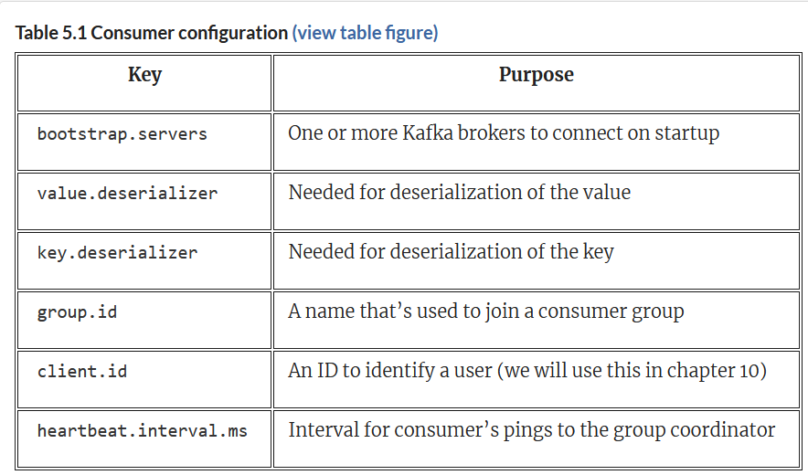
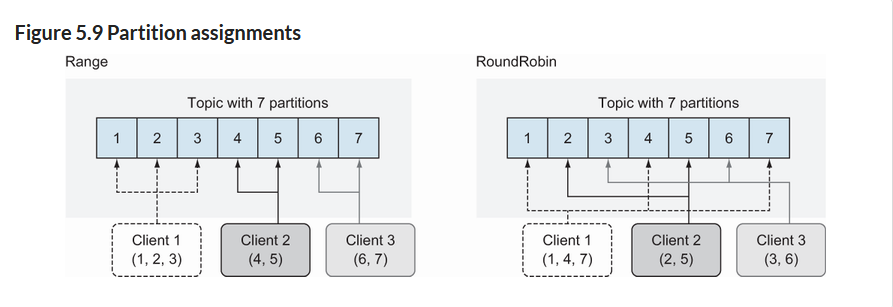

## Consumer
- Client application
- reads messages from topics
- connection pooling
- Network protocol
- Horizontally and elastically scalable
- Maintains ordering within partitions at scale


## Hands On
```bash
$ virtualenv env
$ source env/bin/activate
(env) $ pip install confluent-kafka

(env) $ confluent kafka cluster describe

(env) $ cat config.ini
[default]
bootstrap.servers=< Endpoint >
security.protocol=SASL_SSL
sasl.mechanisms=PLAIN
sasl.username=< API Key >
sasl.password=< API Secret >

[consumer]
group.id=python_kafka101_group_1
# 'auto.offset.reset=earliest' to start reading from the beginning of
# the topic if no committed offsets exist.
auto.offset.reset=earliest

(env) $ cat consumer.py
#!/usr/bin/env python
from argparse import ArgumentParser, FileType
from configparser import ConfigParser
from confluent_kafka import Consumer
if __name__ == '__main__':
    # Parse the command line.
    parser = ArgumentParser()
    parser.add_argument('config_file', type=FileType('r'))
    args = parser.parse_args()

    # Parse the configuration.
    config_parser = ConfigParser()
    config_parser.read_file(args.config_file)
    config = dict(config_parser['default'])
    config.update(config_parser['consumer'])

    # Create Consumer instance
    consumer = Consumer(config)

    # Subscribe to topic
    topic = "poems"
    consumer.subscribe([topic])

    # Poll for new messages from Kafka and print them.
    try:
        while True:
            msg = consumer.poll(1.0)
            if msg is None:
                print("Waiting...")
            elif msg.error():
                print("ERROR: %s".format(msg.error()))
            else:
                # Extract the (optional) key and value, and print.
                print("Consumed event from topic {topic}: key = {key:12} value = {value:12}".format(topic=msg.topic(), key=msg.key().decode('utf-8'), value=msg.value().decode('utf-8')))
    except KeyboardInterrupt:
        pass
    finally:
        # Leave group and commit final offsets
        consumer.close()
    
(env) $ chmod u+x consumer.py
(env) $ ./consumer.py config.in

```



```java
...
  private volatile boolean keepConsuming = true;
 
  public static void main(String[] args) {
    Properties kaProperties = new Properties();
    kaProperties.put("bootstrap.servers", "localhost:9092,localhost:9093,,localhost:9094");
    kaProperties.put("group.id", "kinaction_webconsumer");
    kaProperties.put("enable.auto.commit", "true");
    kaProperties.put("auto.commit.interval.ms", "1000");
    kaProperties.put("key.deserializer", "org.apache.kafka.common.serialization.StringDeserializer");
    kaProperties.put("value.deserializer", "org.apache.kafka.common.serialization.StringDeserializer");
 
    WebClickConsumer webClickConsumer = new WebClickConsumer();
    webClickConsumer.consume(kaProperties);
 
    Runtime.getRuntime()
      .addShutdownHook(
        new Thread(webClickConsumer::shutdown)
      );
  }
 
  private void consume(Properties kaProperties) {
    try (KafkaConsumer<String, String> consumer =
      new KafkaConsumer<>(kaProperties)) {
      consumer.subscribe(
        List.of("kinaction_promos")
      );
 
      while (keepConsuming) {
         ConsumerRecords<String, String> records =
          consumer.poll(Duration.ofMillis(250));
        for (ConsumerRecord<String, String> record : records) {
          log.info("kinaction_info offset = {}, key = {}",
                    record.offset(),
                    record.key());
          log.info("kinaction_info value = {}",
            Double.parseDouble(record.value()) * 1.543);
        }
      }
    }
  }
 
  private void shutdown() {
    keepConsuming = false;
  }
}
```

## Group coordinator
Kafka, as we mentioned in the first chapter, is not limited to having only one consumer. Even if a consuming application does not exist when a message is first created on a topic, as long as Kafka retains the message in its log, then it can still process the data. Because messages are not removed from other consumers or delivered once, consumer clients need a way to keep a record of where they have read in the topic. In addition, because many applications can read the same topic, it is important that the offsets and partitions are specific to a certain consumer group. The key coordinates to let your consumer clients work together is a unique blend of the following: group, topic, and partition number.

the group coordinator works with the consumer clients to keep a record of where inside the topic that specific group has read. The partition’s coordinates of a topic and group ID make it specific to an offset value.

As a general rule, only one consumer per consumer group can read one partition. In other words, whereas a partition might be read by many consumers, it can only be read by one consumer from each group at a time.

A single partition replica is not to be divided or shared between more than one consumer with the same ID.

One of the neat things about being part of a consumer group is that when a consumer fails, the partitions that it was reading are reassigned. An existing consumer takes the place of reading a partition that was once read by the consumer that dropped out of the group.

heartbeat.interval.ms, which determines the amount of pings to the group coordinator. This heartbeat is the way that the consumer communicates with the coordinator to let it know it is still replying in a timely fashion and working away diligently.

## Partition assignment strategy
One item that we will want to be aware of is how consumers get assigned to partitions. This matters since it will help you figure out how many partitions each of your consumers might be taxed with processing. The property partition.assignment.strategy is what determines which partitions are assigned to each consumer. Range and RoundRobin are provided, as are Sticky and CooperativeSticky.

The range assigner uses a single topic to find the number of partitions (ordered by number) and then is broken down by the number of consumers. If the split is not even, then the first consumers (using alphabetical order) get the remaining partitions. Make sure that you employ a spread of partitions that your consumers can handle and consider switching the assignment strategy if some consumer clients use all their resources, though others are fine.

The round-robin strategy is where the partitions are uniformly distributed down the row of consumers.



## Marking our place
One of the important things to think about is your need for assuring that your applications read all messages from your topic. Is it okay to miss a few, or do you need each message confirmed as it’s read? The real decision comes down to your requirements and any trade-offs you are willing to make. Are you okay with sacrificing some speed in order to have a safer method of seeing each message? These choices are discussed in this section.

One option is to use enable.auto.commit set to true, the default for consumer clients. Offsets are committed on our behalf. One of the nicest parts of this option is that we do not have to make any other calls to commit the offsets that are consumed.

When looking at what you commit, notice that timing might not be perfect. If you do not call a commit method on a consumer with metadata noting your specific offset to commit, you might have some undefined behavior based on the timing of polls, expired timers, or even your own threading logic. If you need to be sure to commit a record at a specific time as you process it or a specific offset in particular, you should make sure that you send the offset metadata into the commit method.

Let’s explore this topic more by talking about using code-specific commits enabled by enable.auto.commit set to false. This method can be used to exercise the most management over when your application actually consumes a message and commits it. At-least-once delivery guarantees can be achieved with this pattern.

Now let’s look at some of the code that we would use to control our offsets. As we did with a producer when we sent a message earlier, we can also commit offsets in a synchronous or asynchronous manner.

```java
consumer.commitSync();
#// Any code here will wait on line before
```
```java
...
kaProperties.put("enable.auto.commit", "false");
 
try (KafkaConsumer<String, String> consumer =
     new KafkaConsumer<>(kaProperties)) {
 
      consumer.subscribe(List.of("kinaction_audit"));
 
      while (keepConsuming) {
        var records = consumer.poll(Duration.ofMillis(250));
        for (ConsumerRecord<String, String> record : records) {
          // audit record process ...
 
          OffsetAndMetadata offsetMeta =
            new OffsetAndMetadata(++record.offset(), "");
 
          Map<TopicPartition, OffsetAndMetadata> kaOffsetMap =
            new HashMap<>();
          kaOffsetMap.put(
            new TopicPartition("kinaction_audit",
                               record.partition()), offsetMeta);
 
          consumer.commitSync(kaOffsetMap);
        }
      }
    }
...
```
Looking at that listing for commitSync, it is important to note that the commit takes place in a manner that blocks any other progress in the code until a success or failure occurs.

As with producers, we can also use a callback. Listing shows how to create an asynchronous commit with a callback by implementing the OffsetCommitCallback interface (the onComplete method) with a lambda expression. This instance allows for log messages to determine our success or failure even though our code does not wait before moving on to the next instruction.

```java
public static void commitOffset(long offset,
                                  int partition,
                                  String topic,
                                  KafkaConsumer<String, String> consumer) {
    OffsetAndMetadata offsetMeta = new OffsetAndMetadata(++offset, "");
 
    Map<TopicPartition, OffsetAndMetadata> kaOffsetMap = new HashMap<>();
    kaOffsetMap.put(new TopicPartition(topic, partition), offsetMeta);
 
    consumer.commitAsync(kaOffsetMap, (map, e) -> {
      if (e != null) {
        for (TopicPartition key : map.keySet()) {
          log.info("kinaction_error: offset {}", map.get(key).offset());
        }
      } else {
        for (TopicPartition key : map.keySet()) {
          log.info("kinaction_info: offset {}", map.get(key).offset());
        }
      }
    });
  }
```

```java
kaProperties.put("enable.auto.commit", "false");
 
KafkaConsumer<Alert, String> consumer =
  new KafkaConsumer<Alert, String>(kaProperties);
TopicPartition partitionZero =
  new TopicPartition("kinaction_alert", 0);
consumer.assign(List.of(partitionZero));
 
while (true) {
    ConsumerRecords<Alert, String> records =
      consumer.poll(Duration.ofMillis(250));
    for (ConsumerRecord<Alert, String> record : records) {
        // ...
        commitOffset(record.offset(),
          record.partition(), topicName, consumer);
    }
}
 
...
public static void commitOffset(long offset,int part, String topic,
  KafkaConsumer<Alert, String> consumer) {
    OffsetAndMetadata offsetMeta = new OffsetAndMetadata(++offset, "");
 
    Map<TopicPartition, OffsetAndMetadata> kaOffsetMap =
      new HashMap<TopicPartition, OffsetAndMetadata>();
    kaOffsetMap.put(new TopicPartition(topic, part), offsetMeta);
 
    OffsetCommitCallback callback = new OffsetCommitCallback() {
    ...
    };
    consumer.commitAsync(kaOffsetMap, callback);
}
```
To implement your own callback, you need to use the interface OffsetCommitCallback. You can define an onComplete method definition to handle exceptions or successes as needed.

## Reading options

One of the trickier offset search methods is offsetsForTimes. This method allows you to send a map of topics and partitions as well as a timestamp for each in order to get a map back of the offset and timestamp for the given topics and partitions. This can be useful in situations where a logical offset is not known, but a timestamp is known. For example, if you have an exception related to an event that was logged, you might be able to use a consumer to determine the data that was processed around your specific timestamp. Trying to locate an audit event by time might be used for our topic kinaction_audit to locate commands happening as well.

As listing shows, we have the ability to retrieve the offset and timestamps per a topic or partition when we map each to a timestamp. After we get our map of metadata returned from the offsetsForTimes call, we then can seek directly to the offset we are interested in by seeking to the offset returned for each respective key.

```java
...
Map<TopicPartition, OffsetAndTimestamp> kaOffsetMap =
consumer.offsetsForTimes(timeStampMapper);
...
// We need to use the map we get
consumer.seek(partitionOne,
  kaOffsetMap.get(partitionOne).offset());
```

One thing to be aware of is that the offset returned is the first message with a timestamp that meets your criteria. However, due to the producer resending messages on failures or variations in when timestamps are added (by consumers, perhaps), times might appear out of order.

Kafka also gives you the ability to find other offsets as can be referenced in the consumer Javadoc. With all of these options, let’s see how they apply to our use case. 