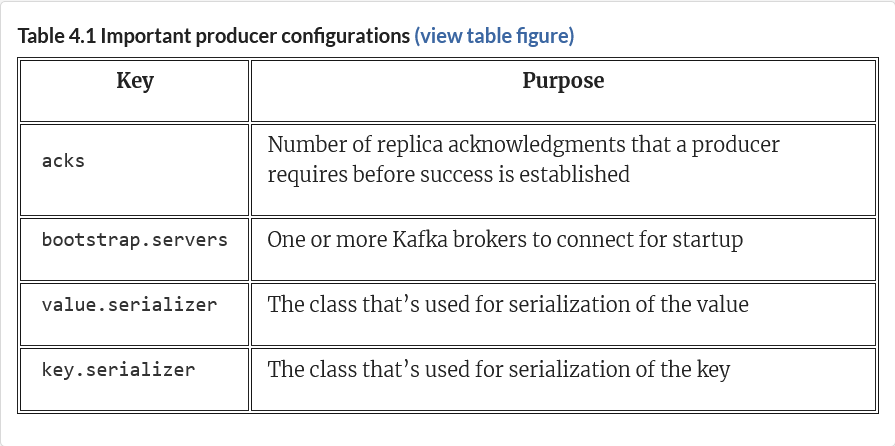

## Producers

The producer’s job includes fetching metadata about the cluster. Because producers can only write to the replica leader of the partition they are assigned to, the metadata helps the producer determine which broker to write to as the user might have only included a topic name without any other details. This is nice because the producer’s end user does not have to make a separate call to get that information. The end user, however, needs to have at least one running broker to connect to, and the Java client library figures out the rest.

Because this distributed system is designed to account for momentary errors such as a network blip, the logic for retries is already built in. However, if the ordering of the messages is essential, like for our audit messages, then besides setting the retries to a number like 3, we also need to set the max.in.flight.requests.per.connection value to 1 and set acks (the number of brokers that send acknowledgments back) to all. In our opinion, this is one of the safest methods to ensure that your producer’s messages arrive in the order you intend. We can set the values for both acks and retries as configuration parameters.

Another option to be aware of is using an idempotent producer. The term idempotent refers to how sending the same message multiple times only results in producing the message once. To use an idempotent producer, we can set the configuration property enable.idempotence=true. We will not be using the idempotent producer in our following examples.



Another configuration property that applies to our scenario is the acks key, which stands for acknowledgments. This controls how many acknowledgments the producer needs to receive from the partition leader’s followers before it returns a completed request. The valid values for this property are all, -1, 1, and 0. The values all or -1 are the strongest available option for this configuration setting.

## Timestamps
Recent versions of the producer record contain a timestamp on the events you send. A user can either pass the time into the constructor as a Java type long when sending a ProducerRecord Java object or the current system time. The actual time that is used in the message can stay as this value, or it can be a broker timestamp that occurs when the message is logged. Setting the topic configuration message.timestamp.type to CreateTime uses the time set by the client, whereas setting it to LogAppendTime uses the broker time.


```java
Properties kaProperties = new Properties(); 
kaProperties.put( "bootstrap.servers", "localhost:9092,localhost:9093,localhost:9094");
kaProperties.put("acks", "all");
kaProperties.put("retries", "3");
kaProperties.put("max.in.flight.requests.per.connection", "1");
```

The following listing shows the get method, which is how we can bring about waiting for the response to complete synchronously before moving on in the code. Note that the following listing was informed by examples located at: 
```java
RecordMetadata result = producer.send(producerRecord).get();
log.info("kinaction_info offset = {}, topic = {}, timestamp = {}", result.offset(), result.topic(), result.timestamp());
producer.close();
```
Waiting on the response directly in a synchronous way ensures that the code is handling each record’s results as they come back before another message is sent. The focus is on delivering the messages without loss, more than on speed!

```java
public class AlertTrendingProducer {
 
  private static final Logger log =
      LoggerFactory.getLogger(AlertTrendingProducer.class);
 
  public static void main(String[] args)
      throws InterruptedException, ExecutionException {
 
    Properties kaProperties = new Properties();
    kaProperties.put("bootstrap.servers",
      "localhost:9092,localhost:9093,localhost:9094");
    kaProperties.put("key.serializer",
      AlertKeySerde.class.getName());
    kaProperties.put("value.serializer",
      "org.apache.kafka.common.serialization.StringSerializer");
 
    try (Producer<Alert, String> producer =
      new KafkaProducer<>(kaProperties)) {
 
      Alert alert = new Alert(0, "Stage 0", "CRITICAL", "Stage 0 stopped");
      ProducerRecord<Alert, String> producerRecord =
          new ProducerRecord<>("kinaction_alerttrend",
            alert, alert.getAlertMessage());
 
      RecordMetadata result = producer.send(producerRecord).get();
      log.info("kinaction_info offset = {}, topic = {}, timestamp = {}",
               result.offset(), result.topic(), result.timestamp());
    }
  }
}
```

So far in our examples of writing to Kafka, the data was directed to a topic with no additional metadata provided from the client. Because the topics are made up of partitions that sit on the brokers, Kafka provides a default way to send messages to a specific partition. The default for a message with no key (which we used in the examples thus far) was a round-robin assignment strategy prior to Kafka version 2.4. In versions after 2.4, messages without keys use a sticky partition strategy. However, sometimes we have specific ways that we want our data to be partitioned. One way to take control of this is to write our own unique partitioner class.

The client also has the ability to control what partition it writes to by configuring a unique partitioner.
