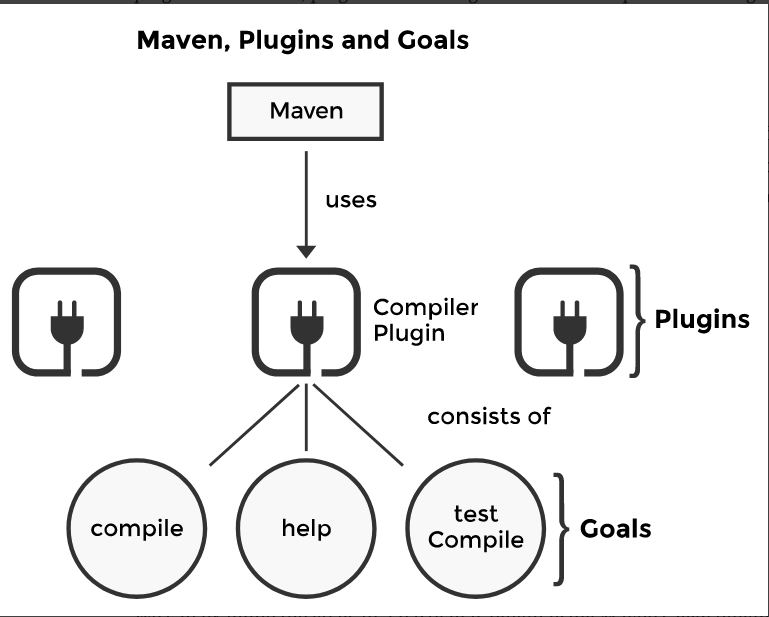
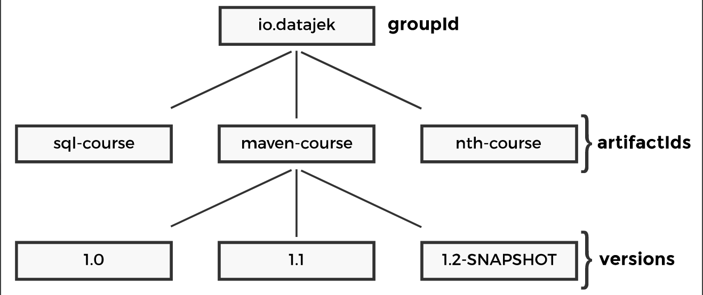

## Plugin

Maven can accept plugins to perform various tasks. The core of Maven is limited and small, a harness that leverages the intelligence of the plugins attached to it to perform various tasks. Some of the most common plugins are:

- Compiler Plugin: contains the logic to compile
- Jar Plugin: contains the logic to create jars
- Surefire Plugin: contains the logic to execute unit tests

There are numerous other plugins that can be used. In fact, we can even write our own plugins. Remember, plugins are nothing but code that implement the logic to perform various tasks during the build process.

## Goal

A Maven plugin consists of goals which is a unit of work. You can think of it as representing the capability of a plugin. A goal is an action we want to take on the project defined by a POM (covered later) file. The following illustration shows the relationship between the different entities we’ve discussed so far.



We can examine the goals in a particular plugin using Maven’s help plugin. You can execute the commands in the widget below and see the goals printed out for the compiler plugin. The command is:

```bash
# Execute the following command to see the details for the compiler plugin
mvn help:describe -Dplugin=org.apache.maven.plugins:maven-compiler-plugin

# We add the argument -Ddetail and now the output gives detailed description
# of each plugin goal.
mvn help:describe -Dplugin=org.apache.maven.plugins:maven-compiler-plugin -Ddetail
```

## Coordinates

Projects don’t exist in isolation. Any substantial project will have dependencies on other projects. The POM file for a project defines the list of projects the current one depends on. But how do we uniquely identify projects? Projects need to be unambiguously identifiable so that they can be referred to in other projects. Maven makes this possible through a combination of fields defined in a POM file called the Maven coordinates. These are:

    groupId: This can be the group, company, or department responsible for creating the project. The convention is to use the domain name in reverse order. For instance, for our company the groupdId would be io.datajek.

    artifactId: A unique name for the project under the groupId. A team in your company that produces several jar libraries for other teams to consume will have a unique artifactId for each library, but the same groupId.

    version: The version specifies a particular release of the project. Imagine your team releases improvements to a particular library on a quarterly basis, each release would get a different version number.

The relationship between these identifiers is shown below:



An example of the three values for a project is shown below:
```xml
<groupId>io.datajek</groupId>
<artifactId>maven-course</artifactId>
<version>1.0-SNAPSHOT</version>
```

Together these three attributes uniquely identify a project. No two projects can have the same values for all three attributes. Furthermore, two more POM fields are listed as Maven coordinates but don’t participate in uniquely identifying a project. These are:

- packaging: Defines the type of a project. A project with packaging set to jar will produce a jar archive, while one with war will produce a web application.
- classifier: Consider you are writing a Java application that you intend to support on Java versions 8 and 11. One way to distinguish between the artifacts you produce for the two versions is to use the classifier. The classifier is an optional arbitrary string that, if present, is appended to the artifact name after the version number. The classifier allows us to distinguish between artifacts built from the same POM that differ in content. In our hypothetical example we can set the classifier to be jdk8 and jdk11 for the two artifacts and let consumers chose according to their available Java version.

Maven coordinates are expressed in the following format using colons as the delimiter:

```
groupId:artifactId:packaging:version
```
An example for our project will be:
```
io.datajek:maven-course:jar:1.0-SNAPSHOT
```
Using coordinates, it becomes trivial to express the dependencies of a project in its POM file. In later lessons, we’ll learn how to define dependencies

## Repositories
There are two kinds of repositories and it’s important to understand how they work with each other. These are:

- Local Repository
- Remote Repository

By default, the local repository is created at the path (Unix systems) /<username>/.m2/repository or ~/.m2/repository.

In general, artifacts are installed at the path with the following format relative to the repository’s root:
```
<groupId>/<artifactId>/<version>/<artifactId>-<version>.<packaging>
```

The remote repository location can be configured in a settings.xml file under the .m2 directory.

## Build lifecycle

Maven supports the concept of a build lifecycle which can be loosely defined as an ordered set of actions Maven takes for building and distributing a particular artifact or project.

A build life cycle consists of build phases where each phase has plugin goals attached to it. The plugin goals are executed when the phase executes as part of the life cycle.

## POM

A Maven project is described by a POM file. POM stands for Project Object Model and is a declarative description of a project. It defines the unique Maven coordinates of the project, the dependencies of the project, required plugins, any parameters required for the goals Maven executes in the context of the project, etc. It is an XML file that contains information about the project and configuration details used by Maven to build the project. Maven, when invoked, looks for the POM file and works from it. In the absence of a POM file, Maven will throw an error.

Some of the configurations that can be specified in the POM are the project dependencies, the plugins or goals that can be executed, the build profiles, and so on. Other information such as the project version, description, developers, mailing lists, and so on can also be specified

Here’s the minimal version of a POM file:
```xml
<?xml version="1.0" encoding="UTF-8"?>

<project>

    <modelVersion>4.0.0</modelVersion>
    <groupId>io.datajek</groupId>
    <artifactId>empty-project</artifactId>
    <version>1</version>

</project>
```
The POM is an XML file and the schema of an XML file is governed by a corresponding XSD file, short for XML Schema Definition. An XSD file formally describes the elements in an Extensible Markup Language (XML) document. For Maven, the structure of the POM file is described by an XSD file and is represented by the element <modelVersion> in the POM file. We set the element <modelVersion> to the value 4.0.0. Quoting from the official documentation: The <modelVersion> element indicates what version of the object model this POM is using. The version of the model itself changes very infrequently but it is mandatory in order to ensure stability of use if and when the Maven developers deem it necessary to change the model. The model refers to the structure of the POM file, e.g., what elements are allowed, what elements are mandatory, or how to interpret them. The XSD can be found [here](https://maven.apache.org/xsd/maven-4.0.0.xsd).

## Super POM

The Super POM is Maven's default POM. All POMs extend the Super POM unless explicitly set, meaning the configuration specified in the Super POM is inherited by the POMs you created for your projects.

Maven defines a base POM file called Super POM that is implicitly inherited by all POMs. Recall the minimal POM we presented in the previous lesson. The minimal POM inherits several properties from the Super POM. We can also explicitly define a parent POM for a project other than the Super POM, but the parent POM will in turn inherit from the Super POM. The Super POM is referenced [here](https://maven.apache.org/ref/3.6.3/maven-model-builder/super-pom.html).

 The POM that results after applying the Super POM defaults, inheritance, variable interpolation, and active profiles is known as the Effective POM and used by Maven to build the project. We can print the effective POM for a project using the maven-help-plugin’s effective-pom goal. Let’s try it out in the terminal below:

 ```bash
 mvn help:effective-pom -Dverbose
 ```

 ## Inheritance
 Introducing a parent POM can help extract out common configurations among an organization’s projects and consolidate them in a parent POM from which all other projects inherit. POM inheritance allows the following to be merged:

- dependencies
- developers and contributors
- plugin lists (including reports)
- plugin executions with matching ids
- plugin configuration
- resources

## Project Aggregation
Project Aggregation is similar to Project Inheritance. But instead of specifying the parent POM from the module, it specifies the modules from the parent POM. By doing so, the parent project now knows its modules, and if a Maven command is invoked against the parent project, that Maven command will then be executed to the parent's modules as well. To do Project Aggregation, you must do the following:
- Change the parent POMs packaging to the value "pom".
- Specify in the parent POM the directories of its modules (children POMs).

## Interpolation and Variables

Maven allows using predefined and user-defined variables in a POM file. This avoids repeating values across child POMs and also makes modifications easy as any change only needs to be applied at one place.

Any elements with a single value present in the project model (the XSD that defines the structure of a POM file) can be accessed using the prefix project.. For instance, we can access the version of the project using project.version. Similarly, if we want to access the default value of the source directory defined in the super POM, we can do so using the expression project.build.sourceDirectory. Some of the variables are special, i.e., not defined in the POM or super POM, such as project.basedir and maven.build.timestamp.

Users can define their own variables as properties under the properties XML element and can then use the variable as ${X} where X is the name of the property. Properties defined in a parent POM can also be used in a child POM.

Maven also allows for use of other properties listed below:

1. Environment variables can be accessed using the prefix env., for instance ${env.PATH} will access the PATH variable.
2. Elements in the settings.xml file can be accessed using the prefix settings., for instance ${settings.offline}.
3. Java system properties returned by the snippet java.lang.System.getProperties() can also be accessed as POM properties using the java. prefix, for instance ${java.home}.

## Version

The version for a project should follow the below pattern:

<majorVersion>.<minorVersion>.<incrementalVersion>-<qualifier>

Following this format for defining project versions is helpful when defining project dependencies. We can define project dependencies as a range instead of a specific version. Maven will be able to determine the versions of a project that fall into a range if the above pattern of naming the project versions is followed. A range can be specified using the following:

- (, ) exclusive quantifiers
- [, ] inclusive quantifiers

For instance, if the version is specified as below:
```xml
<version>[3.8, 4.0)</version>
```
It implies that the dependency with a version of 3.8 or higher but less than 4.0 should be used. The lower boundary is inclusive, but the upper boundary is exclusive.

## SNAPSHOT version

As a developer you’ll often come across artifact versions labelled as SNAPSHOT. A snapshot version signifies that the project is under active development and is treated slightly differently when deployed by Maven in a repository. The SNAPSHOT value refers to the latest code along a development branch and isn’t considered stable or unchanging.

Maven always fetches the latest SNAPSHOT version from the remote repository for a SNAPSHOT dependency. This is in contrast to regular versions, whereby Maven looks up the dependency in the local repository; if found, an attempt to fetch the dependency from the remote repository is not made.

When uploading/deploying an artifact to a repository, if Maven encounters a version ending in “-SNAPSHOT”, it substitutes the token with a timestamp. The repository manager and client tools manage the translation from the snapshot version to the timestamped version. As a user, if you want to add a SNAPSHOT dependency, you’ll put in the version as “*-SNAPSHOT” and always get the latest version of the dependency.

## Dependency

One of the tasks Maven excels at is handling dependencies for a given project. It can also handle transitive dependencies, which means if your project P depends on a jar A, which in turn depends on jar B, then Maven would download both the dependencies for you. In this case, jar A will be referred to as a direct dependency while jar B will be considered a transitive dependency for your project P. If jar B is in turn dependent on jar C, and jar C is in turn dependent on jar D, Maven will also download jars C and D when building your project P. Jars B, C, and D will collectively be called as transitive dependencies.

Maven can also resolve any dependency version conflicts and allow certain dependencies to be excluded. But how is Maven able to determine the complete set of dependencies for a given project? This is made possible by the POM file that is also installed for an artifact in the repository. Recall that the empty-project-1.jar artifact was installed in the local repository with the empty-project-1.pom file too. So now, if a new project takes a dependency on the empty-project.jar, Maven will be able to determine transitive dependencies using the empty-project-1.pom file and download dependencies for empty-project-1.jar too.

```xml
<dependency>
    <groupId>com.google.api-client</groupId>
    <artifactId>google-api-client</artifactId>
    <version>1.30.9</version>
</dependency>
```

We used the command below to print the dependency tree for the artifact.
```bash
mvn dependency:tree -Dverbose
```
The command invokes the tree goal of the dependency plugin and the system property verbose is specified for a detailed output. The plus \\+ symbol indicates several nodes on the same level, while the \\- symbol indicates one single node or the last node for that level of hierarchy.

## Dependency Scopes

When a dependency is specified it is also accompanied by a scope. The scope element controls two aspects: first, if a dependency should be included with the application packaging, and second, which classpath a dependency should be included in. A classpath is the location of the classes and packages that a project is dependent on.

These scopes are discussed below:
1. Compile: This is the default scope for a dependency. The scope is set to compile if the \<scope\> element is not explicitly specified. Compile-scoped dependencies are available in all classpaths. For instance, the below example has a compile scope by default.
```xml
<dependency>
    <groupId>org.apache.hadoop</groupId>
    <artifactId>hadoop-common</artifactId>
    <version>3.3.0</version>
</dependency>
```
2. Test: Any dependencies that are only required for compiling and executing tests should be test-scoped. These dependencies aren’t required for the execution of a project’s artifacts and need not be included with the packaging. The standard use case for this scope is adding test libraries, e.g.,
```xml
<dependency>
    <groupId>junit</groupId>
    <artifactId>junit</artifactId>
    <version>3.8</version>
    <scope>test</scope>
</dependency>
```
3. Runtime: Runtime-scoped dependencies are needed when the project executes or is being tested but are not required for compiling the project. Dependencies marked with the runtime scope will be present in runtime and test classpaths, but they will be missing from compile classpath. This is typically dynamically loaded code, such as JDBC drivers or MySQL connectors, which are not directly referenced in the program code. A runtime dependency is copied into your deployed application, but it is not available during compilation. This ensures that a developer doesn’t mistakenly depend on a specific library that is intended to be a runtime dependency.
```xml
<dependency>
    <groupId>mysql</groupId>
    <artifactId>mysql-connector-java</artifactId>
    <version>8.0.21</version>
    <scope>runtime</scope>
</dependency>
```
4. Provided: Dependencies that are provided by the JDK or by a container, e.g., an application server or a servlet container, should be scoped as provided. As an example, consider you are developing a web application and would need the Servlet API available on the compile classpath to compile a servlet. However, you don’t want to include the Servlet API in the packaged WAR file since the Servlet API jar will be supplied by your application server or the servlet container. Provided-scoped dependencies are available on the compile classpath, but not on the runtime classpath.
```xml
<dependency>
    <groupId>javax.servlet</groupId>
    <artifactId>servlet-api</artifactId>
    <version>3.0-alpha-1</version>
    <scope>provided</scope>
</dependency>
```
5. System: The system scope is similar to the provided scope, however, the difference is that in case of system-scoped dependencies the path to the dependency on the local machine is specified via the \<systemPath\> element. Maven will look for the dependency on the local machine at the specified path and not in the local or remote repository. This has the obvious disadvantage that other developers will be expected to have the dependency at the same path on their local machines in order to successfully build the project.
```xml
<dependency>
    <groupId>io.datajek</groupId>
    <artifactId>some-dependency</artifactId>
    <version>1.0</version>
    <scope>system</scope>
    <systemPath>${project.basedir}/libs/some-dependency-1.0.jar</systemPath>
</dependency>
```
6. Import: The import scope was introduced in Maven 2.0.9 and is only applicable to a dependency of type POM. An import-scoped dependency indicates that it should be replaced with the dependencies in its \<dependencyManagement\> section.
```xml
<dependency>
    <groupId>io.datajek</groupId>
    <artifactId>some-pom-dependency</artifactId>
    <version>2.0</version>
    <type>pom</type>
    <scope>import</scope>
</dependency>
```
we can find the dependencies resolved along with their scope using the following command:
```bash
mvn dependency:resolve
```
We can also determine the classpath for compile, test, or other phases.
```bash
mvn dependency:build-classpath -DincludeScope=compile
```

## Excluding transitive dependencies#

```xml
<dependency>
    <groupId>io.datajek</groupId>
    <artifactId>project9-projectb</artifactId>
    <version>1</version>
    <exclusions>
        <exclusion>
            <groupId>com.google.code.gson</groupId>
            <artifactId>gson</artifactId>
        </exclusion>
    </exclusions>
</dependency>
```

## Dependency management

When working at enterprise-scale, it is common to encounter several dozen projects using a particular version of a dependency. Because of how the projects are intertwined, upgrading or downgrading the version of the dependency in one project may require duplicating the effort across all the projects. This creates a maintenance nuisance where every project’s POM file has to be updated. There could also be other reasons to synchronize the version of a dependency across projects in an enterprise. For instance, because of licensing restrictions or known security vulnerabilities, only “blessed” versions of a dependency are allowed for use in an enterprise. One way to tackle this issue is to use dependency management in Maven. Usually, the set-up consists of a parent POM that is shared among the projects. Within the parent POM we define a section, \<dependencyManagement\>, which lists dependencies and their preferred versions. Any child project that inherits from the parent POM can now declare a dependency without the version, as long as the dependency appears in the list of dependencies under the \<dependencyManagement\> section in the parent POM.

```xml
<dependencyManagement>
    <dependencies>
        <dependency>
            <groupId>com.google.code.gson</groupId>
            <artifactId>gson</artifactId>
            <version>2.7</version>
        </dependency>
    </dependencies>
</dependencyManagement>
```

Another purpose served by the dependency management section is to control the versions of artifacts to be used when they are encountered in transitive dependencies or in dependencies where no version has been specified. The desired versions for transitive dependencies can be specified by project authors in the \<dependencyManagement\> section.

Consider the setup of two projects, where the first one acts as a parent and the second as the child. The parent defines a dependency management section as follows:
```xml
<dependencyManagement>
    <dependencies>
        <dependency>
            <groupId>com.google.code.gson</groupId>
            <artifactId>gson</artifactId>
            <version>2.8.6</version>
        </dependency>
    </dependencies>
</dependencyManagement>
```

And the child POM declares a dependency on the Gson artifact as follows:
```xml
<dependencies>
    <dependency>
        <groupId>com.google.code.gson</groupId>
        <artifactId>gson</artifactId>
    </dependency>
</dependencies>
```

Note that the version is missing in the child POM and Maven walks up the parent-child hierarchy until it finds a project with a \<dependencyManagement\> element and uses the version specified in the \<dependencyManagement\> section for the dependency. However, if the child project did define a version, it would override the version listed in the parent POM’s dependency management section. In other words, the \<dependencyManagement\> version is used only when the child does not declare a version directly.

## Optional Dependencies
A dependency can be marked as optional using the \<optional\> tag and putting in the value as true. An example is shown in the snippet below.
```xml
<dependency>
    <groupId>com.google.code.gson</groupId>
    <artifactId>gson</artifactId>
    <version>2.8.6</version>
    <optional>true</optional>
</dependency>
```

## Working with Plugins
Maven at its heart is a plugin execution framework. It can get new capabilities by including plugins and leveraging their goals. This opens up Maven for constant innovation and enables it to address new use cases as they come up. There are two kinds of plugins:

1. Build Plugins: These plugins run during build and are configured in the \<build\> element.
2. Reporting Plugins: These plugins run during site generation and are configured in the \<reporting\> element.

Some of the important plugins are listed [here](https://maven.apache.org/plugins/index.html) on the official Maven documentation and worth a cursory look.

A plugin is identified by an artifactId, groupId, and a version. When we execute a maven command in the format **mvn \<phase\>**, plugin goals tied to the phase are executed. But we can also invoke a particular plugin goal individually using one of the following commands:

1. groupId:artifactId:version:goal e.g., mvn org.apache.maven.plugins:maven-clean-plugin:2.5:clean
2. groupId:artifactId:goal e.g., mvn org.apache.maven.plugins:maven-clean-plugin:clean
3. prefix:goal e.g., mvn clean:clean

```xml
<build>
    <plugins>
        <plugin>
            <groupId>org.apache.maven.plugins</groupId>
            <artifactId>maven-clean-plugin</artifactId>
            <version>3.0.0</version>
            <configuration>
                <verbose>true</verbose>
                <outputDirectory>/Project11/test</outputDirectory>
            </configuration>
        </plugin>
    </plugins>
</build>
```

A plugin goal is nothing but some coded logic that executes when the goal is invoked. In Maven parlance, a goal is called a Maven plain Old Java Object or Mojo. Each mojo is an executable goal in Maven, and a plugin is a distribution of one or more related mojos.


The \<executions\> element contains information about when we want to execute a particular goal of the plugin. The other elements are discussed below:
```xml
<plugin>
    <groupId>org.codehaus.mojo</groupId>
    <artifactId>exec-maven-plugin</artifactId>
    <version>3.2</version>
    <executions>
        <execution>
            <id>my-special-exec</id>
            <phase>install</phase>
            <goals>
                <goal>exec</goal>
            </goals>
            <configuration>
                <executable>/Project12/myScript.sh</executable>
            </configuration>
        </execution>
    </executions>
</plugin>
```

1. id: is the identifier for the execution. IDs have to be unique among all executions of a single plugin within a POM. They don’t have to be unique across an inheritance hierarchy of POMs. We can invoke a plugin using the ID on the command line directly.

2. phase: is the phase of a lifecycle the goal is bound to, i.e. the stage within the lifecycle when the goal would get executed. We can also skip the phase, if the goal already has a default phase bound to it within which it executes, e.g., as we saw in the case of the clean plugin. But if the goal is not bound to any lifecycle phase then it simply won’t be executed.

3. goal: The name of the goal we wish to execute. For our example, we want to execute the goal exec. The plugin also offers another goal by the name of java.

4. configuration: Under the configuration element we’ll add all the plugin specific parameters and their values. The astute reader may question why the \<configuration\> element for the clean plugin appears twice in the first exhibit. The reason is, prior to Maven 3.3.1 if we wanted to invoke a plugin goal directly from the command line, the configuration in the POM wouldn’t apply since it resided within the \<executions\> element and took effect only when the lifecycle phase it was bound to, was invoked. To have the configuration apply when the goal is invoked on the command line, the \<configuration\> element had to be taken outside of \<executions\>. With the latest Maven version, this isn’t the case anymore as we can also invoke a goal with a particular execution context using the execution ID as follows:

```bash
mvn <plugin-prefix>:<plugin-goal>@<execution-id>

## e.g. for our example, the invocation will be:
mvn exec:exec@my-special-exec
```
Note, that if we try to invoke the plugin goal by itself on the command line mvn exec:exec, it’ll fail because there’s no associated configuration. We can duplicate the \<configuration\> element from the \<execution\> section and insert it after the \<executions\> element in the POM file. This would allow the goal to execute by itself without having to be part of a lifecycle phase, because the configuration outside the \<executions\> applies globally to all invocations of the plugin.

5. dependencies: Though not covered in this example, if a plugin is dependent on other artifacts, we can add them as a dependency and specify the desired version for the plugin to use.

6. inherited: Plugin configuration is propagated to child POMs by default but in case we want to break the inheritance, we can use the \<inherited\> tag and set it to false. We’ll see a practical example of its use in later lessons.

We have already covered \<dependencyManagement\> and how it can be used to factor out common dependencies and their associated versions in one place. The \<pluginManagement\> tag offers similar functionality from the perspective of plugins.

```xml
<build>
    <pluginManagement>
        <plugins>
            <plugin>
                <groupId>org.codehaus.mojo</groupId>
                <artifactId>exec-maven-plugin</artifactId>
                <version>3.0.0</version>
                <executions>
                    <execution>
                        <id>my-special-exec</id>
                        <phase>clean</phase>
                        <goals>
                            <goal>exec</goal>
                        </goals>
                        <configuration>
                            <executable>${project.parent.basedir}/myScript.sh</executable>
                        </configuration>
                    </execution>
                </executions>
            </plugin>
        </plugins>
    </pluginManagement>
</build>
```

The parent POM file has the exec-maven-plugin configuration from the previous lesson, but it is wrapped inside the \<pluginManagement\> element. Note that adding the plugin details inside the \<pluginManagement\> element will not cause the plugin to execute for an inheriting child project. The child project must include the plugin coordinates in its \<build\> section for the plugin to execute with the configuration inherited from the parent POM. 

```xml
<?xml version="1.0" encoding="UTF-8"?>

<project>

    <modelVersion>4.0.0</modelVersion>

    <groupId>io.datajek</groupId>
    <artifactId>project13-child</artifactId>
    <version>1</version>

    <name>Child</name>

    <parent>
        <groupId>io.datajek</groupId>
        <artifactId>project13</artifactId>
        <version>1</version>
    </parent>

    <properties>
        <maven.compiler.source>1.8</maven.compiler.source>
        <maven.compiler.target>1.8</maven.compiler.target>
    </properties>

    <build>
        <plugins>
            <plugin>
                <groupId>org.codehaus.mojo</groupId>
                <artifactId>exec-maven-plugin</artifactId>
            </plugin>
        </plugins>
    </build>


</project>
```

Note that we have specified the complete information required to run the plugin goal. Also, the path to the script is specified as ${project.parent.basedir} because when we run the plugin goal from the child project, it’ll have to refer to the parent’s base directory. But we could also leave out details to be filled in by the inheriting child projects or have them override the existing details.

## Build Profiles

The notion of a profile when building Maven projects stems from the need for build portability. The ease with which a particular project can be built for different environments is referred to as build portability.

A build can be non-portable, that is the project can only be built under specific circumstances and criteria. A build can be portable across environments, that is the project can be built in test, stage, or production environments. A project build may be portable within an organization, e.g., dependencies are only available within the organization’s local repository. Finally, a build can be universally portable, i.e., anyone can download the source code for such a project and build it.

The concept of a profile allows Maven to use an alternative set of configuration values that set or override default values. Using profiles, we can customize a build for different environments. For instance, the database to connect to may have a different name in test vs production.

Let’s consider an example, say we want to execute a script test.sh in the test environment and a script prod.sh in the production environment. We can achieve this using profiles. The POM file for the project is shown below:
```xml
<?xml version="1.0" encoding="UTF-8"?>

<project>
    <modelVersion>4.0.0</modelVersion>

    <groupId>io.datajek</groupId>
    <artifactId>project14</artifactId>
    <version>1</version>
    <name>Project14</name>

    <profiles>
        <profile>
            <id>test</id>
            <build>
                <plugins>
                    <plugin>
                        <groupId>org.codehaus.mojo</groupId>
                        <artifactId>exec-maven-plugin</artifactId>
                        <executions>
                            <execution>
                                <id>my-special-exec</id>
                                <configuration>
                                    <executable>/Project14/testScript.sh</executable>
                                </configuration>
                            </execution>
                        </executions>
                    </plugin>
                </plugins>
            </build>
        </profile>

        <profile>
            <id>prod</id>
            <build>
                <plugins>
                    <plugin>
                        <groupId>org.codehaus.mojo</groupId>
                        <artifactId>exec-maven-plugin</artifactId>
                        <executions>
                            <execution>
                                <id>my-special-exec</id>
                                <configuration>
                                    <executable>/Project14/prodScript.sh
                                    </executable>
                                </configuration>
                            </execution>
                        </executions>
                    </plugin>
                </plugins>
            </build>
        </profile>
    </profiles>


    <build>
        <pluginManagement>
            <plugins>
                <plugin>
                    <groupId>org.codehaus.mojo</groupId>
                    <artifactId>exec-maven-plugin</artifactId>
                    <version>3.0.0</version>
                    <executions>
                        <execution>
                            <id>my-special-exec</id>
                            <phase>clean</phase>
                            <goals>
                                <goal>exec</goal>
                            </goals>
                        </execution>
                    </executions>
                </plugin>
            </plugins>
        </pluginManagement>
    </build>
    
</project>
```
In the above POM we have defined two profiles, test and prod. Note, that each profile overrides the configuration for the exec-maven-plugin plugin’s exec goal. Within the profile element we can override almost any of the elements one would expect to see under the project tag. Following is a complete list of tags that can be overridden in a profile as referenced from the official [documentation](https://maven.apache.org/guides/introduction/introduction-to-profiles.html#which-areas-of-a-pom-can-be-customized-by-each-type-of-profile-w).