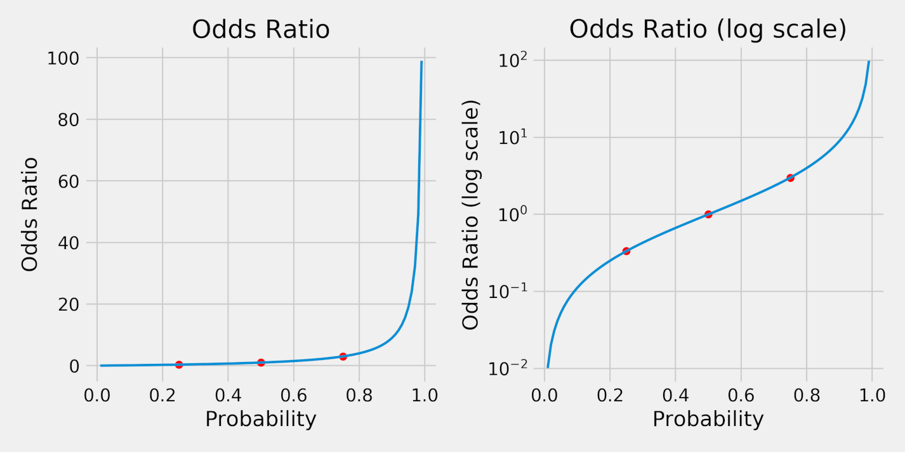
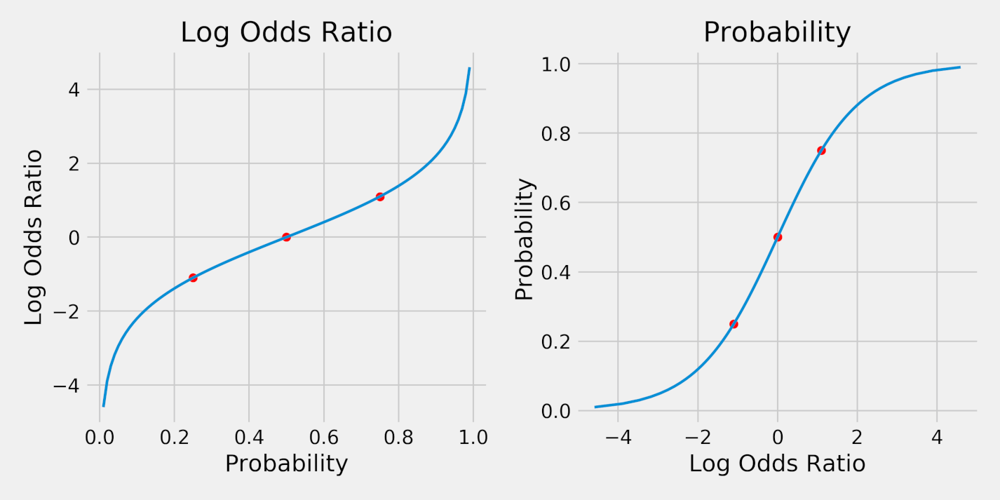
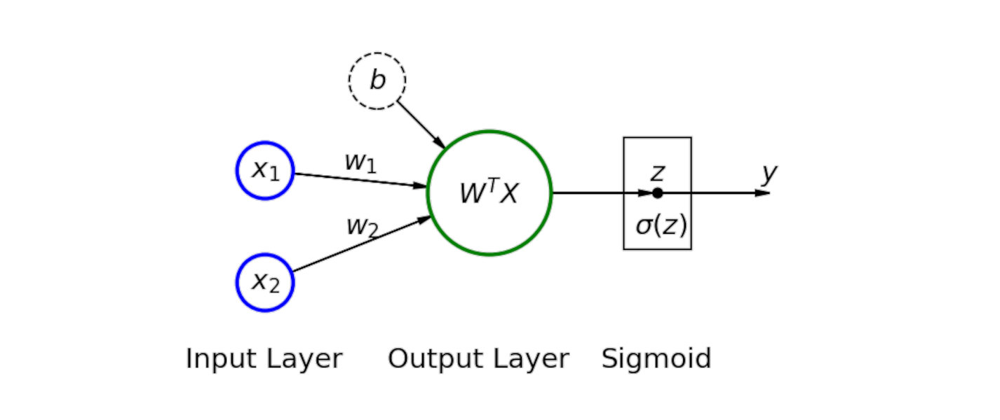

```python
import numpy as np

import torch
import torch.optim as optim
import torch.nn as nn
import torch.functional as F
from torch.utils.data import DataLoader, TensorDataset

from sklearn.datasets import make_moons
from sklearn.preprocessing import StandardScaler
from sklearn.model_selection import train_test_split
from sklearn.metrics import confusion_matrix, roc_curve, precision_recall_curve, auc

from stepbystep.v0 import StepByStep
```
## A Simple Classification Problem
It is time to handle a different class of problems: classification problems (pun intended). In a classification problem, we’re trying to predict which class a data point belongs to.
Let’s say we have two classes of points: They are either red or blue. These are the labels (y) of the points. Sure enough, we need to assign numeric values to them. We could assign zero to red and one to blue. The class associated with zero is the negative class, while one corresponds to the positive class.

In a nutshell, for binary classification, we have:
|  **Color** | **Value**  | **Class**  |
|---|---|---|
|  Red | 0 | Negative |
| Blue | 1  | Positive |

> IMPORTANT: In a classification model, the output is the predicted probability of the positive class. In our case, the model will 
> predict the probability of a point being blue.
> The choice of which class is positive and which class is negative does not affect model performance. If we reverse the mapping, making 
> red the positive class, the only difference would be that the model would predict the probability of a point being red. But, since 
> both probabilities have to add up to one, we could easily convert between them, so the models are equivalent.

## Data Generation

Let’s make the data a bit more interesting by using two features ($x_1$ and $x_2$) this time. We’ll use Scikit-Learn’s [make_moons()](https://scikit-learn.org/stable/modules/generated/sklearn.datasets.make_moons.html) to generate a toy dataset with 100 data points. We will also add some Gaussian noise and set a random seed to ensure reproducibility.
Then, we’ll perform the train-validation split using Scikit-Learn’s [train_test_split()](https://scikit-learn.org/stable/modules/generated/sklearn.model_selection.train_test_split.html) for convenience (we’ll get back to splitting indices later):

```python
X, y = make_moons(n_samples=100, noise=0.3, random_state=0)
X_train, X_val, y_train, y_val = train_test_split(X, y, test_size=.2, random_state=13)
sc = StandardScaler()
sc.fit(X_train)

X_train = sc.transform(X_train)
X_val = sc.transform(X_val)
fig = figure1(X_train, y_train, X_val, y_val)
```

## Data Preparation

As usual, the data preparation step converts Numpy arrays into PyTorch tensors, builds TensorDatasets for them, and creates the corresponding data loaders.
```python
torch.manual_seed(13)

# Builds tensors from numpy arrays
x_train_tensor = torch.as_tensor(X_train).float()
y_train_tensor = torch.as_tensor(y_train.reshape(-1, 1)).float()

x_val_tensor = torch.as_tensor(X_val).float()
y_val_tensor = torch.as_tensor(y_val.reshape(-1, 1)).float()

# Builds dataset containing ALL data points
train_dataset = TensorDataset(x_train_tensor, y_train_tensor)
val_dataset = TensorDataset(x_val_tensor, y_val_tensor)

# Builds a loader of each set
train_loader = DataLoader(dataset=train_dataset, batch_size=16, shuffle=True)
val_loader = DataLoader(dataset=val_dataset, batch_size=16)
```

## Model
Given a classification problem, one of the more straightforward models is the logistic regression.

Well, since it is called logistic regression, I would say that linear regression is a good starting point. What would a linear regression model with two features look like?

$$ \Large y = b + w_1x_1 + w_2x_2 + \epsilon$$

There is one obvious problem with the model above: Our labels (y) are discrete; that is, they are either zero or one; no other value is allowed. We need to change the model slightly to adapt it to our purposes.
"What if we assign the positive outputs to one and the negative outputs to zero?"
Makes sense, right? We’re already calling them positive and negative classes anyway; why not put their names to good use? Our model would look like this:
$$
\Large 
y =
\begin{cases}
1,\ \text{if }b + w_1x_1 + w_2x_2 \ge 0
\\
0,\ \text{if }b + w_1x_1 + w_2x_2 \lt 0
\end{cases}
$$

### Logits
To make our lives easier, let’s give the right-hand side of the equation above a name: logit (z).
$$ \Large z = b + w_1x_1 + w_2x_2 $$
The equation above is strikingly similar to the original linear regression model, but we’re calling the resulting value z, or logit, instead of y, or label.
"Does it mean a logit is the same as linear regression?"
Not quite—there is one fundamental difference between them: There is no error term (epsilon).
"If there is no error term, where does the uncertainty come from?"
That’s the role of the probability: Instead of assigning a data point to a discrete label (zero or one), we’ll compute the probability of a data point’s belonging to the positive class.

### Probabilities
If a data point has a logit that equals zero, it is exactly at the decision boundary since it is neither positive nor negative. For the sake of completeness, we assigned it to the positive class, but this assignment has maximum uncertainty, right? So, the corresponding probability needs to be 0.5 (50%), since it could go either way.

Following this reasoning, we would like to have large positive logit values assigned to higher probabilities (of being in the positive class) and large negative logit values assigned to lower probabilities (of being in the positive class).

For really large positive and negative logit values (z), we would like to have:
$$
\Large
\begin{aligned}
& \text{P}(y=1) \approx 1.0, & \text{if } &z \gg 0
\\
& \text{P}(y=1) = 0.5, & \text{if } &z = 0
\\
& \text{P}(y=1) \approx 0.0, & \text{if } &z \ll 0
\end{aligned}
$$
We still need to figure out a function that maps logit values into probabilities.

### Odds Ratio
This is a colloquial expression meaning something very unlikely has happened. But odds do not have to refer to an unlikely event or a slim chance.
The odds ratio is given by the ratio between the probability of success (p) and the probability of failure (q):
$$
\Large \text{odds ratio }(p) = \frac{p}{q} = \frac{p}{1-p}
$$

We can also plot the resulting odds ratios for probabilities ranging from 1% to 99%. The red dots correspond to the probabilities of 25% (q), 50%, and 75% (p).



Clearly, the odds ratios (left plot) are not symmetrical. But, in a log scale (right plot), they are. This serves us very well since we’re looking for a symmetrical function that maps logit values into probabilities.

If the function weren’t symmetrical, different choices for the positive class would produce models that were not equivalent. But, using a symmetrical function, we could train two equivalent models using the same dataset, just flipping the classes:

- Blue Model (the positive class (y=1) corresponds to blue points)
    - Data Point #1: P(y=1) = P(blue) = .83 (which is the same as P(red) = .17)
- Red Model (the positive class (y=1) corresponds to red points)
    - Data Point #1: P(y=1) = P(red) = .17 (which is the same as P(blue) = .83)

### Log Odds Ratio
By taking the logarithm of the odds ratio, the function is not only symmetrical, but also maps probabilities into real numbers, instead of only the positive ones:
$$
\Large \text{log odds ratio }(p) = \text{log}\left(\frac{p}{1-p}\right)
$$
In code, our log_odds_ratio() function looks like this:
```python
def log_odds_ratio(prob):
    return np.log(odds_ratio(prob))

p = .75
q = 1 - p
log_odds_ratio(p), log_odds_ratio(q)
(1.0986122886681098, -1.0986122886681098)
```

As expected, probabilities that add up to 100% (like 75% and 25%) correspond to log odds ratios that are the same in absolute value. Let’s plot it:


On the left, each probability maps into a log odds ratio. The red dots correspond to probabilities of 25%, 50%, and 75%, the same as before. 
If we flip the horizontal and vertical axes (right plot), we are inverting the function, thus mapping each log odds ratio into a probability. That’s the function we were looking for!

### From Logits to Probabilities
We were trying to map logit values into probabilities, and we’ve just found out, graphically, a function that maps log odds ratios into probabilities.

Clearly, our logits are log odds ratios. Sure, drawing conclusions like this is not very scientific, but the purpose of this exercise is to illustrate how the results of a regression, represented by the logits (z), get to be mapped into probabilities.
So, here’s what we arrived at:
$$
\Large
\begin{aligned}
b + w_1x_1 + w_2x_2 = &\ z = \text{log}\left(\frac{p}{1-p}\right) 
\\
e^{b + w_1x_1 + w_2x_2} = &\ e^z = \frac{p}{1-p} 
\end{aligned}
$$
Let’s work this equation out a bit, inverting, rearranging, and simplifying some terms to isolate p:
$$
\Large
\begin{aligned}
\frac{1}{e^z}& = \frac{1-p}{p}
\\
e^{-z}& = \frac{1}{p} - 1
\\
1 + e^{-z}& = \frac{1}{p}&
\\
p& = \frac{1}{1 + e^{-z}}
\end{aligned}
$$

Does it look familiar? That’s a sigmoid function! It is the inverse of the log odds ratio.

$$
\Large
p = \sigma(z) = \frac{1}{1+e^{-z}}
$$

```python
def sigmoid(z):
    return 1 / (1 + np.exp(-z))

p = .75
q = 1 - p
sigmoid(log_odds_ratio(p)), sigmoid(log_odds_ratio(q))
(0.75, 0.25)
```

### Sigmoid
There is no need to implement our own sigmoid function, though. PyTorch provides two different ways of using a sigmoid: [torch.sigmoid()](https://pytorch.org/docs/master/generated/torch.sigmoid.html) and [nn.Sigmoid](https://pytorch.org/docs/stable/generated/torch.nn.Sigmoid.html).
The first one is a simple function, like the one above, but takes a tensor as input and returns another tensor:
```python
torch.sigmoid(torch.tensor(1.0986)), torch.sigmoid(torch.tensor(-1.0986))
```

The second one is a full-fledged class inherited from nn.Module. It is, for all intents and purposes, a model on its own. It is quite a simple and straightforward model: It only implements a forward() method, which, surprise, surprise, calls torch.sigmoid().

Remember, models can be used as layers of another, larger model. That’s exactly what we’re going to do with the sigmoid class.

### Logistic Regression
Given two features, $x_1$ and $x_2$, the model will fit a linear regression such that its outputs are logits (z), which are then converted into probabilities using a sigmoid function.

$$
\Large
\text{P}(y=1) = \sigma(z) = \sigma(b+w_1x_1+w_2x_2)
$$



We can think of the logistic regression as the second simplest neural network possible. It is pretty much the same as the linear regression, but with a sigmoid applied to the results of the output layer (z).

Now let’s use the Sequential model to build our logistic regression in PyTorch:

```python
torch.manual_seed(42)
model1 = nn.Sequential()
model1.add_module('linear', nn.Linear(2, 1))
model1.add_module('sigmoid', nn.Sigmoid())
print(model1.state_dict())
```
Did you notice that state_dict() contains parameters from the linear layer only? Even though the model has a second sigmoid layer, this layer does not contain any parameters since it does not need to learn anything: The sigmoid function will be the same regardless of which model it is a part of.

### Loss

We already have a model, and now we need to define an appropriate loss for it. A binary classification problem calls for the binary cross-entropy (BCE) loss, sometimes known as log loss.

The BCE loss requires the predicted probabilities, as returned by the sigmoid function, and the true labels (y) for its computation. For each data point i in the training set, it starts by computing the error corresponding to the point’s true class.

If the data point belongs to the positive class (y=1), we would like our model to predict a probability close to one, right? A perfect one would result in the logarithm of one, which is zero. It makes sense; a perfect prediction means zero loss. It goes like this:
$$
\Large y_i = 1 \Rightarrow \text{error}_i=\text{log}(\text{P}(y_i=1))
$$

What if the data point belongs to the negative class (y=0)? Then we cannot simply use the predicted probability. Why not? Because the model outputs the probability of a point’s belonging to the positive, not the negative, class. Luckily, the latter can be easily computed:

$$
\Large \text{P}(y_i=0)=1-\text{P}(y_i=1)
$$

And thus, the error associated with a data point’s belonging to the negative class goes like this:
$$
\Large y_i = 0 \Rightarrow \text{error}_i=\text{log}(1-\text{P}(y_i=1))
$$

Once all errors are computed, they are aggregated into a loss value. For the binary-cross entropy loss, we simply take the average of the errors and invert its sign.
$$
\Large
\text{BCE}(y)={-\frac{1}{(N_{\text{pos}}+N_{\text{neg}})}\Bigg[{\sum_{i=1}^{N_{\text{pos}}}{\text{log}(\text{P}(y_i=1))} + \sum_{i=1}^{N_{\text{neg}}}{\text{log}(1 - \text{P}(y_i=1))}}\Bigg]}
$$

I believe the formula above is quite straightforward and easy to understand. Unfortunately, it is usually skipped over, and only its equivalent is presented:

$$
\Large
\text{BCE}(y)={-\frac{1}{N}\sum_{i=1}^{N}{\left[y_i \text{log}(\text{P}(y_i=1)) + (1-y_i) \text{log}(1-\text{P}(y_i=1))\right]}}
$$

For a very detailed explanation of the rationale behind this loss function, make sure to check my post: ["Understanding binary cross-entropy / log loss: a visual explanation."](https://towardsdatascience.com/understanding-binary-cross-entropy-log-loss-a-visual-explanation-a3ac6025181a)

### BCELoss
Sure enough, PyTorch implements the binary cross-entropy loss, [nn.BCELoss()](https://pytorch.org/docs/stable/generated/torch.nn.BCELoss.html). Just like its regression counterpart, nn.MSELoss(), introduced in Chapter 1, it is a higherorder function that returns the actual loss function.

The nn.BCELoss() higher-order function takes two optional arguments (the others are deprecated, and you can safely ignore them):
- reduction: It takes either mean, sum, or none. The default mean corresponds to our Equation above. As expected, sum will return the sum of the errors, instead of the average. The last option, none, corresponds to the unreduced form; that is, it returns the full array of errors.
- weight: The default is none, meaning every data point has equal weight. If supplied, it needs to be a tensor with a size equal to the number of elements in a mini-batch, representing the weights assigned to each element in the batch. In other words, this argument allows you to assign different weights to each element of the current batch, based on its position. So, the first element would have a given weight, the second element would have a different weight, and so on, regardless of the actual class of that particular data point. Sounds
confusing? Weird? Yes, this is weird; I think so too. Of course, this is not useless or a mistake, but the proper usage of this argument is a more advanced topic and outside the scope of this book. 

```python
loss_fn = nn.BCELoss(reduction='mean')

loss_fn

dummy_labels = torch.tensor([1.0, 0.0])
dummy_predictions = torch.tensor([.9, .2])

# RIGHT
right_loss = loss_fn(dummy_predictions, dummy_labels)

# WRONG
wrong_loss = loss_fn(dummy_labels, dummy_predictions)

print(right_loss, wrong_loss)

```

Clearly, the order matters. It matters because the nn.BCELoss() takes the logarithm of the probabilities, which is expected as the first argument. If we swap the arguments, it will yield different results.

So far, so good. But there is yet another binary cross-entropy loss available, and it is very important to know when to use one or the other, so you don’t end up with an inconsistent combination of model and loss function. Moreover, you’ll understand why I made such a fuss about the logits.

### BCEWithLogitsLoss

The former loss function took probabilities as an argument (together with the labels, obviously). This loss function takes logits as an argument, instead of probabilities.

It means you should NOT add a sigmoid as the last layer of your model when using this loss function. This loss combines both the sigmoid layer and the former binary cross-entropy loss into one.

> IMPORTANT: I can’t stress this enough: You must use the right combination of model and loss function.
> Option 1: nn.Sigmoid as the last layer, meaning your model is producing probabilities, combined with the nn.BCELoss() function.
> Option 2: No sigmoid in the last layer, meaning your model is producing logits, combined with the nn.BCEWithLogitsLoss() function.
> Mixing nn.Sigmoid and nn.BCEWithLogitsLoss() is just wrong.
> Besides, Option 2 is preferred since it is numerically more stable than Option 1.

Now, let’s take a closer look at the [nn.BCEWithLogitsLoss()](https://pytorch.org/docs/stable/generated/torch.nn.BCEWithLogitsLoss.html) function. It is also a higher-order function, but it takes three optional arguments (the others are deprecated, and you can safely ignore them):
- reduction: It takes either mean, sum, or none, and it works just like in nn.BCELoss(). The default is mean.
- weight: This argument also works just like in nn.BCELoss(), and it is unlikely to be used.
- pos_weight: The weight of positive samples, it must be a tensor with length equal to the number of labels associated with a data point (the documentation refers to classes, instead of labels, which just makes everything even more confusing).

Let’s see how to use this loss in code. We start by creating the loss function itself:

```python
loss_fn_logits = nn.BCEWithLogitsLoss(reduction='mean')

loss_fn_logits

logit1 = log_odds_ratio(.9)
logit2 = log_odds_ratio(.2)

dummy_labels = torch.tensor([1.0, 0.0])
dummy_logits = torch.tensor([logit1, logit2])

print(dummy_logits)

loss = loss_fn_logits(dummy_logits, dummy_labels)
loss
```

228
